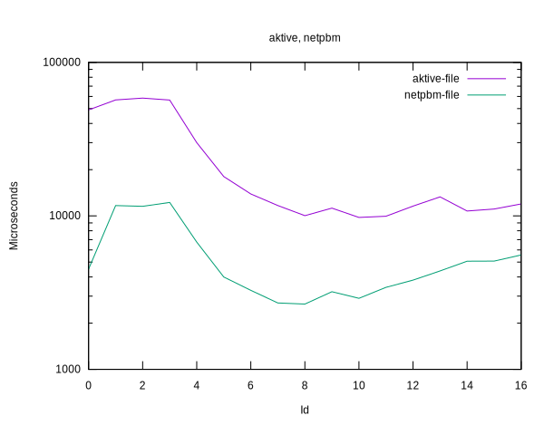
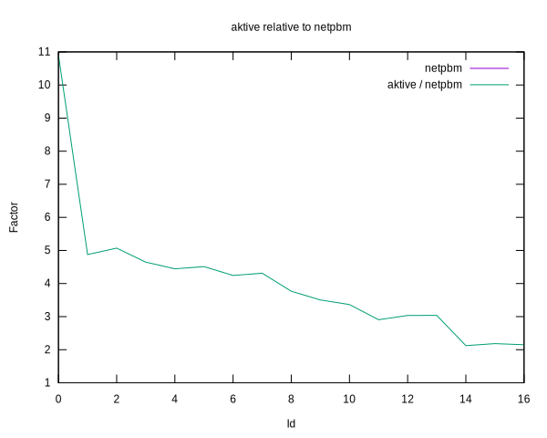

# Benchmark results comparing the AKTIVE and NETPBM readers

||
|---|
|[Parent ↗](../README.md)|

## Summary

 - Comparable formats (binary), and modes (file, Tcl_Channel).

 - The AKTIVE reader is between 2 and 5 times slower than NETPBM,
   despite the recent boost.

     - When using 8 threads, matching the number of CPU cores, the
       faktor is 4.

 - Format differences:

     - AKTIVE stores doubles, 8 bytes, per pixel.

         - Versus NETPBM's single byte per pixel.

     - AKTIVE requires endian conversion (byte shuffling).

         - Whereas NETPBM converts to double and scales.

 - Thus

     - AKTIVE reads more, with simple processing.

     - NETPBM reads much less, with more complex processing.

## Plots

