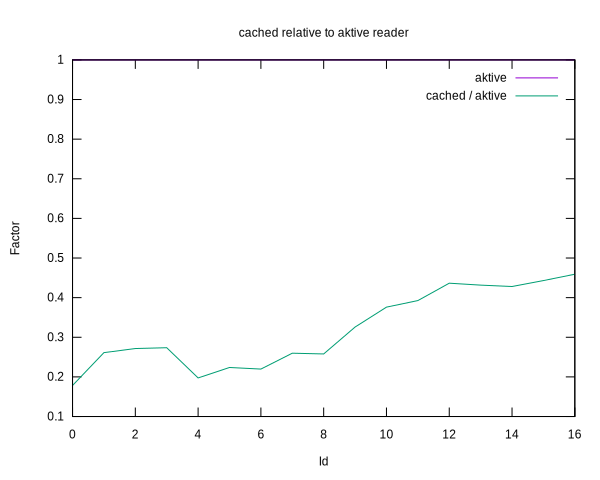

# Benchmark results for reading from in-memory cache

## Navigation

[Parent](../README.md)

## Summary

 - Used both AKTIVE and NETPBM as backends.

 - The results are minimally different between backends.

 - For AKTIVE the cache is definitely faster than the reader itself,
   by 2 to 5 times.

 - For NETPBM it is not as clear-cut. For most configurations the
   reader is actually somewhat faster, up to 2 times. The cache
   overtakes the reader only for the higher thread counts (>= 11).

## Plots

### AKTIVE vs NETPBM

### Cache vs file, AKTIVE

### Cache vs file, NETPBM

