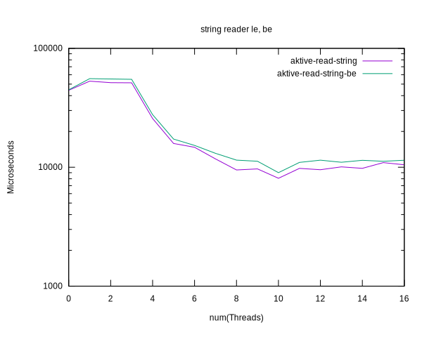

# Benchmark results for the AKTIVE reader, old (big-endian) vs new (little-endian)

||
|---|
|[Parent ↗](../README.md)|

## Summary

  - In line with expecations reading little-endian data is faster than
    reading big endian data. Given that we have to perform
    byte-swapping for big-endian, and nothing such for little-endian.

  - The gap is roughly 10% for reading from strings, and somewhat
    larger for reading from files.

## Plots

Based on [CSV](aktive-read-le-be.csv)

### From files

### From strings

