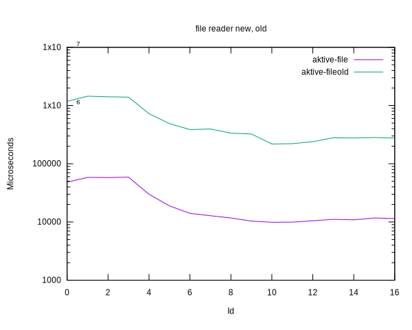

# Benchmark results for the AKTIVE reader

||
|---|
|[Parent ↗](../README.md)|

## Summary

  - Replacing the 3-nested blitter reading each value separately with
    a 2-nested loop reading entire (partial) rows boosts the
    performance of both file and string readers.

  - The boost is most significant for the file reader, and less so for
    the string reader.

  - The new file reader is about 20x faster than the old.

  - The new string reader is about 1.11x faster than the old

  - Overall the new file reader is roughly on par with the new string
    reader. Whereas the old file reader was about 21x slower than the
    old string reader.

## Takeaways

  - There is no need to look into caching for the file reader at this
    time.

  - Even so, memory mapping might still be able to provide another boost.

  - Ditto for a vectorized endian conversion.

  - See if the same kind of thing can be applied to the NETPBM binary
    formats.

## Plots

