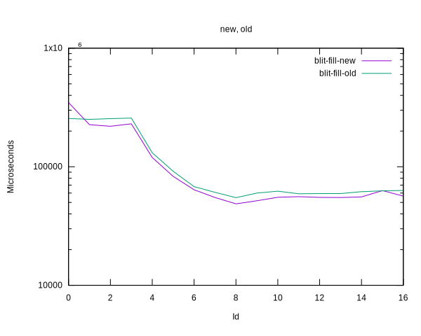
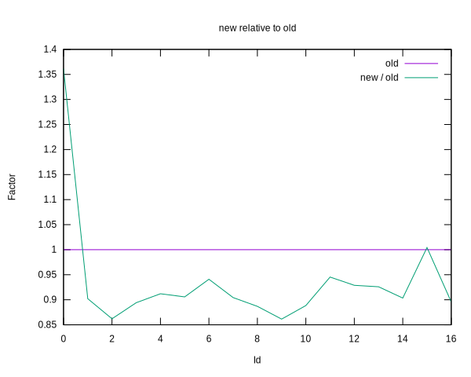
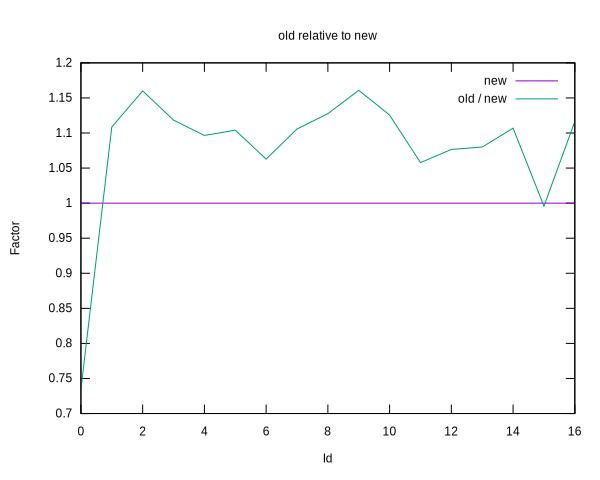

# Benchmark results comparing `image from value` variants

The benchmarks compare the current `image from value` against a new
variant using the new `xz` folding of the blitter.

||
|---|
|[Parent ↗](../README.md)|

## Summary

 - The current/old form is about 1.1 to 1.3 times slower than the new
   implementation, for a test image of 800x600x3 (0.5 MP). Extending
   the test image to 2 MP (1600x1200x3) shifts things up, if only a
   bit. Around 1.15. Going to 16 MP (4608x3456x3) it drops again to
   around 1.1.

 - Good enough to switch as many blitters as we can to this
   mode. Definitely good enough in light of the fact that such `xz`
   loops have a good chance of being simd/vectorizable. See google's
   [highway](https://github.com/google/highway) for a possibility.

     - Addendum (Dec 3, 2025). The code of the highway/simd experiment
       can be found in branch `highway-simd-experiment`. Also the
       [Results](/doc/highway-simd-experiment/bench/plots/simd/README.md)

       Summary: A 4-unrolled (super)scalar loop beats the SIMD-based
       loop, which has only 2 lanes in the vector unit for doubles.
       And unrolling the SIMD-based loop is counterproductive.

 - Details of the underlying differences

     - With the new `xz` axis of the blitter the image bands are
       folded into the columns, allowing a single loop to run over
       them all, instead of using many separate `z`-loops each going
       over the not many bands of a column.

## Plots

For the 16 MP case.

