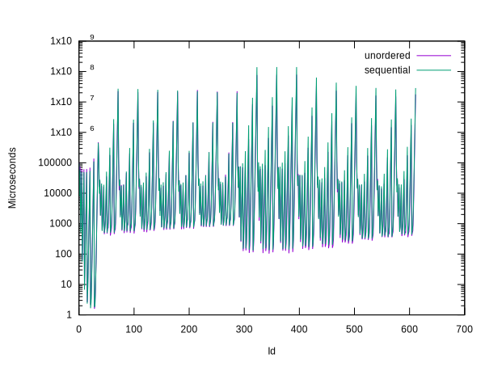
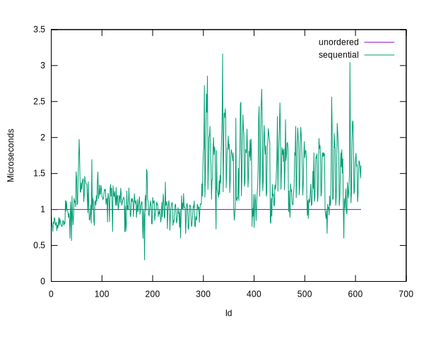
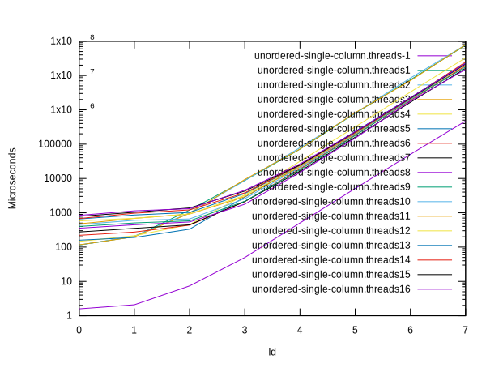
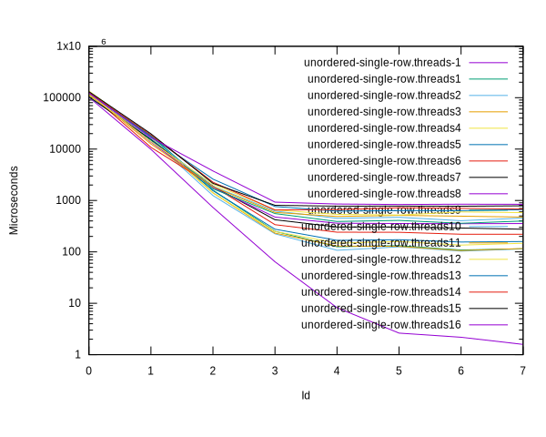
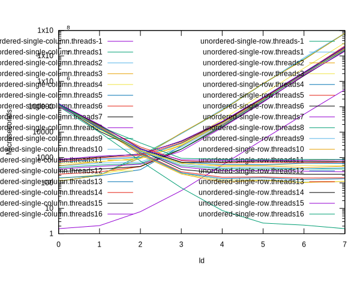
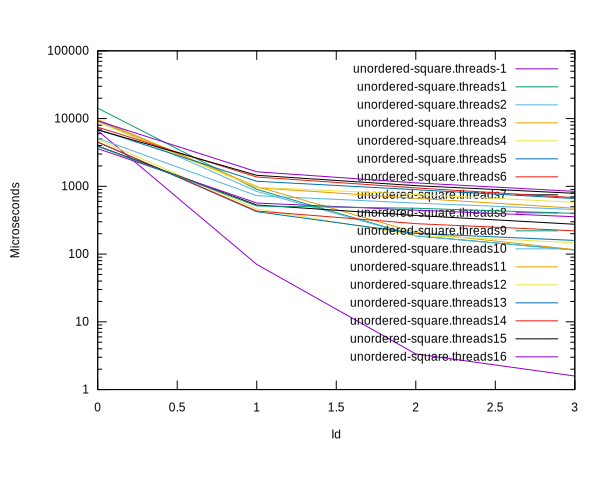
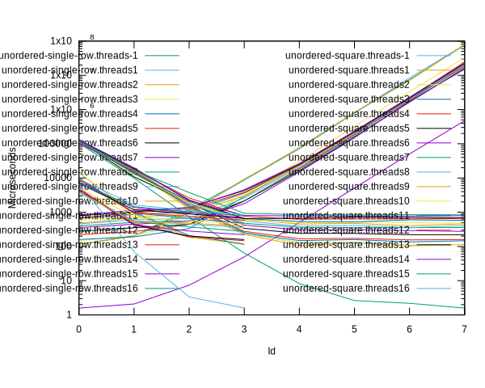

# Benchmark results comparing the two batch processor coordinators

## Navigation

[Parent](../README.md)

## Summary

  - In the log plot both modes look very nearly identical, with the
    17 different thread configurations easy separable

  - The differences become eminent when treating unordered as
    baseline, and plotting sequential relative to that.

    Sequential is generally about 1.5 times slower than unordered,
    with spikes to 3 times slower. This is for thread counts >= cpu
    count.

    With less threads used than available cpus the difference is much
    less, roughly on par, in part even better.

  - Looking only at unordered mode, and at the extreme case of narrow
    tall images (single column of varying heights) using more threads
    does not help at all. Time depends strongly on height, except for
    heights < 1000, where thread count becomes more important, with
    more threads yieding higher performance, by a factor of 10.

  - Conversely, for wide shallow images (single row of varying widths)
    width matters less than thread count for widths > 1000. After that
    point more threads provide higher performance, even for thread
    counts > available cpus. Again roughly a factor of 10.

    It is suspected that the memory system is better able to handle
    the longer contiguous blocks of values.

  - For square images the plot looks roughly similar to the wide
    shallow case, likely again because of the larger contiguous blocks
    of values in memory.

## Plots

### Sequential / unordered

### Tall images, varying height (x powers of 10)

### Wide images, varying width (x powers of 10)

### Tall and wide together

### Square images, varying width/height (x powers of 10)

### Tall, wide, and square together

