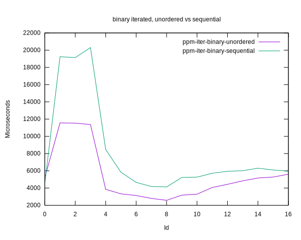
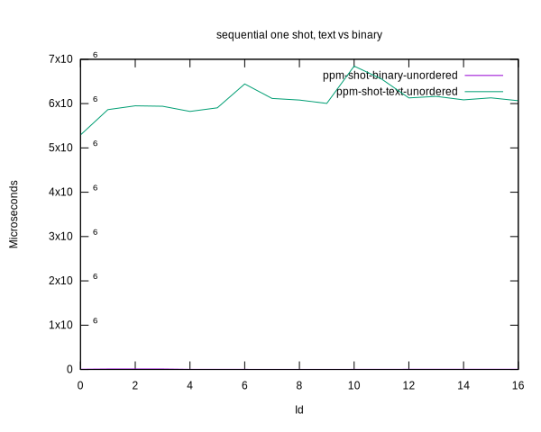
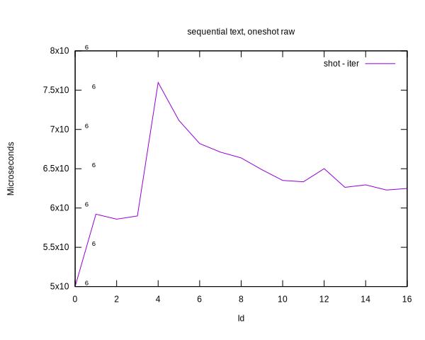

# Benchmark results for the NETPBM reader

## Navigation

[Parent](../README.md)

## Summary

  - For iterated, i.e. cache fill time not relevant, unordered is
    faster than sequential, regardless of format.

  - Conversely text format is faster than binary, likely because of
    the in-memory cache.

  - For shots, where cache fill time is measured as part of the
    operation binary has no difference to iterated, as expected, as
    binary is without a cache.

  - For text format however the time to fill the cache is substantial,
    up to 8 seconds. Still around 6 seconds for thread count >= actual
    core count.

## Takeaways

  - Look into ideas for a faster cache implementation than the current
    (row) vector cache, especially faster fill.

      - Veccache uses quite a lot of locking between the contending
        threads while incrementally filling individual rows
        (i.e. separate allocations)

      - Could a variant of the `cache` op be better, with a single
        thread once streaming the file into a single memory block ?

	Maybe with incremental release of filled rows to the
	requesting threads interleaved with the fill itself ?

  - Look into caching binary too.

  - Look into other means of reading from a file instead of (serial)
    through a file descriptor.

      - VIPS seems to support mapping of a file directly into process
      	memory ?!

## Plots

### Iterated binary, unordered / sequential

### Iterated text, unordered / sequential

### Iterated unordered, text / binary

### Iterated sequential, text / binary

### Iterated all

### Oneshot binary, unordered / sequential

### Oneshot text, unordered / sequential

### Oneshot unordered, text / binary

### Oneshot sequential, text / binary

### Shot all

### Text unordered, shot / iterated

### Text sequential, shot / iterated

### Binary unordered, shot / iterated

### Binary sequential, shot / iterated

