Benchmark results for baseline reducer

||
|---|
|[Parent ↗](../README.md)|

## Summary

TODO

## Plots

[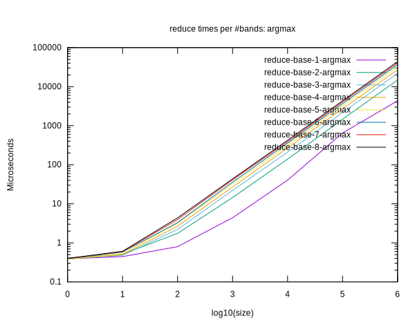](svg/times-reduce-base-argmax.svg)
[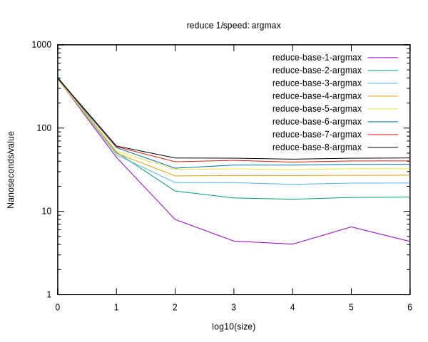](svg/ispeed-reduce-base-argmax.svg)

[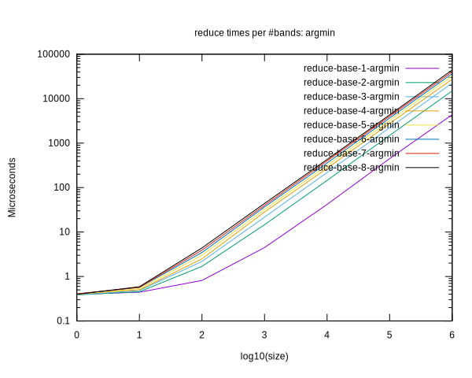](svg/times-reduce-base-argmin.svg)
[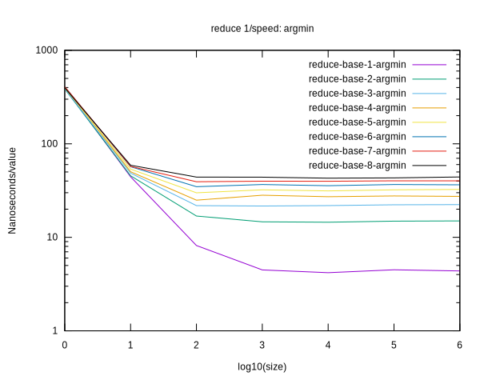](svg/ispeed-reduce-base-argmin.svg)

[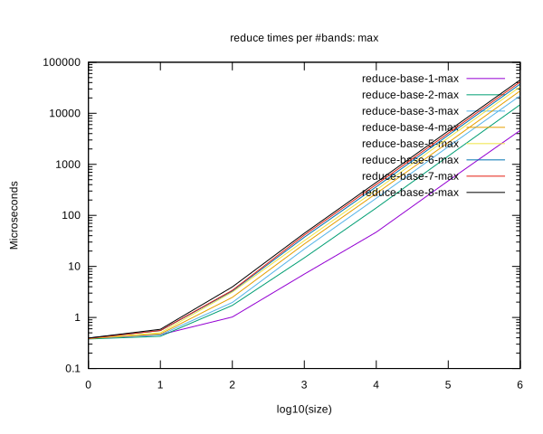](svg/times-reduce-base-max.svg)
[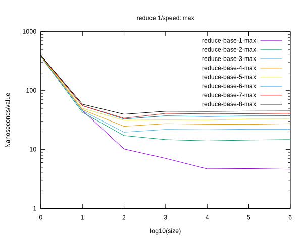](svg/ispeed-reduce-base-max.svg)

[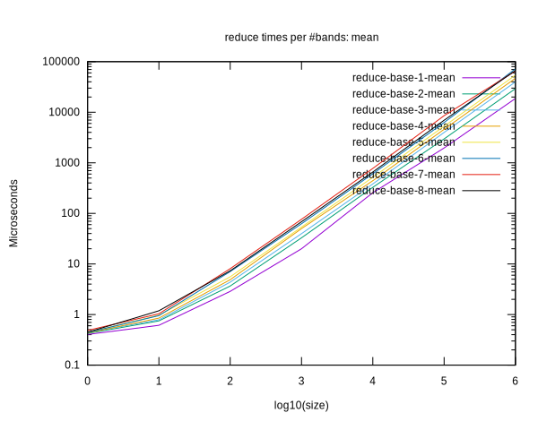](svg/times-reduce-base-mean.svg)
[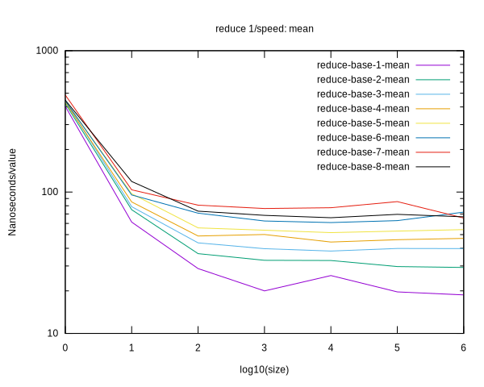](svg/ispeed-reduce-base-mean.svg)

[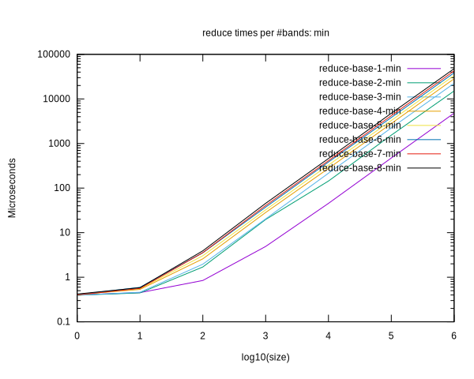](svg/times-reduce-base-min.svg)
[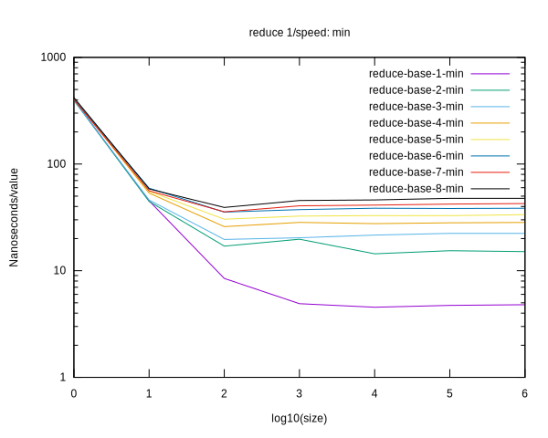](svg/ispeed-reduce-base-min.svg)

[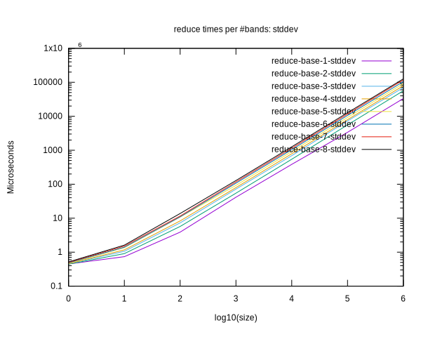](svg/times-reduce-base-stddev.svg)
[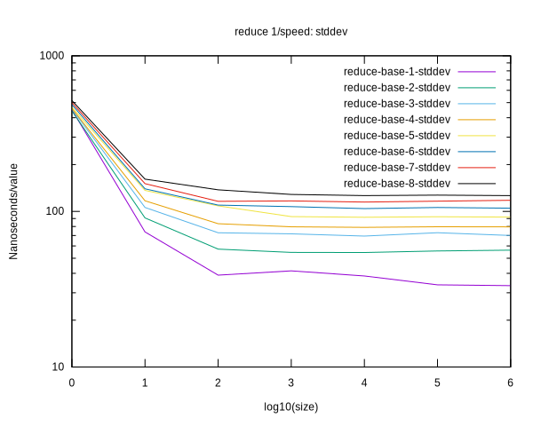](svg/ispeed-reduce-base-stddev.svg)

[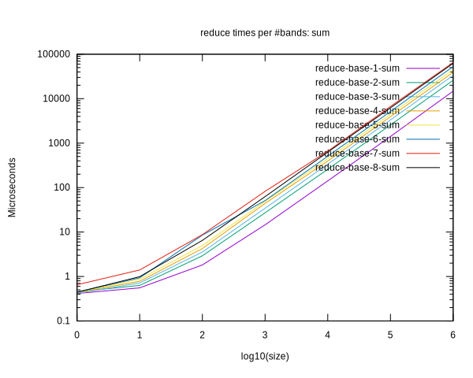](svg/times-reduce-base-sum.svg)
[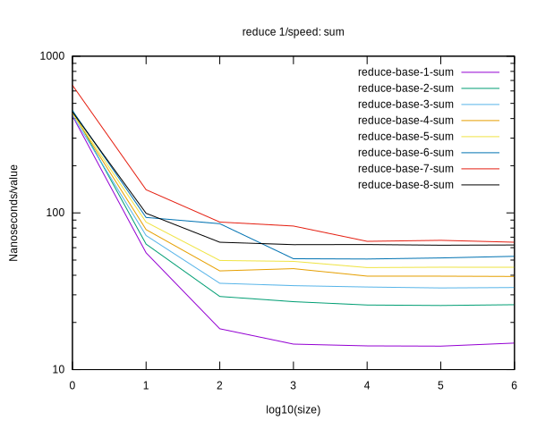](svg/ispeed-reduce-base-sum.svg)

[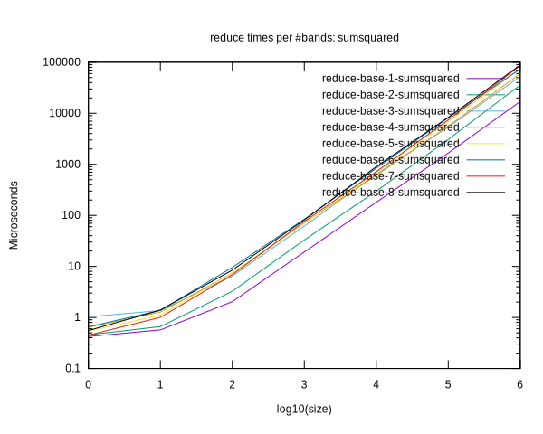](svg/times-reduce-base-sumsquared.svg)
[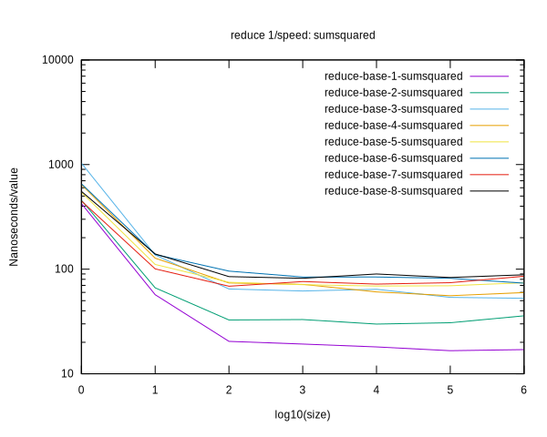](svg/ispeed-reduce-base-sumsquared.svg)

[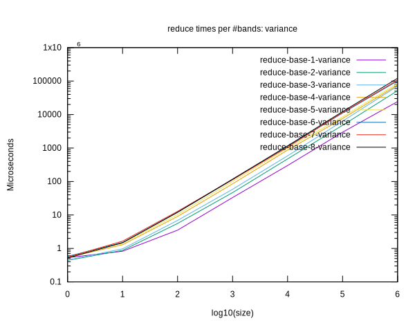](svg/times-reduce-base-variance.svg)
[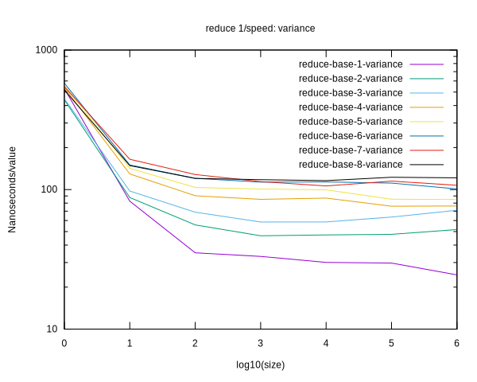](svg/ispeed-reduce-base-variance.svg)