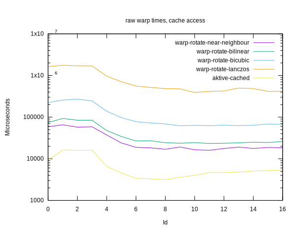
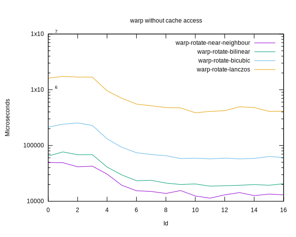
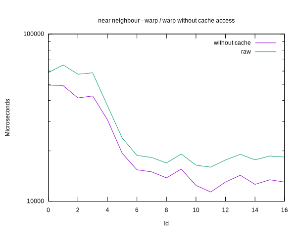
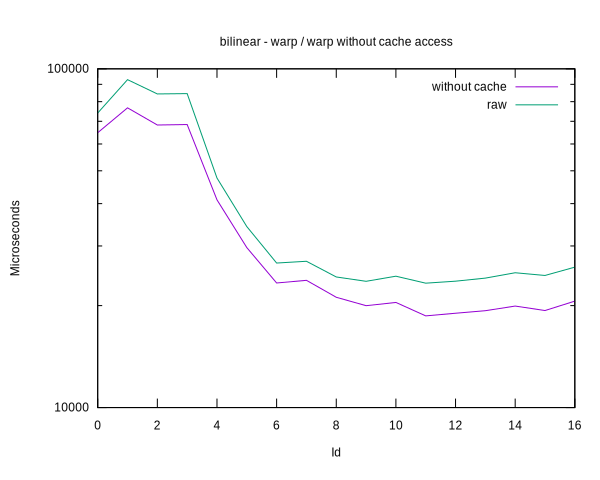
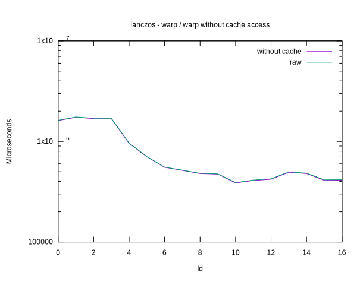

# Benchmark results for a simple rotation transform, various interpolations

||
|---|
|[Parent ↗](../README.md)|

## Summary

  - The interpolation methods falls into three groups.

      - `near-neighbour` and `bilinear` as single fast group, followed by

      - `bicubic` as much slower, and

      - `lanczos` a few orders slower than that.

  - Correlates very well with the size of the neighbourhood used to
    compute each interpolated value from.

  - __Todo__

      - See how much this is influenced by the separate fetching of
        the necessary neighbourhoods for each result pixel.

      - This requires the writing of an alternate implementation
        attempting to fetch a larger region useful to computing
        multiple results. I.e. a bit of an operator-local cache.

      - Also, there might be some threshold where individual fetching
        is more advantegous, because it would not incur the overhead
        of computing much of the input image.

      - It is unclear at this point if the threshold is better as

          - a percentage of the input we wish to stay below of, or as

          - a ratio between result and fetched area, or as

          - a ratio between the area of the union of the separate
            regions vs the area of the single region fetched

## Plots

