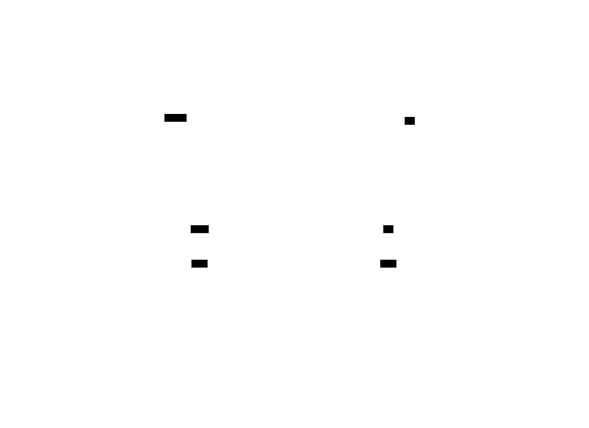

||||
|---|---|---|
|[Project ↗](../../README.md)|[Documentation](../index.md)||[Developer Index ↗](index.md)|

# Connected Components

__Note:__ In other image processing systems CCs are called (labeled) regions.

## Implementation

Files:

  - [op/cconn.h](/file?ci=trunk&name=op/cconn.h)
  - [op/cconn.c](/file?ci=trunk&name=op/cconn.c)

Based on AKTIVE's [batch processor](batch.md).

## Description

AKTIVE's concurrent calculation of connected components is done in two overlapping phases:

  1. Concurrent calculation of per-row connected components

     This is trivial, regardless of the chosen neighbourhood. The row components are the sets of
     continuous ranges of non-black/white pixels. Each such range can be described by its row index
     and the min/max column indices.

  1. Concurrent fusing of adjacent rows (simple blocks) into larger blocks until a single block
     remains, covering the entirety of the image.

     While this is not as trivial, it is not truly complicated either. The fusion process only has
     to look at the adjacent rows of the two blocks and look for overlaps between their ranges as
     per the chosen neighbourhood, and merge the associated components.

The phases can overlap because we can start fusing adjacent blocks immediately as we see them in the
batch processor completion thread, while other worker threads of the batch processor still compute
more of the base blocks.

To do all this the block structure used in both phases:

  - Tracks the set of the `CC`s in the block, as a double-linked list. The latter ensures easy
    unlinking of CCs discarded after merges.

  - Tracks the set of `rows` covered by the block, as a single-linked list, sorted in order from
    lower to larger row indices.

  - Tracks in each `row` the set of `ranges` (i.e. proto CCs) it contains, as a single-linked list,
    sorted in order from lower to larger column indices.

  - Tracks in each `CC` the set of `ranges` the CC is made up of, as a single-linked list.

  - Note how each tracked `range` belongs to two linked lists, for the `row` it comes from, and the
    `CC` containing it.

  - In support of the merge process each range `links` back to its containing `CC`.

  - In support of the merge process each `CC` links back to its containing `block`.

A nice thing is that it is easy to also track the bounding boxes and areas of the resulting CCs as
part of the calculations.

The processor state additionally uses an array the size of the image height to save and reference
all incoming generated `blocks` (base or fused) per the rows they cover, in support of the
above-mentioned adjacency checks. __Note__ that each `block` __only__ has to be referenced by the
entries for the block's __first and last rows__, for the checks to work.

## Data structure details

Without showing the structure of the single- and double-linked lists.

