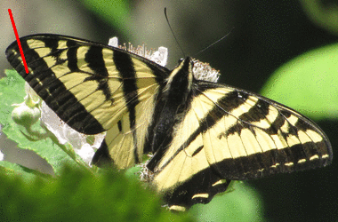

||||||||
|---|---|---|---|---|---|---|
|[Project ↗](../../README.md)|[Documentation ↗](../index.md)|&mdash;|[Tutorials ↗](../tutorials.md)|[How To's ↗](../howtos.md)|[Explanations ↗](../explanations.md)|References|

|||||||||
|---|---|---|---|---|---|---|---|
|[Entry ↗](index.md)|&mdash;|[Sections ↘](bysection.md)|[Permuted Sections ↘](bypsection.md)|[Names ↘](byname.md)|[Permuted Names ↘](bypname.md)|[Strict ↘](strict.md)|[Implementations ↘](bylang.md)|

# Documentation -- Reference Pages -- accessor

## Table Of Contents

  - [Roots](bysection.md) ↗

## Subsections

 - [accessor geometry](accessor_geometry.md) ↘
 - [accessor metadata](accessor_metadata.md) ↘
 - [accessor morphology](accessor_morphology.md) ↘
 - [accessor values](accessor_values.md) ↘

### Operators

 - [aktive format as d2](#format_as_d2)
 - [aktive format as markdown](#format_as_markdown)
 - [aktive format as tclscript](#format_as_tclscript)
 - [aktive op query colorspace](#op_query_colorspace)
 - [aktive query id](#query_id)
 - [aktive query inputs](#query_inputs)
 - [aktive query params](#query_params)
 - [aktive query setup](#query_setup)
 - [aktive query type](#query_type)

## Operators

---
###  aktive format as d2

Syntax: __aktive format as d2__ src

Converts the internal DAG representation of the image into a D2 graph format and returns the resulting string.

Despite the naming the operator is __not strict__. It does not access the input's pixels at all, only the meta information of the pipeline.

---
###  aktive format as markdown

Syntax: __aktive format as markdown__ src

Converts the internal DAG representation of the image into a Markdown table and returns the resulting string.

Despite the naming the operator is __not strict__. It does not access the input's pixels at all, only the meta information of the pipeline.

---
###  aktive format as tclscript

Syntax: __aktive format as tclscript__ src

Converts the internal DAG representation of the image into a Tcl script and returns the resulting string.

Despite the naming the operator is __not strict__. It does not access the input's pixels at all, only the meta information of the pipeline.

---
###  aktive op query colorspace

Syntax: __aktive op query colorspace__ src

Returns the name of the color space the input is in.

If no colorspace is set then `sRGB` is assumed for 3-band images, and `grey` for single-band images.

For anything else an error is thrown instead of making assumptions.

---
###  aktive query id

Syntax: __aktive query id__ src

Returns the input's implementation-specific image identity.

---
###  aktive query inputs

Syntax: __aktive query inputs__ src

Returns a list of the input's inputs.

For an image without inputs the result is the empty list.

---
###  aktive query params

Syntax: __aktive query params__ src

Returns a dictionary containing the input's parameters.

For an image without parameters the result is the empty dictionary.

## Examples

<table><tr><th>@1</th><th>aktive query params @1</th></tr>
<tr><td valign='top'></td><td valign='top'>width 32 height 32</td></tr></table>

<table><tr><th>@1</th><th>aktive query params @1</th></tr>
<tr><td valign='top'></td><td valign='top'>width 32 height 32 depth 1 first 0.0 last 1.0</td></tr></table>

---
###  aktive query setup

Syntax: __aktive query setup__ src

Returns a dictionary containing the input's setup.

This includes type, geometry, and parameters, if any. The inputs however are excluded.

## Examples

<table><tr><th>@1</th><th>aktive query setup @1</th></tr>
<tr><td valign='top'></td><td valign='top'>type image::zone domain {x 0 y 0 width 32 height 32 depth 1} config {width 32 height 32}</td></tr></table>

<table><tr><th>@1</th><th>aktive query setup @1</th></tr>
<tr><td valign='top'></td><td valign='top'>type image::gradient domain {x 0 y 0 width 32 height 32 depth 1} config {width 32 height 32 depth 1 first 0.0 last 1.0}</td></tr></table>

---
###  aktive query type

Syntax: __aktive query type__ src

Returns the input's type.

## Examples

<table><tr><th>@1</th><th>aktive query type @1</th></tr>
<tr><td valign='top'></td><td valign='top'>image::zone</td></tr></table>

<table><tr><th>@1</th><th>aktive query type @1</th></tr>
<tr><td valign='top'></td><td valign='top'>image::gradient</td></tr></table>

