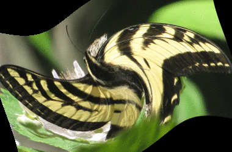

||||||||
|---|---|---|---|---|---|---|
|[Project ↗](../../README.md)|[Documentation ↗](../index.md)|&mdash;|[Tutorials ↗](../tutorials.md)|[How To's ↗](../howtos.md)|[Explanations ↗](../explanations.md)|References|

|||||||||
|---|---|---|---|---|---|---|---|
|[Entry ↗](index.md)|&mdash;|[Sections ↘](bysection.md)|[Permuted Sections ↘](bypsection.md)|[Names ↘](byname.md)|[Permuted Names ↘](bypname.md)|[Strict ↘](strict.md)|[Implementations ↘](bylang.md)|

# Documentation -- Reference Pages -- accessor

## <anchor='top'> Table Of Contents

  - [Roots](bysection.md) ↗

## Subsections

 - [accessor geometry](accessor_geometry.md) ↘
 - [accessor metadata](accessor_metadata.md) ↘
 - [accessor morphology](accessor_morphology.md) ↘
 - [accessor values](accessor_values.md) ↘

### Operators

 - [aktive format as d2](#format_as_d2)
 - [aktive format as markdown](#format_as_markdown)
 - [aktive format as tclscript](#format_as_tclscript)
 - [aktive op query colorspace](#op_query_colorspace)
 - [aktive query id](#query_id)
 - [aktive query inputs](#query_inputs)
 - [aktive query params](#query_params)
 - [aktive query setup](#query_setup)
 - [aktive query type](#query_type)

## Operators

---
### [↑](#top)  aktive format as d2

Syntax: __aktive format as d2__ src [[→ definition](../../../../file?ci=trunk&ln=6&name=etc/sink/asother.tcl)]

Converts the internal DAG representation of the image into a D2 graph format and returns the resulting string.

Despite the naming the operator is __not strict__. It does not access the input's pixels at all, only the meta information of the pipeline.

|Input|Description|
|:---|:---|
|src|Source image|

####  Examples

<table>
<tr><th>@1
     (assets/butterfly.ppm)</th>
    <th>@2
     (charcoal)</th>
    <th>aktive format as d2 @2
     &nbsp;</th></tr>
<tr><td valign='top'>
     geometry(0 0 380 250 3)</td>
    <td valign='top'>
     geometry(0 0 380 250 1)</td>
    <td valign='top'>&nbsp;# -\*- d2 -\*- &nbsp;direction: left &nbsp;1: "aktive read from netpbm\\n(path tests/assets/butterfly.ppm)" &nbsp;1.shape: document &nbsp;1.style.fill: lightgreen &nbsp;2: "aktive op view\\n(port {-1 -1 382 252})" &nbsp;2.shape: oval &nbsp;1 -> 2 &nbsp;3: "aktive op tile max\\n(radius 1)" &nbsp;3.shape: oval &nbsp;2 -> 3 &nbsp;4: "aktive op view\\n(port {-1 -1 382 252})" &nbsp;4.shape: oval &nbsp;1 -> 4 &nbsp;5: "aktive op tile min\\n(radius 1)" &nbsp;5.shape: oval &nbsp;4 -> 5 &nbsp;6: "aktive op math sub" &nbsp;6.shape: oval &nbsp;3 -> 6 &nbsp;5 -> 6 &nbsp;7: "aktive op math1 invert" &nbsp;7.shape: oval &nbsp;6 -> 7 &nbsp;8: "aktive op math1 gamma expand" &nbsp;8.shape: oval &nbsp;7 -> 8 &nbsp;9: "aktive op color scRGB to Grey" &nbsp;9.shape: oval &nbsp;8 -> 9 &nbsp;10: "aktive op math1 scale\\n(factor 0.01)" &nbsp;10.shape: oval &nbsp;10.style.fill: orange &nbsp;9 -> 10</td></tr>
</table>

---
### [↑](#top)  aktive format as markdown

Syntax: __aktive format as markdown__ src [[→ definition](../../../../file?ci=trunk&ln=6&name=etc/sink/asother.tcl)]

Converts the internal DAG representation of the image into a Markdown table and returns the resulting string.

Despite the naming the operator is __not strict__. It does not access the input's pixels at all, only the meta information of the pipeline.

|Input|Description|
|:---|:---|
|src|Source image|

####  Examples

<table>
<tr><th>@1
     (assets/butterfly.ppm)</th>
    <th>@2
     (charcoal)</th>
    <th>aktive format as markdown @2
     &nbsp;</th></tr>
<tr><td valign='top'>
     geometry(0 0 380 250 3)</td>
    <td valign='top'>
     geometry(0 0 380 250 1)</td>
    <td valign='top'>&nbsp;||Id|Command|Config|Inputs|Notes| &nbsp;|:---|:---|:---|:---|:---|:---| &nbsp;|__FILE__|1|aktive read from netpbm|path tests/assets/butterfly.ppm||FO(2): 2, 4| &nbsp;||2|aktive op view|port {-1 -1 382 252}|1|| &nbsp;||3|aktive op tile max|radius 1|2|| &nbsp;||4|aktive op view|port {-1 -1 382 252}|1|| &nbsp;||5|aktive op tile min|radius 1|4|| &nbsp;||6|aktive op math sub||3, 5|| &nbsp;||7|aktive op math1 invert||6|| &nbsp;||8|aktive op math1 gamma expand||7|| &nbsp;||9|aktive op color scRGB to Grey||8|| &nbsp;|__OUT__|10|aktive op math1 scale|factor 0.01|9||</td></tr>
</table>

---
### [↑](#top)  aktive format as tclscript

Syntax: __aktive format as tclscript__ src [[→ definition](../../../../file?ci=trunk&ln=6&name=etc/sink/asother.tcl)]

Converts the internal DAG representation of the image into a Tcl script and returns the resulting string.

Despite the naming the operator is __not strict__. It does not access the input's pixels at all, only the meta information of the pipeline.

|Input|Description|
|:---|:---|
|src|Source image|

####  Examples

<table>
<tr><th>@1
     (assets/butterfly.ppm)</th>
    <th>@2
     (charcoal)</th>
    <th>aktive format as tclscript @2
     &nbsp;</th></tr>
<tr><td valign='top'>
     geometry(0 0 380 250 3)</td>
    <td valign='top'>
     geometry(0 0 380 250 1)</td>
    <td valign='top'>&nbsp;set file1 [aktive read from netpbm path tests/assets/butterfly.ppm]	;# FO(2): tmp2, tmp4 &nbsp;set tmp2 [aktive op view $file1 port {-1 -1 382 252}] &nbsp;set tmp3 [aktive op tile max $tmp2 radius 1] &nbsp;set tmp4 [aktive op view $file1 port {-1 -1 382 252}] &nbsp;set tmp5 [aktive op tile min $tmp4 radius 1] &nbsp;set tmp6 [aktive op math sub $tmp3 $tmp5] &nbsp;set tmp7 [aktive op math1 invert $tmp6] &nbsp;set tmp8 [aktive op math1 gamma expand $tmp7] &nbsp;set tmp9 [aktive op color scRGB to Grey $tmp8] &nbsp;set result [aktive op math1 scale $tmp9 factor 0.01]</td></tr>
</table>

---
### [↑](#top)  aktive op query colorspace

Syntax: __aktive op query colorspace__ src [[→ definition](../../../../file?ci=trunk&ln=5&name=etc/accessor/colorspace.tcl)]

Returns the name of the color space the input is in.

If no colorspace is set then `sRGB` is assumed for 3-band images, and `grey` for single-band images.

For anything else an error is thrown instead of making assumptions.

|Input|Description|
|:---|:---|
|src|Source image|

####  Examples

<table>
<tr><th>@1
     &nbsp;</th>
    <th>aktive op query colorspace @1
     &nbsp;</th></tr>
<tr><td valign='top'>
     geometry(0 0 256 256 3)</td>
    <td valign='top'>&nbsp;sRGB</td></tr>
</table>

---
### [↑](#top)  aktive query id

Syntax: __aktive query id__ src [[→ definition](../../../../file?ci=trunk&ln=5&name=etc/accessor/attributes.tcl)]

Returns the input's implementation-specific image identity.

|Input|Description|
|:---|:---|
|src|Source image|

---
### [↑](#top)  aktive query inputs

Syntax: __aktive query inputs__ src [[→ definition](../../../../file?ci=trunk&ln=169&name=etc/accessor/attributes.tcl)]

Returns a list of the input's inputs.

For an image without inputs the result is the empty list.

|Input|Description|
|:---|:---|
|src|Source image|

---
### [↑](#top)  aktive query params

Syntax: __aktive query params__ src [[→ definition](../../../../file?ci=trunk&ln=194&name=etc/accessor/attributes.tcl)]

Returns a dictionary containing the input's parameters.

For an image without parameters the result is the empty dictionary.

|Input|Description|
|:---|:---|
|src|Source image|

####  Examples

<table>
<tr><th>@1
     (zone width 32 height 32)</th>
    <th>aktive query params @1
     &nbsp;</th></tr>
<tr><td valign='top'>
     geometry(0 0 32 32 1)</td>
    <td valign='top'>&nbsp;width 32 height 32</td></tr>
</table>

<table>
<tr><th>@1
     (gradient width 32 height 32 depth 1 first 0 last 1)</th>
    <th>aktive query params @1
     &nbsp;</th></tr>
<tr><td valign='top'>
     geometry(0 0 32 32 1)</td>
    <td valign='top'>&nbsp;width 32 height 32 depth 1 first 0.0 last 1.0</td></tr>
</table>

---
### [↑](#top)  aktive query setup

Syntax: __aktive query setup__ src [[→ definition](../../../../file?ci=trunk&ln=219&name=etc/accessor/attributes.tcl)]

Returns a dictionary containing the input's setup.

This includes type, geometry, and parameters, if any. The inputs however are excluded.

|Input|Description|
|:---|:---|
|src|Source image|

####  Examples

<table>
<tr><th>@1
     (zone width 32 height 32)</th>
    <th>aktive query setup @1
     &nbsp;</th></tr>
<tr><td valign='top'>
     geometry(0 0 32 32 1)</td>
    <td valign='top'>&nbsp;type image::zone domain {x 0 y 0 width 32 height 32 depth 1} config {width 32 height 32}</td></tr>
</table>

<table>
<tr><th>@1
     &nbsp;</th>
    <th>aktive query setup @1
     &nbsp;</th></tr>
<tr><td valign='top'>
     geometry(0 0 32 32 1)</td>
    <td valign='top'>&nbsp;type image::gradient domain {x 0 y 0 width 32 height 32 depth 1} config {width 32 height 32 depth 1 first 0.0 last 1.0}</td></tr>
</table>

---
### [↑](#top)  aktive query type

Syntax: __aktive query type__ src [[→ definition](../../../../file?ci=trunk&ln=27&name=etc/accessor/attributes.tcl)]

Returns the input's type.

|Input|Description|
|:---|:---|
|src|Source image|

####  Examples

<table>
<tr><th>@1
     &nbsp;</th>
    <th>aktive query type @1
     &nbsp;</th></tr>
<tr><td valign='top'>
     geometry(0 0 32 32 1)</td>
    <td valign='top'>&nbsp;image::zone</td></tr>
</table>

<table>
<tr><th>@1
     &nbsp;</th>
    <th>aktive query type @1
     &nbsp;</th></tr>
<tr><td valign='top'>
     geometry(0 0 32 32 1)</td>
    <td valign='top'>&nbsp;image::gradient</td></tr>
</table>

