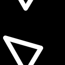
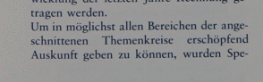

||||||||
|---|---|---|---|---|---|---|
|[Project ↗](../../README.md)|[Documentation ↗](../index.md)|&mdash;|[Tutorials ↗](../tutorials.md)|[How To's ↗](../howtos.md)|[Explanations ↗](../explanations.md)|References|

|||||||||
|---|---|---|---|---|---|---|---|
|[Entry ↗](index.md)|&mdash;|[Sections ↘](bysection.md)|[Permuted Sections ↘](bypsection.md)|[Names ↘](byname.md)|[Permuted Names ↘](bypname.md)|[Strict ↘](strict.md)|[Implementations ↘](bylang.md)|

# Documentation -- Reference Pages -- accessor geometry

## Table Of Contents

  - [accessor](accessor.md) ↗

### Operators

 - [aktive query depth](#query_depth)
 - [aktive query domain](#query_domain)
 - [aktive query geometry](#query_geometry)
 - [aktive query height](#query_height)
 - [aktive query location](#query_location)
 - [aktive query pitch](#query_pitch)
 - [aktive query pixels](#query_pixels)
 - [aktive query size](#query_size)
 - [aktive query width](#query_width)
 - [aktive query x](#query_x)
 - [aktive query xmax](#query_xmax)
 - [aktive query y](#query_y)
 - [aktive query ymax](#query_ymax)

## Operators

---
###  aktive query depth

Syntax: __aktive query depth__ src

Returns the image's depth.

## Examples

### aktive query depth @1

|||
|---|---|
|@1|aktive query depth @1|
||`1`|

### aktive query depth @1

|||
|---|---|
|@1|aktive query depth @1|
||`1`|

---
###  aktive query domain

Syntax: __aktive query domain__ src

Returns the image domain, a 2D rectangle. I.e. location, width, and height.

## Examples

### aktive query domain @1

|||
|---|---|
|@1|aktive query domain @1|
||`0 0 32 32`|

### aktive query domain @1

|||
|---|---|
|@1|aktive query domain @1|
||`0 0 32 32`|

---
###  aktive query geometry

Syntax: __aktive query geometry__ src

Returns the full image geometry, i.e. domain and depth.

## Examples

### aktive query geometry @1

|||
|---|---|
|@1|aktive query geometry @1|
||`0 0 32 32 1`|

### aktive query geometry @1

|||
|---|---|
|@1|aktive query geometry @1|
||`0 0 32 32 1`|

---
###  aktive query height

Syntax: __aktive query height__ src

Returns the image's height.

## Examples

### aktive query height @1

|||
|---|---|
|@1|aktive query height @1|
||`32`|

### aktive query height @1

|||
|---|---|
|@1|aktive query height @1|
||`32`|

---
###  aktive query location

Syntax: __aktive query location__ src

Returns the image location, a 2D point.

## Examples

### aktive query location @1

|||
|---|---|
|@1|aktive query location @1|
||`0 0`|

### aktive query location @1

|||
|---|---|
|@1|aktive query location @1|
||`0 0`|

---
###  aktive query pitch

Syntax: __aktive query pitch__ src

Returns the image's pitch, the number of values in a row, taking depth into account.

## Examples

### aktive query pitch @1

|||
|---|---|
|@1|aktive query pitch @1|
||`32`|

### aktive query pitch @1

|||
|---|---|
|@1|aktive query pitch @1|
||`32`|

---
###  aktive query pixels

Syntax: __aktive query pixels__ src

Returns the image's number of pixels.

## Examples

### aktive query pixels @1

|||
|---|---|
|@1|aktive query pixels @1|
||`1024`|

### aktive query pixels @1

|||
|---|---|
|@1|aktive query pixels @1|
||`1024`|

---
###  aktive query size

Syntax: __aktive query size__ src

Returns the image's size, the number of pixels multiplied by the depth.

## Examples

### aktive query size @1

|||
|---|---|
|@1|aktive query size @1|
||`1024`|

### aktive query size @1

|||
|---|---|
|@1|aktive query size @1|
||`1024`|

---
###  aktive query width

Syntax: __aktive query width__ src

Returns the image's width.

## Examples

### aktive query width @1

|||
|---|---|
|@1|aktive query width @1|
||`32`|

### aktive query width @1

|||
|---|---|
|@1|aktive query width @1|
||`32`|

---
###  aktive query x

Syntax: __aktive query x__ src

Returns the image's x location.

## Examples

### aktive query x @1

|||
|---|---|
|@1|aktive query x @1|
||`0`|

### aktive query x @1

|||
|---|---|
|@1|aktive query x @1|
||`0`|

---
###  aktive query xmax

Syntax: __aktive query xmax__ src

Returns the image's maximum x location.

## Examples

### aktive query xmax @1

|||
|---|---|
|@1|aktive query xmax @1|
||`31`|

### aktive query xmax @1

|||
|---|---|
|@1|aktive query xmax @1|
||`31`|

---
###  aktive query y

Syntax: __aktive query y__ src

Returns the image's y location.

## Examples

### aktive query y @1

|||
|---|---|
|@1|aktive query y @1|
||`0`|

### aktive query y @1

|||
|---|---|
|@1|aktive query y @1|
||`0`|

---
###  aktive query ymax

Syntax: __aktive query ymax__ src

Returns the image's maximum y location.

## Examples

### aktive query ymax @1

|||
|---|---|
|@1|aktive query ymax @1|
||`31`|

### aktive query ymax @1

|||
|---|---|
|@1|aktive query ymax @1|
||`31`|

