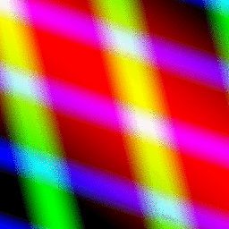

||||||||
|---|---|---|---|---|---|---|
|[Project ↗](../../README.md)|[Documentation ↗](../index.md)|&mdash;|[Tutorials ↗](../tutorials.md)|[How To's ↗](../howtos.md)|[Explanations ↗](../explanations.md)|References|

|||||||||
|---|---|---|---|---|---|---|---|
|[Entry ↗](index.md)|&mdash;|[Sections ↘](bysection.md)|[Permuted Sections ↘](bypsection.md)|[Names ↘](byname.md)|[Permuted Names ↘](bypname.md)|[Strict ↘](strict.md)|[Implementations ↘](bylang.md)|

# Documentation -- Reference Pages -- accessor geometry

## <anchor='top'> Table Of Contents

  - [accessor](accessor.md) ↗

### Operators

 - [aktive query depth](#query_depth)
 - [aktive query domain](#query_domain)
 - [aktive query geometry](#query_geometry)
 - [aktive query height](#query_height)
 - [aktive query location](#query_location)
 - [aktive query pitch](#query_pitch)
 - [aktive query pixels](#query_pixels)
 - [aktive query size](#query_size)
 - [aktive query width](#query_width)
 - [aktive query x](#query_x)
 - [aktive query xmax](#query_xmax)
 - [aktive query y](#query_y)
 - [aktive query ymax](#query_ymax)

## Operators

---
### [↑](#top)  aktive query depth

Syntax: __aktive query depth__ src [[→ definition](/file?ci=trunk&ln=141&name=etc/accessor/attributes.tcl)]

Returns the input's depth.

|Input|Description|
|:---|:---|
|src|Source image|

####  Examples

<table>
<tr><th>@1
     &nbsp;</th>
    <th>aktive query depth @1
     &nbsp;</th></tr>
<tr><td valign='top'>
     geometry(0 0 32 32 1)</td>
    <td valign='top'>&nbsp;1</td></tr>
</table>

<table>
<tr><th>@1
     &nbsp;</th>
    <th>aktive query depth @1
     &nbsp;</th></tr>
<tr><td valign='top'>
     geometry(0 0 32 32 1)</td>
    <td valign='top'>&nbsp;1</td></tr>
</table>

---
### [↑](#top)  aktive query domain

Syntax: __aktive query domain__ src [[→ definition](/file?ci=trunk&ln=69&name=etc/accessor/attributes.tcl)]

Returns the input's domain, a 2D rectangle. I.e. location, width, and height.

|Input|Description|
|:---|:---|
|src|Source image|

####  Examples

<table>
<tr><th>@1
     &nbsp;</th>
    <th>aktive query domain @1
     &nbsp;</th></tr>
<tr><td valign='top'>
     geometry(0 0 32 32 1)</td>
    <td valign='top'>&nbsp;0 0 32 32</td></tr>
</table>

<table>
<tr><th>@1
     &nbsp;</th>
    <th>aktive query domain @1
     &nbsp;</th></tr>
<tr><td valign='top'>
     geometry(0 0 32 32 1)</td>
    <td valign='top'>&nbsp;0 0 32 32</td></tr>
</table>

---
### [↑](#top)  aktive query geometry

Syntax: __aktive query geometry__ src [[→ definition](/file?ci=trunk&ln=90&name=etc/accessor/attributes.tcl)]

Returns the input's full geometry, i.e. domain and depth.

|Input|Description|
|:---|:---|
|src|Source image|

####  Examples

<table>
<tr><th>@1
     &nbsp;</th>
    <th>aktive query geometry @1
     &nbsp;</th></tr>
<tr><td valign='top'>
     geometry(0 0 32 32 1)</td>
    <td valign='top'>&nbsp;0 0 32 32 1</td></tr>
</table>

<table>
<tr><th>@1
     &nbsp;</th>
    <th>aktive query geometry @1
     &nbsp;</th></tr>
<tr><td valign='top'>
     geometry(0 0 32 32 1)</td>
    <td valign='top'>&nbsp;0 0 32 32 1</td></tr>
</table>

---
### [↑](#top)  aktive query height

Syntax: __aktive query height__ src [[→ definition](/file?ci=trunk&ln=141&name=etc/accessor/attributes.tcl)]

Returns the input's height.

|Input|Description|
|:---|:---|
|src|Source image|

####  Examples

<table>
<tr><th>@1
     &nbsp;</th>
    <th>aktive query height @1
     &nbsp;</th></tr>
<tr><td valign='top'>
     geometry(0 0 32 32 1)</td>
    <td valign='top'>&nbsp;32</td></tr>
</table>

<table>
<tr><th>@1
     &nbsp;</th>
    <th>aktive query height @1
     &nbsp;</th></tr>
<tr><td valign='top'>
     geometry(0 0 32 32 1)</td>
    <td valign='top'>&nbsp;32</td></tr>
</table>

---
### [↑](#top)  aktive query location

Syntax: __aktive query location__ src [[→ definition](/file?ci=trunk&ln=48&name=etc/accessor/attributes.tcl)]

Returns the input's location, a 2D point.

|Input|Description|
|:---|:---|
|src|Source image|

####  Examples

<table>
<tr><th>@1
     &nbsp;</th>
    <th>aktive query location @1
     &nbsp;</th></tr>
<tr><td valign='top'>
     geometry(0 0 32 32 1)</td>
    <td valign='top'>&nbsp;0 0</td></tr>
</table>

<table>
<tr><th>@1
     &nbsp;</th>
    <th>aktive query location @1
     &nbsp;</th></tr>
<tr><td valign='top'>
     geometry(0 0 32 32 1)</td>
    <td valign='top'>&nbsp;0 0</td></tr>
</table>

---
### [↑](#top)  aktive query pitch

Syntax: __aktive query pitch__ src [[→ definition](/file?ci=trunk&ln=141&name=etc/accessor/attributes.tcl)]

Returns the input's pitch, the number of values in a row, i.e. width times depth.

|Input|Description|
|:---|:---|
|src|Source image|

####  Examples

<table>
<tr><th>@1
     &nbsp;</th>
    <th>aktive query pitch @1
     &nbsp;</th></tr>
<tr><td valign='top'>
     geometry(0 0 32 32 1)</td>
    <td valign='top'>&nbsp;32</td></tr>
</table>

<table>
<tr><th>@1
     &nbsp;</th>
    <th>aktive query pitch @1
     &nbsp;</th></tr>
<tr><td valign='top'>
     geometry(0 0 32 32 1)</td>
    <td valign='top'>&nbsp;32</td></tr>
</table>

---
### [↑](#top)  aktive query pixels

Syntax: __aktive query pixels__ src [[→ definition](/file?ci=trunk&ln=141&name=etc/accessor/attributes.tcl)]

Returns the input's number of pixels.

|Input|Description|
|:---|:---|
|src|Source image|

####  Examples

<table>
<tr><th>@1
     &nbsp;</th>
    <th>aktive query pixels @1
     &nbsp;</th></tr>
<tr><td valign='top'>
     geometry(0 0 32 32 1)</td>
    <td valign='top'>&nbsp;1024</td></tr>
</table>

<table>
<tr><th>@1
     &nbsp;</th>
    <th>aktive query pixels @1
     &nbsp;</th></tr>
<tr><td valign='top'>
     geometry(0 0 32 32 1)</td>
    <td valign='top'>&nbsp;1024</td></tr>
</table>

---
### [↑](#top)  aktive query size

Syntax: __aktive query size__ src [[→ definition](/file?ci=trunk&ln=141&name=etc/accessor/attributes.tcl)]

Returns the input's size, i.e. the number of pixels times depth.

|Input|Description|
|:---|:---|
|src|Source image|

####  Examples

<table>
<tr><th>@1
     &nbsp;</th>
    <th>aktive query size @1
     &nbsp;</th></tr>
<tr><td valign='top'>
     geometry(0 0 32 32 1)</td>
    <td valign='top'>&nbsp;1024</td></tr>
</table>

<table>
<tr><th>@1
     &nbsp;</th>
    <th>aktive query size @1
     &nbsp;</th></tr>
<tr><td valign='top'>
     geometry(0 0 32 32 1)</td>
    <td valign='top'>&nbsp;1024</td></tr>
</table>

---
### [↑](#top)  aktive query width

Syntax: __aktive query width__ src [[→ definition](/file?ci=trunk&ln=141&name=etc/accessor/attributes.tcl)]

Returns the input's width.

|Input|Description|
|:---|:---|
|src|Source image|

####  Examples

<table>
<tr><th>@1
     &nbsp;</th>
    <th>aktive query width @1
     &nbsp;</th></tr>
<tr><td valign='top'>
     geometry(0 0 32 32 1)</td>
    <td valign='top'>&nbsp;32</td></tr>
</table>

<table>
<tr><th>@1
     &nbsp;</th>
    <th>aktive query width @1
     &nbsp;</th></tr>
<tr><td valign='top'>
     geometry(0 0 32 32 1)</td>
    <td valign='top'>&nbsp;32</td></tr>
</table>

---
### [↑](#top)  aktive query x

Syntax: __aktive query x__ src [[→ definition](/file?ci=trunk&ln=113&name=etc/accessor/attributes.tcl)]

Returns the input's x location.

|Input|Description|
|:---|:---|
|src|Source image|

####  Examples

<table>
<tr><th>@1
     &nbsp;</th>
    <th>aktive query x @1
     &nbsp;</th></tr>
<tr><td valign='top'>
     geometry(0 0 32 32 1)</td>
    <td valign='top'>&nbsp;0</td></tr>
</table>

<table>
<tr><th>@1
     &nbsp;</th>
    <th>aktive query x @1
     &nbsp;</th></tr>
<tr><td valign='top'>
     geometry(0 0 32 32 1)</td>
    <td valign='top'>&nbsp;0</td></tr>
</table>

---
### [↑](#top)  aktive query xmax

Syntax: __aktive query xmax__ src [[→ definition](/file?ci=trunk&ln=113&name=etc/accessor/attributes.tcl)]

Returns the input's maximum x location.

|Input|Description|
|:---|:---|
|src|Source image|

####  Examples

<table>
<tr><th>@1
     &nbsp;</th>
    <th>aktive query xmax @1
     &nbsp;</th></tr>
<tr><td valign='top'>
     geometry(0 0 32 32 1)</td>
    <td valign='top'>&nbsp;31</td></tr>
</table>

<table>
<tr><th>@1
     &nbsp;</th>
    <th>aktive query xmax @1
     &nbsp;</th></tr>
<tr><td valign='top'>
     geometry(0 0 32 32 1)</td>
    <td valign='top'>&nbsp;31</td></tr>
</table>

---
### [↑](#top)  aktive query y

Syntax: __aktive query y__ src [[→ definition](/file?ci=trunk&ln=113&name=etc/accessor/attributes.tcl)]

Returns the input's y location.

|Input|Description|
|:---|:---|
|src|Source image|

####  Examples

<table>
<tr><th>@1
     &nbsp;</th>
    <th>aktive query y @1
     &nbsp;</th></tr>
<tr><td valign='top'>
     geometry(0 0 32 32 1)</td>
    <td valign='top'>&nbsp;0</td></tr>
</table>

<table>
<tr><th>@1
     &nbsp;</th>
    <th>aktive query y @1
     &nbsp;</th></tr>
<tr><td valign='top'>
     geometry(0 0 32 32 1)</td>
    <td valign='top'>&nbsp;0</td></tr>
</table>

---
### [↑](#top)  aktive query ymax

Syntax: __aktive query ymax__ src [[→ definition](/file?ci=trunk&ln=113&name=etc/accessor/attributes.tcl)]

Returns the input's maximum y location.

|Input|Description|
|:---|:---|
|src|Source image|

####  Examples

<table>
<tr><th>@1
     &nbsp;</th>
    <th>aktive query ymax @1
     &nbsp;</th></tr>
<tr><td valign='top'>
     geometry(0 0 32 32 1)</td>
    <td valign='top'>&nbsp;31</td></tr>
</table>

<table>
<tr><th>@1
     &nbsp;</th>
    <th>aktive query ymax @1
     &nbsp;</th></tr>
<tr><td valign='top'>
     geometry(0 0 32 32 1)</td>
    <td valign='top'>&nbsp;31</td></tr>
</table>

