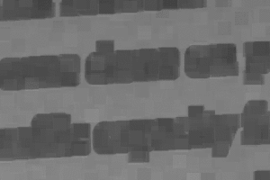

||||||||
|---|---|---|---|---|---|---|
|[Project ↗](../../README.md)|[Documentation ↗](../index.md)|&mdash;|[Tutorials ↗](../tutorials.md)|[How To's ↗](../howtos.md)|[Explanations ↗](../explanations.md)|References|

|||||||||
|---|---|---|---|---|---|---|---|
|[Entry ↗](index.md)|&mdash;|[Sections ↘](bysection.md)|[Permuted Sections ↘](bypsection.md)|[Names ↘](byname.md)|[Permuted Names ↘](bypname.md)|[Strict ↘](strict.md)|[Implementations ↘](bylang.md)|

# Documentation -- Reference Pages -- accessor threshold generate

## <anchor='top'> Table Of Contents

  - [accessor threshold](accessor_threshold.md) ↗

### Operators

 - [aktive image threshold global bernsen](#image_threshold_global_bernsen)
 - [aktive image threshold global mean](#image_threshold_global_mean)
 - [aktive image threshold global niblack](#image_threshold_global_niblack)
 - [aktive image threshold global otsu](#image_threshold_global_otsu)
 - [aktive image threshold global phansalkar](#image_threshold_global_phansalkar)
 - [aktive image threshold global sauvola](#image_threshold_global_sauvola)

## Operators

---
### [↑](#top)  aktive image threshold global bernsen

Syntax: __aktive image threshold global bernsen__ src [[→ definition](../../../../file?ci=trunk&ln=64&name=etc/accessor/thresholds.tcl)]

Returns a global threshold for the input, according to [Bernsen](https://craftofcoding.wordpress.com/2021/10/27/thresholding-algorithms-bernsen-local)'s method.

The operator [aktive image mask per global bernsen](transform_threshold_mask_generate.md#image_mask_per_global_bernsen) uses this to generate a mask of the input.

This operator is __strict__ in its single input. The computed pixels are not materialized. They are immediately reduced to the threshold.

|Input|Description|
|:---|:---|
|src|Source image|

####  Examples

<table>
<tr><th>@1
     &nbsp;</th>
    <th>aktive image threshold global bernsen @1
     &nbsp;</th></tr>
<tr><td valign='top'>
     geometry(0 0 300 200 1)</td>
    <td valign='top'>&nbsp;0.33137254901960783</td></tr>
</table>

<table>
<tr><th>@1
     &nbsp;</th>
    <th>aktive image threshold global bernsen @1
     &nbsp;</th></tr>
<tr><td valign='top'>
     geometry(0 0 380 250 3)</td>
    <td valign='top'>&nbsp;0.5078431372549019</td></tr>
</table>

---
### [↑](#top)  aktive image threshold global mean

Syntax: __aktive image threshold global mean__ src [[→ definition](../../../../file?ci=trunk&ln=19&name=etc/accessor/thresholds.tcl)]

Returns a global threshold for the input, as the image mean.

The operator [aktive image mask per global mean](transform_threshold_mask_generate.md#image_mask_per_global_mean) uses this to generate a mask of the input.

There are better methods. Extensions to the simple mean, in order of creation (and complexity), are [Sauvola](https://craftofcoding.wordpress.com/2021/10/06/thresholding-algorithms-sauvola-local), [Niblack](https://craftofcoding.wordpress.com/2021/09/30/thresholding-algorithms-niblack-local), and [Phansalkar](https://craftofcoding.wordpress.com/2021/09/28/thresholding-algorithms-phansalkar-local). Each of these modifies the plain mean with a bias based on a mix of mean, standard deviation, and parameters.

This operator is __strict__ in its single input. The computed pixels are not materialized. They are immediately reduced to the threshold.

|Input|Description|
|:---|:---|
|src|Source image|

####  Examples

<table>
<tr><th>@1
     &nbsp;</th>
    <th>aktive image threshold global mean @1
     &nbsp;</th></tr>
<tr><td valign='top'>
     geometry(0 0 300 200 1)</td>
    <td valign='top'>&nbsp;0.46493130718954245</td></tr>
</table>

<table>
<tr><th>@1
     &nbsp;</th>
    <th>aktive image threshold global mean @1
     &nbsp;</th></tr>
<tr><td valign='top'>
     geometry(0 0 380 250 3)</td>
    <td valign='top'>&nbsp;0.37447068455452354</td></tr>
</table>

---
### [↑](#top)  aktive image threshold global niblack

Syntax: __aktive image threshold global niblack__ src ?(param value)...? [[→ definition](../../../../file?ci=trunk&ln=112&name=etc/accessor/thresholds.tcl)]

Returns a global threshold for the input, according to [Niblack](https://craftofcoding.wordpress.com/2021/09/30/thresholding-algorithms-niblack-local)'s method.

The operator [aktive image mask per global niblack](transform_threshold_mask_generate.md#image_mask_per_global_niblack) uses this to generate a mask of the input.

This operator is __strict__ in its single input. The computed pixels are not materialized. They are immediately reduced to the threshold.

|Input|Description|
|:---|:---|
|src|Source image|

|Parameter|Type|Default|Description|
|:---|:---|:---|:---|
|k|double|-0.2|niblack parameter|

####  Examples

<table>
<tr><th>@1
     &nbsp;</th>
    <th>aktive image threshold global niblack @1
     &nbsp;</th></tr>
<tr><td valign='top'>
     geometry(0 0 300 200 1)</td>
    <td valign='top'>&nbsp;0.4461036579290674</td></tr>
</table>

<table>
<tr><th>@1
     &nbsp;</th>
    <th>aktive image threshold global niblack @1
     &nbsp;</th></tr>
<tr><td valign='top'>
     geometry(0 0 380 250 3)</td>
    <td valign='top'>&nbsp;0.3194965780697608</td></tr>
</table>

---
### [↑](#top)  aktive image threshold global otsu

Syntax: __aktive image threshold global otsu__ src ?(param value)...? [[→ definition](../../../../file?ci=trunk&ln=274&name=etc/accessor/thresholds.tcl)]

Returns a global threshold for the input, according to [Otsu](https://en.wikipedia.org/wiki/Otsu%27s_method)'s method.

The operator [aktive image mask per global otsu](transform_threshold_mask_generate.md#image_mask_per_global_otsu) uses this to generate a mask of the input.

This operator is __strict__ in its single input. The computed pixels are not materialized. They are immediately reduced to the threshold.

|Input|Description|
|:---|:---|
|src|Source image|

|Parameter|Type|Default|Description|
|:---|:---|:---|:---|
|bins|int|256|The number of bins used by the internal histogram. The pixel values are quantized to fit. Only values in the range of `[0..1]` are considered valid. Values outside of that range are placed into the smallest/largest bins, respectively. The default quantizes the image values to 8-bit.|

####  Examples

<table>
<tr><th>@1
     &nbsp;</th>
    <th>aktive image threshold global otsu @1
     &nbsp;</th></tr>
<tr><td valign='top'>
     geometry(0 0 300 200 1)</td>
    <td valign='top'>&nbsp;0.3515625</td></tr>
</table>

---
### [↑](#top)  aktive image threshold global phansalkar

Syntax: __aktive image threshold global phansalkar__ src ?(param value)...? [[→ definition](../../../../file?ci=trunk&ln=217&name=etc/accessor/thresholds.tcl)]

Returns a global threshold for the input, according to [Phansalkar](https://craftofcoding.wordpress.com/2021/09/28/thresholding-algorithms-phansalkar-local)'s method.

The operator [aktive image mask per global phansalkar](transform_threshold_mask_generate.md#image_mask_per_global_phansalkar) uses this to generate a mask of the input.

This operator is __strict__ in its single input. The computed pixels are not materialized. They are immediately reduced to the threshold.

|Input|Description|
|:---|:---|
|src|Source image|

|Parameter|Type|Default|Description|
|:---|:---|:---|:---|
|k|double|0.25|phansalkar parameter|
|R|double|0.5|phansalkar parameter|
|p|double|3|phansalkar parameter|
|q|double|10|phansalkar parameter|

####  Examples

<table>
<tr><th>@1
     &nbsp;</th>
    <th>aktive image threshold global phansalkar @1
     &nbsp;</th></tr>
<tr><td valign='top'>
     geometry(0 0 300 200 1)</td>
    <td valign='top'>&nbsp;0.3839280179396569</td></tr>
</table>

<table>
<tr><th>@1
     &nbsp;</th>
    <th>aktive image threshold global phansalkar @1
     &nbsp;</th></tr>
<tr><td valign='top'>
     geometry(0 0 380 250 3)</td>
    <td valign='top'>&nbsp;0.35887882734383425</td></tr>
</table>

---
### [↑](#top)  aktive image threshold global sauvola

Syntax: __aktive image threshold global sauvola__ src ?(param value)...? [[→ definition](../../../../file?ci=trunk&ln=164&name=etc/accessor/thresholds.tcl)]

Returns a global threshold for the input, according to [Sauvola](https://craftofcoding.wordpress.com/2021/10/06/thresholding-algorithms-sauvola-local)'s method.

The operator [aktive image mask per global sauvola](transform_threshold_mask_generate.md#image_mask_per_global_sauvola) uses this to generate a mask of the input.

This operator is __strict__ in its single input. The computed pixels are not materialized. They are immediately reduced to the threshold.

|Input|Description|
|:---|:---|
|src|Source image|

|Parameter|Type|Default|Description|
|:---|:---|:---|:---|
|k|double|0.5|sauvola parameter|
|R|double|128|sauvola parameter|

####  Examples

<table>
<tr><th>@1
     &nbsp;</th>
    <th>aktive image threshold global sauvola @1
     &nbsp;</th></tr>
<tr><td valign='top'>
     geometry(0 0 300 200 1)</td>
    <td valign='top'>&nbsp;0.23263662163348175</td></tr>
</table>

<table>
<tr><th>@1
     &nbsp;</th>
    <th>aktive image threshold global sauvola @1
     &nbsp;</th></tr>
<tr><td valign='top'>
     geometry(0 0 380 250 3)</td>
    <td valign='top'>&nbsp;0.18763741632585793</td></tr>
</table>

