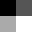

||||||||
|---|---|---|---|---|---|---|
|[Project ↗](../../README.md)|[Documentation ↗](../index.md)|&mdash;|[Tutorials ↗](../tutorials.md)|[How To's ↗](../howtos.md)|[Explanations ↗](../explanations.md)|References|

|||||||||
|---|---|---|---|---|---|---|---|
|[Entry ↗](index.md)|&mdash;|[Sections ↘](bysection.md)|[Permuted Sections ↘](bypsection.md)|[Names ↘](byname.md)|[Permuted Names ↘](bypname.md)|[Strict ↘](strict.md)|[Implementations ↘](bylang.md)|

# Documentation -- Reference Pages -- accessor values

## <anchor='top'> Table Of Contents

  - [accessor](accessor.md) ↗

### Operators

 - [aktive query value around](#query_value_around)
 - [aktive query value at](#query_value_at)
 - [aktive query values](#query_values)

## Operators

---
### [↑](#top)  aktive query value around

Syntax: __aktive query value around__ src ?(param value)...? [[→ definition](/file?ci=trunk&ln=320&name=etc/accessor/attributes.tcl)]

Returns the input's pixel values for the region around the specified 2D point, within the manhattan `radius`.

The result is __not__ an image.

Beware that the coordinate domain is `0..width|height`, regardless of image location.

This operator is __strict__ in its single input. The requested pixel region is materialized in memory.

|Input|Description|
|:---|:---|
|src|Source image|

|Parameter|Type|Default|Description|
|:---|:---|:---|:---|
|x|int||Physical x-coordinate of the pixel to query|
|y|int||Physical y-coordinate of the pixel to query|
|radius|uint|1|Region radius, defaults to 1, i.e. a 3x3 region.|

---
### [↑](#top)  aktive query value at

Syntax: __aktive query value at__ src (param value)... [[→ definition](/file?ci=trunk&ln=290&name=etc/accessor/attributes.tcl)]

Returns the input's pixel value(s) at the given 2D point.

The result is __not__ an image. It is a list of floating point numbers for a multi-band input, and a single floating point number otherwise.

Beware that the coordinate domain is `0..width|height`, regardless of image location.

This operator is __strict__ in its single input. The requested pixel is materialized in memory.

|Input|Description|
|:---|:---|
|src|Source image|

|Parameter|Type|Default|Description|
|:---|:---|:---|:---|
|x|int||Physical x-coordinate of the pixel to query|
|y|int||Physical y-coordinate of the pixel to query|

####  Examples

<table>
<tr><th>@1
     &nbsp;</th>
    <th>aktive query value at @1 x 0 y 1
     &nbsp;</th></tr>
<tr><td valign='top'><table><tr><td valign='top'>times 16</td><td valign='top'>
     geometry(0 0 32 32 1)</td></tr></table></td>
    <td valign='top'>&nbsp;0.6666666666666666</td></tr>
</table>

---
### [↑](#top)  aktive query values

Syntax: __aktive query values__ src [[→ definition](/file?ci=trunk&ln=264&name=etc/accessor/attributes.tcl)]

Returns a list containing the input's pixel values.

The values are provided in row-major order.

The list has length "[aktive query size](accessor_geometry.md#query_size) \<src\>".

This operator is __strict__ in its single input. The image is materialized in memory.

|Input|Description|
|:---|:---|
|src|Source image|

####  Examples

<table>
<tr><th>@1
     &nbsp;</th>
    <th>aktive query values @1
     &nbsp;</th></tr>
<tr><td valign='top'><table><tr><td valign='top'>times 16</td><td valign='top'>
     geometry(0 0 32 32 1)</td></tr></table></td>
    <td valign='top'>&nbsp;0.0 0.3333333333333333 0.6666666666666666 1.0</td></tr>
</table>

