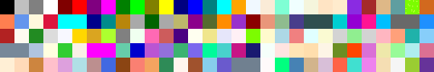

||||||||
|---|---|---|---|---|---|---|
|[Project ↗](../../README.md)|[Documentation ↗](../index.md)|&mdash;|[Tutorials ↗](../tutorials.md)|[How To's ↗](../howtos.md)|[Explanations ↗](../explanations.md)|References|

|||||||||
|---|---|---|---|---|---|---|---|
|[Entry ↗](index.md)|&mdash;|[Sections ↘](bysection.md)|[Permuted Sections ↘](bypsection.md)|[Names ↘](byname.md)|[Permuted Names ↘](bypname.md)|[Strict ↘](strict.md)|[Implementations ↘](bylang.md)|

# Documentation -- Reference Pages -- color

## <anchor='top'> Table Of Contents

  - [Roots](bysection.md) ↗

### Operators

 - [aktive color css](#color_css)
 - [aktive color css-names](#color_css_names)

## Operators

---
### [↑](#top)  aktive color css

Syntax: __aktive color css__ name [[→ definition](/file?ci=trunk&ln=5&name=etc/other/color.tcl)]

Returns the RGB values for the named color. The command knows the CSS colors up to CSS level 4.

|Parameter|Type|Default|Description|
|:---|:---|:---|:---|
|name|str||Color name to look up.|

####  Examples

<table>
<tr><th>aktive color css lavenderblush
     &nbsp;</th></tr>
<tr><td valign='top'>&nbsp;1.0 0.9411764705882353 0.9607843137254902</td></tr>
</table>

<table>
<tr><th>aktive image from color-matrix width 30 height 5 values {&#42}[aktive color css-names]
     &nbsp;</th></tr>
<tr><td valign='top'><table><tr><td valign='top'>times 16</td><td valign='top'>
     geometry(0 0 480 80 3)</td></tr></table></td></tr>
</table>

---
### [↑](#top)  aktive color css-names

Syntax: __aktive color css-names__  [[→ definition](/file?ci=trunk&ln=24&name=etc/other/color.tcl)]

Returns the names of all CSS colors known to the package, up to CSS level 4.

####  Examples

<table>
<tr><th>string cat "..." [lrange [aktive color css-names] 50 65] "..."
     &nbsp;</th></tr>
<tr><td valign='top'>&nbsp;...fuchsia gainsboro ghostwhite gold goldenrod gray green greenyellow grey honeydew hotpink indianred indigo ivory khaki lavender...</td></tr>
</table>

