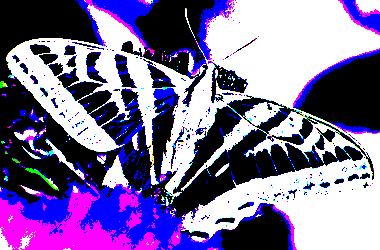
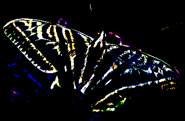
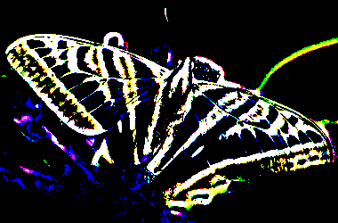
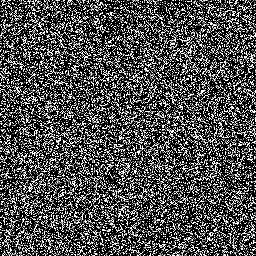
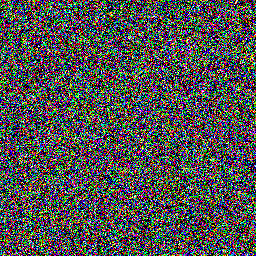
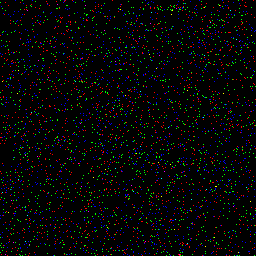
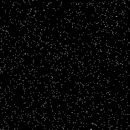

||||||||
|---|---|---|---|---|---|---|
|[Project ↗](../../README.md)|[Documentation ↗](../index.md)|&mdash;|[Tutorials ↗](../tutorials.md)|[How To's ↗](../howtos.md)|[Explanations ↗](../explanations.md)|References|

|||||||||
|---|---|---|---|---|---|---|---|
|[Entry ↗](index.md)|&mdash;|[Sections ↘](bysection.md)|[Permuted Sections ↘](bypsection.md)|[Names ↘](byname.md)|[Permuted Names ↘](bypname.md)|[Strict ↘](strict.md)|[Implementations ↘](bylang.md)|

# Documentation -- Reference Pages -- composer

## Table Of Contents

  - [Roots](bysection.md) ↗

### Operators

 - [aktive op montage x](#op_montage_x)
 - [aktive op montage x-core](#op_montage_x_core)
 - [aktive op montage x-rep](#op_montage_x_rep)
 - [aktive op montage y](#op_montage_y)
 - [aktive op montage y-core](#op_montage_y_core)
 - [aktive op montage y-rep](#op_montage_y_rep)
 - [aktive op montage z](#op_montage_z)
 - [aktive op montage z-core](#op_montage_z_core)
 - [aktive op montage z-rep](#op_montage_z_rep)

## Operators

---
###  aktive op montage x

Syntax: __aktive op montage x__ srcs...

Returns image with all inputs joined left to right along the x-axis.

## Examples

### aktive op montage x @1 @2 @3

|||||
|---|---|---|---|
|@1|@2|@3|aktive op montage x @1 @2 @3|
|||||

---
###  aktive op montage x-core

Syntax: __aktive op montage x-core__ src0 src1

Returns image with the 2 inputs joined left to right along the x-axis.

The location of the first image becomes the location of the result.

The other location is ignored.

The width of the result is the sum of the widths of the inputs.

The other dimensions use the maximum of the same over the inputs.

In the result the uncovered parts are zero (black)-filled.

---
###  aktive op montage x-rep

Syntax: __aktive op montage x-rep__ src (param value)...

Returns image with input joined left to right with itself N times along the x-axis.

|Parameter|Type|Default|Description|
|:---|:---|:---|:---|
|by|uint||Replication factor|

## Examples

### aktive op montage x-rep @1 by 3

|||
|---|---|
|@1|aktive op montage x-rep @1 by 3|
|||

---
###  aktive op montage y

Syntax: __aktive op montage y__ srcs...

Returns image with all inputs joined top to bottom along the y-axis.

## Examples

### aktive op montage y @1 @2 @3

|||||
|---|---|---|---|
|@1|@2|@3|aktive op montage y @1 @2 @3|
|||||

---
###  aktive op montage y-core

Syntax: __aktive op montage y-core__ src0 src1

Returns image with the 2 inputs joined top to bottom along the y-axis.

The location of the first image becomes the location of the result.

The other location is ignored.

The height of the result is the sum of the heights of the inputs.

The other dimensions use the maximum of the same over the inputs.

In the result the uncovered parts are zero (black)-filled.

---
###  aktive op montage y-rep

Syntax: __aktive op montage y-rep__ src (param value)...

Returns image with input joined top to bottom with itself N times along the y-axis.

|Parameter|Type|Default|Description|
|:---|:---|:---|:---|
|by|uint||Replication factor|

## Examples

### aktive op montage y-rep @1 by 3

|||
|---|---|
|@1|aktive op montage y-rep @1 by 3|
|||

---
###  aktive op montage z

Syntax: __aktive op montage z__ srcs...

Returns image with all inputs joined front to back along the z-axis.

## Examples

### aktive op montage z @1 @2 @3

|||||
|---|---|---|---|
|@1|@2|@3|aktive op montage z @1 @2 @3|
|||||

---
###  aktive op montage z-core

Syntax: __aktive op montage z-core__ src0 src1

Returns image with the 2 inputs joined front to back along the z-axis.

The location of the first image becomes the location of the result.

The other location is ignored.

The depth of the result is the sum of the depths of the inputs.

The other dimensions use the maximum of the same over the inputs.

In the result the uncovered parts are zero (black)-filled.

---
###  aktive op montage z-rep

Syntax: __aktive op montage z-rep__ src (param value)...

Returns image with input joined front to back with itself N times along the z-axis.

|Parameter|Type|Default|Description|
|:---|:---|:---|:---|
|by|uint||Replication factor|

## Examples

### aktive op montage z-rep @1 by 3

|||
|---|---|
|@1|aktive op montage z-rep @1 by 3|
|||

