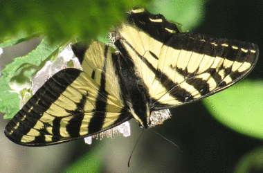

||||||||
|---|---|---|---|---|---|---|
|[Project ↗](../../README.md)|[Documentation ↗](../index.md)|&mdash;|[Tutorials ↗](../tutorials.md)|[How To's ↗](../howtos.md)|[Explanations ↗](../explanations.md)|References|

|||||||||
|---|---|---|---|---|---|---|---|
|[Entry ↗](index.md)|&mdash;|[Sections ↘](bysection.md)|[Permuted Sections ↘](bypsection.md)|[Names ↘](byname.md)|[Permuted Names ↘](bypname.md)|[Strict ↘](strict.md)|[Implementations ↘](bylang.md)|

# Documentation -- Reference Pages -- generator reader

## Table Of Contents

  - [generator](generator.md) ↗

### Operators

 - [aktive read from aktive](#read_from_aktive)
 - [aktive read from netpbm](#read_from_netpbm)

## Operators

---
###  aktive read from aktive

Syntax: __aktive read from aktive__  (param value)...

Construct image from file content in the native AKTIVE format.

|Parameter|Type|Default|Description|
|:---|:---|:---|:---|
|path|object||Path to file holding the AKTIVE image data to read|

## Examples

### aktive read from aktive path tests/assets/results/format-colorbox.aktive (times 8)

### aktive read from aktive path tests/assets/results/format-graybox.aktive (times 8)

---
###  aktive read from netpbm

Syntax: __aktive read from netpbm__  (param value)...

Construct image from file content in one of the NetPBM formats.

|Parameter|Type|Default|Description|
|:---|:---|:---|:---|
|path|object||Path to file holding the NetPBM image data to read|

## Examples

### aktive read from netpbm path tests/assets/sines.ppm

### aktive read from netpbm path tests/assets/crop.pgm

