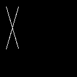
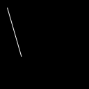

||||||||
|---|---|---|---|---|---|---|
|[Project ↗](../../README.md)|[Documentation ↗](../index.md)|&mdash;|[Tutorials ↗](../tutorials.md)|[How To's ↗](../howtos.md)|[Explanations ↗](../explanations.md)|References|

|||||||||
|---|---|---|---|---|---|---|---|
|[Entry ↗](index.md)|&mdash;|[Sections ↘](bysection.md)|[Permuted Sections ↘](bypsection.md)|[Names ↘](byname.md)|[Permuted Names ↘](bypname.md)|[Strict ↘](strict.md)|[Implementations ↘](bylang.md)|

# Documentation -- Reference Pages -- generator virtual

## <anchor='top'> Table Of Contents

  - [generator](generator.md) ↗

## Subsections

 - [generator virtual drawing](generator_virtual_drawing.md) ↘
 - [generator virtual sdf](generator_virtual_sdf.md) ↘
 - [generator virtual warp](generator_virtual_warp.md) ↘

### Operators

 - [aktive image cbar](#image_cbar)
 - [aktive image checkers](#image_checkers)
 - [aktive image circle](#image_circle)
 - [aktive image cross](#image_cross)
 - [aktive image dbar](#image_dbar)
 - [aktive image dgrid](#image_dgrid)
 - [aktive image disc](#image_disc)
 - [aktive image dstripes](#image_dstripes)
 - [aktive image eye](#image_eye)
 - [aktive image from band](#image_from_band)
 - [aktive image from column](#image_from_column)
 - [aktive image from matrix](#image_from_matrix)
 - [aktive image from row](#image_from_row)
 - [aktive image from sparse deltas](#image_from_sparse_deltas)
 - [aktive image from sparse points](#image_from_sparse_points)
 - [aktive image from sparse ranges](#image_from_sparse_ranges)
 - [aktive image from value](#image_from_value)
 - [aktive image gradient](#image_gradient)
 - [aktive image grey](#image_grey)
 - [aktive image grid](#image_grid)
 - [aktive image hbar](#image_hbar)
 - [aktive image indexed](#image_indexed)
 - [aktive image kernel emboss](#image_kernel_emboss)
 - [aktive image kernel gauss3 x](#image_kernel_gauss3_x)
 - [aktive image kernel gauss3 xy](#image_kernel_gauss3_xy)
 - [aktive image kernel gauss3 y](#image_kernel_gauss3_y)
 - [aktive image kernel gauss5 x](#image_kernel_gauss5_x)
 - [aktive image kernel gauss5 y](#image_kernel_gauss5_y)
 - [aktive image kernel gauss7 x](#image_kernel_gauss7_x)
 - [aktive image kernel gauss7 y](#image_kernel_gauss7_y)
 - [aktive image kernel gauss9 x](#image_kernel_gauss9_x)
 - [aktive image kernel gauss9 y](#image_kernel_gauss9_y)
 - [aktive image kernel gauss discrete](#image_kernel_gauss_discrete)
 - [aktive image kernel kirsch md](#image_kernel_kirsch_md)
 - [aktive image kernel kirsch sd](#image_kernel_kirsch_sd)
 - [aktive image kernel kirsch x](#image_kernel_kirsch_x)
 - [aktive image kernel kirsch y](#image_kernel_kirsch_y)
 - [aktive image kernel lanczos](#image_kernel_lanczos)
 - [aktive image kernel laplace 4](#image_kernel_laplace_4)
 - [aktive image kernel laplace 8](#image_kernel_laplace_8)
 - [aktive image kernel laplace X](#image_kernel_laplace_X)
 - [aktive image kernel prewitt md](#image_kernel_prewitt_md)
 - [aktive image kernel prewitt sd](#image_kernel_prewitt_sd)
 - [aktive image kernel prewitt x](#image_kernel_prewitt_x)
 - [aktive image kernel prewitt y](#image_kernel_prewitt_y)
 - [aktive image kernel roberts x](#image_kernel_roberts_x)
 - [aktive image kernel roberts y](#image_kernel_roberts_y)
 - [aktive image kernel scharr x](#image_kernel_scharr_x)
 - [aktive image kernel scharr y](#image_kernel_scharr_y)
 - [aktive image kernel sharp 4](#image_kernel_sharp_4)
 - [aktive image kernel sharp 8](#image_kernel_sharp_8)
 - [aktive image kernel sharp X](#image_kernel_sharp_X)
 - [aktive image kernel sobel md](#image_kernel_sobel_md)
 - [aktive image kernel sobel sd](#image_kernel_sobel_sd)
 - [aktive image kernel sobel x](#image_kernel_sobel_x)
 - [aktive image kernel sobel y](#image_kernel_sobel_y)
 - [aktive image noise gauss](#image_noise_gauss)
 - [aktive image noise salt](#image_noise_salt)
 - [aktive image noise uniform](#image_noise_uniform)
 - [aktive image palette color](#image_palette_color)
 - [aktive image palette grey](#image_palette_grey)
 - [aktive image sines](#image_sines)
 - [aktive image square](#image_square)
 - [aktive image stripes](#image_stripes)
 - [aktive image vbar](#image_vbar)
 - [aktive image xcross](#image_xcross)
 - [aktive image zone](#image_zone)

## Operators

---
### [↑](#top)  aktive image cbar

Syntax: __aktive image cbar__  ?(param value)...? [[→ definition](../../../../file?ci=trunk&ln=34&name=etc/generator/virtual/pattern/selements.tcl)]

Returns square single-band image containing a cross diagonal bar. The image has size `2*radius + 1` squared.

|Parameter|Type|Default|Description|
|:---|:---|:---|:---|
|radius|uint|1|Radius of the cross diagonal bar.|
|width|uint|0|Width of the element. Default 0. Has to be less or equal to the radius.|

####  Examples

<table>
<tr><th>aktive image cbar radius 32 width 8
     &nbsp;</th></tr>
<tr><td valign='top'>
     geometry(0 0 65 65 1)</td></tr>
</table>

---
### [↑](#top)  aktive image checkers

Syntax: __aktive image checkers__  ?(param value)...? [[→ definition](../../../../file?ci=trunk&ln=143&name=etc/generator/virtual/pattern/checkers.tcl)]

Returns image containing a black/white checker board.

|Parameter|Type|Default|Description|
|:---|:---|:---|:---|
|width|uint||Width of the returned image|
|height|uint||Height of the returned image|
|offset|uint|0|Pattern offset|
|black|uint|8|Width of the black area|
|white|uint|8|Width of the white area|

####  Examples

<table>
<tr><th>aktive image checkers width 128 height 128
     &nbsp;</th></tr>
<tr><td valign='top'>
     geometry(0 0 128 128 1)</td></tr>
</table>

<table>
<tr><th>aktive image checkers width 128 height 128 black 16 white 32
     &nbsp;</th></tr>
<tr><td valign='top'>
     geometry(0 0 128 128 1)</td></tr>
</table>

<table>
<tr><th>aktive image checkers width 128 height 128 black 16 white 32 offset 8
     &nbsp;</th></tr>
<tr><td valign='top'>
     geometry(0 0 128 128 1)</td></tr>
</table>

---
### [↑](#top)  aktive image circle

Syntax: __aktive image circle__  ?(param value)...? [[→ definition](../../../../file?ci=trunk&ln=34&name=etc/generator/virtual/pattern/selements.tcl)]

Returns square single-band image containing a circle (disc perimeter). The image has size `2*radius + 1` squared.

|Parameter|Type|Default|Description|
|:---|:---|:---|:---|
|radius|uint|1|Radius of the circle (disc perimeter).|
|width|uint|1|Width of the element. Default 1. Has to be less or equal to the radius.|

####  Examples

<table>
<tr><th>aktive image circle radius 32 width 8
     &nbsp;</th></tr>
<tr><td valign='top'>
     geometry(0 0 65 65 1)</td></tr>
</table>

---
### [↑](#top)  aktive image cross

Syntax: __aktive image cross__  ?(param value)...? [[→ definition](../../../../file?ci=trunk&ln=34&name=etc/generator/virtual/pattern/selements.tcl)]

Returns square single-band image containing a cross. The image has size `2*radius + 1` squared.

|Parameter|Type|Default|Description|
|:---|:---|:---|:---|
|radius|uint|1|Radius of the cross.|
|width|uint|0|Width of the element. Default 0. Has to be less or equal to the radius.|

####  Examples

<table>
<tr><th>aktive image cross radius 32 width 8
     &nbsp;</th></tr>
<tr><td valign='top'>
     geometry(0 0 65 65 1)</td></tr>
</table>

---
### [↑](#top)  aktive image dbar

Syntax: __aktive image dbar__  ?(param value)...? [[→ definition](../../../../file?ci=trunk&ln=34&name=etc/generator/virtual/pattern/selements.tcl)]

Returns square single-band image containing a diagonal bar. The image has size `2*radius + 1` squared.

|Parameter|Type|Default|Description|
|:---|:---|:---|:---|
|radius|uint|1|Radius of the diagonal bar.|
|width|uint|0|Width of the element. Default 0. Has to be less or equal to the radius.|

####  Examples

<table>
<tr><th>aktive image dbar radius 32 width 8
     &nbsp;</th></tr>
<tr><td valign='top'>
     geometry(0 0 65 65 1)</td></tr>
</table>

---
### [↑](#top)  aktive image dgrid

Syntax: __aktive image dgrid__  ?(param value)...? [[→ definition](../../../../file?ci=trunk&ln=29&name=etc/generator/virtual/pattern/checkers.tcl)]

Returns image containing a diagonal black/white grid with configurable stripes

|Parameter|Type|Default|Description|
|:---|:---|:---|:---|
|width|uint||Width of the returned image|
|height|uint||Height of the returned image|
|offset|uint|0|Pattern offset|
|black|uint|8|Width of the black stripe|
|white|uint|8|Width of the white stripe|

####  Examples

<table>
<tr><th>aktive image dgrid width 128 height 128
     &nbsp;</th></tr>
<tr><td valign='top'>
     geometry(0 0 128 128 1)</td></tr>
</table>

<table>
<tr><th>aktive image dgrid width 128 height 128 black 16 white 32
     &nbsp;</th></tr>
<tr><td valign='top'>
     geometry(0 0 128 128 1)</td></tr>
</table>

<table>
<tr><th>aktive image dgrid width 128 height 128 black 16 white 32 offset 8
     &nbsp;</th></tr>
<tr><td valign='top'>
     geometry(0 0 128 128 1)</td></tr>
</table>

---
### [↑](#top)  aktive image disc

Syntax: __aktive image disc__  ?(param value)...? [[→ definition](../../../../file?ci=trunk&ln=34&name=etc/generator/virtual/pattern/selements.tcl)]

Returns square single-band image containing a filled disc. The image has size `2*radius + 1` squared.

|Parameter|Type|Default|Description|
|:---|:---|:---|:---|
|radius|uint|1|Radius of the filled disc.|

####  Examples

<table>
<tr><th>aktive image disc radius 32
     &nbsp;</th></tr>
<tr><td valign='top'>
     geometry(0 0 65 65 1)</td></tr>
</table>

---
### [↑](#top)  aktive image dstripes

Syntax: __aktive image dstripes__  ?(param value)...? [[→ definition](../../../../file?ci=trunk&ln=98&name=etc/generator/virtual/pattern/checkers.tcl)]

Returns image containing a series of diagonal black/white stripes.

|Parameter|Type|Default|Description|
|:---|:---|:---|:---|
|width|uint||Width of the returned image|
|height|uint||Height of the returned image|
|offset|uint|0|Pattern offset|
|black|uint|8|Width of the black stripe|
|white|uint|8|Width of the white stripe|

####  Examples

<table>
<tr><th>aktive image dstripes width 128 height 128
     &nbsp;</th></tr>
<tr><td valign='top'>
     geometry(0 0 128 128 1)</td></tr>
</table>

<table>
<tr><th>aktive image dstripes width 128 height 128 black 16 white 32
     &nbsp;</th></tr>
<tr><td valign='top'>
     geometry(0 0 128 128 1)</td></tr>
</table>

<table>
<tr><th>aktive image dstripes width 128 height 128 black 16 white 32 offset 8
     &nbsp;</th></tr>
<tr><td valign='top'>
     geometry(0 0 128 128 1)</td></tr>
</table>

---
### [↑](#top)  aktive image eye

Syntax: __aktive image eye__  (param value)... [[→ definition](../../../../file?ci=trunk&ln=5&name=etc/generator/virtual/pattern/eye.tcl)]

Returns image containing a test pattern with increasing spatial frequency from left to right, and increasing amplitude (i.e. black to white) from top to bottom.

|Parameter|Type|Default|Description|
|:---|:---|:---|:---|
|width|uint||Width of the returned image|
|height|uint||Height of the returned image|
|factor|double||Maximum spatial frequency. Range 0..1.|

####  Examples

<table>
<tr><th>aktive image eye width 256 height 256 factor 0.8
     &nbsp;</th></tr>
<tr><td valign='top'>
     geometry(0 0 256 256 1)</td></tr>
</table>

---
### [↑](#top)  aktive image from band

Syntax: __aktive image from band__  ?(param value)...? [[→ definition](../../../../file?ci=trunk&ln=29&name=etc/generator/virtual/constant.tcl)]

Returns image where all pixels have the same band values.

Depth is len(value)

|Parameter|Type|Default|Description|
|:---|:---|:---|:---|
|x|int|0|Image location, X coordinate|
|y|int|0|Image location, Y coordinate|
|width|uint||Width of the returned image|
|height|uint||Height of the returned image|
|values|double...||Pixel band values|

####  Examples

<table>
<tr><th>aktive image from band width 64 height 64 values 0.3
     &nbsp;</th></tr>
<tr><td valign='top'>
     geometry(0 0 64 64 1)</td></tr>
</table>

<table>
<tr><th>aktive image from band width 64 height 64 values 0.3 0.5 0.7
     &nbsp;</th></tr>
<tr><td valign='top'>
     geometry(0 0 64 64 3)</td></tr>
</table>

---
### [↑](#top)  aktive image from column

Syntax: __aktive image from column__  ?(param value)...? [[→ definition](../../../../file?ci=trunk&ln=83&name=etc/generator/virtual/constant.tcl)]

Returns image of the specified width where all columns have the same set of values.

The image's height is the number of values.

|Parameter|Type|Default|Description|
|:---|:---|:---|:---|
|x|int|0|Image location, X coordinate|
|y|int|0|Image location, Y coordinate|
|width|uint||Width of the returned image|
|values|double...||Pixel column values|

####  Examples

<table>
<tr><th>aktive image from column width 64 values 0 0.05 0.1 0.15 0.2 0.25 0.3 0.35 0.4 0.45 0.5 0.55 0.6 0.6 0.7 0.75 0.8 0.85 0.9 0.95 1
     &nbsp;</th></tr>
<tr><td valign='top'>
     geometry(0 0 64 21 1)</td></tr>
</table>

---
### [↑](#top)  aktive image from matrix

Syntax: __aktive image from matrix__  ?(param value)...? [[→ definition](../../../../file?ci=trunk&ln=109&name=etc/generator/virtual/constant.tcl)]

Returns single-band image with the pixel VALUEs.

Less than width by height values are extended with zeroes.

Excess values are ignored.

Depth is fixed at 1.

|Parameter|Type|Default|Description|
|:---|:---|:---|:---|
|x|int|0|Image location, X coordinate|
|y|int|0|Image location, Y coordinate|
|width|uint||Width of the returned image|
|height|uint||Height of the returned image|
|factor|double|1|Scaling factor|
|values|double...||Pixel values|

####  Examples

<table>
<tr><th>aktive image from matrix width 16 height 16 values 0 0 0 0 0 0 0 0 0 0 0 0 0 0 0 0 0 0 0 0 0 0 0 0 0 0 0 0 0 0 0 0 0 0 1 1 1 1 1 1 1 1 1 1 1 1 0 0 0 0 1 1 1 1 1 1 1 1 1 1 1 1 0 0 0 0 1 1 0 0 0 0 0 0 0 0 0 0 0 0 0 0 1 1 0 0 0 0 0 0 0 0 0 0 0 0 0 0 1 1 0 0 0 0 0 0 0 0 0 0 0 0 0 0 1 1 1 1 1 1 1 1 0 0 0 0 0 0 0 0 1 1 1 1 1 1 1 1 0 0 0 0 0 0 0 0 1 1 0 0 0 0 0 0 0 0 0 0 0 0 0 0 1 1 0 0 0 0 0 0 0 0 0 0 0 0 0 0 1 1 0 0 0 0 0 0 0 0 0 0 0 0 0 0 1 1 0 0 0 0 0 0 0 0 0 0 0 0 0 0 1 1 0 0 0 0 0 0 0 0 0 0 0 0 0 0 0 0 0 0 0 0 0 0 0 0 0 0 0 0 0 0 0 0 0 0 0 0 0 0 0 0 0 0 0 0
     &nbsp;</th></tr>
<tr><td valign='top'><table><tr><td valign='top'>times 8</td><td valign='top'>
     geometry(0 0 128 128 1)</td></tr></table></td></tr>
</table>

---
### [↑](#top)  aktive image from row

Syntax: __aktive image from row__  ?(param value)...? [[→ definition](../../../../file?ci=trunk&ln=57&name=etc/generator/virtual/constant.tcl)]

Returns image of the specified height where all rows have the same set of values.

The image's width is the number of values.

|Parameter|Type|Default|Description|
|:---|:---|:---|:---|
|x|int|0|Image location, X coordinate|
|y|int|0|Image location, Y coordinate|
|height|uint||Height of the returned image|
|values|double...||Pixel row values|

####  Examples

<table>
<tr><th>aktive image from row height 64 values 0 0.05 0.1 0.15 0.2 0.25 0.3 0.35 0.4 0.45 0.5 0.55 0.6 0.6 0.7 0.75 0.8 0.85 0.9 0.95 1
     &nbsp;</th></tr>
<tr><td valign='top'>
     geometry(0 0 21 64 1)</td></tr>
</table>

---
### [↑](#top)  aktive image from sparse deltas

Syntax: __aktive image from sparse deltas__  (param value)... [[→ definition](../../../../file?ci=trunk&ln=55&name=etc/generator/virtual/sparse.tcl)]

Returns a single-band image where pixels are set to white at exactly the specified points. In contrast to `sparse points` the points are specified as linear distances from the origin.

The height is infered from the points

The first delta is relative to index 0

Converts the deltas internally to points and then operates like `sparse points`

Depth is fixed at 1

Pixel value is fixed at 1.0

|Parameter|Type|Default|Description|
|:---|:---|:---|:---|
|width|uint||Width of the returned image. This is needed for the conversion of the linear indices to (x,y) coordinates.|
|deltas|uint...||Linear distances between points to set|

####  Examples

<table>
<tr><th>aktive image from sparse deltas width 7 deltas 0 20 5 15
     &nbsp;</th></tr>
<tr><td valign='top'><table><tr><td valign='top'>
     geometry(0 0 7 6 1)</td><td valign='top'>times 8</td><td valign='top'>
     geometry(0 0 56 48 1)</td></tr></table></td></tr>
</table>

---
### [↑](#top)  aktive image from sparse points

Syntax: __aktive image from sparse points__  (param value)... [[→ definition](../../../../file?ci=trunk&ln=5&name=etc/generator/virtual/sparse.tcl)]

Returns a single-band image where pixels are set to white at exactly the specified coordinates.

Generally, the bounding box specifies the geometry, especially also the image origin

Width is implied by the bounding box of the points

Height is implied by the bounding box of the points

Depth is fixed at 1

Pixel value is fixed at 1.0

|Parameter|Type|Default|Description|
|:---|:---|:---|:---|
|coords|point...||Coordinates of the pixels to set in the image|

####  Examples

<table>
<tr><th>aktive image from sparse points coords {0 0} {4 3} {5 5} {6 2}
     &nbsp;</th></tr>
<tr><td valign='top'><table><tr><td valign='top'>
     geometry(0 0 7 6 1)</td><td valign='top'>times 8</td><td valign='top'>
     geometry(0 0 56 48 1)</td></tr></table></td></tr>
</table>

---
### [↑](#top)  aktive image from sparse ranges

Syntax: __aktive image from sparse ranges__  ?(param value)...? [[→ definition](../../../../file?ci=trunk&ln=126&name=etc/generator/virtual/sparse.tcl)]

Returns a single-band image where the pixels are set to the specified values as per the provided row ranges.

A single row range is specified by 4 numbers.

These are, in order, the row index, a range of columns, and the pixel value.

The latter is a floating point value, while the others are integers.

The bounding box over all provided the ranges specifies the result's geometry, including the origin.

The image depth is fixed at 1, i.e. the result is single-band.

|Parameter|Type|Default|Description|
|:---|:---|:---|:---|
|geometry|rect|{0 0 0 0}|Image geometry. Defaults to the bounding box of the ranges.|
|ranges|range...||The ranges to set in the result, and their values.|

####  Examples

<table>
<tr><th>aktive image from sparse ranges ranges {1 24 30 1} {2 23 31 1} {3 22 32 1} {4 22 24 0.75} {4 30 32 0.75} {5 22 23 0.75} {5 31 32 0.75} {6 23 24 0.5} {6 30 31 0.5} {7 24 25 0.5} {7 29 30 0.5}
     &nbsp;</th></tr>
<tr><td valign='top'><table><tr><td valign='top'>
     geometry(22 1 11 7 1)</td><td valign='top'>times 8</td><td valign='top'>
     geometry(22 1 88 56 1)</td></tr></table></td></tr>
</table>

---
### [↑](#top)  aktive image from value

Syntax: __aktive image from value__  ?(param value)...? [[→ definition](../../../../file?ci=trunk&ln=5&name=etc/generator/virtual/constant.tcl)]

Returns image which has the same VALUE everywhere.

|Parameter|Type|Default|Description|
|:---|:---|:---|:---|
|x|int|0|Image location, X coordinate|
|y|int|0|Image location, Y coordinate|
|width|uint||Width of the returned image|
|height|uint||Height of the returned image|
|depth|uint||Depth of the returned image|
|value|double||Pixel value|

####  Examples

<table>
<tr><th>aktive image from value width 64 height 64 depth 1 value 0.5
     &nbsp;</th></tr>
<tr><td valign='top'>
     geometry(0 0 64 64 1)</td></tr>
</table>

<table>
<tr><th>aktive image from value width 64 height 64 depth 3 value 0.5
     &nbsp;</th></tr>
<tr><td valign='top'>
     geometry(0 0 64 64 3)</td></tr>
</table>

---
### [↑](#top)  aktive image gradient

Syntax: __aktive image gradient__  (param value)... [[→ definition](../../../../file?ci=trunk&ln=5&name=etc/generator/virtual/gradient.tcl)]

Returns image containing a linear gradient through all cells.

|Parameter|Type|Default|Description|
|:---|:---|:---|:---|
|width|uint||Width of the returned image|
|height|uint||Height of the returned image|
|depth|uint||Depth of the returned image|
|first|double||First value|
|last|double||Last value|

####  Examples

<table>
<tr><th>aktive image gradient width 256 height   1 depth 1 first 0 last 1
     &nbsp;</th></tr>
<tr><td valign='top'><table><tr><td valign='top'>height-times 32</td><td valign='top'>
     geometry(0 0 256 32 1)</td></tr></table></td></tr>
</table>

<table>
<tr><th>aktive image gradient width 128 height 128 depth 1 first 0 last 1
     &nbsp;</th></tr>
<tr><td valign='top'>
     geometry(0 0 128 128 1)</td></tr>
</table>

---
### [↑](#top)  aktive image grey

Syntax: __aktive image grey__  (param value)... [[→ definition](../../../../file?ci=trunk&ln=5&name=etc/generator/virtual/grey.tcl)]

Returns image containing a left to right black to white gradient.

|Parameter|Type|Default|Description|
|:---|:---|:---|:---|
|width|uint||Width of the returned image|
|height|uint||Height of the returned image|

####  Examples

<table>
<tr><th>aktive image grey width 256 height 32
     &nbsp;</th></tr>
<tr><td valign='top'>
     geometry(0 0 256 32 1)</td></tr>
</table>

---
### [↑](#top)  aktive image grid

Syntax: __aktive image grid__  ?(param value)...? [[→ definition](../../../../file?ci=trunk&ln=5&name=etc/generator/virtual/pattern/checkers.tcl)]

Returns image containing an axis-aligned black/white grid with configurable stripes

|Parameter|Type|Default|Description|
|:---|:---|:---|:---|
|width|uint||Width of the returned image|
|height|uint||Height of the returned image|
|offset|uint|0|Pattern offset|
|black|uint|8|Width of the black stripe|
|white|uint|8|Width of the white stripe|

####  Examples

<table>
<tr><th>aktive image grid width 128 height 128
     &nbsp;</th></tr>
<tr><td valign='top'>
     geometry(0 0 128 128 1)</td></tr>
</table>

<table>
<tr><th>aktive image grid width 128 height 128 black 16 white 32
     &nbsp;</th></tr>
<tr><td valign='top'>
     geometry(0 0 128 128 1)</td></tr>
</table>

<table>
<tr><th>aktive image grid width 128 height 128 black 16 white 32 offset 8
     &nbsp;</th></tr>
<tr><td valign='top'>
     geometry(0 0 128 128 1)</td></tr>
</table>

---
### [↑](#top)  aktive image hbar

Syntax: __aktive image hbar__  ?(param value)...? [[→ definition](../../../../file?ci=trunk&ln=34&name=etc/generator/virtual/pattern/selements.tcl)]

Returns square single-band image containing a horizontal bar. The image has size `2*radius + 1` squared.

|Parameter|Type|Default|Description|
|:---|:---|:---|:---|
|radius|uint|1|Radius of the horizontal bar.|
|width|uint|0|Width of the element. Default 0. Has to be less or equal to the radius.|

####  Examples

<table>
<tr><th>aktive image hbar radius 32 width 8
     &nbsp;</th></tr>
<tr><td valign='top'>
     geometry(0 0 65 65 1)</td></tr>
</table>

---
### [↑](#top)  aktive image indexed

Syntax: __aktive image indexed__  ?(param value)...? [[→ definition](../../../../file?ci=trunk&ln=5&name=etc/generator/virtual/indexed.tcl)]

Returns a 2-band image where each pixel declares its own position.

__Note__ that while the result is usable as a warp map for the <!xref aktive op warp map> operation, it will not do anything, as it represents the identity warping.

|Parameter|Type|Default|Description|
|:---|:---|:---|:---|
|x|int|0|X location of the returned image in the 2D plane|
|y|int|0|Y location of the returned image in the 2D plane|
|width|uint||Width of the returned image|
|height|uint||Height of the returned image|

####  Examples

<table>
<tr><th>aktive image indexed width 5 height 5
     &nbsp;</th></tr>
<tr><td valign='top'><table><tr><td>(0, 0)</td><td>(1, 0)</td><td>(2, 0)</td><td>(3, 0)</td><td>(4, 0)</td></tr><tr><td>(0, 1)</td><td>(1, 1)</td><td>(2, 1)</td><td>(3, 1)</td><td>(4, 1)</td></tr><tr><td>(0, 2)</td><td>(1, 2)</td><td>(2, 2)</td><td>(3, 2)</td><td>(4, 2)</td></tr><tr><td>(0, 3)</td><td>(1, 3)</td><td>(2, 3)</td><td>(3, 3)</td><td>(4, 3)</td></tr><tr><td>(0, 4)</td><td>(1, 4)</td><td>(2, 4)</td><td>(3, 4)</td><td>(4, 4)</td></tr></table></td></tr>
</table>

<table>
<tr><th>aktive image indexed x -5 y -5 width 8 height 8
     &nbsp;</th></tr>
<tr><td valign='top'><table><tr><td>(-5, -5)</td><td>(-4, -5)</td><td>(-3, -5)</td><td>(-2, -5)</td><td>(-1, -5)</td><td>(0, -5)</td><td>(1, -5)</td><td>(2, -5)</td></tr><tr><td>(-5, -4)</td><td>(-4, -4)</td><td>(-3, -4)</td><td>(-2, -4)</td><td>(-1, -4)</td><td>(0, -4)</td><td>(1, -4)</td><td>(2, -4)</td></tr><tr><td>(-5, -3)</td><td>(-4, -3)</td><td>(-3, -3)</td><td>(-2, -3)</td><td>(-1, -3)</td><td>(0, -3)</td><td>(1, -3)</td><td>(2, -3)</td></tr><tr><td>(-5, -2)</td><td>(-4, -2)</td><td>(-3, -2)</td><td>(-2, -2)</td><td>(-1, -2)</td><td>(0, -2)</td><td>(1, -2)</td><td>(2, -2)</td></tr><tr><td>(-5, -1)</td><td>(-4, -1)</td><td>(-3, -1)</td><td>(-2, -1)</td><td>(-1, -1)</td><td>(0, -1)</td><td>(1, -1)</td><td>(2, -1)</td></tr><tr><td>(-5, 0)</td><td>(-4, 0)</td><td>(-3, 0)</td><td>(-2, 0)</td><td>(-1, 0)</td><td>(0, 0)</td><td>(1, 0)</td><td>(2, 0)</td></tr><tr><td>(-5, 1)</td><td>(-4, 1)</td><td>(-3, 1)</td><td>(-2, 1)</td><td>(-1, 1)</td><td>(0, 1)</td><td>(1, 1)</td><td>(2, 1)</td></tr><tr><td>(-5, 2)</td><td>(-4, 2)</td><td>(-3, 2)</td><td>(-2, 2)</td><td>(-1, 2)</td><td>(0, 2)</td><td>(1, 2)</td><td>(2, 2)</td></tr></table></td></tr>
</table>

---
### [↑](#top)  aktive image kernel emboss

Syntax: __aktive image kernel emboss__  [[→ definition](../../../../file?ci=trunk&ln=30&name=etc/generator/virtual/pattern/kernels.tcl)]

Returns convolution kernel for embossing effect

####  Examples

<table>
<tr><th>aktive image kernel emboss 
     &nbsp;</th></tr>
<tr><td valign='top'><table><tr><td>2</td><td>0</td><td>0</td></tr><tr><td>0</td><td>-1</td><td>0</td></tr><tr><td>0</td><td>0</td><td>-1</td></tr></table></td></tr>
</table>

---
### [↑](#top)  aktive image kernel gauss3 x

Syntax: __aktive image kernel gauss3 x__  [[→ definition](../../../../file?ci=trunk&ln=30&name=etc/generator/virtual/pattern/kernels.tcl)]

Returns convolution kernel for gauss3ian blur effect

####  Examples

<table>
<tr><th>aktive image kernel gauss3 x 
     &nbsp;</th></tr>
<tr><td valign='top'><table><tr><td>0.2500</td><td>0.5000</td><td>0.2500</td></tr></table></td></tr>
</table>

---
### [↑](#top)  aktive image kernel gauss3 xy

Syntax: __aktive image kernel gauss3 xy__  [[→ definition](../../../../file?ci=trunk&ln=30&name=etc/generator/virtual/pattern/kernels.tcl)]

Returns convolution kernel for gauss3ian blur effect

####  Examples

<table>
<tr><th>aktive image kernel gauss3 xy 
     &nbsp;</th></tr>
<tr><td valign='top'><table><tr><td>0.0625</td><td>0.1250</td><td>0.0625</td></tr><tr><td>0.1250</td><td>0.2500</td><td>0.1250</td></tr><tr><td>0.0625</td><td>0.1250</td><td>0.0625</td></tr></table></td></tr>
</table>

---
### [↑](#top)  aktive image kernel gauss3 y

Syntax: __aktive image kernel gauss3 y__  [[→ definition](../../../../file?ci=trunk&ln=30&name=etc/generator/virtual/pattern/kernels.tcl)]

Returns convolution kernel for gauss3ian blur effect

####  Examples

<table>
<tr><th>aktive image kernel gauss3 y 
     &nbsp;</th></tr>
<tr><td valign='top'><table><tr><td>0.2500</td></tr><tr><td>0.5000</td></tr><tr><td>0.2500</td></tr></table></td></tr>
</table>

---
### [↑](#top)  aktive image kernel gauss5 x

Syntax: __aktive image kernel gauss5 x__  [[→ definition](../../../../file?ci=trunk&ln=30&name=etc/generator/virtual/pattern/kernels.tcl)]

Returns convolution kernel for gauss5ian blur effect

####  Examples

<table>
<tr><th>aktive image kernel gauss5 x 
     &nbsp;</th></tr>
<tr><td valign='top'><table><tr><td>0.0625</td><td>0.2500</td><td>0.3750</td><td>0.2500</td><td>0.0625</td></tr></table></td></tr>
</table>

---
### [↑](#top)  aktive image kernel gauss5 y

Syntax: __aktive image kernel gauss5 y__  [[→ definition](../../../../file?ci=trunk&ln=30&name=etc/generator/virtual/pattern/kernels.tcl)]

Returns convolution kernel for gauss5ian blur effect

####  Examples

<table>
<tr><th>aktive image kernel gauss5 y 
     &nbsp;</th></tr>
<tr><td valign='top'><table><tr><td>0.0625</td></tr><tr><td>0.2500</td></tr><tr><td>0.3750</td></tr><tr><td>0.2500</td></tr><tr><td>0.0625</td></tr></table></td></tr>
</table>

---
### [↑](#top)  aktive image kernel gauss7 x

Syntax: __aktive image kernel gauss7 x__  [[→ definition](../../../../file?ci=trunk&ln=30&name=etc/generator/virtual/pattern/kernels.tcl)]

Returns convolution kernel for gauss7ian blur effect

####  Examples

<table>
<tr><th>aktive image kernel gauss7 x 
     &nbsp;</th></tr>
<tr><td valign='top'><table><tr><td>0.0156</td><td>0.0938</td><td>0.2344</td><td>0.3125</td><td>0.2344</td><td>0.0938</td><td>0.0156</td></tr></table></td></tr>
</table>

---
### [↑](#top)  aktive image kernel gauss7 y

Syntax: __aktive image kernel gauss7 y__  [[→ definition](../../../../file?ci=trunk&ln=30&name=etc/generator/virtual/pattern/kernels.tcl)]

Returns convolution kernel for gauss7ian blur effect

####  Examples

<table>
<tr><th>aktive image kernel gauss7 y 
     &nbsp;</th></tr>
<tr><td valign='top'><table><tr><td>0.0156</td></tr><tr><td>0.0938</td></tr><tr><td>0.2344</td></tr><tr><td>0.3125</td></tr><tr><td>0.2344</td></tr><tr><td>0.0938</td></tr><tr><td>0.0156</td></tr></table></td></tr>
</table>

---
### [↑](#top)  aktive image kernel gauss9 x

Syntax: __aktive image kernel gauss9 x__  [[→ definition](../../../../file?ci=trunk&ln=30&name=etc/generator/virtual/pattern/kernels.tcl)]

Returns convolution kernel for gauss9ian blur effect

####  Examples

<table>
<tr><th>aktive image kernel gauss9 x 
     &nbsp;</th></tr>
<tr><td valign='top'><table><tr><td>0.0078</td><td>0.0625</td><td>0.2188</td><td>0.4375</td><td>0.5469</td><td>0.4375</td><td>0.2188</td><td>0.0625</td><td>0.0078</td></tr></table></td></tr>
</table>

---
### [↑](#top)  aktive image kernel gauss9 y

Syntax: __aktive image kernel gauss9 y__  [[→ definition](../../../../file?ci=trunk&ln=30&name=etc/generator/virtual/pattern/kernels.tcl)]

Returns convolution kernel for gauss9ian blur effect

####  Examples

<table>
<tr><th>aktive image kernel gauss9 y 
     &nbsp;</th></tr>
<tr><td valign='top'><table><tr><td>0.0078</td></tr><tr><td>0.0625</td></tr><tr><td>0.2188</td></tr><tr><td>0.4375</td></tr><tr><td>0.5469</td></tr><tr><td>0.4375</td></tr><tr><td>0.2188</td></tr><tr><td>0.0625</td></tr><tr><td>0.0078</td></tr></table></td></tr>
</table>

---
### [↑](#top)  aktive image kernel gauss discrete

Syntax: __aktive image kernel gauss discrete__  ?(param value)...? [[→ definition](../../../../file?ci=trunk&ln=99&name=etc/generator/virtual/pattern/kernels.tcl)]

Returns the 1D discrete gaussian convolution kernel, for the specified sigma and radius. By default sigma is 1. By default the radius is max(1,ceil(3*sigma)).

For more about the math see http://en.wikipedia.org/wiki/Scale_space_implementation#The_discrete_Gaussian_kernel

|Parameter|Type|Default|Description|
|:---|:---|:---|:---|
|sigma|double||Kernel spread, as standard deviation to cover.|
|radius|uint|[expr {max(1,int(ceil(3*$sigma)))}]|Kernel radius, defaults to max(1,ceil(3*sigma)).|

####  Examples

<table>
<tr><th>aktive image kernel gauss discrete sigma 1
     &nbsp;</th></tr>
<tr><td valign='top'><table><tr><td>0.0082</td><td>0.0501</td><td>0.2084</td><td>0.4668</td><td>0.2084</td><td>0.0501</td><td>0.0082</td></tr></table></td></tr>
</table>

<table>
<tr><th>aktive image kernel gauss discrete sigma 2
     &nbsp;</th></tr>
<tr><td valign='top'><table><tr><td>0.0028</td><td>0.0093</td><td>0.0260</td><td>0.0612</td><td>0.1179</td><td>0.1791</td><td>0.2074</td><td>0.1791</td><td>0.1179</td><td>0.0612</td><td>0.0260</td><td>0.0093</td><td>0.0028</td></tr></table></td></tr>
</table>

<table>
<tr><th>aktive image kernel gauss discrete sigma 1 radius 6
     &nbsp;</th></tr>
<tr><td valign='top'><table><tr><td>0.0000</td><td>0.0001</td><td>0.0010</td><td>0.0082</td><td>0.0499</td><td>0.2079</td><td>0.4658</td><td>0.2079</td><td>0.0499</td><td>0.0082</td><td>0.0010</td><td>0.0001</td><td>0.0000</td></tr></table></td></tr>
</table>

---
### [↑](#top)  aktive image kernel kirsch md

Syntax: __aktive image kernel kirsch md__  [[→ definition](../../../../file?ci=trunk&ln=30&name=etc/generator/virtual/pattern/kernels.tcl)]

Returns convolution kernel for kirsch edge detection

####  Examples

<table>
<tr><th>aktive image kernel kirsch md 
     &nbsp;</th></tr>
<tr><td valign='top'><table><tr><td>-3</td><td>5</td><td>5</td></tr><tr><td>-3</td><td>0</td><td>5</td></tr><tr><td>-3</td><td>-3</td><td>-3</td></tr></table></td></tr>
</table>

---
### [↑](#top)  aktive image kernel kirsch sd

Syntax: __aktive image kernel kirsch sd__  [[→ definition](../../../../file?ci=trunk&ln=30&name=etc/generator/virtual/pattern/kernels.tcl)]

Returns convolution kernel for kirsch edge detection

####  Examples

<table>
<tr><th>aktive image kernel kirsch sd 
     &nbsp;</th></tr>
<tr><td valign='top'><table><tr><td>5</td><td>5</td><td>-3</td></tr><tr><td>5</td><td>0</td><td>-3</td></tr><tr><td>-3</td><td>-3</td><td>-3</td></tr></table></td></tr>
</table>

---
### [↑](#top)  aktive image kernel kirsch x

Syntax: __aktive image kernel kirsch x__  [[→ definition](../../../../file?ci=trunk&ln=30&name=etc/generator/virtual/pattern/kernels.tcl)]

Returns convolution kernel for kirsch edge detection

####  Examples

<table>
<tr><th>aktive image kernel kirsch x 
     &nbsp;</th></tr>
<tr><td valign='top'><table><tr><td>5</td><td>-3</td><td>-3</td></tr><tr><td>5</td><td>0</td><td>-3</td></tr><tr><td>5</td><td>-3</td><td>-3</td></tr></table></td></tr>
</table>

---
### [↑](#top)  aktive image kernel kirsch y

Syntax: __aktive image kernel kirsch y__  [[→ definition](../../../../file?ci=trunk&ln=30&name=etc/generator/virtual/pattern/kernels.tcl)]

Returns convolution kernel for kirsch edge detection

####  Examples

<table>
<tr><th>aktive image kernel kirsch y 
     &nbsp;</th></tr>
<tr><td valign='top'><table><tr><td>5</td><td>5</td><td>5</td></tr><tr><td>-3</td><td>0</td><td>-3</td></tr><tr><td>-3</td><td>-3</td><td>-3</td></tr></table></td></tr>
</table>

---
### [↑](#top)  aktive image kernel lanczos

Syntax: __aktive image kernel lanczos__  ?(param value)...? [[→ definition](../../../../file?ci=trunk&ln=165&name=etc/generator/virtual/pattern/kernels.tcl)]

Returns lanczos convolution kernel of the specified order. The default order is 3. Step expands the kernel to the given resolution (default 1).

For more about the math see https://en.wikipedia.org/wiki/Lanczos_resampling#Lanczos_kernel

|Parameter|Type|Default|Description|
|:---|:---|:---|:---|
|order|uint|3|Order of the lanczos kernel. Acceptable minimum is 2.|
|step|double|1|X-delta between kernel elements.|

####  Examples

<table>
<tr><th>aktive image kernel lanczos 
     &nbsp;</th></tr>
<tr><td valign='top'><table><tr><td>-0.0000</td><td>0.0000</td><td>1.0000</td><td>0.0000</td><td>-0.0000</td></tr></table></td></tr>
</table>

<table>
<tr><th>aktive image kernel lanczos order 2
     &nbsp;</th></tr>
<tr><td valign='top'><table><tr><td>0.0000</td><td>1.0000</td><td>0.0000</td></tr></table></td></tr>
</table>

<table>
<tr><th>aktive image kernel lanczos order 2 step 0.25
     &nbsp;</th></tr>
<tr><td valign='top'><table><tr><td>-0.0179</td><td>-0.0637</td><td>-0.0847</td><td>0.0000</td><td>0.2353</td><td>0.5732</td><td>0.8774</td><td>1.0000</td><td>0.8774</td><td>0.5732</td><td>0.2353</td><td>0.0000</td><td>-0.0847</td><td>-0.0637</td><td>-0.0179</td></tr></table></td></tr>
</table>

---
### [↑](#top)  aktive image kernel laplace 4

Syntax: __aktive image kernel laplace 4__  [[→ definition](../../../../file?ci=trunk&ln=30&name=etc/generator/virtual/pattern/kernels.tcl)]

Returns convolution kernel for laplacian edge detection

####  Examples

<table>
<tr><th>aktive image kernel laplace 4 
     &nbsp;</th></tr>
<tr><td valign='top'><table><tr><td>0</td><td>-1</td><td>0</td></tr><tr><td>-1</td><td>4</td><td>-1</td></tr><tr><td>0</td><td>-1</td><td>0</td></tr></table></td></tr>
</table>

---
### [↑](#top)  aktive image kernel laplace 8

Syntax: __aktive image kernel laplace 8__  [[→ definition](../../../../file?ci=trunk&ln=30&name=etc/generator/virtual/pattern/kernels.tcl)]

Returns convolution kernel for laplacian edge detection

####  Examples

<table>
<tr><th>aktive image kernel laplace 8 
     &nbsp;</th></tr>
<tr><td valign='top'><table><tr><td>-1</td><td>-1</td><td>-1</td></tr><tr><td>-1</td><td>8</td><td>-1</td></tr><tr><td>-1</td><td>-1</td><td>-1</td></tr></table></td></tr>
</table>

---
### [↑](#top)  aktive image kernel laplace X

Syntax: __aktive image kernel laplace X__  [[→ definition](../../../../file?ci=trunk&ln=30&name=etc/generator/virtual/pattern/kernels.tcl)]

Returns convolution kernel for laplacian edge detection

####  Examples

<table>
<tr><th>aktive image kernel laplace X 
     &nbsp;</th></tr>
<tr><td valign='top'><table><tr><td>1</td><td>-2</td><td>1</td></tr><tr><td>-2</td><td>4</td><td>-2</td></tr><tr><td>1</td><td>-2</td><td>1</td></tr></table></td></tr>
</table>

---
### [↑](#top)  aktive image kernel prewitt md

Syntax: __aktive image kernel prewitt md__  [[→ definition](../../../../file?ci=trunk&ln=30&name=etc/generator/virtual/pattern/kernels.tcl)]

Returns convolution kernel for prewitt edge detection

####  Examples

<table>
<tr><th>aktive image kernel prewitt md 
     &nbsp;</th></tr>
<tr><td valign='top'><table><tr><td>0</td><td>1</td><td>1</td></tr><tr><td>-1</td><td>0</td><td>1</td></tr><tr><td>-1</td><td>-1</td><td>0</td></tr></table></td></tr>
</table>

---
### [↑](#top)  aktive image kernel prewitt sd

Syntax: __aktive image kernel prewitt sd__  [[→ definition](../../../../file?ci=trunk&ln=30&name=etc/generator/virtual/pattern/kernels.tcl)]

Returns convolution kernel for prewitt edge detection

####  Examples

<table>
<tr><th>aktive image kernel prewitt sd 
     &nbsp;</th></tr>
<tr><td valign='top'><table><tr><td>-1</td><td>-1</td><td>0</td></tr><tr><td>-1</td><td>0</td><td>1</td></tr><tr><td>0</td><td>1</td><td>1</td></tr></table></td></tr>
</table>

---
### [↑](#top)  aktive image kernel prewitt x

Syntax: __aktive image kernel prewitt x__  [[→ definition](../../../../file?ci=trunk&ln=30&name=etc/generator/virtual/pattern/kernels.tcl)]

Returns convolution kernel for prewitt edge detection

####  Examples

<table>
<tr><th>aktive image kernel prewitt x 
     &nbsp;</th></tr>
<tr><td valign='top'><table><tr><td>-1</td><td>0</td><td>1</td></tr><tr><td>-1</td><td>0</td><td>1</td></tr><tr><td>-1</td><td>0</td><td>1</td></tr></table></td></tr>
</table>

---
### [↑](#top)  aktive image kernel prewitt y

Syntax: __aktive image kernel prewitt y__  [[→ definition](../../../../file?ci=trunk&ln=30&name=etc/generator/virtual/pattern/kernels.tcl)]

Returns convolution kernel for prewitt edge detection

####  Examples

<table>
<tr><th>aktive image kernel prewitt y 
     &nbsp;</th></tr>
<tr><td valign='top'><table><tr><td>-1</td><td>-1</td><td>-1</td></tr><tr><td>0</td><td>0</td><td>0</td></tr><tr><td>1</td><td>1</td><td>1</td></tr></table></td></tr>
</table>

---
### [↑](#top)  aktive image kernel roberts x

Syntax: __aktive image kernel roberts x__  [[→ definition](../../../../file?ci=trunk&ln=30&name=etc/generator/virtual/pattern/kernels.tcl)]

Returns convolution kernel for roberts cross edge detection

####  Examples

<table>
<tr><th>aktive image kernel roberts x 
     &nbsp;</th></tr>
<tr><td valign='top'><table><tr><td>0</td><td>-1</td><td>0</td></tr><tr><td>1</td><td>0</td><td>0</td></tr><tr><td>0</td><td>0</td><td>0</td></tr></table></td></tr>
</table>

---
### [↑](#top)  aktive image kernel roberts y

Syntax: __aktive image kernel roberts y__  [[→ definition](../../../../file?ci=trunk&ln=30&name=etc/generator/virtual/pattern/kernels.tcl)]

Returns convolution kernel for roberts cross edge detection

####  Examples

<table>
<tr><th>aktive image kernel roberts y 
     &nbsp;</th></tr>
<tr><td valign='top'><table><tr><td>-1</td><td>0</td><td>0</td></tr><tr><td>0</td><td>1</td><td>0</td></tr><tr><td>0</td><td>0</td><td>0</td></tr></table></td></tr>
</table>

---
### [↑](#top)  aktive image kernel scharr x

Syntax: __aktive image kernel scharr x__  [[→ definition](../../../../file?ci=trunk&ln=30&name=etc/generator/virtual/pattern/kernels.tcl)]

Returns convolution kernel for scharr edge detection

####  Examples

<table>
<tr><th>aktive image kernel scharr x 
     &nbsp;</th></tr>
<tr><td valign='top'><table><tr><td>-3</td><td>0</td><td>3</td></tr><tr><td>-10</td><td>0</td><td>10</td></tr><tr><td>-3</td><td>0</td><td>3</td></tr></table></td></tr>
</table>

---
### [↑](#top)  aktive image kernel scharr y

Syntax: __aktive image kernel scharr y__  [[→ definition](../../../../file?ci=trunk&ln=30&name=etc/generator/virtual/pattern/kernels.tcl)]

Returns convolution kernel for scharr edge detection

####  Examples

<table>
<tr><th>aktive image kernel scharr y 
     &nbsp;</th></tr>
<tr><td valign='top'><table><tr><td>-3</td><td>-10</td><td>-3</td></tr><tr><td>0</td><td>0</td><td>0</td></tr><tr><td>3</td><td>10</td><td>3</td></tr></table></td></tr>
</table>

---
### [↑](#top)  aktive image kernel sharp 4

Syntax: __aktive image kernel sharp 4__  [[→ definition](../../../../file?ci=trunk&ln=30&name=etc/generator/virtual/pattern/kernels.tcl)]

Returns convolution kernel for sharpening effect

####  Examples

<table>
<tr><th>aktive image kernel sharp 4 
     &nbsp;</th></tr>
<tr><td valign='top'><table><tr><td>0</td><td>-1</td><td>0</td></tr><tr><td>-1</td><td>5</td><td>-1</td></tr><tr><td>0</td><td>-1</td><td>0</td></tr></table></td></tr>
</table>

---
### [↑](#top)  aktive image kernel sharp 8

Syntax: __aktive image kernel sharp 8__  [[→ definition](../../../../file?ci=trunk&ln=30&name=etc/generator/virtual/pattern/kernels.tcl)]

Returns convolution kernel for sharpening effect

####  Examples

<table>
<tr><th>aktive image kernel sharp 8 
     &nbsp;</th></tr>
<tr><td valign='top'><table><tr><td>-1</td><td>-1</td><td>-1</td></tr><tr><td>-1</td><td>9</td><td>-1</td></tr><tr><td>-1</td><td>-1</td><td>-1</td></tr></table></td></tr>
</table>

---
### [↑](#top)  aktive image kernel sharp X

Syntax: __aktive image kernel sharp X__  [[→ definition](../../../../file?ci=trunk&ln=30&name=etc/generator/virtual/pattern/kernels.tcl)]

Returns convolution kernel for sharpening effect

####  Examples

<table>
<tr><th>aktive image kernel sharp X 
     &nbsp;</th></tr>
<tr><td valign='top'><table><tr><td>1</td><td>-2</td><td>1</td></tr><tr><td>-2</td><td>5</td><td>-2</td></tr><tr><td>1</td><td>-2</td><td>1</td></tr></table></td></tr>
</table>

---
### [↑](#top)  aktive image kernel sobel md

Syntax: __aktive image kernel sobel md__  [[→ definition](../../../../file?ci=trunk&ln=30&name=etc/generator/virtual/pattern/kernels.tcl)]

Returns convolution kernel for sobel edge detection

####  Examples

<table>
<tr><th>aktive image kernel sobel md 
     &nbsp;</th></tr>
<tr><td valign='top'><table><tr><td>0</td><td>-1</td><td>-1</td></tr><tr><td>2</td><td>0</td><td>-2</td></tr><tr><td>1</td><td>1</td><td>0</td></tr></table></td></tr>
</table>

---
### [↑](#top)  aktive image kernel sobel sd

Syntax: __aktive image kernel sobel sd__  [[→ definition](../../../../file?ci=trunk&ln=30&name=etc/generator/virtual/pattern/kernels.tcl)]

Returns convolution kernel for sobel edge detection

####  Examples

<table>
<tr><th>aktive image kernel sobel sd 
     &nbsp;</th></tr>
<tr><td valign='top'><table><tr><td>1</td><td>1</td><td>0</td></tr><tr><td>2</td><td>0</td><td>-2</td></tr><tr><td>0</td><td>-1</td><td>-1</td></tr></table></td></tr>
</table>

---
### [↑](#top)  aktive image kernel sobel x

Syntax: __aktive image kernel sobel x__  [[→ definition](../../../../file?ci=trunk&ln=30&name=etc/generator/virtual/pattern/kernels.tcl)]

Returns convolution kernel for sobel edge detection

####  Examples

<table>
<tr><th>aktive image kernel sobel x 
     &nbsp;</th></tr>
<tr><td valign='top'><table><tr><td>1</td><td>0</td><td>-1</td></tr><tr><td>2</td><td>0</td><td>-2</td></tr><tr><td>1</td><td>0</td><td>-1</td></tr></table></td></tr>
</table>

---
### [↑](#top)  aktive image kernel sobel y

Syntax: __aktive image kernel sobel y__  [[→ definition](../../../../file?ci=trunk&ln=30&name=etc/generator/virtual/pattern/kernels.tcl)]

Returns convolution kernel for sobel edge detection

####  Examples

<table>
<tr><th>aktive image kernel sobel y 
     &nbsp;</th></tr>
<tr><td valign='top'><table><tr><td>1</td><td>2</td><td>1</td></tr><tr><td>0</td><td>0</td><td>0</td></tr><tr><td>-1</td><td>-2</td><td>-1</td></tr></table></td></tr>
</table>

---
### [↑](#top)  aktive image noise gauss

Syntax: __aktive image noise gauss__  ?(param value)...? [[→ definition](../../../../file?ci=trunk&ln=5&name=etc/generator/virtual/noise/gauss.tcl)]

Returns image where pixels are set to random values drawn from a gaussian distribution with mean and sigma over +/-sigma. The defaults are 0 and 1.

|Parameter|Type|Default|Description|
|:---|:---|:---|:---|
|width|uint||Width of the returned image|
|height|uint||Height of the returned image|
|depth|uint||Depth of the returned image|
|mean|double|0|Mean of the desired gauss distribution.|
|sigma|double|1|Sigma of the desired gauss distribution.|
|seed|uint|[expr {int(4294967296*rand())}]|Randomizer seed. Needed only to force fixed results.|

####  Examples

<table>
<tr><th>aktive image noise gauss width 256 height 256 depth 1 seed 703011174
     &nbsp;</th></tr>
<tr><td valign='top'>
     geometry(0 0 256 256 1)</td></tr>
</table>

<table>
<tr><th>aktive image noise gauss width 256 height 256 depth 3 seed 703011174
     &nbsp;</th></tr>
<tr><td valign='top'>
     geometry(0 0 256 256 3)</td></tr>
</table>

---
### [↑](#top)  aktive image noise salt

Syntax: __aktive image noise salt__  ?(param value)...? [[→ definition](../../../../file?ci=trunk&ln=7&name=etc/generator/virtual/noise/salt.tcl)]

Returns image containing salt and pepper noise.

Pixels are set where the uniformly distributed random value is under the threshold.

For a given desired percentage P of noise pixels set the threshold to P/100.

The value of set pixels is fixed at 1.0

|Parameter|Type|Default|Description|
|:---|:---|:---|:---|
|width|uint||Width of the returned image|
|height|uint||Height of the returned image|
|depth|uint||Depth of the returned image|
|threshold|double|0.01|Noise threshold within [0..1].|
|seed|uint|[expr {int(4294967296*rand())}]|Randomizer seed. Needed only to force fixed results.|

####  Examples

<table>
<tr><th>aktive image noise salt width 256 height 256 depth 1 seed 703011174 threshold 0.02
     &nbsp;</th></tr>
<tr><td valign='top'>
     geometry(0 0 256 256 1)</td></tr>
</table>

<table>
<tr><th>aktive image noise salt width 256 height 256 depth 3 seed 703011174 threshold 0.02
     &nbsp;</th></tr>
<tr><td valign='top'>
     geometry(0 0 256 256 3)</td></tr>
</table>

---
### [↑](#top)  aktive image noise uniform

Syntax: __aktive image noise uniform__  ?(param value)...? [[→ definition](../../../../file?ci=trunk&ln=5&name=etc/generator/virtual/noise/uniform.tcl)]

Returns image where pixels are set to random values drawn from a uniform distribution over [0..1]

|Parameter|Type|Default|Description|
|:---|:---|:---|:---|
|width|uint||Width of the returned image|
|height|uint||Height of the returned image|
|depth|uint||Depth of the returned image|
|seed|uint|[expr {int(4294967296*rand())}]|Randomizer seed. Needed only to force fixed results.|

####  Examples

<table>
<tr><th>aktive image noise uniform width 256 height 256 depth 1 seed 703011174
     &nbsp;</th></tr>
<tr><td valign='top'>
     geometry(0 0 256 256 1)</td></tr>
</table>

<table>
<tr><th>aktive image noise uniform width 256 height 256 depth 3 seed 703011174
     &nbsp;</th></tr>
<tr><td valign='top'>
     geometry(0 0 256 256 3)</td></tr>
</table>

---
### [↑](#top)  aktive image palette color

Syntax: __aktive image palette color__  [[→ definition](../../../../file?ci=trunk&ln=19&name=etc/generator/virtual/pattern/palette.tcl)]

Returns a 128x128 image containing a color palette.

####  Examples

<table>
<tr><th>aktive image palette color 
     &nbsp;</th></tr>
<tr><td valign='top'>
     geometry(0 0 128 128 3)</td></tr>
</table>

---
### [↑](#top)  aktive image palette grey

Syntax: __aktive image palette grey__  [[→ definition](../../../../file?ci=trunk&ln=5&name=etc/generator/virtual/pattern/palette.tcl)]

Returns a 128x128 image containing a gray palette.

####  Examples

<table>
<tr><th>aktive image palette grey 
     &nbsp;</th></tr>
<tr><td valign='top'>
     geometry(0 0 128 128 1)</td></tr>
</table>

---
### [↑](#top)  aktive image sines

Syntax: __aktive image sines__  (param value)... [[→ definition](../../../../file?ci=trunk&ln=5&name=etc/generator/virtual/pattern/sines.tcl)]

Returns image containing a sine wave in two dimensions.

The ratio between horizontal and vertical frequencies determines the angle of the composite wave relative to the X axis.

|Parameter|Type|Default|Description|
|:---|:---|:---|:---|
|width|uint||Width of the returned image|
|height|uint||Height of the returned image|
|hf|double||Horizontal frequency|
|vf|double||Vertical frequency|

####  Examples

<table>
<tr><th>aktive image sines width 256 height 256 hf 0.5 vf 0.6
     &nbsp;</th></tr>
<tr><td valign='top'>
     geometry(0 0 256 256 1)</td></tr>
</table>

---
### [↑](#top)  aktive image square

Syntax: __aktive image square__  ?(param value)...? [[→ definition](../../../../file?ci=trunk&ln=17&name=etc/generator/virtual/pattern/selements.tcl)]

Returns single-band white square with radius. Default radius 1.

|Parameter|Type|Default|Description|
|:---|:---|:---|:---|
|radius|uint|1|Radius of the square. Full size is 2*radius + 1.|

####  Examples

<table>
<tr><th>aktive image square radius 32
     &nbsp;</th></tr>
<tr><td valign='top'>
     geometry(0 0 65 65 1)</td></tr>
</table>

---
### [↑](#top)  aktive image stripes

Syntax: __aktive image stripes__  ?(param value)...? [[→ definition](../../../../file?ci=trunk&ln=53&name=etc/generator/virtual/pattern/checkers.tcl)]

Returns image containing a series of vertical black/white stripes.

|Parameter|Type|Default|Description|
|:---|:---|:---|:---|
|width|uint||Width of the returned image|
|height|uint||Height of the returned image|
|offset|uint|0|Pattern offset|
|black|uint|8|Width of the black stripe|
|white|uint|8|Width of the white stripe|

####  Examples

<table>
<tr><th>aktive image stripes width 128 height 128
     &nbsp;</th></tr>
<tr><td valign='top'>
     geometry(0 0 128 128 1)</td></tr>
</table>

<table>
<tr><th>aktive image stripes width 128 height 128 black 16 white 32
     &nbsp;</th></tr>
<tr><td valign='top'>
     geometry(0 0 128 128 1)</td></tr>
</table>

<table>
<tr><th>aktive image stripes width 128 height 128 black 16 white 32 offset 8
     &nbsp;</th></tr>
<tr><td valign='top'>
     geometry(0 0 128 128 1)</td></tr>
</table>

---
### [↑](#top)  aktive image vbar

Syntax: __aktive image vbar__  ?(param value)...? [[→ definition](../../../../file?ci=trunk&ln=34&name=etc/generator/virtual/pattern/selements.tcl)]

Returns square single-band image containing a vertical bar. The image has size `2*radius + 1` squared.

|Parameter|Type|Default|Description|
|:---|:---|:---|:---|
|radius|uint|1|Radius of the vertical bar.|
|width|uint|0|Width of the element. Default 0. Has to be less or equal to the radius.|

####  Examples

<table>
<tr><th>aktive image vbar radius 32 width 8
     &nbsp;</th></tr>
<tr><td valign='top'>
     geometry(0 0 65 65 1)</td></tr>
</table>

---
### [↑](#top)  aktive image xcross

Syntax: __aktive image xcross__  ?(param value)...? [[→ definition](../../../../file?ci=trunk&ln=34&name=etc/generator/virtual/pattern/selements.tcl)]

Returns square single-band image containing a diagonal cross. The image has size `2*radius + 1` squared.

|Parameter|Type|Default|Description|
|:---|:---|:---|:---|
|radius|uint|1|Radius of the diagonal cross.|
|width|uint|0|Width of the element. Default 0. Has to be less or equal to the radius.|

####  Examples

<table>
<tr><th>aktive image xcross radius 32 width 8
     &nbsp;</th></tr>
<tr><td valign='top'>
     geometry(0 0 65 65 1)</td></tr>
</table>

---
### [↑](#top)  aktive image zone

Syntax: __aktive image zone__  (param value)... [[→ definition](../../../../file?ci=trunk&ln=5&name=etc/generator/virtual/pattern/zone.tcl)]

Returns image containing a zone plate test pattern.

|Parameter|Type|Default|Description|
|:---|:---|:---|:---|
|width|uint||Width of the returned image|
|height|uint||Height of the returned image|

####  Examples

<table>
<tr><th>aktive image zone width 256 height 256
     &nbsp;</th></tr>
<tr><td valign='top'>
     geometry(0 0 256 256 1)</td></tr>
</table>

