||||||||
|---|---|---|---|---|---|---|
|[Project ↗](../../README.md)|[Documentation ↗](../index.md)|&mdash;|[Tutorials ↗](../tutorials.md)|[How To's ↗](../howtos.md)|[Explanations ↗](../explanations.md)|References|

|||||||||
|---|---|---|---|---|---|---|---|
|[Entry ↗](index.md)|&mdash;|[Sections ↘](bysection.md)|[Permuted Sections ↘](bypsection.md)|[Names ↘](byname.md)|[Permuted Names ↘](bypname.md)|[Strict ↘](strict.md)|[Implementations ↘](bylang.md)|

# Documentation -- Reference Pages -- generator virtual drawing

## <anchor='top'> Table Of Contents

  - [generator virtual](generator_virtual.md) ↗

### Operators

 - [aktive image draw box](#image_draw_box)
 - [aktive image draw box-rounded](#image_draw_box_rounded)
 - [aktive image draw circle](#image_draw_circle)
 - [aktive image draw circles](#image_draw_circles)
 - [aktive image draw line](#image_draw_line)
 - [aktive image draw parallelogram](#image_draw_parallelogram)
 - [aktive image draw polyline](#image_draw_polyline)
 - [aktive image draw rhombus](#image_draw_rhombus)
 - [aktive image draw triangle](#image_draw_triangle)

## Operators

---
### [↑](#top)  aktive image draw box

Syntax: __aktive image draw box__  ?(param value)...? [[→ definition](../../../../file?ci=trunk&ln=52&name=etc/generator/virtual/draw.tcl)]

Returns an image with the given dimensions and location, with a box drawn into it.

Beware, the location and size of the box are independent of image location and dimensions. The operator is perfectly fine computing the SDF of a box located completely outside of the image domain.

The returned image is always single-band. It is grey-scale when anti-aliasing is active, and black/white if not.

See also [aktive op draw box on](transform_drawing.md#op_draw_box_on) and [aktive image sdf box](generator_virtual_sdf.md#image_sdf_box).

The box is axis-aligned, of width `2*ewidth+1`, height `2*eheight+1`, and placed at the specified center.

|Parameter|Type|Default|Description|
|:---|:---|:---|:---|
|width|uint||Image width|
|height|uint||Image height|
|x|int|0|Image location, X coordinate|
|y|int|0|Image location, Y coordinate|
|antialiased|bool|1|Draw with antialiasing for smoother contours (Default)|
|outlined|uint|0|Outline thickness. Draw filled if zero (Default).|
|ewidth|uint|1|Element width|
|eheight|uint|1|Element height|
|center|point||Element center|

####  Examples

<table>
<tr><th>aktive image draw box center {64 64} width 128 height 128 ewidth 32 eheight 32
     &nbsp;</th></tr>
<tr><td valign='top'>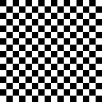
     geometry(0 0 128 128 1)</td></tr>
</table>

<table>
<tr><th>aktive image draw box center {64 64} width 128 height 128 ewidth 32 eheight 32 outlined 1
     &nbsp;</th></tr>
<tr><td valign='top'>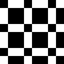
     geometry(0 0 128 128 1)</td></tr>
</table>

<table>
<tr><th>aktive image draw box center {64 64} width 128 height 128 ewidth 32 eheight 32 antialiased 0
     &nbsp;</th></tr>
<tr><td valign='top'>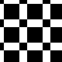
     geometry(0 0 128 128 1)</td></tr>
</table>

---
### [↑](#top)  aktive image draw box-rounded

Syntax: __aktive image draw box-rounded__  ?(param value)...? [[→ definition](../../../../file?ci=trunk&ln=52&name=etc/generator/virtual/draw.tcl)]

Returns an image with the given dimensions and location, with a box drawn into it.

Beware, the location and size of the box are independent of image location and dimensions. The operator is perfectly fine computing the SDF of a box located completely outside of the image domain.

The returned image is always single-band. It is grey-scale when anti-aliasing is active, and black/white if not.

See also [aktive op draw box-rounded on](transform_drawing.md#op_draw_box_rounded_on) and [aktive image sdf box-rounded](generator_virtual_sdf.md#image_sdf_box_rounded).

The box is axis-aligned, of width `2*ewidth+1`, height `2*eheight+1`, with rounded corners per the radii, and placed at the specified center.

The radii default to 0, i.e. no rounded corners.

|Parameter|Type|Default|Description|
|:---|:---|:---|:---|
|width|uint||Image width|
|height|uint||Image height|
|x|int|0|Image location, X coordinate|
|y|int|0|Image location, Y coordinate|
|antialiased|bool|1|Draw with antialiasing for smoother contours (Default)|
|outlined|uint|0|Outline thickness. Draw filled if zero (Default).|
|upleftradius|uint|0|Radius of element at upper left corner|
|uprightradius|uint|0|Radius of element at upper right corner|
|downleftradius|uint|0|Radius of element at lower left corner|
|downrightradius|uint|0|Radius of element at lower right corner|
|ewidth|uint|1|Element width|
|eheight|uint|1|Element height|
|center|point||Element center|

####  Examples

<table>
<tr><th>aktive image draw box-rounded center {64 64} width 128 height 128 ewidth 32 eheight 32
     &nbsp;</th></tr>
<tr><td valign='top'>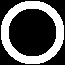
     geometry(0 0 128 128 1)</td></tr>
</table>

<table>
<tr><th>aktive image draw box-rounded center {64 64} width 128 height 128 ewidth 32 eheight 32 upleftradius 32 outlined 1
     &nbsp;</th></tr>
<tr><td valign='top'>
     geometry(0 0 128 128 1)</td></tr>
</table>

<table>
<tr><th>aktive image draw box-rounded center {64 64} width 128 height 128 ewidth 32 eheight 32 upleftradius 32 antialiased 0
     &nbsp;</th></tr>
<tr><td valign='top'>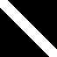
     geometry(0 0 128 128 1)</td></tr>
</table>

---
### [↑](#top)  aktive image draw circle

Syntax: __aktive image draw circle__  ?(param value)...? [[→ definition](../../../../file?ci=trunk&ln=52&name=etc/generator/virtual/draw.tcl)]

Returns an image with the given dimensions and location, with a circle drawn into it.

Beware, the location and size of the circle are independent of image location and dimensions. The operator is perfectly fine computing the SDF of a circle located completely outside of the image domain.

The returned image is always single-band. It is grey-scale when anti-aliasing is active, and black/white if not.

See also [aktive op draw circle on](transform_drawing.md#op_draw_circle_on) and [aktive image sdf circle](generator_virtual_sdf.md#image_sdf_circle).

The circle has the `radius`, and is placed at the specified center.

|Parameter|Type|Default|Description|
|:---|:---|:---|:---|
|width|uint||Image width|
|height|uint||Image height|
|x|int|0|Image location, X coordinate|
|y|int|0|Image location, Y coordinate|
|antialiased|bool|1|Draw with antialiasing for smoother contours (Default)|
|outlined|uint|0|Outline thickness. Draw filled if zero (Default).|
|radius|uint|1|Circle radius|
|center|point||Element center|

####  Examples

<table>
<tr><th>aktive image draw circle center {64 64} width 128 height 128 radius 32
     &nbsp;</th></tr>
<tr><td valign='top'>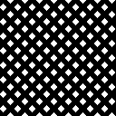
     geometry(0 0 128 128 1)</td></tr>
</table>

<table>
<tr><th>aktive image draw circle center {64 64} width 128 height 128 radius 32 outlined 1
     &nbsp;</th></tr>
<tr><td valign='top'>
     geometry(0 0 128 128 1)</td></tr>
</table>

<table>
<tr><th>aktive image draw circle center {64 64} width 128 height 128 radius 32 antialiased 0
     &nbsp;</th></tr>
<tr><td valign='top'>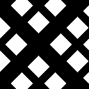
     geometry(0 0 128 128 1)</td></tr>
</table>

---
### [↑](#top)  aktive image draw circles

Syntax: __aktive image draw circles__  ?(param value)...? [[→ definition](../../../../file?ci=trunk&ln=52&name=etc/generator/virtual/draw.tcl)]

Returns an image with the given dimensions and location, with a set of circles drawn into it.

Beware, the location and size of the set of circles are independent of image location and dimensions. The operator is perfectly fine computing the SDF of a set of circles located completely outside of the image domain.

The returned image is always single-band. It is grey-scale when anti-aliasing is active, and black/white if not.

See also [aktive op draw circles on](transform_drawing.md#op_draw_circles_on) and [aktive image sdf circles](generator_virtual_sdf.md#image_sdf_circles).

The circles all have the same `radius`, and are placed at the specified centers.

|Parameter|Type|Default|Description|
|:---|:---|:---|:---|
|width|uint||Image width|
|height|uint||Image height|
|x|int|0|Image location, X coordinate|
|y|int|0|Image location, Y coordinate|
|antialiased|bool|1|Draw with antialiasing for smoother contours (Default)|
|outlined|uint|0|Outline thickness. Draw filled if zero (Default).|
|radius|uint|1|Circle radius|
|centers|point...||Circle centers|

####  Examples

<table>
<tr><th>aktive image draw circles width 128 height 128 radius 8 centers {10 10} {30 80} {80 30}
     &nbsp;</th></tr>
<tr><td valign='top'>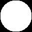
     geometry(0 0 128 128 1)</td></tr>
</table>

<table>
<tr><th>aktive image draw circles width 128 height 128 radius 8 outlined 1 centers {10 10} {30 80} {80 30}
     &nbsp;</th></tr>
<tr><td valign='top'>
     geometry(0 0 128 128 1)</td></tr>
</table>

<table>
<tr><th>aktive image draw circles width 128 height 128 radius 8 antialiased 0 centers {10 10} {30 80} {80 30}
     &nbsp;</th></tr>
<tr><td valign='top'>
     geometry(0 0 128 128 1)</td></tr>
</table>

---
### [↑](#top)  aktive image draw line

Syntax: __aktive image draw line__  ?(param value)...? [[→ definition](../../../../file?ci=trunk&ln=52&name=etc/generator/virtual/draw.tcl)]

Returns an image with the given dimensions and location, with a line drawn into it.

Beware, the location and size of the line are independent of image location and dimensions. The operator is perfectly fine computing the SDF of a line located completely outside of the image domain.

The returned image is always single-band. It is grey-scale when anti-aliasing is active, and black/white if not.

See also [aktive op draw line on](transform_drawing.md#op_draw_line_on) and [aktive image sdf line](generator_virtual_sdf.md#image_sdf_line).

The line connects the two specified locations.

|Parameter|Type|Default|Description|
|:---|:---|:---|:---|
|width|uint||Image width|
|height|uint||Image height|
|x|int|0|Image location, X coordinate|
|y|int|0|Image location, Y coordinate|
|antialiased|bool|1|Draw with antialiasing for smoother contours (Default)|
|strokewidth|uint|0|Stroke width. Lines are `2*strokewidth+1` wide.|
|from|point||Starting location|
|to|point||End location|

####  Examples

<table>
<tr><th>aktive image draw line width 128 height 128 from {10 10} to {30 80}
     &nbsp;</th></tr>
<tr><td valign='top'>
     geometry(0 0 128 128 1)</td></tr>
</table>

<table>
<tr><th>aktive image draw line width 128 height 128 from {10 10} to {30 80} strokewidth 1
     &nbsp;</th></tr>
<tr><td valign='top'>
     geometry(0 0 128 128 1)</td></tr>
</table>

<table>
<tr><th>aktive image draw line width 128 height 128 from {10 10} to {30 80} antialiased 0
     &nbsp;</th></tr>
<tr><td valign='top'>
     geometry(0 0 128 128 1)</td></tr>
</table>

---
### [↑](#top)  aktive image draw parallelogram

Syntax: __aktive image draw parallelogram__  ?(param value)...? [[→ definition](../../../../file?ci=trunk&ln=52&name=etc/generator/virtual/draw.tcl)]

Returns an image with the given dimensions and location, with a parallelogram drawn into it.

Beware, the location and size of the parallelogram are independent of image location and dimensions. The operator is perfectly fine computing the SDF of a parallelogram located completely outside of the image domain.

The returned image is always single-band. It is grey-scale when anti-aliasing is active, and black/white if not.

See also [aktive op draw parallelogram on](transform_drawing.md#op_draw_parallelogram_on) and [aktive image sdf parallelogram](generator_virtual_sdf.md#image_sdf_parallelogram).

The parallelogram is axis-aligned, of width `2*ewidth+1`, height `2*eheight+1`, skewed by `eskew`, and placed at the specified center.

|Parameter|Type|Default|Description|
|:---|:---|:---|:---|
|width|uint||Image width|
|height|uint||Image height|
|x|int|0|Image location, X coordinate|
|y|int|0|Image location, Y coordinate|
|antialiased|bool|1|Draw with antialiasing for smoother contours (Default)|
|outlined|uint|0|Outline thickness. Draw filled if zero (Default).|
|eskew|uint|1|Element skew|
|ewidth|uint|1|Element width|
|eheight|uint|1|Element height|
|center|point||Element center|

####  Examples

<table>
<tr><th>aktive image draw parallelogram center {64 64} width 128 height 128 ewidth 32 eheight 32 eskew 8
     &nbsp;</th></tr>
<tr><td valign='top'>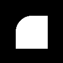
     geometry(0 0 128 128 1)</td></tr>
</table>

<table>
<tr><th>aktive image draw parallelogram center {64 64} width 128 height 128 ewidth 32 eheight 32 eskew 8 outlined 1
     &nbsp;</th></tr>
<tr><td valign='top'>
     geometry(0 0 128 128 1)</td></tr>
</table>

<table>
<tr><th>aktive image draw parallelogram center {64 64} width 128 height 128 ewidth 32 eheight 32 eskew 8 antialiased 0
     &nbsp;</th></tr>
<tr><td valign='top'>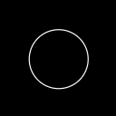
     geometry(0 0 128 128 1)</td></tr>
</table>

---
### [↑](#top)  aktive image draw polyline

Syntax: __aktive image draw polyline__  ?(param value)...? [[→ definition](../../../../file?ci=trunk&ln=52&name=etc/generator/virtual/draw.tcl)]

Returns an image with the given dimensions and location, with a set of lines drawn into it.

Beware, the location and size of the set of lines are independent of image location and dimensions. The operator is perfectly fine computing the SDF of a set of lines located completely outside of the image domain.

The returned image is always single-band. It is grey-scale when anti-aliasing is active, and black/white if not.

See also [aktive op draw polyline on](transform_drawing.md#op_draw_polyline_on) and [aktive image sdf polyline](generator_virtual_sdf.md#image_sdf_polyline).

The lines form a polyline through the specified points.

|Parameter|Type|Default|Description|
|:---|:---|:---|:---|
|width|uint||Image width|
|height|uint||Image height|
|x|int|0|Image location, X coordinate|
|y|int|0|Image location, Y coordinate|
|antialiased|bool|1|Draw with antialiasing for smoother contours (Default)|
|strokewidth|uint|0|Stroke width. Lines are `2*strokewidth+1` wide.|
|points|point...||Points of the poly-line|

####  Examples

<table>
<tr><th>aktive image draw polyline width 128 height 128 points {10 10} {30 80} {80 30}
     &nbsp;</th></tr>
<tr><td valign='top'>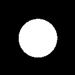
     geometry(0 0 128 128 1)</td></tr>
</table>

<table>
<tr><th>aktive image draw polyline width 128 height 128 strokewidth 1 points {10 10} {30 80} {80 30}
     &nbsp;</th></tr>
<tr><td valign='top'>
     geometry(0 0 128 128 1)</td></tr>
</table>

<table>
<tr><th>aktive image draw polyline width 128 height 128 antialiased 0 points {10 10} {30 80} {80 30}
     &nbsp;</th></tr>
<tr><td valign='top'>
     geometry(0 0 128 128 1)</td></tr>
</table>

---
### [↑](#top)  aktive image draw rhombus

Syntax: __aktive image draw rhombus__  ?(param value)...? [[→ definition](../../../../file?ci=trunk&ln=52&name=etc/generator/virtual/draw.tcl)]

Returns an image with the given dimensions and location, with a rhombus drawn into it.

Beware, the location and size of the rhombus are independent of image location and dimensions. The operator is perfectly fine computing the SDF of a rhombus located completely outside of the image domain.

The returned image is always single-band. It is grey-scale when anti-aliasing is active, and black/white if not.

See also [aktive op draw rhombus on](transform_drawing.md#op_draw_rhombus_on) and [aktive image sdf rhombus](generator_virtual_sdf.md#image_sdf_rhombus).

The rhombus is axis-aligned, of width `2*ewidth+1`, height `2*eheight+1`, and placed at the specified center.

|Parameter|Type|Default|Description|
|:---|:---|:---|:---|
|width|uint||Image width|
|height|uint||Image height|
|x|int|0|Image location, X coordinate|
|y|int|0|Image location, Y coordinate|
|antialiased|bool|1|Draw with antialiasing for smoother contours (Default)|
|outlined|uint|0|Outline thickness. Draw filled if zero (Default).|
|ewidth|uint|1|Element width|
|eheight|uint|1|Element height|
|center|point||Element center|

####  Examples

<table>
<tr><th>aktive image draw rhombus center {64 64} width 128 height 128 ewidth 32 eheight 32
     &nbsp;</th></tr>
<tr><td valign='top'>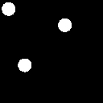
     geometry(0 0 128 128 1)</td></tr>
</table>

<table>
<tr><th>aktive image draw rhombus center {64 64} width 128 height 128 ewidth 32 eheight 32 outlined 1
     &nbsp;</th></tr>
<tr><td valign='top'>
     geometry(0 0 128 128 1)</td></tr>
</table>

<table>
<tr><th>aktive image draw rhombus center {64 64} width 128 height 128 ewidth 32 eheight 32 antialiased 0
     &nbsp;</th></tr>
<tr><td valign='top'>
     geometry(0 0 128 128 1)</td></tr>
</table>

---
### [↑](#top)  aktive image draw triangle

Syntax: __aktive image draw triangle__  ?(param value)...? [[→ definition](../../../../file?ci=trunk&ln=52&name=etc/generator/virtual/draw.tcl)]

Returns an image with the given dimensions and location, with a triangle drawn into it.

Beware, the location and size of the triangle are independent of image location and dimensions. The operator is perfectly fine computing the SDF of a triangle located completely outside of the image domain.

The returned image is always single-band. It is grey-scale when anti-aliasing is active, and black/white if not.

See also [aktive op draw triangle on](transform_drawing.md#op_draw_triangle_on) and [aktive image sdf triangle](generator_virtual_sdf.md#image_sdf_triangle).

The triangle connects the points A, B, and C, in this order.

|Parameter|Type|Default|Description|
|:---|:---|:---|:---|
|width|uint||Image width|
|height|uint||Image height|
|x|int|0|Image location, X coordinate|
|y|int|0|Image location, Y coordinate|
|antialiased|bool|1|Draw with antialiasing for smoother contours (Default)|
|outlined|uint|0|Outline thickness. Draw filled if zero (Default).|
|a|point||Triangle point A|
|b|point||Triangle point B|
|c|point||Triangle point C|

####  Examples

<table>
<tr><th>aktive image draw triangle width 128 height 128 a {10 10} b {30 80} c {80 30}
     &nbsp;</th></tr>
<tr><td valign='top'>
     geometry(0 0 128 128 1)</td></tr>
</table>

<table>
<tr><th>aktive image draw triangle width 128 height 128 a {10 10} b {30 80} c {80 30} outlined 1
     &nbsp;</th></tr>
<tr><td valign='top'>
     geometry(0 0 128 128 1)</td></tr>
</table>

<table>
<tr><th>aktive image draw triangle width 128 height 128 a {10 10} b {30 80} c {80 30} antialiased 0
     &nbsp;</th></tr>
<tr><td valign='top'>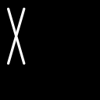
     geometry(0 0 128 128 1)</td></tr>
</table>

