||||||||
|---|---|---|---|---|---|---|
|[Project ↗](../../README.md)|[Documentation ↗](../index.md)|&mdash;|[Tutorials ↗](../tutorials.md)|[How To's ↗](../howtos.md)|[Explanations ↗](../explanations.md)|References|

|||||||||
|---|---|---|---|---|---|---|---|
|[Entry ↗](index.md)|&mdash;|[Sections ↘](bysection.md)|[Permuted Sections ↘](bypsection.md)|[Names ↘](byname.md)|[Permuted Names ↘](bypname.md)|[Strict ↘](strict.md)|[Implementations ↘](bylang.md)|

# Documentation -- Reference Pages -- generator virtual sdf

## Table Of Contents

  - [generator virtual](generator_virtual.md) ↗

### Operators

 - [aktive image sdf box](#image_sdf_box)
 - [aktive image sdf box-rounded](#image_sdf_box_rounded)
 - [aktive image sdf circle](#image_sdf_circle)
 - [aktive image sdf circles](#image_sdf_circles)
 - [aktive image sdf line](#image_sdf_line)
 - [aktive image sdf parallelogram](#image_sdf_parallelogram)
 - [aktive image sdf polyline](#image_sdf_polyline)
 - [aktive image sdf rhombus](#image_sdf_rhombus)
 - [aktive image sdf triangle](#image_sdf_triangle)

## Operators

---
###  aktive image sdf box

Syntax: __aktive image sdf box__  ?(param value)...?

Returns an image with the given dimensions and location, containing the signed distance field of a box.

Beware, the location and size of the box are independent of image location and dimensions. The operator is perfectly fine computing the SDF of a box located completely outside of the image domain.

The box is axis-aligned, of width `2*ewidth+1`, height `2*eheight+1`, and placed at the specified center.

|Parameter|Type|Default|Description|
|:---|:---|:---|:---|
|width|uint||Image width|
|height|uint||Image height|
|x|int|0|Image location, X coordinate|
|y|int|0|Image location, Y coordinate|
|ewidth|uint|1|Element width|
|eheight|uint|1|Element height|
|center|point||Element center|

####  Examples

<table><tr><th>aktive image sdf box center {64 64} width 128 height 128 ewidth 32 eheight 32</th></tr>
<tr><td valign='top'><table><tr><td valign='top'>sdf-fit</td><td valign='top'>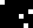 geometry(0 0 128 128 1)</td><td valign='top'>sdf-smooth</td><td valign='top'>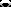 geometry(0 0 128 128 1)</td><td valign='top'>sdf-pixelated</td><td valign='top'>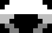 geometry(0 0 128 128 1)</td></tr></table></td></tr></table>

---
###  aktive image sdf box-rounded

Syntax: __aktive image sdf box-rounded__  ?(param value)...?

Returns an image with the given dimensions and location, containing the signed distance field of a box.

Beware, the location and size of the box are independent of image location and dimensions. The operator is perfectly fine computing the SDF of a box located completely outside of the image domain.

The box is axis-aligned, of width `2*ewidth+1`, height `2*eheight+1`, with rounded corners per the radii, and placed at the specified center.

The radii default to 0, i.e. no rounded corners.

|Parameter|Type|Default|Description|
|:---|:---|:---|:---|
|width|uint||Image width|
|height|uint||Image height|
|x|int|0|Image location, X coordinate|
|y|int|0|Image location, Y coordinate|
|upleftradius|uint|0|Radius of element at upper left corner|
|uprightradius|uint|0|Radius of element at upper right corner|
|downleftradius|uint|0|Radius of element at lower left corner|
|downrightradius|uint|0|Radius of element at lower right corner|
|ewidth|uint|1|Element width|
|eheight|uint|1|Element height|
|center|point||Element center|

####  Examples

<table><tr><th>aktive image sdf box-rounded center {64 64} width 128 height 128 ewidth 32 eheight 32</th></tr>
<tr><td valign='top'><table><tr><td valign='top'>sdf-fit</td><td valign='top'>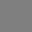 geometry(0 0 128 128 1)</td><td valign='top'>sdf-smooth</td><td valign='top'> geometry(0 0 128 128 1)</td><td valign='top'>sdf-pixelated</td><td valign='top'>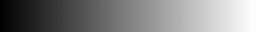 geometry(0 0 128 128 1)</td></tr></table></td></tr></table>

<table><tr><th>aktive image sdf box-rounded center {64 64} width 128 height 128 ewidth 32 eheight 32 upleftradius 32</th></tr>
<tr><td valign='top'><table><tr><td valign='top'>sdf-fit</td><td valign='top'>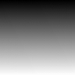 geometry(0 0 128 128 1)</td><td valign='top'>sdf-smooth</td><td valign='top'>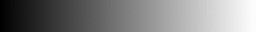 geometry(0 0 128 128 1)</td><td valign='top'>sdf-pixelated</td><td valign='top'>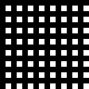 geometry(0 0 128 128 1)</td></tr></table></td></tr></table>

---
###  aktive image sdf circle

Syntax: __aktive image sdf circle__  ?(param value)...?

Returns an image with the given dimensions and location, containing the signed distance field of a circle.

Beware, the location and size of the circle are independent of image location and dimensions. The operator is perfectly fine computing the SDF of a circle located completely outside of the image domain.

The circle has the `radius`, and is placed at the specified center.

|Parameter|Type|Default|Description|
|:---|:---|:---|:---|
|width|uint||Image width|
|height|uint||Image height|
|x|int|0|Image location, X coordinate|
|y|int|0|Image location, Y coordinate|
|radius|uint|1|Circle radius|
|center|point||Element center|

####  Examples

<table><tr><th>aktive image sdf circle center {64 64} width 128 height 128 radius 32</th></tr>
<tr><td valign='top'><table><tr><td valign='top'>sdf-fit</td><td valign='top'>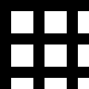 geometry(0 0 128 128 1)</td><td valign='top'>sdf-smooth</td><td valign='top'>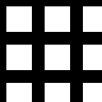 geometry(0 0 128 128 1)</td><td valign='top'>sdf-pixelated</td><td valign='top'>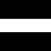 geometry(0 0 128 128 1)</td></tr></table></td></tr></table>

---
###  aktive image sdf circles

Syntax: __aktive image sdf circles__  ?(param value)...?

Returns an image with the given dimensions and location, containing the signed distance field of a set of circles.

Beware, the location and size of the set of circles are independent of image location and dimensions. The operator is perfectly fine computing the SDF of a set of circles located completely outside of the image domain.

The circles all have the same `radius`, and are placed at the specified centers.

|Parameter|Type|Default|Description|
|:---|:---|:---|:---|
|width|uint||Image width|
|height|uint||Image height|
|x|int|0|Image location, X coordinate|
|y|int|0|Image location, Y coordinate|
|radius|uint|1|Circle radius|
|centers|point...||Circle centers|

####  Examples

<table><tr><th>aktive image sdf circles width 128 height 128 radius 8 centers {10 10} {30 80} {80 30}</th></tr>
<tr><td valign='top'><table><tr><td valign='top'>sdf-fit</td><td valign='top'> geometry(0 0 128 128 1)</td><td valign='top'>sdf-smooth</td><td valign='top'> geometry(0 0 128 128 1)</td><td valign='top'>sdf-pixelated</td><td valign='top'> geometry(0 0 128 128 1)</td></tr></table></td></tr></table>

---
###  aktive image sdf line

Syntax: __aktive image sdf line__  ?(param value)...?

Returns an image with the given dimensions and location, containing the signed distance field of a line.

Beware, the location and size of the line are independent of image location and dimensions. The operator is perfectly fine computing the SDF of a line located completely outside of the image domain.

The line connects the two specified locations.

|Parameter|Type|Default|Description|
|:---|:---|:---|:---|
|width|uint||Image width|
|height|uint||Image height|
|x|int|0|Image location, X coordinate|
|y|int|0|Image location, Y coordinate|
|from|point||Starting location|
|to|point||End location|

####  Examples

<table><tr><th>aktive image sdf line width 128 height 128 from {10 10} to {30 80}</th></tr>
<tr><td valign='top'><table><tr><td valign='top'>sdf-fit</td><td valign='top'> geometry(0 0 128 128 1)</td><td valign='top'>sdf-smooth</td><td valign='top'> geometry(0 0 128 128 1)</td><td valign='top'>sdf-pixelated</td><td valign='top'> geometry(0 0 128 128 1)</td></tr></table></td></tr></table>

---
###  aktive image sdf parallelogram

Syntax: __aktive image sdf parallelogram__  ?(param value)...?

Returns an image with the given dimensions and location, containing the signed distance field of a parallelogram.

Beware, the location and size of the parallelogram are independent of image location and dimensions. The operator is perfectly fine computing the SDF of a parallelogram located completely outside of the image domain.

The parallelogram is axis-aligned, of width `2*ewidth+1`, height `2*eheight+1`, skewed by `eskew`, and placed at the specified center.

|Parameter|Type|Default|Description|
|:---|:---|:---|:---|
|width|uint||Image width|
|height|uint||Image height|
|x|int|0|Image location, X coordinate|
|y|int|0|Image location, Y coordinate|
|eskew|uint|1|Element skew|
|ewidth|uint|1|Element width|
|eheight|uint|1|Element height|
|center|point||Element center|

####  Examples

<table><tr><th>aktive image sdf parallelogram center {64 64} width 128 height 128 ewidth 32 eheight 32 eskew 8</th></tr>
<tr><td valign='top'><table><tr><td valign='top'>sdf-fit</td><td valign='top'> geometry(0 0 128 128 1)</td><td valign='top'>sdf-smooth</td><td valign='top'> geometry(0 0 128 128 1)</td><td valign='top'>sdf-pixelated</td><td valign='top'> geometry(0 0 128 128 1)</td></tr></table></td></tr></table>

---
###  aktive image sdf polyline

Syntax: __aktive image sdf polyline__  ?(param value)...?

Returns an image with the given dimensions and location, containing the signed distance field of a set of lines.

Beware, the location and size of the set of lines are independent of image location and dimensions. The operator is perfectly fine computing the SDF of a set of lines located completely outside of the image domain.

The lines form a polyline through the specified points.

|Parameter|Type|Default|Description|
|:---|:---|:---|:---|
|width|uint||Image width|
|height|uint||Image height|
|x|int|0|Image location, X coordinate|
|y|int|0|Image location, Y coordinate|
|points|point...||Points of the poly-line|

####  Examples

<table><tr><th>aktive image sdf polyline width 128 height 128 points {10 10} {30 80} {80 30}</th></tr>
<tr><td valign='top'><table><tr><td valign='top'>sdf-fit</td><td valign='top'> geometry(0 0 128 128 1)</td><td valign='top'>sdf-smooth</td><td valign='top'> geometry(0 0 128 128 1)</td><td valign='top'>sdf-pixelated</td><td valign='top'> geometry(0 0 128 128 1)</td></tr></table></td></tr></table>

---
###  aktive image sdf rhombus

Syntax: __aktive image sdf rhombus__  ?(param value)...?

Returns an image with the given dimensions and location, containing the signed distance field of a rhombus.

Beware, the location and size of the rhombus are independent of image location and dimensions. The operator is perfectly fine computing the SDF of a rhombus located completely outside of the image domain.

The rhombus is axis-aligned, of width `2*ewidth+1`, height `2*eheight+1`, and placed at the specified center.

|Parameter|Type|Default|Description|
|:---|:---|:---|:---|
|width|uint||Image width|
|height|uint||Image height|
|x|int|0|Image location, X coordinate|
|y|int|0|Image location, Y coordinate|
|ewidth|uint|1|Element width|
|eheight|uint|1|Element height|
|center|point||Element center|

####  Examples

<table><tr><th>aktive image sdf rhombus center {64 64} width 128 height 128 ewidth 32 eheight 32</th></tr>
<tr><td valign='top'><table><tr><td valign='top'>sdf-fit</td><td valign='top'> geometry(0 0 128 128 1)</td><td valign='top'>sdf-smooth</td><td valign='top'> geometry(0 0 128 128 1)</td><td valign='top'>sdf-pixelated</td><td valign='top'> geometry(0 0 128 128 1)</td></tr></table></td></tr></table>

---
###  aktive image sdf triangle

Syntax: __aktive image sdf triangle__  ?(param value)...?

Returns an image with the given dimensions and location, containing the signed distance field of a triangle.

Beware, the location and size of the triangle are independent of image location and dimensions. The operator is perfectly fine computing the SDF of a triangle located completely outside of the image domain.

The triangle connects the points A, B, and C, in this order.

|Parameter|Type|Default|Description|
|:---|:---|:---|:---|
|width|uint||Image width|
|height|uint||Image height|
|x|int|0|Image location, X coordinate|
|y|int|0|Image location, Y coordinate|
|a|point||Triangle point A|
|b|point||Triangle point B|
|c|point||Triangle point C|

####  Examples

<table><tr><th>aktive image sdf triangle width 128 height 128 a {10 10} b {30 80} c {80 30}</th></tr>
<tr><td valign='top'><table><tr><td valign='top'>sdf-fit</td><td valign='top'> geometry(0 0 128 128 1)</td><td valign='top'>sdf-smooth</td><td valign='top'> geometry(0 0 128 128 1)</td><td valign='top'>sdf-pixelated</td><td valign='top'> geometry(0 0 128 128 1)</td></tr></table></td></tr></table>

