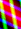

||||||||
|---|---|---|---|---|---|---|
|[Project ↗](../../README.md)|[Documentation ↗](../index.md)|&mdash;|[Tutorials ↗](../tutorials.md)|[How To's ↗](../howtos.md)|[Explanations ↗](../explanations.md)|References|

|||||||||
|---|---|---|---|---|---|---|---|
|[Entry ↗](index.md)|&mdash;|[Sections ↘](bysection.md)|[Permuted Sections ↘](bypsection.md)|[Names ↘](byname.md)|[Permuted Names ↘](bypname.md)|[Strict ↘](strict.md)|[Implementations ↘](bylang.md)|

# Documentation -- Reference Pages -- transform

## Table Of Contents

  - [Roots](bysection.md) ↗

## Subsections

 - [transform color](transform_color.md) ↘
 - [transform convolution](transform_convolution.md) ↘
 - [transform drawing](transform_drawing.md) ↘
 - [transform effect](transform_effect.md) ↘
 - [transform geometry](transform_geometry.md) ↘
 - [transform identity](transform_identity.md) ↘
 - [transform kuwahara](transform_kuwahara.md) ↘
 - [transform location](transform_location.md) ↘
 - [transform math](transform_math.md) ↘
 - [transform metadata](transform_metadata.md) ↘
 - [transform morphology](transform_morphology.md) ↘
 - [transform sdf](transform_sdf.md) ↘
 - [transform statistics](transform_statistics.md) ↘
 - [transform structure](transform_structure.md) ↘
 - [transform wiener](transform_wiener.md) ↘

### Operators

 - [aktive op bands recombine](#op_bands_recombine)
 - [aktive op view](#op_view)

## Operators

---
###  aktive op bands recombine

Syntax: __aktive op bands recombine__ src0 src1 [[→ definition](../../../../file?ci=trunk&ln=5&name=etc/transformer/filter/recombine.tcl)]

Returns image with the input's band information recombined through a matrix-vector multiplication.

The band values of the input pixels are the vectors which are multiplied with the matrix specified as the first image argument. The input to be processed is the second image argument.

The matrix has to be single-band and its height has to match the depth of the input. The width of the matrix becomes the depth of the result.

The location of the matrix image is ignored.

---
###  aktive op view

Syntax: __aktive op view__ src (param value)... [[→ definition](../../../../file?ci=trunk&ln=5&name=etc/transformer/viewport.tcl)]

Returns image arbitrarily offset and sized compared to the input domain. In other words, an arbitrary rectangular view (port) into the input.

Beware, the requested area may fall __anywhere__ with respect to the input's domain. Same, inside (subset), outside, partially overlapping, etc.

This is useful to add after an application of [aktive op transform by](transform_structure_warp.md#op_transform_by), as a means of focusing on the desired part of the transformation's result.

|Parameter|Type|Default|Description|
|:---|:---|:---|:---|
|port|rect||The specific area to view in the plane. A rectangle of the form {x y w h}.|

####  Examples

<table>
<tr><th>@1
     &nbsp;</th>
    <th>aktive op view @1 port {190 125 380 250}
     &nbsp;</th></tr>
<tr><td valign='top'>
     geometry(0 0 380 250 3)</td>
    <td valign='top'>
     geometry(190 125 380 250 3)</td></tr>
</table>

<table>
<tr><th>@1
     &nbsp;</th>
    <th>aktive op view @1 port {-190 -125 380 250}
     &nbsp;</th></tr>
<tr><td valign='top'>
     geometry(0 0 380 250 3)</td>
    <td valign='top'>
     geometry(-190 -125 380 250 3)</td></tr>
</table>

<table>
<tr><th>@1
     &nbsp;</th>
    <th>aktive op view @1 port {80 80 80 80}
     &nbsp;</th></tr>
<tr><td valign='top'>
     geometry(0 0 380 250 3)</td>
    <td valign='top'>
     geometry(80 80 80 80 3)</td></tr>
</table>

