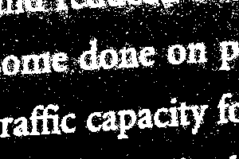
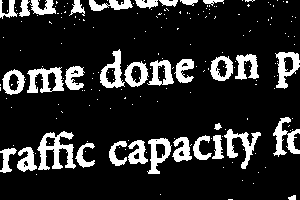

||||||||
|---|---|---|---|---|---|---|
|[Project ↗](../../README.md)|[Documentation ↗](../index.md)|&mdash;|[Tutorials ↗](../tutorials.md)|[How To's ↗](../howtos.md)|[Explanations ↗](../explanations.md)|References|

|||||||||
|---|---|---|---|---|---|---|---|
|[Entry ↗](index.md)|&mdash;|[Sections ↘](bysection.md)|[Permuted Sections ↘](bypsection.md)|[Names ↘](byname.md)|[Permuted Names ↘](bypname.md)|[Strict ↘](strict.md)|[Implementations ↘](bylang.md)|

# Documentation -- Reference Pages -- transform convolution

## Table Of Contents

  - [transform](transform.md) ↗

### Operators

 - [aktive op convolve xy](#op_convolve_xy)

## Operators

---
###  aktive op convolve xy

Syntax: __aktive op convolve xy__ src0 src1

Returns image of input (2nd argument) convolved with the matrix (1st argument).

This operator is __strict__ in the 1st input. The convolution kernel is materialized and cached.

The location of the matrix image is ignored.

A matrix with even width and/or height is extended at the right/bottom to be of odd width and height.

Beware, the result image is shrunken by matrix `width-1` and `height-1` relative to the input. Inputs smaller than that are rejected.

If shrinkage is not desired add a border to the input using one of the `aktive op embed ...` operators before applying this operator.

The prefered embedding for convolution is `mirror`. It is chosen to have minimal to no impact on results at the original input's borders.

## Examples

### aktive op convolve xy @2 @1

||||
|---|---|---|
|@1|@2|aktive op convolve xy @2 @1|
||||

### aktive op convolve xy @2 @1

||||
|---|---|---|
|@1|@2|aktive op convolve xy @2 @1|
||||

