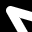

||||||||
|---|---|---|---|---|---|---|
|[Project ↗](../../README.md)|[Documentation ↗](../index.md)|&mdash;|[Tutorials ↗](../tutorials.md)|[How To's ↗](../howtos.md)|[Explanations ↗](../explanations.md)|References|

|||||||||
|---|---|---|---|---|---|---|---|
|[Entry ↗](index.md)|&mdash;|[Sections ↘](bysection.md)|[Permuted Sections ↘](bypsection.md)|[Names ↘](byname.md)|[Permuted Names ↘](bypname.md)|[Strict ↘](strict.md)|[Implementations ↘](bylang.md)|

# Documentation -- Reference Pages -- transform drawing

## <anchor='top'> Table Of Contents

  - [transform](transform.md) ↗

### Operators

 - [aktive op draw box-rounded on](#op_draw_box_rounded_on)
 - [aktive op draw box on](#op_draw_box_on)
 - [aktive op draw circle on](#op_draw_circle_on)
 - [aktive op draw circles on](#op_draw_circles_on)
 - [aktive op draw line on](#op_draw_line_on)
 - [aktive op draw parallelogram on](#op_draw_parallelogram_on)
 - [aktive op draw polyline on](#op_draw_polyline_on)
 - [aktive op draw rhombus on](#op_draw_rhombus_on)
 - [aktive op draw triangle on](#op_draw_triangle_on)

## Operators

---
### [↑](#top)  aktive op draw box-rounded on

Syntax: __aktive op draw box-rounded on__ src ?(param value)...? [[→ definition](../../../../file?ci=trunk&ln=95&name=etc/generator/virtual/draw.tcl)]

Returns an image where a box is drawn on the input image.

Beware, the location and size of the box are independent of image location and dimensions. The operator is perfectly fine computing the SDF of a box located completely outside of the image domain.

See also [aktive image draw box-rounded](generator_virtual_drawing.md#image_draw_box_rounded) and [aktive image sdf box-rounded](generator_virtual_sdf.md#image_sdf_box_rounded).

The box is axis-aligned, of width `2*ewidth+1`, height `2*eheight+1`, with rounded corners per the radii, and placed at the specified center.

The radii default to 0, i.e. no rounded corners.

|Parameter|Type|Default|Description|
|:---|:---|:---|:---|
|antialiased|bool|1|Draw with antialiasing for smoother contours (Default)|
|outlined|uint|0|Outline thickness. Draw filled if zero (Default).|
|color|str||List of band values, color of the drawn box. Their number has to match the input's depth.|
|upleftradius|uint|0|Radius of element at upper left corner|
|uprightradius|uint|0|Radius of element at upper right corner|
|downleftradius|uint|0|Radius of element at lower left corner|
|downrightradius|uint|0|Radius of element at lower right corner|
|ewidth|uint|1|Element width|
|eheight|uint|1|Element height|
|center|point||Element center|

####  Examples

<table>
<tr><th>@1
     &nbsp;</th>
    <th>aktive op draw box-rounded on @1 center {64 64} ewidth 32 eheight 32 upleftradius 32 outlined 1 color {1 0 0}
     &nbsp;</th></tr>
<tr><td valign='top'>
     geometry(0 0 380 250 3)</td>
    <td valign='top'>
     geometry(0 0 380 250 3)</td></tr>
</table>

---
### [↑](#top)  aktive op draw box on

Syntax: __aktive op draw box on__ src ?(param value)...? [[→ definition](../../../../file?ci=trunk&ln=95&name=etc/generator/virtual/draw.tcl)]

Returns an image where a box is drawn on the input image.

Beware, the location and size of the box are independent of image location and dimensions. The operator is perfectly fine computing the SDF of a box located completely outside of the image domain.

See also [aktive image draw box](generator_virtual_drawing.md#image_draw_box) and [aktive image sdf box](generator_virtual_sdf.md#image_sdf_box).

The box is axis-aligned, of width `2*ewidth+1`, height `2*eheight+1`, and placed at the specified center.

|Parameter|Type|Default|Description|
|:---|:---|:---|:---|
|antialiased|bool|1|Draw with antialiasing for smoother contours (Default)|
|outlined|uint|0|Outline thickness. Draw filled if zero (Default).|
|color|str||List of band values, color of the drawn box. Their number has to match the input's depth.|
|ewidth|uint|1|Element width|
|eheight|uint|1|Element height|
|center|point||Element center|

####  Examples

<table>
<tr><th>@1
     &nbsp;</th>
    <th>aktive op draw box on @1 center {64 64} ewidth 32 eheight 32 color {1 0 0} outlined 1
     &nbsp;</th></tr>
<tr><td valign='top'>
     geometry(0 0 380 250 3)</td>
    <td valign='top'>
     geometry(0 0 380 250 3)</td></tr>
</table>

---
### [↑](#top)  aktive op draw circle on

Syntax: __aktive op draw circle on__ src ?(param value)...? [[→ definition](../../../../file?ci=trunk&ln=95&name=etc/generator/virtual/draw.tcl)]

Returns an image where a circle is drawn on the input image.

Beware, the location and size of the circle are independent of image location and dimensions. The operator is perfectly fine computing the SDF of a circle located completely outside of the image domain.

See also [aktive image draw circle](generator_virtual_drawing.md#image_draw_circle) and [aktive image sdf circle](generator_virtual_sdf.md#image_sdf_circle).

The circle has the `radius`, and is placed at the specified center.

|Parameter|Type|Default|Description|
|:---|:---|:---|:---|
|antialiased|bool|1|Draw with antialiasing for smoother contours (Default)|
|outlined|uint|0|Outline thickness. Draw filled if zero (Default).|
|color|str||List of band values, color of the drawn circle. Their number has to match the input's depth.|
|radius|uint|1|Circle radius|
|center|point||Element center|

####  Examples

<table>
<tr><th>@1
     &nbsp;</th>
    <th>aktive op draw circle on @1 center {64 64} radius 32 color {1 0 0} outlined 1
     &nbsp;</th></tr>
<tr><td valign='top'>
     geometry(0 0 380 250 3)</td>
    <td valign='top'>
     geometry(0 0 380 250 3)</td></tr>
</table>

---
### [↑](#top)  aktive op draw circles on

Syntax: __aktive op draw circles on__ src ?(param value)...? [[→ definition](../../../../file?ci=trunk&ln=95&name=etc/generator/virtual/draw.tcl)]

Returns an image where a set of circles is drawn on the input image.

Beware, the location and size of the set of circles are independent of image location and dimensions. The operator is perfectly fine computing the SDF of a set of circles located completely outside of the image domain.

See also [aktive image draw circles](generator_virtual_drawing.md#image_draw_circles) and [aktive image sdf circles](generator_virtual_sdf.md#image_sdf_circles).

The circles all have the same `radius`, and are placed at the specified centers.

|Parameter|Type|Default|Description|
|:---|:---|:---|:---|
|antialiased|bool|1|Draw with antialiasing for smoother contours (Default)|
|outlined|uint|0|Outline thickness. Draw filled if zero (Default).|
|color|str||List of band values, color of the drawn set of circles. Their number has to match the input's depth.|
|radius|uint|1|Circle radius|
|centers|point...||Circle centers|

####  Examples

<table>
<tr><th>@1
     &nbsp;</th>
    <th>aktive op draw circles on @1 radius 8 color {1 0 0} outlined 1 centers {10 10} {30 80} {80 30}
     &nbsp;</th></tr>
<tr><td valign='top'>
     geometry(0 0 380 250 3)</td>
    <td valign='top'>
     geometry(0 0 380 250 3)</td></tr>
</table>

---
### [↑](#top)  aktive op draw line on

Syntax: __aktive op draw line on__ src ?(param value)...? [[→ definition](../../../../file?ci=trunk&ln=95&name=etc/generator/virtual/draw.tcl)]

Returns an image where a line is drawn on the input image.

Beware, the location and size of the line are independent of image location and dimensions. The operator is perfectly fine computing the SDF of a line located completely outside of the image domain.

See also [aktive image draw line](generator_virtual_drawing.md#image_draw_line) and [aktive image sdf line](generator_virtual_sdf.md#image_sdf_line).

The line connects the two specified locations.

|Parameter|Type|Default|Description|
|:---|:---|:---|:---|
|antialiased|bool|1|Draw with antialiasing for smoother contours (Default)|
|strokewidth|uint|0|Stroke width. Lines are `2*strokewidth+1` wide.|
|color|str||List of band values, color of the drawn line. Their number has to match the input's depth.|
|from|point||Starting location|
|to|point||End location|

####  Examples

<table>
<tr><th>@1
     &nbsp;</th>
    <th>aktive op draw line on @1 from {10 10} to {30 80} color {1 0 0} strokewidth 1
     &nbsp;</th></tr>
<tr><td valign='top'>
     geometry(0 0 380 250 3)</td>
    <td valign='top'>
     geometry(0 0 380 250 3)</td></tr>
</table>

---
### [↑](#top)  aktive op draw parallelogram on

Syntax: __aktive op draw parallelogram on__ src ?(param value)...? [[→ definition](../../../../file?ci=trunk&ln=95&name=etc/generator/virtual/draw.tcl)]

Returns an image where a parallelogram is drawn on the input image.

Beware, the location and size of the parallelogram are independent of image location and dimensions. The operator is perfectly fine computing the SDF of a parallelogram located completely outside of the image domain.

See also [aktive image draw parallelogram](generator_virtual_drawing.md#image_draw_parallelogram) and [aktive image sdf parallelogram](generator_virtual_sdf.md#image_sdf_parallelogram).

The parallelogram is axis-aligned, of width `2*ewidth+1`, height `2*eheight+1`, skewed by `eskew`, and placed at the specified center.

|Parameter|Type|Default|Description|
|:---|:---|:---|:---|
|antialiased|bool|1|Draw with antialiasing for smoother contours (Default)|
|outlined|uint|0|Outline thickness. Draw filled if zero (Default).|
|color|str||List of band values, color of the drawn parallelogram. Their number has to match the input's depth.|
|eskew|uint|1|Element skew|
|ewidth|uint|1|Element width|
|eheight|uint|1|Element height|
|center|point||Element center|

####  Examples

<table>
<tr><th>@1
     &nbsp;</th>
    <th>aktive op draw parallelogram on @1 center {64 64} ewidth 32 eheight 32 eskew 8 color {1 0 0} outlined 1
     &nbsp;</th></tr>
<tr><td valign='top'>
     geometry(0 0 380 250 3)</td>
    <td valign='top'>
     geometry(0 0 380 250 3)</td></tr>
</table>

---
### [↑](#top)  aktive op draw polyline on

Syntax: __aktive op draw polyline on__ src ?(param value)...? [[→ definition](../../../../file?ci=trunk&ln=95&name=etc/generator/virtual/draw.tcl)]

Returns an image where a set of lines is drawn on the input image.

Beware, the location and size of the set of lines are independent of image location and dimensions. The operator is perfectly fine computing the SDF of a set of lines located completely outside of the image domain.

See also [aktive image draw polyline](generator_virtual_drawing.md#image_draw_polyline) and [aktive image sdf polyline](generator_virtual_sdf.md#image_sdf_polyline).

The lines form a polyline through the specified points.

|Parameter|Type|Default|Description|
|:---|:---|:---|:---|
|antialiased|bool|1|Draw with antialiasing for smoother contours (Default)|
|strokewidth|uint|0|Stroke width. Lines are `2*strokewidth+1` wide.|
|color|str||List of band values, color of the drawn set of lines. Their number has to match the input's depth.|
|points|point...||Points of the poly-line|

####  Examples

<table>
<tr><th>@1
     &nbsp;</th>
    <th>aktive op draw polyline on @1 color {1 0 0} strokewidth 1 points {10 10} {30 80} {80 30}
     &nbsp;</th></tr>
<tr><td valign='top'>
     geometry(0 0 380 250 3)</td>
    <td valign='top'>
     geometry(0 0 380 250 3)</td></tr>
</table>

---
### [↑](#top)  aktive op draw rhombus on

Syntax: __aktive op draw rhombus on__ src ?(param value)...? [[→ definition](../../../../file?ci=trunk&ln=95&name=etc/generator/virtual/draw.tcl)]

Returns an image where a rhombus is drawn on the input image.

Beware, the location and size of the rhombus are independent of image location and dimensions. The operator is perfectly fine computing the SDF of a rhombus located completely outside of the image domain.

See also [aktive image draw rhombus](generator_virtual_drawing.md#image_draw_rhombus) and [aktive image sdf rhombus](generator_virtual_sdf.md#image_sdf_rhombus).

The rhombus is axis-aligned, of width `2*ewidth+1`, height `2*eheight+1`, and placed at the specified center.

|Parameter|Type|Default|Description|
|:---|:---|:---|:---|
|antialiased|bool|1|Draw with antialiasing for smoother contours (Default)|
|outlined|uint|0|Outline thickness. Draw filled if zero (Default).|
|color|str||List of band values, color of the drawn rhombus. Their number has to match the input's depth.|
|ewidth|uint|1|Element width|
|eheight|uint|1|Element height|
|center|point||Element center|

####  Examples

<table>
<tr><th>@1
     &nbsp;</th>
    <th>aktive op draw rhombus on @1 center {64 64} ewidth 32 eheight 32 outlined 1 color {1 0 0} outlined 1
     &nbsp;</th></tr>
<tr><td valign='top'>
     geometry(0 0 380 250 3)</td>
    <td valign='top'>
     geometry(0 0 380 250 3)</td></tr>
</table>

---
### [↑](#top)  aktive op draw triangle on

Syntax: __aktive op draw triangle on__ src ?(param value)...? [[→ definition](../../../../file?ci=trunk&ln=95&name=etc/generator/virtual/draw.tcl)]

Returns an image where a triangle is drawn on the input image.

Beware, the location and size of the triangle are independent of image location and dimensions. The operator is perfectly fine computing the SDF of a triangle located completely outside of the image domain.

See also [aktive image draw triangle](generator_virtual_drawing.md#image_draw_triangle) and [aktive image sdf triangle](generator_virtual_sdf.md#image_sdf_triangle).

The triangle connects the points A, B, and C, in this order.

|Parameter|Type|Default|Description|
|:---|:---|:---|:---|
|antialiased|bool|1|Draw with antialiasing for smoother contours (Default)|
|outlined|uint|0|Outline thickness. Draw filled if zero (Default).|
|color|str||List of band values, color of the drawn triangle. Their number has to match the input's depth.|
|a|point||Triangle point A|
|b|point||Triangle point B|
|c|point||Triangle point C|

####  Examples

<table>
<tr><th>@1
     &nbsp;</th>
    <th>aktive op draw triangle on @1 a {10 10} b {30 80} c {80 30} color {1 0 0} outlined 1
     &nbsp;</th></tr>
<tr><td valign='top'>
     geometry(0 0 380 250 3)</td>
    <td valign='top'>
     geometry(0 0 380 250 3)</td></tr>
</table>

