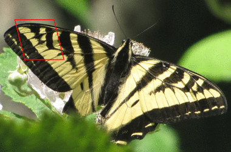

||||||||
|---|---|---|---|---|---|---|
|[Project ↗](../../README.md)|[Documentation ↗](../index.md)|&mdash;|[Tutorials ↗](../tutorials.md)|[How To's ↗](../howtos.md)|[Explanations ↗](../explanations.md)|References|

|||||||||
|---|---|---|---|---|---|---|---|
|[Entry ↗](index.md)|&mdash;|[Sections ↘](bysection.md)|[Permuted Sections ↘](bypsection.md)|[Names ↘](byname.md)|[Permuted Names ↘](bypname.md)|[Strict ↘](strict.md)|[Implementations ↘](bylang.md)|

# Documentation -- Reference Pages -- transform drawing

## <anchor='top'> Table Of Contents

  - [transform](transform.md) ↗

### Operators

 - [aktive op draw box-rounded on](#op_draw_box_rounded_on)
 - [aktive op draw box on](#op_draw_box_on)
 - [aktive op draw circle on](#op_draw_circle_on)
 - [aktive op draw circles on](#op_draw_circles_on)
 - [aktive op draw line on](#op_draw_line_on)
 - [aktive op draw lines on](#op_draw_lines_on)
 - [aktive op draw parallelogram on](#op_draw_parallelogram_on)
 - [aktive op draw polyline on](#op_draw_polyline_on)
 - [aktive op draw rhombus on](#op_draw_rhombus_on)
 - [aktive op draw triangle on](#op_draw_triangle_on)

## Operators

---
### [↑](#top)  aktive op draw box-rounded on

Syntax: __aktive op draw box-rounded on__ background ?(param value)...? [[→ definition](/file?ci=trunk&ln=98&name=etc/generator/virtual/draw.tcl)]

Returns an image where a box is drawn on the input image.

__Beware__. The location and size of the box are independent of image location and dimensions. The operator is perfectly fine computing the SDF of a box located completely outside of the image domain.

See also [aktive image draw box-rounded](generator_virtual_drawing.md#image_draw_box_rounded) and [aktive image sdf box-rounded](generator_virtual_sdf.md#image_sdf_box_rounded).

The box is axis-aligned, of width `2*ewidth+1`, height `2*eheight+1`, with rounded corners per the radii, and placed at the specified center.

The radii default to 0, i.e. no rounded corners.

|Input|Description|
|:---|:---|
|background|The image to draw on, i.e. the background for the drawing.|

|Parameter|Type|Default|Description|
|:---|:---|:---|:---|
|antialiased|bool|1|Draw with antialiasing for smoother contours (Default)|
|outlined|double|0|Outline thickness. Draw filled if zero (Default).|
|color|str||List of band values, color of the drawn box. Their number has to match the input's depth.|
|upleftradius|double|0|Radius of element at upper left corner|
|uprightradius|double|0|Radius of element at upper right corner|
|downleftradius|double|0|Radius of element at lower left corner|
|downrightradius|double|0|Radius of element at lower right corner|
|ewidth|double|1|Element width|
|eheight|double|1|Element height|
|center|fpoint||Element center|

####  Examples

<table>
<tr><th>@1
     &nbsp;</th>
    <th>aktive op draw box-rounded on @1 center {64.25 64.75} ewidth 32.2 eheight 32.8 upleftradius 32.32 outlined 1.1 color {1 0 0}
     &nbsp;</th></tr>
<tr><td valign='top'>
     geometry(0 0 380 250 3)</td>
    <td valign='top'>
     geometry(0 0 380 250 3)</td></tr>
</table>

---
### [↑](#top)  aktive op draw box on

Syntax: __aktive op draw box on__ background ?(param value)...? [[→ definition](/file?ci=trunk&ln=98&name=etc/generator/virtual/draw.tcl)]

Returns an image where a box is drawn on the input image.

__Beware__. The location and size of the box are independent of image location and dimensions. The operator is perfectly fine computing the SDF of a box located completely outside of the image domain.

See also [aktive image draw box](generator_virtual_drawing.md#image_draw_box) and [aktive image sdf box](generator_virtual_sdf.md#image_sdf_box).

The box is axis-aligned, of width `2*ewidth+1`, height `2*eheight+1`, and placed at the specified center.

|Input|Description|
|:---|:---|
|background|The image to draw on, i.e. the background for the drawing.|

|Parameter|Type|Default|Description|
|:---|:---|:---|:---|
|antialiased|bool|1|Draw with antialiasing for smoother contours (Default)|
|outlined|double|0|Outline thickness. Draw filled if zero (Default).|
|color|str||List of band values, color of the drawn box. Their number has to match the input's depth.|
|ewidth|double|1|Element width|
|eheight|double|1|Element height|
|center|fpoint||Element center|

####  Examples

<table>
<tr><th>@1
     &nbsp;</th>
    <th>aktive op draw box on @1 center {64.25 64.75} ewidth 32.2 eheight 32.8 outlined 1.1 color {1 0 0}
     &nbsp;</th></tr>
<tr><td valign='top'>
     geometry(0 0 380 250 3)</td>
    <td valign='top'>
     geometry(0 0 380 250 3)</td></tr>
</table>

---
### [↑](#top)  aktive op draw circle on

Syntax: __aktive op draw circle on__ background ?(param value)...? [[→ definition](/file?ci=trunk&ln=98&name=etc/generator/virtual/draw.tcl)]

Returns an image where a circle is drawn on the input image.

__Beware__. The location and size of the circle are independent of image location and dimensions. The operator is perfectly fine computing the SDF of a circle located completely outside of the image domain.

See also [aktive image draw circle](generator_virtual_drawing.md#image_draw_circle) and [aktive image sdf circle](generator_virtual_sdf.md#image_sdf_circle).

The circle has the `radius`, and is placed at the specified center.

|Input|Description|
|:---|:---|
|background|The image to draw on, i.e. the background for the drawing.|

|Parameter|Type|Default|Description|
|:---|:---|:---|:---|
|antialiased|bool|1|Draw with antialiasing for smoother contours (Default)|
|outlined|double|0|Outline thickness. Draw filled if zero (Default).|
|color|str||List of band values, color of the drawn circle. Their number has to match the input's depth.|
|radius|double|1|Circle radius|
|center|fpoint||Element center|

####  Examples

<table>
<tr><th>@1
     &nbsp;</th>
    <th>aktive op draw circle on @1 center {64.25 64.75} radius 32.5 color {1 0 0} outlined 1.1
     &nbsp;</th></tr>
<tr><td valign='top'>
     geometry(0 0 380 250 3)</td>
    <td valign='top'>
     geometry(0 0 380 250 3)</td></tr>
</table>

---
### [↑](#top)  aktive op draw circles on

Syntax: __aktive op draw circles on__ background ?(param value)...? [[→ definition](/file?ci=trunk&ln=98&name=etc/generator/virtual/draw.tcl)]

Returns an image where a set of circles is drawn on the input image.

__Beware__. The location and size of the set of circles are independent of image location and dimensions. The operator is perfectly fine computing the SDF of a set of circles located completely outside of the image domain.

See also [aktive image draw circles](generator_virtual_drawing.md#image_draw_circles) and [aktive image sdf circles](generator_virtual_sdf.md#image_sdf_circles).

The circles all have the same `radius`, and are placed at the specified centers.

|Input|Description|
|:---|:---|
|background|The image to draw on, i.e. the background for the drawing.|

|Parameter|Type|Default|Description|
|:---|:---|:---|:---|
|antialiased|bool|1|Draw with antialiasing for smoother contours (Default)|
|outlined|double|0|Outline thickness. Draw filled if zero (Default).|
|color|str||List of band values, color of the drawn set of circles. Their number has to match the input's depth.|
|radius|double|1|Circle radius|
|centers|fpoint...||Circle centers|

####  Examples

<table>
<tr><th>@1
     &nbsp;</th>
    <th>aktive op draw circles on @1 radius 8 color {1 0 0} outlined 1.1 centers {10.25 10.75} {30.3 80.6} {80.1 30.9}
     &nbsp;</th></tr>
<tr><td valign='top'>
     geometry(0 0 380 250 3)</td>
    <td valign='top'>
     geometry(0 0 380 250 3)</td></tr>
</table>

---
### [↑](#top)  aktive op draw line on

Syntax: __aktive op draw line on__ background ?(param value)...? [[→ definition](/file?ci=trunk&ln=98&name=etc/generator/virtual/draw.tcl)]

Returns an image where a line is drawn on the input image.

__Beware__. The location and size of the line are independent of image location and dimensions. The operator is perfectly fine computing the SDF of a line located completely outside of the image domain.

See also [aktive image draw line](generator_virtual_drawing.md#image_draw_line) and [aktive image sdf line](generator_virtual_sdf.md#image_sdf_line).

The line connects the two specified locations.

|Input|Description|
|:---|:---|
|background|The image to draw on, i.e. the background for the drawing.|

|Parameter|Type|Default|Description|
|:---|:---|:---|:---|
|antialiased|bool|1|Draw with antialiasing for smoother contours (Default)|
|strokewidth|double|0|Stroke width. Lines are `2*strokewidth+1` wide.|
|color|str||List of band values, color of the drawn line. Their number has to match the input's depth.|
|from|fpoint||Starting location|
|to|fpoint||End location|

####  Examples

<table>
<tr><th>@1
     &nbsp;</th>
    <th>aktive op draw line on @1 from {10.1 10.9} to {30.3 80.6} color {1 0 0} strokewidth 1.1
     &nbsp;</th></tr>
<tr><td valign='top'>
     geometry(0 0 380 250 3)</td>
    <td valign='top'>
     geometry(0 0 380 250 3)</td></tr>
</table>

---
### [↑](#top)  aktive op draw lines on

Syntax: __aktive op draw lines on__ background ?(param value)...? [[→ definition](/file?ci=trunk&ln=98&name=etc/generator/virtual/draw.tcl)]

Returns an image where a set of independent lines is drawn on the input image.

__Beware__. The location and size of the set of independent lines are independent of image location and dimensions. The operator is perfectly fine computing the SDF of a set of independent lines located completely outside of the image domain.

See also [aktive image draw lines](generator_virtual_drawing.md#image_draw_lines) and [aktive image sdf lines](generator_virtual_sdf.md#image_sdf_lines).

Each line connects two locations.

|Input|Description|
|:---|:---|
|background|The image to draw on, i.e. the background for the drawing.|

|Parameter|Type|Default|Description|
|:---|:---|:---|:---|
|antialiased|bool|1|Draw with antialiasing for smoother contours (Default)|
|strokewidth|double|0|Stroke width. Lines are `2*strokewidth+1` wide.|
|color|str||List of band values, color of the drawn set of independent lines. Their number has to match the input's depth.|
|segments|str...||Line segments|

####  Examples

<table>
<tr><th>@1
     &nbsp;</th>
    <th>aktive op draw lines on @1 color {1 0 0} strokewidth 1.1 segments {{10.1 10.9} {30.3 80.6}} {{10.1 80.6} {30.3 10.9}}
     &nbsp;</th></tr>
<tr><td valign='top'>
     geometry(0 0 380 250 3)</td>
    <td valign='top'>
     geometry(0 0 380 250 3)</td></tr>
</table>

---
### [↑](#top)  aktive op draw parallelogram on

Syntax: __aktive op draw parallelogram on__ background ?(param value)...? [[→ definition](/file?ci=trunk&ln=98&name=etc/generator/virtual/draw.tcl)]

Returns an image where a parallelogram is drawn on the input image.

__Beware__. The location and size of the parallelogram are independent of image location and dimensions. The operator is perfectly fine computing the SDF of a parallelogram located completely outside of the image domain.

See also [aktive image draw parallelogram](generator_virtual_drawing.md#image_draw_parallelogram) and [aktive image sdf parallelogram](generator_virtual_sdf.md#image_sdf_parallelogram).

The parallelogram is axis-aligned, of width `2*ewidth+1`, height `2*eheight+1`, skewed by `eskew`, and placed at the specified center.

|Input|Description|
|:---|:---|
|background|The image to draw on, i.e. the background for the drawing.|

|Parameter|Type|Default|Description|
|:---|:---|:---|:---|
|antialiased|bool|1|Draw with antialiasing for smoother contours (Default)|
|outlined|double|0|Outline thickness. Draw filled if zero (Default).|
|color|str||List of band values, color of the drawn parallelogram. Their number has to match the input's depth.|
|eskew|double|1|Element skew|
|ewidth|double|1|Element width|
|eheight|double|1|Element height|
|center|fpoint||Element center|

####  Examples

<table>
<tr><th>@1
     &nbsp;</th>
    <th>aktive op draw parallelogram on @1 center {64.25 64.75} ewidth 32.2 eheight 32.8 eskew 8.1 color {1 0 0} outlined 1.1
     &nbsp;</th></tr>
<tr><td valign='top'>
     geometry(0 0 380 250 3)</td>
    <td valign='top'>
     geometry(0 0 380 250 3)</td></tr>
</table>

---
### [↑](#top)  aktive op draw polyline on

Syntax: __aktive op draw polyline on__ background ?(param value)...? [[→ definition](/file?ci=trunk&ln=98&name=etc/generator/virtual/draw.tcl)]

Returns an image where a set of connected lines is drawn on the input image.

__Beware__. The location and size of the set of connected lines are independent of image location and dimensions. The operator is perfectly fine computing the SDF of a set of connected lines located completely outside of the image domain.

See also [aktive image draw polyline](generator_virtual_drawing.md#image_draw_polyline) and [aktive image sdf polyline](generator_virtual_sdf.md#image_sdf_polyline).

The lines form a polyline through the specified points.

|Input|Description|
|:---|:---|
|background|The image to draw on, i.e. the background for the drawing.|

|Parameter|Type|Default|Description|
|:---|:---|:---|:---|
|antialiased|bool|1|Draw with antialiasing for smoother contours (Default)|
|strokewidth|double|0|Stroke width. Lines are `2*strokewidth+1` wide.|
|color|str||List of band values, color of the drawn set of connected lines. Their number has to match the input's depth.|
|points|fpoint...||Points of the poly-line|

####  Examples

<table>
<tr><th>@1
     &nbsp;</th>
    <th>aktive op draw polyline on @1 color {1 0 0} strokewidth 1.1 points {10.25 10.75} {30.3 80.6} {80.1 30.9}
     &nbsp;</th></tr>
<tr><td valign='top'>
     geometry(0 0 380 250 3)</td>
    <td valign='top'>
     geometry(0 0 380 250 3)</td></tr>
</table>

---
### [↑](#top)  aktive op draw rhombus on

Syntax: __aktive op draw rhombus on__ background ?(param value)...? [[→ definition](/file?ci=trunk&ln=98&name=etc/generator/virtual/draw.tcl)]

Returns an image where a rhombus is drawn on the input image.

__Beware__. The location and size of the rhombus are independent of image location and dimensions. The operator is perfectly fine computing the SDF of a rhombus located completely outside of the image domain.

See also [aktive image draw rhombus](generator_virtual_drawing.md#image_draw_rhombus) and [aktive image sdf rhombus](generator_virtual_sdf.md#image_sdf_rhombus).

The rhombus is axis-aligned, of width `2*ewidth+1`, height `2*eheight+1`, and placed at the specified center.

|Input|Description|
|:---|:---|
|background|The image to draw on, i.e. the background for the drawing.|

|Parameter|Type|Default|Description|
|:---|:---|:---|:---|
|antialiased|bool|1|Draw with antialiasing for smoother contours (Default)|
|outlined|double|0|Outline thickness. Draw filled if zero (Default).|
|color|str||List of band values, color of the drawn rhombus. Their number has to match the input's depth.|
|ewidth|double|1|Element width|
|eheight|double|1|Element height|
|center|fpoint||Element center|

####  Examples

<table>
<tr><th>@1
     &nbsp;</th>
    <th>aktive op draw rhombus on @1 center {64.25 64.75} ewidth 32.2 eheight 32.8 outlined 1.1 color {1 0 0} outlined 1
     &nbsp;</th></tr>
<tr><td valign='top'>
     geometry(0 0 380 250 3)</td>
    <td valign='top'>
     geometry(0 0 380 250 3)</td></tr>
</table>

---
### [↑](#top)  aktive op draw triangle on

Syntax: __aktive op draw triangle on__ background ?(param value)...? [[→ definition](/file?ci=trunk&ln=98&name=etc/generator/virtual/draw.tcl)]

Returns an image where a triangle is drawn on the input image.

__Beware__. The location and size of the triangle are independent of image location and dimensions. The operator is perfectly fine computing the SDF of a triangle located completely outside of the image domain.

See also [aktive image draw triangle](generator_virtual_drawing.md#image_draw_triangle) and [aktive image sdf triangle](generator_virtual_sdf.md#image_sdf_triangle).

The triangle connects the points A, B, and C, in this order.

|Input|Description|
|:---|:---|
|background|The image to draw on, i.e. the background for the drawing.|

|Parameter|Type|Default|Description|
|:---|:---|:---|:---|
|antialiased|bool|1|Draw with antialiasing for smoother contours (Default)|
|outlined|double|0|Outline thickness. Draw filled if zero (Default).|
|color|str||List of band values, color of the drawn triangle. Their number has to match the input's depth.|
|a|fpoint||Triangle point A|
|b|fpoint||Triangle point B|
|c|fpoint||Triangle point C|

####  Examples

<table>
<tr><th>@1
     &nbsp;</th>
    <th>aktive op draw triangle on @1 a {10.25 10.75} b {30.2 80.6} c {80.1 30.9} color {1 0 0} outlined 1.1
     &nbsp;</th></tr>
<tr><td valign='top'>
     geometry(0 0 380 250 3)</td>
    <td valign='top'>
     geometry(0 0 380 250 3)</td></tr>
</table>

