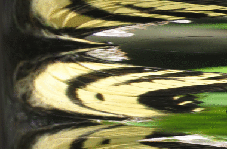
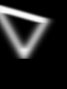
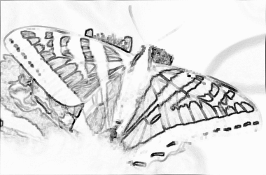
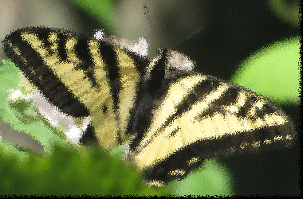

||||||||
|---|---|---|---|---|---|---|
|[Project ↗](../../README.md)|[Documentation ↗](../index.md)|&mdash;|[Tutorials ↗](../tutorials.md)|[How To's ↗](../howtos.md)|[Explanations ↗](../explanations.md)|References|

|||||||||
|---|---|---|---|---|---|---|---|
|[Entry ↗](index.md)|&mdash;|[Sections ↘](bysection.md)|[Permuted Sections ↘](bypsection.md)|[Names ↘](byname.md)|[Permuted Names ↘](bypname.md)|[Strict ↘](strict.md)|[Implementations ↘](bylang.md)|

# Documentation -- Reference Pages -- transform effect

## Table Of Contents

  - [transform](transform.md) ↗

### Operators

 - [aktive effect blur](#effect_blur)
 - [aktive effect charcoal](#effect_charcoal)
 - [aktive effect emboss](#effect_emboss)
 - [aktive effect jitter gauss](#effect_jitter_gauss)
 - [aktive effect jitter uniform](#effect_jitter_uniform)
 - [aktive effect sharpen](#effect_sharpen)
 - [aktive effect sketch](#effect_sketch)
 - [aktive effect swirl](#effect_swirl)

## Operators

---
###  aktive effect blur

Syntax: __aktive effect blur__ src ?(param value)...?

Returns blurred input, per the specified blur radius.

|Parameter|Type|Default|Description|
|:---|:---|:---|:---|
|radius|double|2|Blur kernel radius. Defaults to 2.|

####  Examples

<table><tr><th>@1</th><th>aktive effect blur @1 radius 16</th></tr>
<tr><td valign='top'></td><td valign='top'></td></tr></table>

<table><tr><th>@1</th><th>aktive effect blur @1 radius 16</th></tr>
<tr><td valign='top'></td><td valign='top'></td></tr></table>

---
###  aktive effect charcoal

Syntax: __aktive effect charcoal__ src ?(param value)...?

Returns grey image with a charcoal-like sketch of the sRGB input.

|Parameter|Type|Default|Description|
|:---|:---|:---|:---|
|light|bool|no|Artistic choice between stronger and lighter sketch lines.|

---
###  aktive effect emboss

Syntax: __aktive effect emboss__ src

Returns embossed input.

####  Examples

<table><tr><th>@1</th><th>aktive effect emboss @1</th></tr>
<tr><td valign='top'></td><td valign='top'></td></tr></table>

---
###  aktive effect jitter gauss

Syntax: __aktive effect jitter gauss__ src ?(param value)...?

Returns the input with a jitter effect based on gaussian noise applied to it. Visually this looks like frosted glass.

The underlying operation is [aktive warp noise gauss](generator_virtual_warp.md#warp_noise_gauss).

|Parameter|Type|Default|Description|
|:---|:---|:---|:---|
|interpolate|str|bilinear|Interpolation method to use|
|seed|uint|[expr {int(4294967296*rand())}]|Randomizer seed. Needed only to force fixed results.|
|mean|double|0|Mean of the desired gauss distribution.|
|sigma|double|1|Sigma of the desired gauss distribution.|

####  Examples

<table><tr><th>@1</th><th>aktive effect jitter gauss @1 sigma 4 seed 703011174</th></tr>
<tr><td valign='top'></td><td valign='top'></td></tr></table>

<table><tr><th>@1 (assets/sines.ppm)</th><th>aktive effect jitter gauss @1 sigma 4 seed 703011174</th></tr>
<tr><td valign='top'>(assets/sines.ppm)' style='border:4px solid gold'></td><td valign='top'></td></tr></table>

<table><tr><th>@1 (assets/butterfly.ppm)</th><th>aktive effect jitter gauss @1 sigma 4 seed 703011174</th></tr>
<tr><td valign='top'>(assets/butterfly.ppm)' style='border:4px solid gold'></td><td valign='top'></td></tr></table>

---
###  aktive effect jitter uniform

Syntax: __aktive effect jitter uniform__ src ?(param value)...?

Returns the input with a jitter effect based on uniform noise applied to it. Visually this looks like frosted glass.

The underlying operation is [aktive warp noise uniform](generator_virtual_warp.md#warp_noise_uniform).

|Parameter|Type|Default|Description|
|:---|:---|:---|:---|
|interpolate|str|bilinear|Interpolation method to use|
|seed|uint|[expr {int(4294967296*rand())}]|Randomizer seed. Needed only to force fixed results.|
|min|double|0|Minimal noise value|
|max|double|1|Maximal noise value|

####  Examples

<table><tr><th>@1</th><th>aktive effect jitter uniform @1 min 1 max 6 seed 703011174</th></tr>
<tr><td valign='top'></td><td valign='top'></td></tr></table>

<table><tr><th>@1 (assets/sines.ppm)</th><th>aktive effect jitter uniform @1 min 1 max 6 seed 703011174</th></tr>
<tr><td valign='top'>(assets/sines.ppm)' style='border:4px solid gold'></td><td valign='top'></td></tr></table>

<table><tr><th>@1 (assets/butterfly.ppm)</th><th>aktive effect jitter uniform @1 min 1 max 6 seed 703011174</th></tr>
<tr><td valign='top'>(assets/butterfly.ppm)' style='border:4px solid gold'></td><td valign='top'></td></tr></table>

---
###  aktive effect sharpen

Syntax: __aktive effect sharpen__ src

Returns sharpened input.

####  Examples

<table><tr><th>@1</th><th>aktive effect sharpen @1</th></tr>
<tr><td valign='top'></td><td valign='top'></td></tr></table>

---
###  aktive effect sketch

Syntax: __aktive effect sketch__ src

Returns image with a general sketch of the input.

####  Examples

<table><tr><th>@1</th><th>aktive effect sketch @1</th></tr>
<tr><td valign='top'></td><td valign='top'></td></tr></table>

<table><tr><th>@1</th><th>aktive effect sketch @1</th></tr>
<tr><td valign='top'></td><td valign='top'></td></tr></table>

---
###  aktive effect swirl

Syntax: __aktive effect swirl__ src ?(param value)...?

Returns the input with a swirling effect applied to it.

This effect applies around the specified __center__, with fixed rotation __phi__, a base rotation __from__, and a __decay__ factor.

The rotation angle added to a pixel is given by "__phi__ + __from__ * exp(-__radius__ * __decay__)", where __radius__ is the distance of the pixel from the __center__. A large decay reduces the swirl at shorter radii. A decay of zero disables the decay.

All swirl parameters are optional.

The underlying operation is [aktive warp swirl](generator_virtual_warp.md#warp_swirl).

|Parameter|Type|Default|Description|
|:---|:---|:---|:---|
|interpolate|str|bilinear|Interpolation method to use|
|center|point|{}|Center of the swirl, default center of the image.|
|phi|double|0|In degrees, fixed rotation to apply. Default none.|
|from|double|45|In degrees, swirl rotation at distance 0 from center.|
|decay|double|0.1|Rotation decay with distance from center.|

####  Examples

<table><tr><th>@1</th><th>aktive effect swirl @1 decay 0.05 from 135</th></tr>
<tr><td valign='top'></td><td valign='top'></td></tr></table>

<table><tr><th>@1 (assets/sines.ppm)</th><th>aktive effect swirl @1 decay 0.01 from 135</th></tr>
<tr><td valign='top'>(assets/sines.ppm)' style='border:4px solid gold'></td><td valign='top'></td></tr></table>

<table><tr><th>@1 (assets/butterfly.ppm)</th><th>aktive effect swirl @1 decay 0.01 from 135</th></tr>
<tr><td valign='top'>(assets/butterfly.ppm)' style='border:4px solid gold'></td><td valign='top'></td></tr></table>

