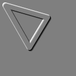
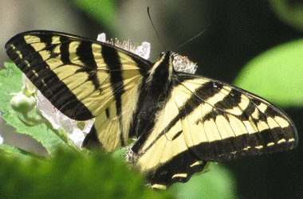
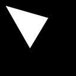
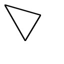

||||||||
|---|---|---|---|---|---|---|
|[Project ↗](../../README.md)|[Documentation ↗](../index.md)|&mdash;|[Tutorials ↗](../tutorials.md)|[How To's ↗](../howtos.md)|[Explanations ↗](../explanations.md)|References|

|||||||||
|---|---|---|---|---|---|---|---|
|[Entry ↗](index.md)|&mdash;|[Sections ↘](bysection.md)|[Permuted Sections ↘](bypsection.md)|[Names ↘](byname.md)|[Permuted Names ↘](bypname.md)|[Strict ↘](strict.md)|[Implementations ↘](bylang.md)|

# Documentation -- Reference Pages -- transform effect

## <anchor='top'> Table Of Contents

  - [transform](transform.md) ↗

### Operators

 - [aktive effect 2cartesian](#effect_2cartesian)
 - [aktive effect 2polar](#effect_2polar)
 - [aktive effect blur](#effect_blur)
 - [aktive effect charcoal](#effect_charcoal)
 - [aktive effect emboss](#effect_emboss)
 - [aktive effect jitter gauss](#effect_jitter_gauss)
 - [aktive effect jitter uniform](#effect_jitter_uniform)
 - [aktive effect max-rgb](#effect_max_rgb)
 - [aktive effect min-rgb](#effect_min_rgb)
 - [aktive effect sharpen](#effect_sharpen)
 - [aktive effect sketch](#effect_sketch)
 - [aktive effect swirl](#effect_swirl)
 - [aktive effect wobble](#effect_wobble)

## Operators

---
### [↑](#top)  aktive effect 2cartesian

Syntax: __aktive effect 2cartesian__ src ?(param value)...? [[→ definition](/file?ci=trunk&ln=41&name=etc/transformer/filter/effects.tcl)]

Returns the input transformed into cartesian representation.

This transformation is the complement of [aktive effect 2polar](transform_effect.md#effect_2polar).

Inspired by <http://libvips.blogspot.com/2015/11/fancy-transforms.html>

The underlying operation is [aktive warp 2cartesian](generator_virtual_warp.md#warp_2cartesian).

|Input|Description|
|:---|:---|
|src|Source image|

|Parameter|Type|Default|Description|
|:---|:---|:---|:---|
|interpolate|str|bilinear|Interpolation method to use.|

####  Examples

<table>
<tr><th>@1
     &nbsp;</th>
    <th>aktive effect 2cartesian @1
     &nbsp;</th></tr>
<tr><td valign='top'>
     geometry(0 0 380 250 3)</td>
    <td valign='top'>
     geometry(0 0 380 250 3)</td></tr>
</table>

<table>
<tr><th>@1
     &nbsp;</th>
    <th>aktive effect 2cartesian @1
     &nbsp;</th></tr>
<tr><td valign='top'>
     geometry(0 0 380 250 3)</td>
    <td valign='top'>
     geometry(0 0 380 250 3)</td></tr>
</table>

####  References

  - <http://libvips.blogspot.com/2015/11/fancy-transforms.html>

---
### [↑](#top)  aktive effect 2polar

Syntax: __aktive effect 2polar__ src ?(param value)...? [[→ definition](/file?ci=trunk&ln=8&name=etc/transformer/filter/effects.tcl)]

Returns the input transformed into polar representation.

This transformation is undone by application of [aktive effect 2cartesian](transform_effect.md#effect_2cartesian).

Inspired by <http://libvips.blogspot.com/2015/11/fancy-transforms.html>

The underlying operation is [aktive warp 2polar](generator_virtual_warp.md#warp_2polar).

|Input|Description|
|:---|:---|
|src|Source image|

|Parameter|Type|Default|Description|
|:---|:---|:---|:---|
|interpolate|str|bilinear|Interpolation method to use.|

####  Examples

<table>
<tr><th>@1
     &nbsp;</th>
    <th>aktive effect 2polar @1
     &nbsp;</th></tr>
<tr><td valign='top'>
     geometry(0 0 380 250 3)</td>
    <td valign='top'>
     geometry(0 0 380 250 3)</td></tr>
</table>

<table>
<tr><th>@1
     &nbsp;</th>
    <th>aktive effect 2polar @1
     &nbsp;</th></tr>
<tr><td valign='top'>
     geometry(0 0 380 250 3)</td>
    <td valign='top'>
     geometry(0 0 380 250 3)</td></tr>
</table>

####  References

  - <http://libvips.blogspot.com/2015/11/fancy-transforms.html>

---
### [↑](#top)  aktive effect blur

Syntax: __aktive effect blur__ src ?(param value)...? [[→ definition](/file?ci=trunk&ln=295&name=etc/transformer/filter/effects.tcl)]

Returns blurred input, per the specified blur radius.

|Input|Description|
|:---|:---|
|src|Source image|

|Parameter|Type|Default|Description|
|:---|:---|:---|:---|
|radius|double|2|Blur kernel radius. Defaults to 2.|

####  Examples

<table>
<tr><th>@1
     &nbsp;</th>
    <th>aktive effect blur @1 radius 16
     &nbsp;</th></tr>
<tr><td valign='top'>
     geometry(0 0 128 128 1)</td>
    <td valign='top'>
     geometry(16 0 96 128 1)</td></tr>
</table>

<table>
<tr><th>@1
     &nbsp;</th>
    <th>aktive effect blur @1 radius 16
     &nbsp;</th></tr>
<tr><td valign='top'>
     geometry(0 0 128 128 1)</td>
    <td valign='top'>
     geometry(16 0 96 128 1)</td></tr>
</table>

---
### [↑](#top)  aktive effect charcoal

Syntax: __aktive effect charcoal__ src ?(param value)...? [[→ definition](/file?ci=trunk&ln=340&name=etc/transformer/filter/effects.tcl)]

Returns a grey image with a charcoal-like sketch of the sRGB input.

|Input|Description|
|:---|:---|
|src|Source image|

|Parameter|Type|Default|Description|
|:---|:---|:---|:---|
|light|bool|no|Artistic choice between stronger and lighter sketch lines.|

####  Examples

<table>
<tr><th>@1
     &nbsp;</th>
    <th>aktive effect charcoal @1
     &nbsp;</th></tr>
<tr><td valign='top'>
     geometry(0 0 380 250 3)</td>
    <td valign='top'>
     geometry(0 0 380 250 1)</td></tr>
</table>

<table>
<tr><th>@1
     &nbsp;</th>
    <th>aktive effect charcoal @1 light yes
     &nbsp;</th></tr>
<tr><td valign='top'>
     geometry(0 0 380 250 3)</td>
    <td valign='top'>
     geometry(0 0 380 250 1)</td></tr>
</table>

---
### [↑](#top)  aktive effect emboss

Syntax: __aktive effect emboss__ src [[→ definition](/file?ci=trunk&ln=259&name=etc/transformer/filter/effects.tcl)]

Returns embossed input.

|Input|Description|
|:---|:---|
|src|Source image|

####  Examples

<table>
<tr><th>@1
     &nbsp;</th>
    <th>aktive effect emboss @1
     &nbsp;</th></tr>
<tr><td valign='top'>
     geometry(0 0 128 128 1)</td>
    <td valign='top'>
     geometry(1 1 126 126 1)</td></tr>
</table>

---
### [↑](#top)  aktive effect jitter gauss

Syntax: __aktive effect jitter gauss__ src ?(param value)...? [[→ definition](/file?ci=trunk&ln=214&name=etc/transformer/filter/effects.tcl)]

Returns the input with a jitter effect based on gaussian noise applied to it. Visually this looks like frosted glass.

The underlying operation is [aktive warp noise gauss](generator_virtual_warp.md#warp_noise_gauss).

|Input|Description|
|:---|:---|
|src|Source image|

|Parameter|Type|Default|Description|
|:---|:---|:---|:---|
|interpolate|str|bilinear|Interpolation method to use|
|seed|uint|[expr {int(4294967296*rand())}]|Randomizer seed. Needed only to force fixed results.|
|mean|double|0|Mean of the desired gauss distribution.|
|sigma|double|1|Sigma of the desired gauss distribution.|

####  Examples

<table>
<tr><th>@1
     &nbsp;</th>
    <th>aktive effect jitter gauss @1 sigma 4 seed 703011174
     &nbsp;</th></tr>
<tr><td valign='top'>
     geometry(0 0 128 128 1)</td>
    <td valign='top'>
     geometry(0 0 128 128 1)</td></tr>
</table>

<table>
<tr><th>@1
     &nbsp;</th>
    <th>aktive effect jitter gauss @1 sigma 4 seed 703011174
     &nbsp;</th></tr>
<tr><td valign='top'>
     geometry(0 0 256 256 3)</td>
    <td valign='top'>
     geometry(0 0 256 256 3)</td></tr>
</table>

<table>
<tr><th>@1
     &nbsp;</th>
    <th>aktive effect jitter gauss @1 sigma 4 seed 703011174
     &nbsp;</th></tr>
<tr><td valign='top'>
     geometry(0 0 380 250 3)</td>
    <td valign='top'>
     geometry(0 0 380 250 3)</td></tr>
</table>

---
### [↑](#top)  aktive effect jitter uniform

Syntax: __aktive effect jitter uniform__ src ?(param value)...? [[→ definition](/file?ci=trunk&ln=172&name=etc/transformer/filter/effects.tcl)]

Returns the input with a jitter effect based on uniform noise applied to it. Visually this looks like frosted glass.

The underlying operation is [aktive warp noise uniform](generator_virtual_warp.md#warp_noise_uniform).

|Input|Description|
|:---|:---|
|src|Source image|

|Parameter|Type|Default|Description|
|:---|:---|:---|:---|
|interpolate|str|bilinear|Interpolation method to use|
|seed|uint|[expr {int(4294967296*rand())}]|Randomizer seed. Needed only to force fixed results.|
|min|double|0|Minimal noise value|
|max|double|1|Maximal noise value|

####  Examples

<table>
<tr><th>@1
     &nbsp;</th>
    <th>aktive effect jitter uniform @1 min 1 max 6 seed 703011174
     &nbsp;</th></tr>
<tr><td valign='top'>
     geometry(0 0 128 128 1)</td>
    <td valign='top'>
     geometry(0 0 128 128 1)</td></tr>
</table>

<table>
<tr><th>@1
     &nbsp;</th>
    <th>aktive effect jitter uniform @1 min 1 max 6 seed 703011174
     &nbsp;</th></tr>
<tr><td valign='top'>
     geometry(0 0 256 256 3)</td>
    <td valign='top'>
     geometry(0 0 256 256 3)</td></tr>
</table>

<table>
<tr><th>@1
     &nbsp;</th>
    <th>aktive effect jitter uniform @1 min 1 max 6 seed 703011174
     &nbsp;</th></tr>
<tr><td valign='top'>
     geometry(0 0 380 250 3)</td>
    <td valign='top'>
     geometry(0 0 380 250 3)</td></tr>
</table>

---
### [↑](#top)  aktive effect max-rgb

Syntax: __aktive effect max-rgb__ src [[→ definition](/file?ci=trunk&ln=390&name=etc/transformer/filter/effects.tcl)]

Returns an image suppressing at each pixel of the input the bands not reaching the max of the bands at that location.

For a single-band input this is a no-op.

Despite the use of `rgb` in the operator name this operator works on all multi-band images, regardless of the exact number or their semantic interpretation.

Idea from <https://docs.gimp.org/2.8/en/plug-in-max-rgb.html>

|Input|Description|
|:---|:---|
|src|Source image|

####  Examples

<table>
<tr><th>@1
     &nbsp;</th>
    <th>aktive effect max-rgb @1
     &nbsp;</th></tr>
<tr><td valign='top'>
     geometry(0 0 380 250 3)</td>
    <td valign='top'>
     geometry(0 0 380 250 3)</td></tr>
</table>

---
### [↑](#top)  aktive effect min-rgb

Syntax: __aktive effect min-rgb__ src [[→ definition](/file?ci=trunk&ln=390&name=etc/transformer/filter/effects.tcl)]

Returns an image suppressing at each pixel of the input the bands not falling to the min of the bands at that location.

For a single-band input this is a no-op.

Despite the use of `rgb` in the operator name this operator works on all multi-band images, regardless of the exact number or their semantic interpretation.

Idea from <https://docs.gimp.org/2.8/en/plug-in-max-rgb.html>

|Input|Description|
|:---|:---|
|src|Source image|

####  Examples

<table>
<tr><th>@1
     &nbsp;</th>
    <th>aktive effect min-rgb @1
     &nbsp;</th></tr>
<tr><td valign='top'>
     geometry(0 0 380 250 3)</td>
    <td valign='top'>
     geometry(0 0 380 250 3)</td></tr>
</table>

---
### [↑](#top)  aktive effect sharpen

Syntax: __aktive effect sharpen__ src [[→ definition](/file?ci=trunk&ln=278&name=etc/transformer/filter/effects.tcl)]

Returns sharpened input.

|Input|Description|
|:---|:---|
|src|Source image|

####  Examples

<table>
<tr><th>@1
     &nbsp;</th>
    <th>aktive effect sharpen @1
     &nbsp;</th></tr>
<tr><td valign='top'>
     geometry(0 0 128 128 1)</td>
    <td valign='top'>
     geometry(1 1 126 126 1)</td></tr>
</table>

---
### [↑](#top)  aktive effect sketch

Syntax: __aktive effect sketch__ src [[→ definition](/file?ci=trunk&ln=318&name=etc/transformer/filter/effects.tcl)]

Returns image with a general sketch of the input.

|Input|Description|
|:---|:---|
|src|Source image|

####  Examples

<table>
<tr><th>@1
     &nbsp;</th>
    <th>aktive effect sketch @1
     &nbsp;</th></tr>
<tr><td valign='top'>
     geometry(0 0 128 128 1)</td>
    <td valign='top'>
     geometry(0 0 128 128 1)</td></tr>
</table>

<table>
<tr><th>@1
     &nbsp;</th>
    <th>aktive effect sketch @1
     &nbsp;</th></tr>
<tr><td valign='top'>
     geometry(0 0 128 128 1)</td>
    <td valign='top'>
     geometry(0 0 128 128 1)</td></tr>
</table>

---
### [↑](#top)  aktive effect swirl

Syntax: __aktive effect swirl__ src ?(param value)...? [[→ definition](/file?ci=trunk&ln=113&name=etc/transformer/filter/effects.tcl)]

Returns the input with a swirling effect applied to it.

This effect applies around the specified __center__, with fixed rotation __phi__, a base rotation __from__, and a __decay__ factor.

The rotation angle added to a pixel is given by `phi + from * exp(-radius * decay)`, where __radius__ is the distance of the pixel from the __center__. A large decay reduces the swirl at shorter radii. A decay of zero disables the decay.

All swirl parameters are optional.

The underlying operation is [aktive warp swirl](generator_virtual_warp.md#warp_swirl).

|Input|Description|
|:---|:---|
|src|Source image|

|Parameter|Type|Default|Description|
|:---|:---|:---|:---|
|interpolate|str|bilinear|Interpolation method to use.|
|center|point|{}|Center of the swirl, default center of the image.|
|phi|double|0|In degrees, fixed rotation to apply. Default none.|
|from|double|45|In degrees, swirl rotation at distance 0 from center.|
|decay|double|0.1|Rotation decay with distance from center.|

####  Examples

<table>
<tr><th>@1
     &nbsp;</th>
    <th>aktive effect swirl @1 decay 0.05 from 135
     &nbsp;</th></tr>
<tr><td valign='top'>
     geometry(0 0 128 128 1)</td>
    <td valign='top'>
     geometry(0 0 128 128 1)</td></tr>
</table>

<table>
<tr><th>@1
     &nbsp;</th>
    <th>aktive effect swirl @1 decay 0.01 from 135
     &nbsp;</th></tr>
<tr><td valign='top'>
     geometry(0 0 256 256 3)</td>
    <td valign='top'>
     geometry(0 0 256 256 3)</td></tr>
</table>

<table>
<tr><th>@1
     &nbsp;</th>
    <th>aktive effect swirl @1 decay 0.01 from 135
     &nbsp;</th></tr>
<tr><td valign='top'>
     geometry(0 0 380 250 3)</td>
    <td valign='top'>
     geometry(0 0 380 250 3)</td></tr>
</table>

---
### [↑](#top)  aktive effect wobble

Syntax: __aktive effect wobble__ src ?(param value)...? [[→ definition](/file?ci=trunk&ln=77&name=etc/transformer/filter/effects.tcl)]

Returns the input with a wobble/ripple effect applied to it.

This effect applies around the specified __center__, with base __amplitude__, __frequency__, __chirp__, and __attenuation__ powers.

Inspired by <http://libvips.blogspot.com/2015/11/fancy-transforms.html>

The effect modulates the distance from the center based on the formula `sin (radius^chirp * frequency) * amplitude / (1+radius)^attenuation`, where `radius` is the original distance.

All parameters, including the center are optional.

The underlying operation is [aktive warp wobble](generator_virtual_warp.md#warp_wobble).

|Input|Description|
|:---|:---|
|src|Source image|

|Parameter|Type|Default|Description|
|:---|:---|:---|:---|
|center|point|{}|Center of the wobble, relative to the origin. Defaults to the image center.|
|amplitude|double|500|Base amplitude of the displacement.|
|frequency|double|2|Base wave frequency.|
|chirp|double|0.5|Chirp (power) factor modulating the frequency.|
|attenuation|double|0.6|Power factor tweaking the base 1/x attenuation.|
|interpolate|str|bilinear|Interpolation method to use.|

####  Examples

<table>
<tr><th>@1
     &nbsp;</th>
    <th>aktive effect wobble @1 center {100 50}
     &nbsp;</th></tr>
<tr><td valign='top'>
     geometry(0 0 380 250 3)</td>
    <td valign='top'>
     geometry(0 0 380 250 3)</td></tr>
</table>

####  References

  - <http://libvips.blogspot.com/2015/11/fancy-transforms.html>

