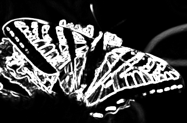
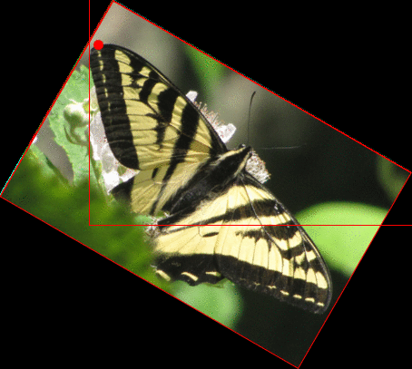
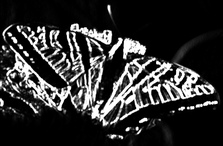
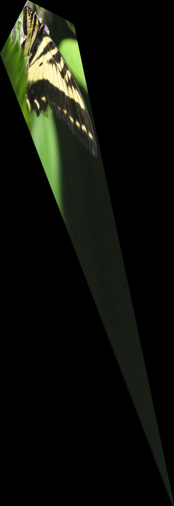
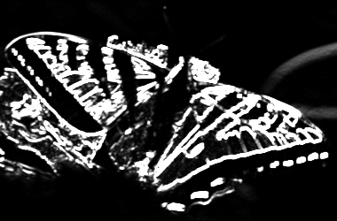
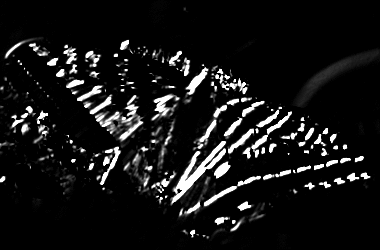

||||||||
|---|---|---|---|---|---|---|
|[Project ↗](../../README.md)|[Documentation ↗](../index.md)|&mdash;|[Tutorials ↗](../tutorials.md)|[How To's ↗](../howtos.md)|[Explanations ↗](../explanations.md)|References|

|||||||||
|---|---|---|---|---|---|---|---|
|[Entry ↗](index.md)|&mdash;|[Sections ↘](bysection.md)|[Permuted Sections ↘](bypsection.md)|[Names ↘](byname.md)|[Permuted Names ↘](bypname.md)|[Strict ↘](strict.md)|[Implementations ↘](bylang.md)|

# Documentation -- Reference Pages -- transform gradient

## <anchor='top'> Table Of Contents

  - [transform](transform.md) ↗

### Operators

 - [aktive op structure lines](#op_structure_lines)
 - [aktive op structure tensor](#op_structure_tensor)

## Operators

---
### [↑](#top)  aktive op structure lines

Syntax: __aktive op structure lines__ src [[→ definition](/file?ci=trunk&ln=61&name=etc/transformer/structure-tensor.tcl)]

Computes and returns the line energy of the input image, based on the [aktive op structure tensor](transform_gradient.md#op_structure_tensor) of the input.

|Input|Description|
|:---|:---|
|src|Source image|

####  Examples

<table>
<tr><th>@1
     &nbsp;</th>
    <th>@2
     ({linear light})</th>
    <th>aktive op structure lines @2
     &nbsp;</th></tr>
<tr><td valign='top'>
     geometry(0 0 380 250 3)</td>
    <td valign='top'>
     geometry(0 0 380 250 3)</td>
    <td valign='top'>
     geometry(0 0 380 250 1)</td></tr>
</table>

---
### [↑](#top)  aktive op structure tensor

Syntax: __aktive op structure tensor__ src ?(param value)...? [[→ definition](/file?ci=trunk&ln=88&name=etc/transformer/structure-tensor.tcl)]

Returns the structure tensor of the input. Expects the input to be in linear light. The tensor is a list of 3 images describing the components of the tensor's matrix. It consists of only three elements because the tensor is symmetric.

The tensor elements are returned in the order top-left, bottom-right (the diagonal), and top-right/bottom-left (the single anti-diagonal element).

|Input|Description|
|:---|:---|
|src|Source image|

|Parameter|Type|Default|Description|
|:---|:---|:---|:---|
|gradient|str|sobel|Filter kernel to use in the calculation of the axis-aligned dicrete gradient. The name refers into the `aktive image kernel` hierarchy. It will be called as `aktive image kernel <gradient> x` and `aktive image kernel <gradient> y`.|
|lowpass|str|gauss3|Filter kernel to smooth the raw tensor elements with. The name refers into the `aktive image kernel` hierarchy. It will be called as `aktive image kernel <lowpass> xy`.|

####  Examples

<table>
<tr><th>@1
     &nbsp;</th>
    <th>@2
     ({linear light})</th>
    <th>lindex [aktive op structure tensor @2] 0
     (XX)</th></tr>
<tr><td valign='top'>
     geometry(0 0 380 250 3)</td>
    <td valign='top'>
     geometry(0 0 380 250 3)</td>
    <td valign='top'>
     geometry(0 0 380 250 1)</td></tr>
</table>

<table>
<tr><th>@1
     &nbsp;</th>
    <th>@2
     ({linear light})</th>
    <th>lindex [aktive op structure tensor @2] 1
     (YY)</th></tr>
<tr><td valign='top'>
     geometry(0 0 380 250 3)</td>
    <td valign='top'>
     geometry(0 0 380 250 3)</td>
    <td valign='top'>
     geometry(0 0 380 250 1)</td></tr>
</table>

<table>
<tr><th>@1
     &nbsp;</th>
    <th>@2
     ({linear light})</th>
    <th>lindex [aktive op structure tensor @2] 2
     (XY)</th></tr>
<tr><td valign='top'>
     geometry(0 0 380 250 3)</td>
    <td valign='top'>
     geometry(0 0 380 250 3)</td>
    <td valign='top'>
     geometry(0 0 380 250 1)</td></tr>
</table>

####  References

  - <https://www.cs.cmu.edu/~sarsen/structureTensorTutorial>

  - <https://en.wikipedia.org/wiki/Structure_tensor>

