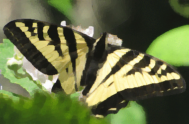

||||||||
|---|---|---|---|---|---|---|
|[Project ↗](../../README.md)|[Documentation ↗](../index.md)|&mdash;|[Tutorials ↗](../tutorials.md)|[How To's ↗](../howtos.md)|[Explanations ↗](../explanations.md)|References|

|||||||||
|---|---|---|---|---|---|---|---|
|[Entry ↗](index.md)|&mdash;|[Sections ↘](bysection.md)|[Permuted Sections ↘](bypsection.md)|[Names ↘](byname.md)|[Permuted Names ↘](bypname.md)|[Strict ↘](strict.md)|[Implementations ↘](bylang.md)|

# Documentation -- Reference Pages -- transform kuwahara

## <anchor='top'> Table Of Contents

  - [transform](transform.md) ↗

### Operators

 - [aktive op kuwahara](#op_kuwahara)
 - [aktive op kuwahara-core](#op_kuwahara_core)

## Operators

---
### [↑](#top)  aktive op kuwahara

Syntax: __aktive op kuwahara__ src ?(param value)...? [[→ definition](/file?ci=trunk&ln=7&name=etc/transformer/filter/kuwahara.tcl)]

Returns the input with a [Kuwahara](https://en.wikipedia.org/wiki/Kuwahara_filter) filter applied to it.

The location of the input is ignored.

The result image is shrunken by `radius` relative to the input. An input smaller than that are rejected.

If shrinkage is not desired add a border to the input use the [aktive op embed bg](transform_structure.md#op_embed_bg) operator or one of its siblings before applying this operator.

The source can be a multi-band image. For known colorspaces the core filter is applied to the luminance channel of the input. The image may be converted into and out of a colorspace with such a channel if it does not have one on its own. For images without a known colorspace the last band is used as the luminance channel.

|Input|Description|
|:---|:---|
|src|Source image|

|Parameter|Type|Default|Description|
|:---|:---|:---|:---|
|radius|uint|2|Filter radius. Actual window size is `2*radius-1`. The default value of `2` is the minimum allowed value.|

####  Examples

<table>
<tr><th>@1
     &nbsp;</th>
    <th>aktive op kuwahara @1 radius 4
     &nbsp;</th></tr>
<tr><td valign='top'>
     geometry(0 0 380 250 3)</td>
    <td valign='top'>
     geometry(0 0 380 250 3)</td></tr>
</table>

####  References

  - <http://www.mathworks.com/matlabcentral/fileexchange/15027-faster-kuwahara-filter>

  - <https://github.com/adussault/python-kuwahara/blob/master/Kuwahara.py>

  - <https://en.wikipedia.org/wiki/Kuwahara_filter>

---
### [↑](#top)  aktive op kuwahara-core

Syntax: __aktive op kuwahara-core__ src ?(param value)...? [[→ definition](/file?ci=trunk&ln=113&name=etc/transformer/filter/kuwahara.tcl)]

Returns the input with a [Kuwahara](https://en.wikipedia.org/wiki/Kuwahara_filter) filter applied to it.

The location of the input is ignored.

The input is expected to be single-band.

The result image is shrunken by `radius` relative to the input. An input smaller than that are rejected.

If shrinkage is not desired add a border to the input use the [aktive op embed bg](transform_structure.md#op_embed_bg) operator or one of its siblings before applying this operator.

The prefered embedding for kuwahara is `mirror`. It is chosen to have minimal to no impact on results at the original input's borders.

|Input|Description|
|:---|:---|
|src|Source image|

|Parameter|Type|Default|Description|
|:---|:---|:---|:---|
|radius|uint|2|Filter radius. The actual window size is `2*radius-1`. The default value of `2` is the minimum allowed value.|

####  Examples

<table>
<tr><th>@1
     &nbsp;</th>
    <th>aktive op kuwahara-core @1 radius 4
     &nbsp;</th></tr>
<tr><td valign='top'>
     geometry(0 0 380 250 1)</td>
    <td valign='top'>
     geometry(0 0 380 250 1)</td></tr>
</table>

####  References

  - <http://www.mathworks.com/matlabcentral/fileexchange/15027-faster-kuwahara-filter>

  - <https://github.com/adussault/python-kuwahara/blob/master/Kuwahara.py>

  - <https://en.wikipedia.org/wiki/Kuwahara_filter>

