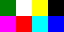

||||||||
|---|---|---|---|---|---|---|
|[Project ↗](../../README.md)|[Documentation ↗](../index.md)|&mdash;|[Tutorials ↗](../tutorials.md)|[How To's ↗](../howtos.md)|[Explanations ↗](../explanations.md)|References|

|||||||||
|---|---|---|---|---|---|---|---|
|[Entry ↗](index.md)|&mdash;|[Sections ↘](bysection.md)|[Permuted Sections ↘](bypsection.md)|[Names ↘](byname.md)|[Permuted Names ↘](bypname.md)|[Strict ↘](strict.md)|[Implementations ↘](bylang.md)|

# Documentation -- Reference Pages -- transform lookup

## <anchor='top'> Table Of Contents

  - [transform](transform.md) ↗

## Subsections

 - [transform lookup indexed](transform_lookup_indexed.md) ↘

### Operators

 - [aktive op lut palette](#op_lut_palette)

## Operators

---
### [↑](#top)  aktive op lut palette

Syntax: __aktive op lut palette__ palette src [[→ definition](/file?ci=trunk&ln=253&name=etc/transformer/filter/lookup.tcl)]

Returns the result of "colorizing" the input via the palette. The result has the same geometry as the input, and the depth of the palette. Colorizing is quoted because this is not limited to 3-band color images. The palette can have an arbitrary number of bands.

This operator is __strict__ in the 1st input. The palette is materialized and cached.

The location and geometry of the palette are ignored.

Each input pixel is treated as integer and used to index into the palette to locate the output values. Indexing outside of the palette is clamped to the first and last entries in the palette.

|Input|Description|
|:---|:---|
|palette|The palette to apply. Materialized at construction time.|
|src|The single-band image to apply the palette to.|

####  Examples

<table>
<tr><th>@1
     &nbsp;</th>
    <th>@2
     &nbsp;</th>
    <th>aktive op lut palette @1 @2
     &nbsp;</th></tr>
<tr><td valign='top'><table><tr><td valign='top'>times 16</td><td valign='top'>
     geometry(0 0 128 16 3)</td></tr></table></td>
    <td valign='top'><table><tr><td>3</td><td>1</td><td>5</td><td>0</td></tr><tr><td>7</td><td>2</td><td>6</td><td>4</td></tr></table></td>
    <td valign='top'><table><tr><td valign='top'>times 16</td><td valign='top'>
     geometry(0 0 64 32 3)</td></tr></table></td></tr>
</table>

