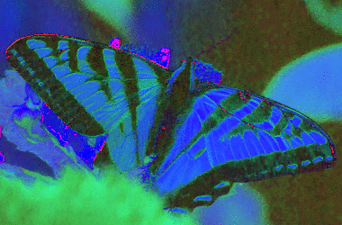
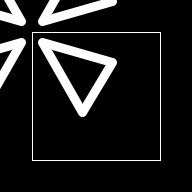
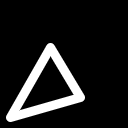
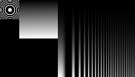
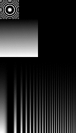
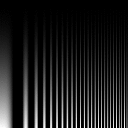

||||||||
|---|---|---|---|---|---|---|
|[Project ↗](../../README.md)|[Documentation ↗](../index.md)|&mdash;|[Tutorials ↗](../tutorials.md)|[How To's ↗](../howtos.md)|[Explanations ↗](../explanations.md)|References|

|||||||||
|---|---|---|---|---|---|---|---|
|[Entry ↗](index.md)|&mdash;|[Sections ↘](bysection.md)|[Permuted Sections ↘](bypsection.md)|[Names ↘](byname.md)|[Permuted Names ↘](bypname.md)|[Strict ↘](strict.md)|[Implementations ↘](bylang.md)|

# Documentation -- Reference Pages -- transform morphology

## <anchor='top'> Table Of Contents

  - [transform](transform.md) ↗

### Operators

 - [aktive op connected-components labeled](#op_connected_components_labeled)
 - [aktive op morph close](#op_morph_close)
 - [aktive op morph dilate](#op_morph_dilate)
 - [aktive op morph erode](#op_morph_erode)
 - [aktive op morph gradient all](#op_morph_gradient_all)
 - [aktive op morph gradient external](#op_morph_gradient_external)
 - [aktive op morph gradient internal](#op_morph_gradient_internal)
 - [aktive op morph open](#op_morph_open)
 - [aktive op morph toggle](#op_morph_toggle)
 - [aktive op morph tophat black](#op_morph_tophat_black)
 - [aktive op morph tophat white](#op_morph_tophat_white)

## Operators

---
### [↑](#top)  aktive op connected-components labeled

Syntax: __aktive op connected-components labeled__ src ?(param value)...? [[→ definition](../../../../file?ci=trunk&ln=8&name=etc/transformer/cc.tcl)]

Returns the input with labeled connected components.

See "[aktive op connected-components get](accessor_morphology.md#op_connected_components_get)" for the CC core.

This operator is __strict__ in its single input. The computed pixels are not materialized, only used to compute the connected components. The returned image is virtual based on the CC data.

|Parameter|Type|Default|Description|
|:---|:---|:---|:---|
|transform|str|{}|Command prefix to transform the CCs before creating an image from them. Executed in the global scope.|
|bbox|bool|0|Flag controlling the result geometry. When false (default) the result has the same geometry as the input. Else the result's geometry is the bounding box containing all CCs (After transformation, if any).|

####  Examples

<table>
<tr><th>@1
     &nbsp;</th>
    <th>aktive op connected-components labeled @1
     &nbsp;</th></tr>
<tr><td valign='top'><table><tr><td valign='top'>times 8</td><td valign='top'>
     geometry(0 0 264 88 1)</td></tr></table></td>
    <td valign='top'><table><tr><td>0</td><td>0</td><td>0</td><td>0</td><td>0</td><td>1</td><td>0</td><td>0</td><td>0</td><td>0</td><td>0</td><td>0</td><td>0</td><td>0</td><td>0</td><td>0</td><td>0</td><td>0</td><td>0</td><td>0</td><td>0</td><td>0</td><td>0</td><td>0</td><td>0</td><td>0</td><td>0</td><td>0</td><td>0</td><td>0</td><td>0</td><td>0</td><td>0</td></tr><tr><td>0</td><td>0</td><td>0</td><td>0</td><td>0</td><td>1</td><td>0</td><td>0</td><td>2</td><td>2</td><td>0</td><td>0</td><td>3</td><td>3</td><td>3</td><td>0</td><td>4</td><td>4</td><td>4</td><td>4</td><td>4</td><td>0</td><td>0</td><td>0</td><td>5</td><td>5</td><td>5</td><td>5</td><td>5</td><td>5</td><td>5</td><td>0</td><td>0</td></tr><tr><td>1</td><td>1</td><td>1</td><td>1</td><td>1</td><td>1</td><td>0</td><td>0</td><td>2</td><td>2</td><td>0</td><td>0</td><td>3</td><td>0</td><td>3</td><td>0</td><td>4</td><td>0</td><td>0</td><td>0</td><td>4</td><td>0</td><td>0</td><td>5</td><td>5</td><td>5</td><td>5</td><td>5</td><td>5</td><td>5</td><td>5</td><td>5</td><td>0</td></tr><tr><td>0</td><td>0</td><td>0</td><td>0</td><td>0</td><td>0</td><td>0</td><td>2</td><td>2</td><td>0</td><td>0</td><td>0</td><td>3</td><td>3</td><td>3</td><td>0</td><td>4</td><td>0</td><td>0</td><td>0</td><td>4</td><td>0</td><td>5</td><td>5</td><td>5</td><td>5</td><td>5</td><td>5</td><td>5</td><td>5</td><td>5</td><td>5</td><td>5</td></tr><tr><td>0</td><td>2</td><td>2</td><td>2</td><td>2</td><td>2</td><td>2</td><td>2</td><td>0</td><td>6</td><td>0</td><td>0</td><td>0</td><td>0</td><td>0</td><td>0</td><td>4</td><td>0</td><td>0</td><td>0</td><td>4</td><td>0</td><td>5</td><td>5</td><td>5</td><td>0</td><td>0</td><td>0</td><td>0</td><td>0</td><td>5</td><td>5</td><td>5</td></tr><tr><td>0</td><td>2</td><td>0</td><td>0</td><td>0</td><td>0</td><td>0</td><td>0</td><td>0</td><td>6</td><td>0</td><td>0</td><td>0</td><td>0</td><td>0</td><td>0</td><td>4</td><td>0</td><td>0</td><td>0</td><td>4</td><td>0</td><td>5</td><td>5</td><td>0</td><td>0</td><td>0</td><td>7</td><td>0</td><td>0</td><td>0</td><td>5</td><td>5</td></tr><tr><td>0</td><td>2</td><td>0</td><td>6</td><td>6</td><td>6</td><td>6</td><td>6</td><td>6</td><td>6</td><td>0</td><td>0</td><td>0</td><td>0</td><td>0</td><td>0</td><td>4</td><td>4</td><td>4</td><td>4</td><td>4</td><td>0</td><td>0</td><td>5</td><td>5</td><td>0</td><td>0</td><td>7</td><td>0</td><td>0</td><td>5</td><td>5</td><td>0</td></tr><tr><td>0</td><td>0</td><td>6</td><td>6</td><td>0</td><td>0</td><td>0</td><td>0</td><td>0</td><td>0</td><td>0</td><td>0</td><td>0</td><td>0</td><td>0</td><td>0</td><td>0</td><td>0</td><td>0</td><td>0</td><td>0</td><td>0</td><td>0</td><td>0</td><td>5</td><td>5</td><td>0</td><td>7</td><td>0</td><td>5</td><td>5</td><td>0</td><td>0</td></tr><tr><td>0</td><td>6</td><td>6</td><td>0</td><td>0</td><td>8</td><td>8</td><td>8</td><td>8</td><td>8</td><td>8</td><td>0</td><td>9</td><td>9</td><td>9</td><td>9</td><td>9</td><td>9</td><td>9</td><td>9</td><td>0</td><td>0</td><td>0</td><td>0</td><td>0</td><td>0</td><td>0</td><td>7</td><td>0</td><td>0</td><td>0</td><td>0</td><td>0</td></tr><tr><td>0</td><td>6</td><td>6</td><td>0</td><td>0</td><td>8</td><td>0</td><td>0</td><td>0</td><td>0</td><td>0</td><td>0</td><td>9</td><td>9</td><td>9</td><td>9</td><td>9</td><td>9</td><td>9</td><td>9</td><td>0</td><td>0</td><td>7</td><td>7</td><td>7</td><td>7</td><td>7</td><td>7</td><td>7</td><td>7</td><td>7</td><td>7</td><td>7</td></tr><tr><td>0</td><td>0</td><td>0</td><td>0</td><td>0</td><td>8</td><td>0</td><td>0</td><td>0</td><td>0</td><td>0</td><td>0</td><td>9</td><td>9</td><td>0</td><td>0</td><td>0</td><td>0</td><td>9</td><td>9</td><td>0</td><td>0</td><td>0</td><td>0</td><td>0</td><td>0</td><td>7</td><td>7</td><td>7</td><td>0</td><td>0</td><td>0</td><td>0</td></tr></table></td></tr>
</table>

<table>
<tr><th>@1
     &nbsp;</th>
    <th>aktive op connected-components labeled @1 transform cc.max
     &nbsp;</th></tr>
<tr><td valign='top'><table><tr><td valign='top'>times 8</td><td valign='top'>
     geometry(0 0 264 88 1)</td></tr></table></td>
    <td valign='top'><table><tr><td valign='top'>times 8</td><td valign='top'>
     geometry(0 0 264 88 1)</td></tr></table></td></tr>
</table>

<table>
<tr><th>@1
     &nbsp;</th>
    <th>aktive op connected-components labeled @1 transform cc.max bbox 1
     &nbsp;</th></tr>
<tr><td valign='top'><table><tr><td valign='top'>times 8</td><td valign='top'>
     geometry(0 0 264 88 1)</td></tr></table></td>
    <td valign='top'><table><tr><td valign='top'>times 8</td><td valign='top'>
     geometry(22 1 88 56 1)</td></tr></table></td></tr>
</table>

---
### [↑](#top)  aktive op morph close

Syntax: __aktive op morph close__ src ?(param value)...? [[→ definition](../../../../file?ci=trunk&ln=8&name=etc/transformer/filter/morphology.tcl)]

Returns image containing the morphological closing (dilate, then erode) of the input using a (2*radius+1)x(2*radius+1) square structuring element.

|Parameter|Type|Default|Description|
|:---|:---|:---|:---|
|radius|uint|1|Size of the structuring element to perform the operation with.|
|embed|str|black|Embedding method to use before core operators to keep output from shrinking.|

####  Examples

<table>
<tr><th>@1
     &nbsp;</th>
    <th>aktive op morph close @1 radius 1
     &nbsp;</th></tr>
<tr><td valign='top'><table><tr><td valign='top'>times 8</td><td valign='top'>
     geometry(0 0 264 88 1)</td></tr></table></td>
    <td valign='top'><table><tr><td valign='top'>times 8</td><td valign='top'>
     geometry(0 0 264 88 1)</td></tr></table></td></tr>
</table>

<table>
<tr><th>@1
     &nbsp;</th>
    <th>aktive op morph close @1 radius 1
     &nbsp;</th></tr>
<tr><td valign='top'><table><tr><td valign='top'>times 8</td><td valign='top'>
     geometry(0 0 200 104 1)</td></tr></table></td>
    <td valign='top'><table><tr><td valign='top'>times 8</td><td valign='top'>
     geometry(0 0 200 104 1)</td></tr></table></td></tr>
</table>

---
### [↑](#top)  aktive op morph dilate

Syntax: __aktive op morph dilate__ src ?(param value)...? [[→ definition](../../../../file?ci=trunk&ln=8&name=etc/transformer/filter/morphology.tcl)]

Returns image containing the morphological dilation of the input using a (2*radius+1)x(2*radius+1) square structuring element.

|Parameter|Type|Default|Description|
|:---|:---|:---|:---|
|radius|uint|1|Size of the structuring element to perform the operation with.|
|embed|str|black|Embedding method to use before core operators to keep output from shrinking.|

####  Examples

<table>
<tr><th>@1
     &nbsp;</th>
    <th>aktive op morph dilate @1 radius 1
     &nbsp;</th></tr>
<tr><td valign='top'><table><tr><td valign='top'>times 8</td><td valign='top'>
     geometry(0 0 264 88 1)</td></tr></table></td>
    <td valign='top'><table><tr><td valign='top'>times 8</td><td valign='top'>
     geometry(0 0 264 88 1)</td></tr></table></td></tr>
</table>

<table>
<tr><th>@1
     &nbsp;</th>
    <th>aktive op morph dilate @1 radius 1
     &nbsp;</th></tr>
<tr><td valign='top'><table><tr><td valign='top'>times 8</td><td valign='top'>
     geometry(0 0 200 104 1)</td></tr></table></td>
    <td valign='top'><table><tr><td valign='top'>times 8</td><td valign='top'>
     geometry(0 0 200 104 1)</td></tr></table></td></tr>
</table>

---
### [↑](#top)  aktive op morph erode

Syntax: __aktive op morph erode__ src ?(param value)...? [[→ definition](../../../../file?ci=trunk&ln=8&name=etc/transformer/filter/morphology.tcl)]

Returns image containing the morphological erosion of the input using a (2*radius+1)x(2*radius+1) square structuring element.

|Parameter|Type|Default|Description|
|:---|:---|:---|:---|
|radius|uint|1|Size of the structuring element to perform the operation with.|
|embed|str|black|Embedding method to use before core operators to keep output from shrinking.|

####  Examples

<table>
<tr><th>@1
     &nbsp;</th>
    <th>aktive op morph erode @1 radius 1
     &nbsp;</th></tr>
<tr><td valign='top'><table><tr><td valign='top'>times 8</td><td valign='top'>
     geometry(0 0 264 88 1)</td></tr></table></td>
    <td valign='top'><table><tr><td valign='top'>times 8</td><td valign='top'>
     geometry(0 0 264 88 1)</td></tr></table></td></tr>
</table>

<table>
<tr><th>@1
     &nbsp;</th>
    <th>aktive op morph erode @1 radius 1
     &nbsp;</th></tr>
<tr><td valign='top'><table><tr><td valign='top'>times 8</td><td valign='top'>
     geometry(0 0 200 104 1)</td></tr></table></td>
    <td valign='top'><table><tr><td valign='top'>times 8</td><td valign='top'>
     geometry(0 0 200 104 1)</td></tr></table></td></tr>
</table>

---
### [↑](#top)  aktive op morph gradient all

Syntax: __aktive op morph gradient all__ src ?(param value)...? [[→ definition](../../../../file?ci=trunk&ln=8&name=etc/transformer/filter/morphology.tcl)]

Returns image containing the morphological gradient (subtract eroded from dilated) of the input using a (2*radius+1)x(2*radius+1) square structuring element.

|Parameter|Type|Default|Description|
|:---|:---|:---|:---|
|radius|uint|1|Size of the structuring element to perform the operation with.|
|embed|str|black|Embedding method to use before core operators to keep output from shrinking.|

####  Examples

<table>
<tr><th>@1
     &nbsp;</th>
    <th>aktive op morph gradient all @1 radius 1
     &nbsp;</th></tr>
<tr><td valign='top'><table><tr><td valign='top'>times 8</td><td valign='top'>
     geometry(0 0 264 88 1)</td></tr></table></td>
    <td valign='top'><table><tr><td valign='top'>times 8</td><td valign='top'>
     geometry(0 0 264 88 1)</td></tr></table></td></tr>
</table>

<table>
<tr><th>@1
     &nbsp;</th>
    <th>aktive op morph gradient all @1 radius 1
     &nbsp;</th></tr>
<tr><td valign='top'><table><tr><td valign='top'>times 8</td><td valign='top'>
     geometry(0 0 200 104 1)</td></tr></table></td>
    <td valign='top'><table><tr><td valign='top'>times 8</td><td valign='top'>
     geometry(0 0 200 104 1)</td></tr></table></td></tr>
</table>

---
### [↑](#top)  aktive op morph gradient external

Syntax: __aktive op morph gradient external__ src ?(param value)...? [[→ definition](../../../../file?ci=trunk&ln=8&name=etc/transformer/filter/morphology.tcl)]

Returns image containing the morphological outer gradient (subtract input from dilated) of the input using a (2*radius+1)x(2*radius+1) square structuring element.

|Parameter|Type|Default|Description|
|:---|:---|:---|:---|
|radius|uint|1|Size of the structuring element to perform the operation with.|
|embed|str|black|Embedding method to use before core operators to keep output from shrinking.|

####  Examples

<table>
<tr><th>@1
     &nbsp;</th>
    <th>aktive op morph gradient external @1 radius 1
     &nbsp;</th></tr>
<tr><td valign='top'><table><tr><td valign='top'>times 8</td><td valign='top'>
     geometry(0 0 264 88 1)</td></tr></table></td>
    <td valign='top'><table><tr><td valign='top'>times 8</td><td valign='top'>
     geometry(0 0 264 88 1)</td></tr></table></td></tr>
</table>

<table>
<tr><th>@1
     &nbsp;</th>
    <th>aktive op morph gradient external @1 radius 1
     &nbsp;</th></tr>
<tr><td valign='top'><table><tr><td valign='top'>times 8</td><td valign='top'>
     geometry(0 0 200 104 1)</td></tr></table></td>
    <td valign='top'><table><tr><td valign='top'>times 8</td><td valign='top'>
     geometry(0 0 200 104 1)</td></tr></table></td></tr>
</table>

---
### [↑](#top)  aktive op morph gradient internal

Syntax: __aktive op morph gradient internal__ src ?(param value)...? [[→ definition](../../../../file?ci=trunk&ln=8&name=etc/transformer/filter/morphology.tcl)]

Returns image containing the morphological inner gradient (subtract eroded from input) of the input using a (2*radius+1)x(2*radius+1) square structuring element.

|Parameter|Type|Default|Description|
|:---|:---|:---|:---|
|radius|uint|1|Size of the structuring element to perform the operation with.|
|embed|str|black|Embedding method to use before core operators to keep output from shrinking.|

####  Examples

<table>
<tr><th>@1
     &nbsp;</th>
    <th>aktive op morph gradient internal @1 radius 1
     &nbsp;</th></tr>
<tr><td valign='top'><table><tr><td valign='top'>times 8</td><td valign='top'>
     geometry(0 0 264 88 1)</td></tr></table></td>
    <td valign='top'><table><tr><td valign='top'>times 8</td><td valign='top'>
     geometry(0 0 264 88 1)</td></tr></table></td></tr>
</table>

<table>
<tr><th>@1
     &nbsp;</th>
    <th>aktive op morph gradient internal @1 radius 1
     &nbsp;</th></tr>
<tr><td valign='top'><table><tr><td valign='top'>times 8</td><td valign='top'>
     geometry(0 0 200 104 1)</td></tr></table></td>
    <td valign='top'><table><tr><td valign='top'>times 8</td><td valign='top'>
     geometry(0 0 200 104 1)</td></tr></table></td></tr>
</table>

---
### [↑](#top)  aktive op morph open

Syntax: __aktive op morph open__ src ?(param value)...? [[→ definition](../../../../file?ci=trunk&ln=8&name=etc/transformer/filter/morphology.tcl)]

Returns image containing the morphological opening (erode, then dilate) of the input using a (2*radius+1)x(2*radius+1) square structuring element.

|Parameter|Type|Default|Description|
|:---|:---|:---|:---|
|radius|uint|1|Size of the structuring element to perform the operation with.|
|embed|str|black|Embedding method to use before core operators to keep output from shrinking.|

####  Examples

<table>
<tr><th>@1
     &nbsp;</th>
    <th>aktive op morph open @1 radius 1
     &nbsp;</th></tr>
<tr><td valign='top'><table><tr><td valign='top'>times 8</td><td valign='top'>
     geometry(0 0 264 88 1)</td></tr></table></td>
    <td valign='top'><table><tr><td valign='top'>times 8</td><td valign='top'>
     geometry(0 0 264 88 1)</td></tr></table></td></tr>
</table>

<table>
<tr><th>@1
     &nbsp;</th>
    <th>aktive op morph open @1 radius 1
     &nbsp;</th></tr>
<tr><td valign='top'><table><tr><td valign='top'>times 8</td><td valign='top'>
     geometry(0 0 200 104 1)</td></tr></table></td>
    <td valign='top'><table><tr><td valign='top'>times 8</td><td valign='top'>
     geometry(0 0 200 104 1)</td></tr></table></td></tr>
</table>

---
### [↑](#top)  aktive op morph toggle

Syntax: __aktive op morph toggle__ src ?(param value)...? [[→ definition](../../../../file?ci=trunk&ln=8&name=etc/transformer/filter/morphology.tcl)]

Returns image containing the morphological of the input using a (2*radius+1)x(2*radius+1) square structuring element.

|Parameter|Type|Default|Description|
|:---|:---|:---|:---|
|radius|uint|1|Size of the structuring element to perform the operation with.|
|embed|str|black|Embedding method to use before core operators to keep output from shrinking.|

####  Examples

<table>
<tr><th>@1
     &nbsp;</th>
    <th>aktive op morph toggle @1 radius 1
     &nbsp;</th></tr>
<tr><td valign='top'><table><tr><td valign='top'>times 8</td><td valign='top'>
     geometry(0 0 264 88 1)</td></tr></table></td>
    <td valign='top'><table><tr><td valign='top'>times 8</td><td valign='top'>
     geometry(0 0 264 88 1)</td></tr></table></td></tr>
</table>

<table>
<tr><th>@1
     &nbsp;</th>
    <th>aktive op morph toggle @1 radius 1
     &nbsp;</th></tr>
<tr><td valign='top'><table><tr><td valign='top'>times 8</td><td valign='top'>
     geometry(0 0 200 104 1)</td></tr></table></td>
    <td valign='top'><table><tr><td valign='top'>times 8</td><td valign='top'>
     geometry(0 0 200 104 1)</td></tr></table></td></tr>
</table>

---
### [↑](#top)  aktive op morph tophat black

Syntax: __aktive op morph tophat black__ src ?(param value)...? [[→ definition](../../../../file?ci=trunk&ln=8&name=etc/transformer/filter/morphology.tcl)]

Returns image containing the morphological black tophat (subtract input from closing) of the input using a (2*radius+1)x(2*radius+1) square structuring element.

|Parameter|Type|Default|Description|
|:---|:---|:---|:---|
|radius|uint|1|Size of the structuring element to perform the operation with.|
|embed|str|black|Embedding method to use before core operators to keep output from shrinking.|

####  Examples

<table>
<tr><th>@1
     &nbsp;</th>
    <th>aktive op morph tophat black @1 radius 1
     &nbsp;</th></tr>
<tr><td valign='top'><table><tr><td valign='top'>times 8</td><td valign='top'>
     geometry(0 0 264 88 1)</td></tr></table></td>
    <td valign='top'><table><tr><td valign='top'>times 8</td><td valign='top'>
     geometry(0 0 264 88 1)</td></tr></table></td></tr>
</table>

<table>
<tr><th>@1
     &nbsp;</th>
    <th>aktive op morph tophat black @1 radius 1
     &nbsp;</th></tr>
<tr><td valign='top'><table><tr><td valign='top'>times 8</td><td valign='top'>
     geometry(0 0 200 104 1)</td></tr></table></td>
    <td valign='top'><table><tr><td valign='top'>times 8</td><td valign='top'>
     geometry(0 0 200 104 1)</td></tr></table></td></tr>
</table>

---
### [↑](#top)  aktive op morph tophat white

Syntax: __aktive op morph tophat white__ src ?(param value)...? [[→ definition](../../../../file?ci=trunk&ln=8&name=etc/transformer/filter/morphology.tcl)]

Returns image containing the morphological white tophat (subtract opening from input) of the input using a (2*radius+1)x(2*radius+1) square structuring element.

|Parameter|Type|Default|Description|
|:---|:---|:---|:---|
|radius|uint|1|Size of the structuring element to perform the operation with.|
|embed|str|black|Embedding method to use before core operators to keep output from shrinking.|

####  Examples

<table>
<tr><th>@1
     &nbsp;</th>
    <th>aktive op morph tophat white @1 radius 1
     &nbsp;</th></tr>
<tr><td valign='top'><table><tr><td valign='top'>times 8</td><td valign='top'>
     geometry(0 0 264 88 1)</td></tr></table></td>
    <td valign='top'><table><tr><td valign='top'>times 8</td><td valign='top'>
     geometry(0 0 264 88 1)</td></tr></table></td></tr>
</table>

<table>
<tr><th>@1
     &nbsp;</th>
    <th>aktive op morph tophat white @1 radius 1
     &nbsp;</th></tr>
<tr><td valign='top'><table><tr><td valign='top'>times 8</td><td valign='top'>
     geometry(0 0 200 104 1)</td></tr></table></td>
    <td valign='top'><table><tr><td valign='top'>times 8</td><td valign='top'>
     geometry(0 0 200 104 1)</td></tr></table></td></tr>
</table>

