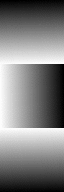
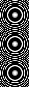
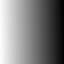

||||||||
|---|---|---|---|---|---|---|
|[Project ↗](../../README.md)|[Documentation ↗](../index.md)|&mdash;|[Tutorials ↗](../tutorials.md)|[How To's ↗](../howtos.md)|[Explanations ↗](../explanations.md)|References|

|||||||||
|---|---|---|---|---|---|---|---|
|[Entry ↗](index.md)|&mdash;|[Sections ↘](bysection.md)|[Permuted Sections ↘](bypsection.md)|[Names ↘](byname.md)|[Permuted Names ↘](bypname.md)|[Strict ↘](strict.md)|[Implementations ↘](bylang.md)|

# Documentation -- Reference Pages -- transform sdf

## Table Of Contents

  - [transform](transform.md) ↗

## Subsections

 - [transform sdf combiner](transform_sdf_combiner.md) ↘

### Operators

 - [aktive op sdf 2image fit](#op_sdf_2image_fit)
 - [aktive op sdf 2image pixelated](#op_sdf_2image_pixelated)
 - [aktive op sdf 2image smooth](#op_sdf_2image_smooth)
 - [aktive op sdf not](#op_sdf_not)
 - [aktive op sdf outline](#op_sdf_outline)
 - [aktive op sdf ring](#op_sdf_ring)
 - [aktive op sdf round](#op_sdf_round)

## Operators

---
###  aktive op sdf 2image fit

Syntax: __aktive op sdf 2image fit__ src [[→ definition](../../../../file?ci=trunk&ln=291&name=etc/generator/virtual/sdf.tcl)]

Compresses the input SDF into the range 0..1 and returns the resulting grayscale image.

---
###  aktive op sdf 2image pixelated

Syntax: __aktive op sdf 2image pixelated__ src [[→ definition](../../../../file?ci=trunk&ln=316&name=etc/generator/virtual/sdf.tcl)]

Converts the SDF into a black/white image with pixelated element borders.

---
###  aktive op sdf 2image smooth

Syntax: __aktive op sdf 2image smooth__ src [[→ definition](../../../../file?ci=trunk&ln=303&name=etc/generator/virtual/sdf.tcl)]

Converts the SDF into a grey-scale image with anti-aliased element borders.

---
###  aktive op sdf not

Syntax: __aktive op sdf not__ src [[→ definition](../../../../file?ci=trunk&ln=99&name=etc/generator/virtual/sdf.tcl)]

Returns the inverted input SDF, where inside and outside changed places.

####  Examples

<table>
<tr><th>@1
     &nbsp;</th>
    <th>aktive op sdf not @1
     &nbsp;</th></tr>
<tr><td valign='top'>
     geometry(0 0 128 128 1)</td>
    <td valign='top'><table><tr><td valign='top'>sdf-fit</td><td valign='top'>
     geometry(0 0 128 128 1)</td><td valign='top'>sdf-smooth</td><td valign='top'>
     geometry(0 0 128 128 1)</td><td valign='top'>sdf-pixelated</td><td valign='top'>
     geometry(0 0 128 128 1)</td></tr></table></td></tr>
</table>

---
###  aktive op sdf outline

Syntax: __aktive op sdf outline__ src [[→ definition](../../../../file?ci=trunk&ln=239&name=etc/generator/virtual/sdf.tcl)]

Replaces the input SDF with an outlined form, and returns the result.

This is implemented by taking the absolute of the input.

####  Examples

<table>
<tr><th>@1
     &nbsp;</th>
    <th>aktive op sdf outline @1
     &nbsp;</th></tr>
<tr><td valign='top'>
     geometry(0 0 128 128 1)</td>
    <td valign='top'><table><tr><td valign='top'>sdf-fit</td><td valign='top'>
     geometry(0 0 128 128 1)</td><td valign='top'>sdf-smooth</td><td valign='top'>
     geometry(0 0 128 128 1)</td><td valign='top'>sdf-pixelated</td><td valign='top'>
     geometry(0 0 128 128 1)</td></tr></table></td></tr>
</table>

---
###  aktive op sdf ring

Syntax: __aktive op sdf ring__ src (param value)... [[→ definition](../../../../file?ci=trunk&ln=215&name=etc/generator/virtual/sdf.tcl)]

Combines outlining and rounding to replace the input SDF with an SDF tracing the border at some thickness and returns the result.

The result is annular, i.e. has a ring/onion-like structure.

Note that a thickness of zero devolves this operation to a plain outline.

|Parameter|Type|Default|Description|
|:---|:---|:---|:---|
|thickness|uint||Desired border thickness.|

####  Examples

<table>
<tr><th>@1
     &nbsp;</th>
    <th>aktive op sdf ring @1 thickness 4
     &nbsp;</th></tr>
<tr><td valign='top'>
     geometry(0 0 128 128 1)</td>
    <td valign='top'><table><tr><td valign='top'>sdf-fit</td><td valign='top'>
     geometry(0 0 128 128 1)</td><td valign='top'>sdf-smooth</td><td valign='top'>
     geometry(0 0 128 128 1)</td><td valign='top'>sdf-pixelated</td><td valign='top'>
     geometry(0 0 128 128 1)</td></tr></table></td></tr>
</table>

---
###  aktive op sdf round

Syntax: __aktive op sdf round__ src (param value)... [[→ definition](../../../../file?ci=trunk&ln=258&name=etc/generator/virtual/sdf.tcl)]

Replaces the input SDF with a more rounded form per the radius, and returns the result.

This is implemented by shifting the input SDF down by the radius.

For a radius > 0 this expands the SDF, making the encoded element rounder. A radius < 0 conversely shrinks the SDF.

To get a rounded SDF at the original size use a pre-shrunken/expanded SDF as the input to compensate the changes made by this operator.

A radius of zero is ignored.

|Parameter|Type|Default|Description|
|:---|:---|:---|:---|
|radius|uint||Expansion/Shrinkage radius for the SDF.|

####  Examples

<table>
<tr><th>@1
     &nbsp;</th>
    <th>aktive op sdf round @1 radius 20
     &nbsp;</th></tr>
<tr><td valign='top'>
     geometry(0 0 128 128 1)</td>
    <td valign='top'><table><tr><td valign='top'>sdf-fit</td><td valign='top'>
     geometry(0 0 128 128 1)</td><td valign='top'>sdf-smooth</td><td valign='top'>
     geometry(0 0 128 128 1)</td><td valign='top'>sdf-pixelated</td><td valign='top'>
     geometry(0 0 128 128 1)</td></tr></table></td></tr>
</table>

