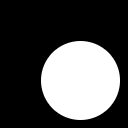
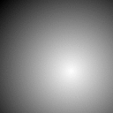
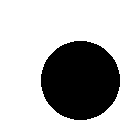
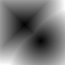
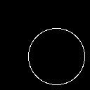

||||||||
|---|---|---|---|---|---|---|
|[Project ↗](../../README.md)|[Documentation ↗](../index.md)|&mdash;|[Tutorials ↗](../tutorials.md)|[How To's ↗](../howtos.md)|[Explanations ↗](../explanations.md)|References|

|||||||||
|---|---|---|---|---|---|---|---|
|[Entry ↗](index.md)|&mdash;|[Sections ↘](bysection.md)|[Permuted Sections ↘](bypsection.md)|[Names ↘](byname.md)|[Permuted Names ↘](bypname.md)|[Strict ↘](strict.md)|[Implementations ↘](bylang.md)|

# Documentation -- Reference Pages -- transform sdf combiner

## <anchor='top'> Table Of Contents

  - [transform sdf](transform_sdf.md) ↗

### Operators

 - [aktive op sdf and](#op_sdf_and)
 - [aktive op sdf or](#op_sdf_or)
 - [aktive op sdf sub](#op_sdf_sub)
 - [aktive op sdf xor](#op_sdf_xor)
 - [aktive op sdf xor-core](#op_sdf_xor_core)

## Operators

---
### [↑](#top)  aktive op sdf and

Syntax: __aktive op sdf and__ srcs... [[→ definition](../../../../file?ci=trunk&ln=135&name=etc/generator/virtual/sdf.tcl)]

Returns the intersection (`*`, `max`) of all input SDFs.

|Input|Description|
|:---|:---|
|args...|Source images|

####  Examples

<table>
<tr><th>@1
     &nbsp;</th>
    <th>@2
     &nbsp;</th>
    <th>aktive op sdf and @1 @2
     &nbsp;</th></tr>
<tr><td valign='top'>
     geometry(0 0 128 128 1)</td>
    <td valign='top'>
     geometry(0 0 128 128 1)</td>
    <td valign='top'><table><tr><td valign='top'>sdf-fit</td><td valign='top'>
     geometry(0 0 128 128 1)</td><td valign='top'>sdf-smooth</td><td valign='top'>
     geometry(0 0 128 128 1)</td><td valign='top'>sdf-pixelated</td><td valign='top'>
     geometry(0 0 128 128 1)</td></tr></table></td></tr>
</table>

---
### [↑](#top)  aktive op sdf or

Syntax: __aktive op sdf or__ srcs... [[→ definition](../../../../file?ci=trunk&ln=117&name=etc/generator/virtual/sdf.tcl)]

Returns the union (`+`, `min`) of all input SDFs.

|Input|Description|
|:---|:---|
|args...|Source images|

####  Examples

<table>
<tr><th>@1
     &nbsp;</th>
    <th>@2
     &nbsp;</th>
    <th>aktive op sdf or @1 @2
     &nbsp;</th></tr>
<tr><td valign='top'>
     geometry(0 0 128 128 1)</td>
    <td valign='top'>
     geometry(0 0 128 128 1)</td>
    <td valign='top'><table><tr><td valign='top'>sdf-fit</td><td valign='top'>
     geometry(0 0 128 128 1)</td><td valign='top'>sdf-smooth</td><td valign='top'>
     geometry(0 0 128 128 1)</td><td valign='top'>sdf-pixelated</td><td valign='top'>
     geometry(0 0 128 128 1)</td></tr></table></td></tr>
</table>

---
### [↑](#top)  aktive op sdf sub

Syntax: __aktive op sdf sub__ a b [[→ definition](../../../../file?ci=trunk&ln=153&name=etc/generator/virtual/sdf.tcl)]

Returns the difference `A - B` of the two input SDFs. This is defined as `A * (not B)`.

|Input|Description|
|:---|:---|
|a|SDF A|
|b|SDF B|

####  Examples

<table>
<tr><th>@1
     &nbsp;</th>
    <th>@2
     &nbsp;</th>
    <th>aktive op sdf sub @1 @2
     &nbsp;</th></tr>
<tr><td valign='top'>
     geometry(0 0 128 128 1)</td>
    <td valign='top'>
     geometry(0 0 128 128 1)</td>
    <td valign='top'><table><tr><td valign='top'>sdf-fit</td><td valign='top'>
     geometry(0 0 128 128 1)</td><td valign='top'>sdf-smooth</td><td valign='top'>
     geometry(0 0 128 128 1)</td><td valign='top'>sdf-pixelated</td><td valign='top'>
     geometry(0 0 128 128 1)</td></tr></table></td></tr>
</table>

---
### [↑](#top)  aktive op sdf xor

Syntax: __aktive op sdf xor__ srcs... [[→ definition](../../../../file?ci=trunk&ln=174&name=etc/generator/virtual/sdf.tcl)]

Returns the symmetric difference of all input SDFs.

|Input|Description|
|:---|:---|
|args...|Source images|

####  Examples

<table>
<tr><th>@1
     &nbsp;</th>
    <th>@2
     &nbsp;</th>
    <th>aktive op sdf xor @1 @2
     &nbsp;</th></tr>
<tr><td valign='top'>
     geometry(0 0 128 128 1)</td>
    <td valign='top'>
     geometry(0 0 128 128 1)</td>
    <td valign='top'><table><tr><td valign='top'>sdf-fit</td><td valign='top'>
     geometry(0 0 128 128 1)</td><td valign='top'>sdf-smooth</td><td valign='top'>
     geometry(0 0 128 128 1)</td><td valign='top'>sdf-pixelated</td><td valign='top'>
     geometry(0 0 128 128 1)</td></tr></table></td></tr>
</table>

---
### [↑](#top)  aktive op sdf xor-core

Syntax: __aktive op sdf xor-core__ a b [[→ definition](../../../../file?ci=trunk&ln=194&name=etc/generator/virtual/sdf.tcl)]

Returns the symmetric difference of the two input SDFs. This is defined as `(A + B) - (A * B)`.

|Input|Description|
|:---|:---|
|a|SDF A|
|b|SDF B|

####  Examples

<table>
<tr><th>@1
     &nbsp;</th>
    <th>@2
     &nbsp;</th>
    <th>aktive op sdf xor-core @1 @2
     &nbsp;</th></tr>
<tr><td valign='top'>
     geometry(0 0 128 128 1)</td>
    <td valign='top'>
     geometry(0 0 128 128 1)</td>
    <td valign='top'><table><tr><td valign='top'>sdf-fit</td><td valign='top'>
     geometry(0 0 128 128 1)</td><td valign='top'>sdf-smooth</td><td valign='top'>
     geometry(0 0 128 128 1)</td><td valign='top'>sdf-pixelated</td><td valign='top'>
     geometry(0 0 128 128 1)</td></tr></table></td></tr>
</table>

