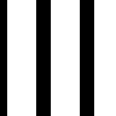
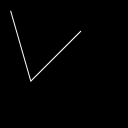
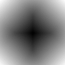
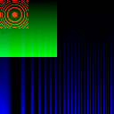
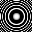

||||||||
|---|---|---|---|---|---|---|
|[Project ↗](../../README.md)|[Documentation ↗](../index.md)|&mdash;|[Tutorials ↗](../tutorials.md)|[How To's ↗](../howtos.md)|[Explanations ↗](../explanations.md)|References|

|||||||||
|---|---|---|---|---|---|---|---|
|[Entry ↗](index.md)|&mdash;|[Sections ↘](bysection.md)|[Permuted Sections ↘](bypsection.md)|[Names ↘](byname.md)|[Permuted Names ↘](bypname.md)|[Strict ↘](strict.md)|[Implementations ↘](bylang.md)|

# Documentation -- Reference Pages -- transform statistics

## Table Of Contents

  - [transform](transform.md) ↗

### Operators

 - [aktive op band arg ge](#op_band_arg_ge)
 - [aktive op band arg gt](#op_band_arg_gt)
 - [aktive op band arg le](#op_band_arg_le)
 - [aktive op band arg lt](#op_band_arg_lt)
 - [aktive op band arg max](#op_band_arg_max)
 - [aktive op band arg min](#op_band_arg_min)
 - [aktive op band cumulative](#op_band_cumulative)
 - [aktive op band histogram](#op_band_histogram)
 - [aktive op band max](#op_band_max)
 - [aktive op band mean](#op_band_mean)
 - [aktive op band median](#op_band_median)
 - [aktive op band min](#op_band_min)
 - [aktive op band otsu](#op_band_otsu)
 - [aktive op band rank](#op_band_rank)
 - [aktive op band stddev](#op_band_stddev)
 - [aktive op band sum](#op_band_sum)
 - [aktive op band sumsquared](#op_band_sumsquared)
 - [aktive op band variance](#op_band_variance)
 - [aktive op column arg max](#op_column_arg_max)
 - [aktive op column arg min](#op_column_arg_min)
 - [aktive op column cumulative](#op_column_cumulative)
 - [aktive op column histogram](#op_column_histogram)
 - [aktive op column max](#op_column_max)
 - [aktive op column mean](#op_column_mean)
 - [aktive op column median](#op_column_median)
 - [aktive op column min](#op_column_min)
 - [aktive op column otsu](#op_column_otsu)
 - [aktive op column profile](#op_column_profile)
 - [aktive op column rank](#op_column_rank)
 - [aktive op column stddev](#op_column_stddev)
 - [aktive op column sum](#op_column_sum)
 - [aktive op column sumsquared](#op_column_sumsquared)
 - [aktive op column variance](#op_column_variance)
 - [aktive op image histogram](#op_image_histogram)
 - [aktive op row arg max](#op_row_arg_max)
 - [aktive op row arg min](#op_row_arg_min)
 - [aktive op row cumulative](#op_row_cumulative)
 - [aktive op row histogram](#op_row_histogram)
 - [aktive op row max](#op_row_max)
 - [aktive op row mean](#op_row_mean)
 - [aktive op row median](#op_row_median)
 - [aktive op row min](#op_row_min)
 - [aktive op row otsu](#op_row_otsu)
 - [aktive op row profile](#op_row_profile)
 - [aktive op row rank](#op_row_rank)
 - [aktive op row stddev](#op_row_stddev)
 - [aktive op row sum](#op_row_sum)
 - [aktive op row sumsquared](#op_row_sumsquared)
 - [aktive op row variance](#op_row_variance)
 - [aktive op tile histogram](#op_tile_histogram)
 - [aktive op tile max](#op_tile_max)
 - [aktive op tile mean](#op_tile_mean)
 - [aktive op tile median](#op_tile_median)
 - [aktive op tile min](#op_tile_min)
 - [aktive op tile rank](#op_tile_rank)
 - [aktive op tile stddev](#op_tile_stddev)
 - [aktive op tile sum](#op_tile_sum)
 - [aktive op tile sumsquared](#op_tile_sumsquared)
 - [aktive op tile variance](#op_tile_variance)

## Operators

---
###  aktive op band arg ge

Syntax: __aktive op band arg ge__ src0 src1

Returns the second image with its input bands compressed to a single value, the first index where the band value is greater than or equal than the threshold provided by the first image. The result is a single-band image with width and height of the inputs.

If no band matches the condition the result is the depth of the data image.

Both images have to have the same width and height.

The threshold image has to be single-band.

---
###  aktive op band arg gt

Syntax: __aktive op band arg gt__ src0 src1

Returns the second image with its input bands compressed to a single value, the first index where the band value is greater than than the threshold provided by the first image. The result is a single-band image with width and height of the inputs.

If no band matches the condition the result is the depth of the data image.

Both images have to have the same width and height.

The threshold image has to be single-band.

---
###  aktive op band arg le

Syntax: __aktive op band arg le__ src0 src1

Returns the second image with its input bands compressed to a single value, the first index where the band value is lesser than or equal than the threshold provided by the first image. The result is a single-band image with width and height of the inputs.

If no band matches the condition the result is the depth of the data image.

Both images have to have the same width and height.

The threshold image has to be single-band.

---
###  aktive op band arg lt

Syntax: __aktive op band arg lt__ src0 src1

Returns the second image with its input bands compressed to a single value, the first index where the band value is lesser than than the threshold provided by the first image. The result is a single-band image with width and height of the inputs.

If no band matches the condition the result is the depth of the data image.

Both images have to have the same width and height.

The threshold image has to be single-band.

---
###  aktive op band arg max

Syntax: __aktive op band arg max__ src

Returns image with input bands compressed to a single value, the first index of the maximal band values. The result is a single-band image with width and height of the input.

---
###  aktive op band arg min

Syntax: __aktive op band arg min__ src

Returns image with input bands compressed to a single value, the first index of the minimal band values. The result is a single-band image with width and height of the input.

---
###  aktive op band cumulative

Syntax: __aktive op band cumulative__ src

Returns image with the input bands transformed into cumulative sums.

This means that each pixel in a band is the sum of the values in the bands before it, having the same row and column.

The result has the same geometry as the input. Only the contents change.

---
###  aktive op band histogram

Syntax: __aktive op band histogram__ src ?(param value)...?

Returns image with input bands transformed into a histogram of `bins` values.

The result is an image of bin-sized histogram bands with width and height of the input

|Parameter|Type|Default|Description|
|:---|:---|:---|:---|
|bins|int|256|The number of bins held by a single histogram. The pixel values are quantized to fit. Only values in the range of [0..1] are considered valid. Values outside of that range are placed into the smallest/largest bin. The default quantizes the image values to 8-bit.|

---
###  aktive op band max

Syntax: __aktive op band max__ src

Returns image with input bands compressed to a single value, the maximum of the band values. The result is a single-band image with width and height of the input.

---
###  aktive op band mean

Syntax: __aktive op band mean__ src

Returns image with input bands compressed to a single value, the arithmetic mean of the band values. The result is a single-band image with width and height of the input.

---
###  aktive op band median

Syntax: __aktive op band median__ src

Returns image with input bands compressed to a single value, the median of the sorted band values.

The result is a single-band image with width and height of the input

---
###  aktive op band min

Syntax: __aktive op band min__ src

Returns image with input bands compressed to a single value, the minimum of the band values. The result is a single-band image with width and height of the input.

---
###  aktive op band otsu

Syntax: __aktive op band otsu__ src

Returns image with the input bands compressed into an otsu threshold.

This assumes as input an image of band histograms.

The result has the same width and height as the input.

The result is single-band.

---
###  aktive op band rank

Syntax: __aktive op band rank__ src ?(param value)...?

Returns image with input bands compressed to a single value, the chosen rank of the sorted band values.

The result is a single-band image with width and height of the input

Beware. While it is possible to use the rank filter for max/min extractions it is recommended to use the specific max/min operators instead, as they should be faster (linear scan of region, no gather, no sorting of the region).

|Parameter|Type|Default|Description|
|:---|:---|:---|:---|
|rank|int|-1|Index of the sorted values to return. Default creates a median filter. 0 creates min-filter.|

---
###  aktive op band stddev

Syntax: __aktive op band stddev__ src

Returns image with input bands compressed to a single value, the standard deviation of the band values. The result is a single-band image with width and height of the input.

---
###  aktive op band sum

Syntax: __aktive op band sum__ src

Returns image with input bands compressed to a single value, the sum of the band values. The result is a single-band image with width and height of the input.

---
###  aktive op band sumsquared

Syntax: __aktive op band sumsquared__ src

Returns image with input bands compressed to a single value, the sum of the squared band values. The result is a single-band image with width and height of the input.

---
###  aktive op band variance

Syntax: __aktive op band variance__ src

Returns image with input bands compressed to a single value, the variance of the band values. The result is a single-band image with width and height of the input.

---
###  aktive op column arg max

Syntax: __aktive op column arg max__ src

Returns image with input columns compressed to a single value, the first index of the maximal column values. The result is a single-row image with width and depth of the input.

The part about the `depth of the input` means that the bands in each column are handled separately.

## Examples

|@1|aktive op column arg max 	@1 |
|---|---|
||<table><tr><td>0</td><td>0</td><td>0</td><td>0</td><td>0</td><td>0</td><td>10</td><td>8</td><td>7</td><td>7</td><td>6</td><td>7</td><td>7</td><td>7</td><td>7</td><td>8</td><td>8</td><td>8</td><td>9</td><td>9</td><td>9</td><td>9</td><td>10</td><td>10</td><td>10</td><td>11</td><td>11</td><td>11</td><td>11</td><td>12</td><td>12</td><td>12</td></tr></table>|

---
###  aktive op column arg min

Syntax: __aktive op column arg min__ src

Returns image with input columns compressed to a single value, the first index of the minimal column values. The result is a single-row image with width and depth of the input.

The part about the `depth of the input` means that the bands in each column are handled separately.

## Examples

|@1|aktive op column arg min 	@1 |
|---|---|
||<table><tr><td>0</td><td>0</td><td>0</td><td>0</td><td>0</td><td>0</td><td>0</td><td>0</td><td>0</td><td>0</td><td>0</td><td>0</td><td>0</td><td>0</td><td>0</td><td>0</td><td>0</td><td>0</td><td>0</td><td>0</td><td>0</td><td>0</td><td>0</td><td>0</td><td>0</td><td>0</td><td>0</td><td>0</td><td>0</td><td>0</td><td>0</td><td>0</td></tr></table>|

---
###  aktive op column cumulative

Syntax: __aktive op column cumulative__ src

Returns image with the input columns transformed into cumulative sums.

This means that each pixel in a column is the sum of the values in the row before it, having the same column.

The result has the same geometry as the input. Only the contents change.

## Examples

|@1|aktive op column cumulative 	@1 |
|---|---|
||<table><tr><td>0.0000</td><td>0.0000</td><td>0.0000</td><td>0.0000</td><td>0.0000</td><td>0.0000</td><td>0.0000</td><td>0.0000</td><td>0.0000</td><td>0.0000</td><td>0.0000</td><td>0.0000</td><td>0.0000</td><td>0.0000</td><td>0.0000</td><td>0.0000</td><td>0.0000</td><td>0.0000</td><td>0.0000</td><td>0.0000</td><td>0.0000</td><td>0.0000</td><td>0.0000</td><td>0.0000</td><td>0.0000</td><td>0.0000</td><td>0.0000</td><td>0.0000</td><td>0.0000</td><td>0.0000</td><td>0.0000</td><td>0.0000</td></tr><tr><td>0.0000</td><td>0.0000</td><td>0.0000</td><td>0.0000</td><td>0.0000</td><td>0.0000</td><td>0.0000</td><td>0.0000</td><td>0.0000</td><td>0.0000</td><td>0.0000</td><td>0.0000</td><td>0.0000</td><td>0.0000</td><td>0.0000</td><td>0.0000</td><td>0.0000</td><td>0.0000</td><td>0.0000</td><td>0.0000</td><td>0.0000</td><td>0.0000</td><td>0.0000</td><td>0.0000</td><td>0.0000</td><td>0.0000</td><td>0.0000</td><td>0.0000</td><td>0.0000</td><td>0.0000</td><td>0.0000</td><td>0.0000</td></tr><tr><td>0.0000</td><td>0.0000</td><td>0.0000</td><td>0.0000</td><td>0.0000</td><td>0.0000</td><td>0.0000</td><td>0.0000</td><td>0.0000</td><td>0.0000</td><td>0.0000</td><td>0.0000</td><td>0.0000</td><td>0.0000</td><td>0.0000</td><td>0.0000</td><td>0.0000</td><td>0.0000</td><td>0.0000</td><td>0.0000</td><td>0.0000</td><td>0.0000</td><td>0.0000</td><td>0.0000</td><td>0.0000</td><td>0.0000</td><td>0.0000</td><td>0.0000</td><td>0.0000</td><td>0.0000</td><td>0.0000</td><td>0.0000</td></tr><tr><td>0.0000</td><td>0.0000</td><td>0.0000</td><td>0.0000</td><td>0.0000</td><td>0.0000</td><td>0.0000</td><td>0.0000</td><td>0.0000</td><td>0.0000</td><td>0.0000</td><td>0.0000</td><td>0.0000</td><td>0.0000</td><td>0.0000</td><td>0.0000</td><td>0.0000</td><td>0.0000</td><td>0.0000</td><td>0.0000</td><td>0.0000</td><td>0.0000</td><td>0.0000</td><td>0.0000</td><td>0.0000</td><td>0.0000</td><td>0.0000</td><td>0.0000</td><td>0.0000</td><td>0.0000</td><td>0.0000</td><td>0.0000</td></tr><tr><td>0.0000</td><td>0.0000</td><td>0.0000</td><td>0.0000</td><td>0.0000</td><td>0.0000</td><td>0.0000</td><td>0.0000</td><td>0.0000</td><td>0.0000</td><td>0.0000</td><td>0.0000</td><td>0.0000</td><td>0.0000</td><td>0.0000</td><td>0.0000</td><td>0.0000</td><td>0.0000</td><td>0.0000</td><td>0.0000</td><td>0.0000</td><td>0.0000</td><td>0.0000</td><td>0.0000</td><td>0.0000</td><td>0.0000</td><td>0.0000</td><td>0.0000</td><td>0.0000</td><td>0.0000</td><td>0.0000</td><td>0.0000</td></tr><tr><td>0.0000</td><td>0.0000</td><td>0.0000</td><td>0.0000</td><td>0.0000</td><td>0.0000</td><td>0.0000</td><td>0.0000</td><td>0.0000</td><td>0.0000</td><td>0.0000</td><td>0.0000</td><td>0.0000</td><td>0.0000</td><td>0.0000</td><td>0.0000</td><td>0.0000</td><td>0.0000</td><td>0.0000</td><td>0.0000</td><td>0.0000</td><td>0.0000</td><td>0.0000</td><td>0.0000</td><td>0.0000</td><td>0.0000</td><td>0.0000</td><td>0.0000</td><td>0.0000</td><td>0.0000</td><td>0.0000</td><td>0.0000</td></tr><tr><td>0.0000</td><td>0.0000</td><td>0.0000</td><td>0.0000</td><td>0.0000</td><td>0.0000</td><td>0.0000</td><td>0.0000</td><td>0.5279</td><td>0.8769</td><td>1.0000</td><td>0.8769</td><td>0.6045</td><td>0.3297</td><td>0.0550</td><td>0.0000</td><td>0.0000</td><td>0.0000</td><td>0.0000</td><td>0.0000</td><td>0.0000</td><td>0.0000</td><td>0.0000</td><td>0.0000</td><td>0.0000</td><td>0.0000</td><td>0.0000</td><td>0.0000</td><td>0.0000</td><td>0.0000</td><td>0.0000</td><td>0.0000</td></tr><tr><td>0.0000</td><td>0.0000</td><td>0.0000</td><td>0.0000</td><td>0.0000</td><td>0.0000</td><td>0.0000</td><td>0.7574</td><td>1.5279</td><td>1.8769</td><td>2.0000</td><td>1.8769</td><td>1.6045</td><td>1.3297</td><td>1.0550</td><td>0.7418</td><td>0.4671</td><td>0.1924</td><td>0.0000</td><td>0.0000</td><td>0.0000</td><td>0.0000</td><td>0.0000</td><td>0.0000</td><td>0.0000</td><td>0.0000</td><td>0.0000</td><td>0.0000</td><td>0.0000</td><td>0.0000</td><td>0.0000</td><td>0.0000</td></tr><tr><td>0.0000</td><td>0.0000</td><td>0.0000</td><td>0.0000</td><td>0.0000</td><td>0.0000</td><td>0.5279</td><td>1.7574</td><td>2.5279</td><td>2.8769</td><td>3.0000</td><td>2.8769</td><td>2.6045</td><td>2.3297</td><td>2.0550</td><td>1.7418</td><td>1.4671</td><td>1.1924</td><td>0.8792</td><td>0.6045</td><td>0.3297</td><td>0.0550</td><td>0.0000</td><td>0.0000</td><td>0.0000</td><td>0.0000</td><td>0.0000</td><td>0.0000</td><td>0.0000</td><td>0.0000</td><td>0.0000</td><td>0.0000</td></tr><tr><td>0.0000</td><td>0.0000</td><td>0.0000</td><td>0.0000</td><td>0.0000</td><td>0.0000</td><td>1.4048</td><td>2.7574</td><td>3.5279</td><td>3.8769</td><td>4.0000</td><td>3.8769</td><td>3.6045</td><td>3.3297</td><td>3.0550</td><td>2.7418</td><td>2.4671</td><td>2.1924</td><td>1.8792</td><td>1.6045</td><td>1.3297</td><td>1.0550</td><td>0.7418</td><td>0.4671</td><td>0.1924</td><td>0.0000</td><td>0.0000</td><td>0.0000</td><td>0.0000</td><td>0.0000</td><td>0.0000</td><td>0.0000</td></tr><tr><td>0.0000</td><td>0.0000</td><td>0.0000</td><td>0.0000</td><td>0.0000</td><td>0.0000</td><td>2.4048</td><td>3.7574</td><td>4.5279</td><td>4.8769</td><td>5.0000</td><td>4.8769</td><td>4.6045</td><td>4.3297</td><td>4.0550</td><td>3.7418</td><td>3.4671</td><td>3.1924</td><td>2.8792</td><td>2.6045</td><td>2.3297</td><td>2.0550</td><td>1.7418</td><td>1.4671</td><td>1.1924</td><td>0.8792</td><td>0.6045</td><td>0.3297</td><td>0.0550</td><td>0.0000</td><td>0.0000</td><td>0.0000</td></tr><tr><td>0.0000</td><td>0.0000</td><td>0.0000</td><td>0.0000</td><td>0.0000</td><td>0.0000</td><td>3.2817</td><td>4.7574</td><td>5.5279</td><td>5.8769</td><td>6.0000</td><td>5.8769</td><td>5.6045</td><td>5.3297</td><td>5.0550</td><td>4.7418</td><td>4.4671</td><td>4.1924</td><td>3.8792</td><td>3.6045</td><td>3.3297</td><td>3.0550</td><td>2.7418</td><td>2.4671</td><td>2.1924</td><td>1.8792</td><td>1.6045</td><td>1.3297</td><td>1.0550</td><td>0.7418</td><td>0.4671</td><td>0.1924</td></tr><tr><td>0.0000</td><td>0.0000</td><td>0.0000</td><td>0.0000</td><td>0.0000</td><td>0.0000</td><td>3.8095</td><td>5.7574</td><td>6.5279</td><td>6.8769</td><td>7.0000</td><td>6.8769</td><td>6.6045</td><td>6.3297</td><td>6.0550</td><td>5.7418</td><td>5.4671</td><td>5.1924</td><td>4.8792</td><td>4.6045</td><td>4.3297</td><td>4.0550</td><td>3.7418</td><td>3.4671</td><td>3.1924</td><td>2.8792</td><td>2.6045</td><td>2.3297</td><td>2.0550</td><td>1.7418</td><td>1.4671</td><td>1.1924</td></tr><tr><td>0.0000</td><td>0.0000</td><td>0.0000</td><td>0.0000</td><td>0.0000</td><td>0.0000</td><td>3.8481</td><td>6.6642</td><td>7.5279</td><td>7.8769</td><td>8.0000</td><td>7.8769</td><td>7.6045</td><td>7.3297</td><td>7.0550</td><td>6.7418</td><td>6.4671</td><td>6.1924</td><td>5.8792</td><td>5.6045</td><td>5.3297</td><td>5.0550</td><td>4.7418</td><td>4.4671</td><td>4.1924</td><td>3.8792</td><td>3.6045</td><td>3.3297</td><td>3.0550</td><td>2.7418</td><td>2.4671</td><td>2.1924</td></tr><tr><td>0.0000</td><td>0.0000</td><td>0.0000</td><td>0.0000</td><td>0.0000</td><td>0.0000</td><td>3.8481</td><td>7.0749</td><td>8.5279</td><td>8.8769</td><td>9.0000</td><td>8.8769</td><td>8.6045</td><td>8.3297</td><td>8.0550</td><td>7.7418</td><td>7.4671</td><td>7.1924</td><td>6.8792</td><td>6.6045</td><td>6.3297</td><td>6.0550</td><td>5.7418</td><td>5.4671</td><td>5.1924</td><td>4.8792</td><td>4.6045</td><td>4.3297</td><td>4.0550</td><td>3.7418</td><td>3.4671</td><td>3.1924</td></tr><tr><td>0.0000</td><td>0.0000</td><td>0.0000</td><td>0.0000</td><td>0.0000</td><td>0.0000</td><td>3.8481</td><td>7.0749</td><td>9.3107</td><td>9.8769</td><td>10.0000</td><td>9.8769</td><td>9.6045</td><td>9.3297</td><td>9.0550</td><td>8.7418</td><td>8.4671</td><td>8.1924</td><td>7.8792</td><td>7.6045</td><td>7.3297</td><td>7.0550</td><td>6.7418</td><td>6.4671</td><td>6.1924</td><td>5.8792</td><td>5.6045</td><td>5.3297</td><td>5.0550</td><td>4.7418</td><td>4.4671</td><td>4.1924</td></tr><tr><td>0.0000</td><td>0.0000</td><td>0.0000</td><td>0.0000</td><td>0.0000</td><td>0.0000</td><td>3.8481</td><td>7.0749</td><td>9.5974</td><td>10.8769</td><td>11.0000</td><td>10.8769</td><td>10.6045</td><td>10.3297</td><td>10.0550</td><td>9.7418</td><td>9.4671</td><td>9.1924</td><td>8.8792</td><td>8.6045</td><td>8.3297</td><td>8.0550</td><td>7.7418</td><td>7.4671</td><td>7.1924</td><td>6.8792</td><td>6.6045</td><td>6.3297</td><td>6.0550</td><td>5.7418</td><td>5.4671</td><td>5.1924</td></tr><tr><td>0.0000</td><td>0.0000</td><td>0.0000</td><td>0.0000</td><td>0.0000</td><td>0.0000</td><td>3.8481</td><td>7.0749</td><td>9.5974</td><td>11.5357</td><td>12.0000</td><td>11.8769</td><td>11.6045</td><td>11.3297</td><td>11.0550</td><td>10.7418</td><td>10.4671</td><td>10.1924</td><td>9.8792</td><td>9.3463</td><td>9.3297</td><td>9.0550</td><td>8.7418</td><td>8.4671</td><td>8.1924</td><td>7.8792</td><td>7.6045</td><td>7.3297</td><td>7.0550</td><td>6.7418</td><td>6.4671</td><td>6.1924</td></tr><tr><td>0.0000</td><td>0.0000</td><td>0.0000</td><td>0.0000</td><td>0.0000</td><td>0.0000</td><td>3.8481</td><td>7.0749</td><td>9.5974</td><td>11.6983</td><td>13.0000</td><td>12.8769</td><td>12.6045</td><td>12.3297</td><td>12.0550</td><td>11.7418</td><td>11.4671</td><td>11.1924</td><td>10.8792</td><td>10.3463</td><td>9.6164</td><td>9.3848</td><td>9.3463</td><td>9.3463</td><td>9.1924</td><td>8.8792</td><td>8.6045</td><td>8.3297</td><td>8.0550</td><td>7.7418</td><td>7.4671</td><td>7.1924</td></tr><tr><td>0.0000</td><td>0.0000</td><td>0.0000</td><td>0.0000</td><td>0.0000</td><td>0.0000</td><td>3.8481</td><td>7.0749</td><td>9.5974</td><td>11.6983</td><td>13.5347</td><td>13.8769</td><td>13.6045</td><td>13.3297</td><td>13.0550</td><td>12.7418</td><td>12.4671</td><td>12.1924</td><td>11.8792</td><td>11.3463</td><td>10.3992</td><td>9.3848</td><td>9.3463</td><td>9.3463</td><td>9.3848</td><td>9.3463</td><td>9.3463</td><td>9.3297</td><td>9.0550</td><td>8.7418</td><td>8.4671</td><td>8.1924</td></tr><tr><td>0.0000</td><td>0.0000</td><td>0.0000</td><td>0.0000</td><td>0.0000</td><td>0.0000</td><td>3.8481</td><td>7.0749</td><td>9.5974</td><td>11.6983</td><td>13.5734</td><td>14.7837</td><td>14.6045</td><td>14.3297</td><td>14.0550</td><td>13.7418</td><td>13.4671</td><td>13.1924</td><td>12.8792</td><td>12.3463</td><td>11.3992</td><td>9.7955</td><td>9.3463</td><td>9.3463</td><td>9.3848</td><td>9.3463</td><td>9.3463</td><td>9.3848</td><td>9.3848</td><td>9.3463</td><td>9.3463</td><td>9.1924</td></tr><tr><td>0.0000</td><td>0.0000</td><td>0.0000</td><td>0.0000</td><td>0.0000</td><td>0.0000</td><td>3.8481</td><td>7.0749</td><td>9.5974</td><td>11.6983</td><td>13.5734</td><td>15.1945</td><td>15.6045</td><td>15.3297</td><td>15.0550</td><td>14.7418</td><td>14.4671</td><td>14.1924</td><td>13.8792</td><td>13.3463</td><td>12.3992</td><td>10.7023</td><td>9.3849</td><td>9.3463</td><td>9.3848</td><td>9.3463</td><td>9.3463</td><td>9.3848</td><td>9.3848</td><td>9.3463</td><td>9.3463</td><td>9.3848</td></tr><tr><td>0.0000</td><td>0.0000</td><td>0.0000</td><td>0.0000</td><td>0.0000</td><td>0.0000</td><td>3.8481</td><td>7.0749</td><td>9.5974</td><td>11.6983</td><td>13.5734</td><td>15.1945</td><td>16.3873</td><td>16.3297</td><td>16.0550</td><td>15.7418</td><td>15.4671</td><td>15.1924</td><td>14.8792</td><td>14.3463</td><td>13.3992</td><td>11.7023</td><td>9.9196</td><td>9.3463</td><td>9.3848</td><td>9.3463</td><td>9.3463</td><td>9.3848</td><td>9.3848</td><td>9.3463</td><td>9.3463</td><td>9.3848</td></tr><tr><td>0.0000</td><td>0.0000</td><td>0.0000</td><td>0.0000</td><td>0.0000</td><td>0.0000</td><td>3.8481</td><td>7.0749</td><td>9.5974</td><td>11.6983</td><td>13.5734</td><td>15.1945</td><td>16.6740</td><td>17.3297</td><td>17.0550</td><td>16.7418</td><td>16.4671</td><td>16.1924</td><td>15.8792</td><td>15.3463</td><td>14.3992</td><td>12.7023</td><td>10.9196</td><td>9.5089</td><td>9.3848</td><td>9.3463</td><td>9.3463</td><td>9.3848</td><td>9.3848</td><td>9.3463</td><td>9.3463</td><td>9.3848</td></tr><tr><td>0.0000</td><td>0.0000</td><td>0.0000</td><td>0.0000</td><td>0.0000</td><td>0.0000</td><td>3.8481</td><td>7.0749</td><td>9.5974</td><td>11.6983</td><td>13.5734</td><td>15.1945</td><td>16.6740</td><td>17.9885</td><td>18.0550</td><td>17.7418</td><td>17.4671</td><td>17.1924</td><td>16.8792</td><td>16.3463</td><td>15.3992</td><td>13.7023</td><td>11.9196</td><td>10.1677</td><td>9.3848</td><td>9.3463</td><td>9.3463</td><td>9.3848</td><td>9.3848</td><td>9.3463</td><td>9.3463</td><td>9.3848</td></tr><tr><td>0.0000</td><td>0.0000</td><td>0.0000</td><td>0.0000</td><td>0.0000</td><td>0.0000</td><td>3.8481</td><td>7.0749</td><td>9.5974</td><td>11.6983</td><td>13.5734</td><td>15.1945</td><td>16.6740</td><td>18.1512</td><td>19.0550</td><td>18.7418</td><td>18.4671</td><td>18.1924</td><td>17.8792</td><td>17.3463</td><td>16.3992</td><td>14.7023</td><td>12.9196</td><td>11.1677</td><td>9.6714</td><td>9.3463</td><td>9.3463</td><td>9.3848</td><td>9.3848</td><td>9.3463</td><td>9.3463</td><td>9.3848</td></tr><tr><td>0.0000</td><td>0.0000</td><td>0.0000</td><td>0.0000</td><td>0.0000</td><td>0.0000</td><td>3.8481</td><td>7.0749</td><td>9.5974</td><td>11.6983</td><td>13.5734</td><td>15.1945</td><td>16.6740</td><td>18.1512</td><td>19.5898</td><td>19.7418</td><td>19.4671</td><td>19.1924</td><td>18.8792</td><td>18.3463</td><td>17.3992</td><td>15.7023</td><td>13.9196</td><td>12.1677</td><td>10.4543</td><td>9.3463</td><td>9.3463</td><td>9.3848</td><td>9.3848</td><td>9.3463</td><td>9.3463</td><td>9.3848</td></tr><tr><td>0.0000</td><td>0.0000</td><td>0.0000</td><td>0.0000</td><td>0.0000</td><td>0.0000</td><td>3.8481</td><td>7.0749</td><td>9.5974</td><td>11.6983</td><td>13.5734</td><td>15.1945</td><td>16.6740</td><td>18.1512</td><td>19.6284</td><td>20.6487</td><td>20.4671</td><td>20.1924</td><td>19.8792</td><td>19.3463</td><td>18.3992</td><td>16.7023</td><td>14.9196</td><td>13.1677</td><td>11.4543</td><td>9.7570</td><td>9.3463</td><td>9.3848</td><td>9.3848</td><td>9.3463</td><td>9.3463</td><td>9.3848</td></tr><tr><td>0.0000</td><td>0.0000</td><td>0.0000</td><td>0.0000</td><td>0.0000</td><td>0.0000</td><td>3.8481</td><td>7.0749</td><td>9.5974</td><td>11.6983</td><td>13.5734</td><td>15.1945</td><td>16.6740</td><td>18.1512</td><td>19.6284</td><td>21.0594</td><td>21.4671</td><td>21.1924</td><td>20.8792</td><td>20.3463</td><td>19.3992</td><td>17.7023</td><td>15.9196</td><td>14.1677</td><td>12.4543</td><td>10.6639</td><td>9.3849</td><td>9.3848</td><td>9.3848</td><td>9.3463</td><td>9.3463</td><td>9.3848</td></tr><tr><td>0.0000</td><td>0.0000</td><td>0.0000</td><td>0.0000</td><td>0.0000</td><td>0.0000</td><td>3.8481</td><td>7.0749</td><td>9.5974</td><td>11.6983</td><td>13.5734</td><td>15.1945</td><td>16.6740</td><td>18.1512</td><td>19.6284</td><td>21.0594</td><td>22.2499</td><td>22.1924</td><td>21.8792</td><td>21.3463</td><td>20.3992</td><td>18.7023</td><td>16.9196</td><td>15.1677</td><td>13.4543</td><td>11.6639</td><td>9.9196</td><td>9.3848</td><td>9.3848</td><td>9.3463</td><td>9.3463</td><td>9.3848</td></tr><tr><td>0.0000</td><td>0.0000</td><td>0.0000</td><td>0.0000</td><td>0.0000</td><td>0.0000</td><td>3.8481</td><td>7.0749</td><td>9.5974</td><td>11.6983</td><td>13.5734</td><td>15.1945</td><td>16.6740</td><td>18.1512</td><td>19.6284</td><td>21.0594</td><td>22.5366</td><td>23.1924</td><td>22.8792</td><td>22.3463</td><td>21.3992</td><td>19.7023</td><td>17.9196</td><td>16.1677</td><td>14.4543</td><td>12.6639</td><td>10.9196</td><td>9.5474</td><td>9.3848</td><td>9.3463</td><td>9.3463</td><td>9.3848</td></tr><tr><td>0.0000</td><td>0.0000</td><td>0.0000</td><td>0.0000</td><td>0.0000</td><td>0.0000</td><td>3.8481</td><td>7.0749</td><td>9.5974</td><td>11.6983</td><td>13.5734</td><td>15.1945</td><td>16.6740</td><td>18.1512</td><td>19.6284</td><td>21.0594</td><td>22.5366</td><td>23.8512</td><td>23.8792</td><td>23.3463</td><td>22.3992</td><td>20.7023</td><td>18.9196</td><td>17.1677</td><td>15.4543</td><td>13.6639</td><td>11.9196</td><td>10.2062</td><td>9.3848</td><td>9.3463</td><td>9.3463</td><td>9.3848</td></tr></table>|

---
###  aktive op column histogram

Syntax: __aktive op column histogram__ src ?(param value)...?

Returns image with input columns transformed into a histogram of `bins` values.

The result is an image of `bins`-sized histogram columns with width and depth of the input.

|Parameter|Type|Default|Description|
|:---|:---|:---|:---|
|bins|int|256|The number of bins held by a single histogram. The pixel values are quantized to fit. Only values in the range of [0..1] are considered valid. Values outside of that range are placed into the smallest/largest bin. The default quantizes the image values to 8-bit.|

## Examples

|@1|aktive op column histogram 	@1 bins 8 |
|---|---|
||<table><tr><td>32</td><td>32</td><td>32</td><td>32</td><td>32</td><td>32</td><td>26</td><td>21</td><td>17</td><td>13</td><td>10</td><td>6</td><td>6</td><td>6</td><td>7</td><td>7</td><td>7</td><td>7</td><td>11</td><td>14</td><td>18</td><td>21</td><td>22</td><td>22</td><td>21</td><td>22</td><td>22</td><td>22</td><td>22</td><td>22</td><td>22</td><td>21</td></tr><tr><td>0</td><td>0</td><td>0</td><td>0</td><td>0</td><td>0</td><td>0</td><td>1</td><td>0</td><td>1</td><td>0</td><td>1</td><td>0</td><td>0</td><td>0</td><td>0</td><td>0</td><td>2</td><td>0</td><td>1</td><td>0</td><td>1</td><td>0</td><td>0</td><td>2</td><td>0</td><td>0</td><td>0</td><td>0</td><td>0</td><td>0</td><td>2</td></tr><tr><td>0</td><td>0</td><td>0</td><td>0</td><td>0</td><td>0</td><td>1</td><td>0</td><td>1</td><td>0</td><td>1</td><td>0</td><td>0</td><td>1</td><td>0</td><td>0</td><td>0</td><td>0</td><td>1</td><td>0</td><td>2</td><td>1</td><td>0</td><td>0</td><td>0</td><td>0</td><td>0</td><td>1</td><td>1</td><td>0</td><td>0</td><td>0</td></tr><tr><td>0</td><td>0</td><td>0</td><td>0</td><td>0</td><td>0</td><td>0</td><td>1</td><td>0</td><td>1</td><td>0</td><td>1</td><td>0</td><td>0</td><td>0</td><td>0</td><td>1</td><td>1</td><td>1</td><td>1</td><td>0</td><td>0</td><td>0</td><td>1</td><td>0</td><td>1</td><td>0</td><td>0</td><td>0</td><td>0</td><td>1</td><td>0</td></tr><tr><td>0</td><td>0</td><td>0</td><td>0</td><td>0</td><td>0</td><td>2</td><td>0</td><td>2</td><td>0</td><td>1</td><td>0</td><td>1</td><td>0</td><td>0</td><td>0</td><td>0</td><td>0</td><td>1</td><td>1</td><td>1</td><td>0</td><td>1</td><td>0</td><td>0</td><td>0</td><td>1</td><td>0</td><td>0</td><td>1</td><td>0</td><td>0</td></tr><tr><td>0</td><td>0</td><td>0</td><td>0</td><td>0</td><td>0</td><td>0</td><td>1</td><td>0</td><td>1</td><td>0</td><td>1</td><td>0</td><td>0</td><td>0</td><td>1</td><td>0</td><td>1</td><td>0</td><td>2</td><td>0</td><td>0</td><td>1</td><td>0</td><td>0</td><td>0</td><td>1</td><td>0</td><td>0</td><td>1</td><td>0</td><td>0</td></tr><tr><td>0</td><td>0</td><td>0</td><td>0</td><td>0</td><td>0</td><td>0</td><td>1</td><td>0</td><td>0</td><td>0</td><td>0</td><td>0</td><td>0</td><td>0</td><td>0</td><td>0</td><td>0</td><td>0</td><td>0</td><td>0</td><td>0</td><td>0</td><td>0</td><td>0</td><td>0</td><td>0</td><td>0</td><td>0</td><td>0</td><td>0</td><td>0</td></tr><tr><td>0</td><td>0</td><td>0</td><td>0</td><td>0</td><td>0</td><td>3</td><td>7</td><td>12</td><td>16</td><td>20</td><td>23</td><td>25</td><td>25</td><td>25</td><td>24</td><td>24</td><td>21</td><td>18</td><td>13</td><td>11</td><td>9</td><td>8</td><td>9</td><td>9</td><td>9</td><td>8</td><td>9</td><td>9</td><td>8</td><td>9</td><td>9</td></tr></table>|

---
###  aktive op column max

Syntax: __aktive op column max__ src

Returns image with input columns compressed to a single value, the maximum of the column values. The result is a single-row image with width and depth of the input.

The part about the `depth of the input` means that the bands in each column are handled separately.

## Examples

|@1|aktive op column max 	@1 |
|---|---|
||<table><tr><td>0</td><td>0</td><td>0</td><td>0</td><td>0</td><td>0</td><td>1</td><td>1</td><td>1</td><td>1</td><td>1</td><td>1</td><td>1</td><td>1</td><td>1</td><td>1</td><td>1</td><td>1</td><td>1</td><td>1</td><td>1</td><td>1</td><td>1</td><td>1</td><td>1</td><td>1</td><td>1</td><td>1</td><td>1</td><td>1</td><td>1</td><td>1</td></tr></table>|

---
###  aktive op column mean

Syntax: __aktive op column mean__ src

Returns image with input columns compressed to a single value, the arithmetic mean of the column values. The result is a single-row image with width and depth of the input.

The part about the `depth of the input` means that the bands in each column are handled separately.

## Examples

|@1|aktive op column mean 	@1 |
|---|---|
||<table><tr><td>0.0000</td><td>0.0000</td><td>0.0000</td><td>0.0000</td><td>0.0000</td><td>0.0000</td><td>0.1203</td><td>0.2211</td><td>0.2999</td><td>0.3656</td><td>0.4242</td><td>0.4748</td><td>0.5211</td><td>0.5672</td><td>0.6134</td><td>0.6581</td><td>0.7043</td><td>0.7453</td><td>0.7462</td><td>0.7296</td><td>0.7000</td><td>0.6469</td><td>0.5912</td><td>0.5365</td><td>0.4829</td><td>0.4270</td><td>0.3725</td><td>0.3189</td><td>0.2933</td><td>0.2921</td><td>0.2921</td><td>0.2933</td></tr></table>|

---
###  aktive op column median

Syntax: __aktive op column median__ src

Returns image with input columns compressed to a single value, the median of the sorted column values.

The result is a single-column image with height and depth of the input

---
###  aktive op column min

Syntax: __aktive op column min__ src

Returns image with input columns compressed to a single value, the minimum of the column values. The result is a single-row image with width and depth of the input.

The part about the `depth of the input` means that the bands in each column are handled separately.

## Examples

|@1|aktive op column min 	@1 |
|---|---|
||<table><tr><td>0</td><td>0</td><td>0</td><td>0</td><td>0</td><td>0</td><td>0</td><td>0</td><td>0</td><td>0</td><td>0</td><td>0</td><td>0</td><td>0</td><td>0</td><td>0</td><td>0</td><td>0</td><td>0</td><td>0</td><td>0</td><td>0</td><td>0</td><td>0</td><td>0</td><td>0</td><td>0</td><td>0</td><td>0</td><td>0</td><td>0</td><td>0</td></tr></table>|

---
###  aktive op column otsu

Syntax: __aktive op column otsu__ src

Returns image with the input columns compressed into an otsu threshold.

This assumes as input an image of column histograms.

The result has the same width and depth as the input.

The result has a single row.

## Examples

|@1|aktive op column otsu 	[aktive op column histogram @1] |
|---|---|
||<table><tr><td>0</td><td>0</td><td>0</td><td>0</td><td>0</td><td>0</td><td>85</td><td>120</td><td>85</td><td>120</td><td>85</td><td>120</td><td>1</td><td>85</td><td>15</td><td>1</td><td>120</td><td>120</td><td>120</td><td>120</td><td>85</td><td>85</td><td>1</td><td>120</td><td>50</td><td>120</td><td>1</td><td>85</td><td>85</td><td>1</td><td>120</td><td>50</td></tr></table>|

---
###  aktive op column profile

Syntax: __aktive op column profile__ src

Returns image with input columns transformed into a profile.

Where a profile contains, per column, the distance of the first pixel != 0

from the top border of the input.

The result is a single-row image with width and depth of the input.

## Examples

|@1|aktive op column profile 	@1 |
|---|---|
||<table><tr><td>32</td><td>32</td><td>32</td><td>32</td><td>32</td><td>32</td><td>8</td><td>7</td><td>6</td><td>6</td><td>6</td><td>6</td><td>6</td><td>6</td><td>6</td><td>7</td><td>7</td><td>7</td><td>8</td><td>8</td><td>8</td><td>8</td><td>9</td><td>9</td><td>9</td><td>10</td><td>10</td><td>10</td><td>10</td><td>11</td><td>11</td><td>11</td></tr></table>|

---
###  aktive op column rank

Syntax: __aktive op column rank__ src ?(param value)...?

Returns image with input columns compressed to a single value, the chosen rank of the sorted column values.

The result is a single-row image with width and depth of the input

Beware. While it is possible to use the rank filter for max/min extractions it is recommended to use the specific max/min operators instead, as they should be faster (linear scan of region, no gather, no sorting of the region).

|Parameter|Type|Default|Description|
|:---|:---|:---|:---|
|rank|int|-1|Index of the sorted values to return. Default creates a median filter. 0 creates min-filter.|

---
###  aktive op column stddev

Syntax: __aktive op column stddev__ src

Returns image with input columns compressed to a single value, the standard deviation of the column values. The result is a single-row image with width and depth of the input.

The part about the `depth of the input` means that the bands in each column are handled separately.

## Examples

|@1|aktive op column stddev 	@1 |
|---|---|
||<table><tr><td>0.0000</td><td>0.0000</td><td>0.0000</td><td>0.0000</td><td>0.0000</td><td>0.0000</td><td>0.2869</td><td>0.3953</td><td>0.4364</td><td>0.4661</td><td>0.4851</td><td>0.4856</td><td>0.4800</td><td>0.4768</td><td>0.4760</td><td>0.4570</td><td>0.4345</td><td>0.4218</td><td>0.4313</td><td>0.4288</td><td>0.4375</td><td>0.4579</td><td>0.4683</td><td>0.4757</td><td>0.4778</td><td>0.4726</td><td>0.4597</td><td>0.4443</td><td>0.4458</td><td>0.4397</td><td>0.4423</td><td>0.4445</td></tr></table>|

---
###  aktive op column sum

Syntax: __aktive op column sum__ src

Returns image with input columns compressed to a single value, the sum of the column values. The result is a single-row image with width and depth of the input.

The part about the `depth of the input` means that the bands in each column are handled separately.

## Examples

|@1|aktive op column sum 	@1 |
|---|---|
||<table><tr><td>0</td><td>0</td><td>0</td><td>0</td><td>0</td><td>0</td><td>4</td><td>7</td><td>10</td><td>12</td><td>14</td><td>15</td><td>17</td><td>18</td><td>20</td><td>21</td><td>23</td><td>24</td><td>24</td><td>23</td><td>22</td><td>21</td><td>19</td><td>17</td><td>15</td><td>14</td><td>12</td><td>10</td><td>9</td><td>9</td><td>9</td><td>9</td></tr></table>|

---
###  aktive op column sumsquared

Syntax: __aktive op column sumsquared__ src

Returns image with input columns compressed to a single value, the sum of the squared column values. The result is a single-row image with width and depth of the input.

The part about the `depth of the input` means that the bands in each column are handled separately.

## Examples

|@1|aktive op column sumsquared 	@1 |
|---|---|
||<table><tr><td>0</td><td>0</td><td>0</td><td>0</td><td>0</td><td>0</td><td>3</td><td>7</td><td>9</td><td>11</td><td>13</td><td>15</td><td>16</td><td>18</td><td>19</td><td>21</td><td>22</td><td>23</td><td>24</td><td>23</td><td>22</td><td>20</td><td>18</td><td>16</td><td>15</td><td>13</td><td>11</td><td>10</td><td>9</td><td>9</td><td>9</td><td>9</td></tr></table>|

---
###  aktive op column variance

Syntax: __aktive op column variance__ src

Returns image with input columns compressed to a single value, the variance of the column values. The result is a single-row image with width and depth of the input.

The part about the `depth of the input` means that the bands in each column are handled separately.

## Examples

|@1|aktive op column variance 	@1 |
|---|---|
||<table><tr><td>0.0000</td><td>0.0000</td><td>0.0000</td><td>0.0000</td><td>0.0000</td><td>0.0000</td><td>0.0823</td><td>0.1563</td><td>0.1905</td><td>0.2173</td><td>0.2353</td><td>0.2358</td><td>0.2304</td><td>0.2273</td><td>0.2266</td><td>0.2088</td><td>0.1888</td><td>0.1779</td><td>0.1861</td><td>0.1838</td><td>0.1914</td><td>0.2097</td><td>0.2193</td><td>0.2263</td><td>0.2283</td><td>0.2234</td><td>0.2113</td><td>0.1974</td><td>0.1987</td><td>0.1933</td><td>0.1957</td><td>0.1976</td></tr></table>|

---
###  aktive op image histogram

Syntax: __aktive op image histogram__ src ?(param value)...?

Returns image with the input transformed into a histogram of `bins` values.

|Parameter|Type|Default|Description|
|:---|:---|:---|:---|
|bins|int|256|The number of bins in the returned histogram. The pixel values are quantized to fit. Only values in the range of [0..1] are considered valid. Values outside of that range are placed into the smallest/largest bin. The default quantizes the image values to 8-bit.|

## Examples

|@1|aktive op image histogram 	@1 bins 8 |
|---|---|
||<table><tr><td>14376</td><td>52</td><td>53</td><td>35</td><td>62</td><td>53</td><td>22</td><td>1731</td></tr></table>|

---
###  aktive op row arg max

Syntax: __aktive op row arg max__ src

Returns image with input rows compressed to a single value, the first index of the maximal row values. The result is a single-column image with height and depth of the input.

The part about the `depth of the input` means that the bands in each row are handled separately.

## Examples

|@1|aktive op row arg max 	@1 |
|---|---|
||<table><tr><td>0</td></tr><tr><td>0</td></tr><tr><td>0</td></tr><tr><td>0</td></tr><tr><td>0</td></tr><tr><td>0</td></tr><tr><td>10</td></tr><tr><td>8</td></tr><tr><td>7</td></tr><tr><td>7</td></tr><tr><td>6</td></tr><tr><td>7</td></tr><tr><td>7</td></tr><tr><td>8</td></tr><tr><td>8</td></tr><tr><td>9</td></tr><tr><td>9</td></tr><tr><td>10</td></tr><tr><td>10</td></tr><tr><td>11</td></tr><tr><td>12</td></tr><tr><td>12</td></tr><tr><td>13</td></tr><tr><td>13</td></tr><tr><td>14</td></tr><tr><td>14</td></tr><tr><td>15</td></tr><tr><td>16</td></tr><tr><td>16</td></tr><tr><td>17</td></tr><tr><td>17</td></tr><tr><td>18</td></tr></table>|

---
###  aktive op row arg min

Syntax: __aktive op row arg min__ src

Returns image with input rows compressed to a single value, the first index of the minimal row values. The result is a single-column image with height and depth of the input.

The part about the `depth of the input` means that the bands in each row are handled separately.

## Examples

|@1|aktive op row arg min 	@1 |
|---|---|
||<table><tr><td>0</td></tr><tr><td>0</td></tr><tr><td>0</td></tr><tr><td>0</td></tr><tr><td>0</td></tr><tr><td>0</td></tr><tr><td>0</td></tr><tr><td>0</td></tr><tr><td>0</td></tr><tr><td>0</td></tr><tr><td>0</td></tr><tr><td>0</td></tr><tr><td>0</td></tr><tr><td>0</td></tr><tr><td>0</td></tr><tr><td>0</td></tr><tr><td>0</td></tr><tr><td>0</td></tr><tr><td>0</td></tr><tr><td>0</td></tr><tr><td>0</td></tr><tr><td>0</td></tr><tr><td>0</td></tr><tr><td>0</td></tr><tr><td>0</td></tr><tr><td>0</td></tr><tr><td>0</td></tr><tr><td>0</td></tr><tr><td>0</td></tr><tr><td>0</td></tr><tr><td>0</td></tr><tr><td>0</td></tr></table>|

---
###  aktive op row cumulative

Syntax: __aktive op row cumulative__ src

Returns image with the input rows transformed into cumulative sums.

This means that each pixel in a row is the sum of the values in the column before it, having the same row.

The result has the same geometry as the input. Only the contents change.

## Examples

|@1|aktive op row cumulative 	@1 |
|---|---|
||<table><tr><td>0.0000</td><td>0.0000</td><td>0.0000</td><td>0.0000</td><td>0.0000</td><td>0.0000</td><td>0.0000</td><td>0.0000</td><td>0.0000</td><td>0.0000</td><td>0.0000</td><td>0.0000</td><td>0.0000</td><td>0.0000</td><td>0.0000</td><td>0.0000</td><td>0.0000</td><td>0.0000</td><td>0.0000</td><td>0.0000</td><td>0.0000</td><td>0.0000</td><td>0.0000</td><td>0.0000</td><td>0.0000</td><td>0.0000</td><td>0.0000</td><td>0.0000</td><td>0.0000</td><td>0.0000</td><td>0.0000</td><td>0.0000</td></tr><tr><td>0.0000</td><td>0.0000</td><td>0.0000</td><td>0.0000</td><td>0.0000</td><td>0.0000</td><td>0.0000</td><td>0.0000</td><td>0.0000</td><td>0.0000</td><td>0.0000</td><td>0.0000</td><td>0.0000</td><td>0.0000</td><td>0.0000</td><td>0.0000</td><td>0.0000</td><td>0.0000</td><td>0.0000</td><td>0.0000</td><td>0.0000</td><td>0.0000</td><td>0.0000</td><td>0.0000</td><td>0.0000</td><td>0.0000</td><td>0.0000</td><td>0.0000</td><td>0.0000</td><td>0.0000</td><td>0.0000</td><td>0.0000</td></tr><tr><td>0.0000</td><td>0.0000</td><td>0.0000</td><td>0.0000</td><td>0.0000</td><td>0.0000</td><td>0.0000</td><td>0.0000</td><td>0.0000</td><td>0.0000</td><td>0.0000</td><td>0.0000</td><td>0.0000</td><td>0.0000</td><td>0.0000</td><td>0.0000</td><td>0.0000</td><td>0.0000</td><td>0.0000</td><td>0.0000</td><td>0.0000</td><td>0.0000</td><td>0.0000</td><td>0.0000</td><td>0.0000</td><td>0.0000</td><td>0.0000</td><td>0.0000</td><td>0.0000</td><td>0.0000</td><td>0.0000</td><td>0.0000</td></tr><tr><td>0.0000</td><td>0.0000</td><td>0.0000</td><td>0.0000</td><td>0.0000</td><td>0.0000</td><td>0.0000</td><td>0.0000</td><td>0.0000</td><td>0.0000</td><td>0.0000</td><td>0.0000</td><td>0.0000</td><td>0.0000</td><td>0.0000</td><td>0.0000</td><td>0.0000</td><td>0.0000</td><td>0.0000</td><td>0.0000</td><td>0.0000</td><td>0.0000</td><td>0.0000</td><td>0.0000</td><td>0.0000</td><td>0.0000</td><td>0.0000</td><td>0.0000</td><td>0.0000</td><td>0.0000</td><td>0.0000</td><td>0.0000</td></tr><tr><td>0.0000</td><td>0.0000</td><td>0.0000</td><td>0.0000</td><td>0.0000</td><td>0.0000</td><td>0.0000</td><td>0.0000</td><td>0.0000</td><td>0.0000</td><td>0.0000</td><td>0.0000</td><td>0.0000</td><td>0.0000</td><td>0.0000</td><td>0.0000</td><td>0.0000</td><td>0.0000</td><td>0.0000</td><td>0.0000</td><td>0.0000</td><td>0.0000</td><td>0.0000</td><td>0.0000</td><td>0.0000</td><td>0.0000</td><td>0.0000</td><td>0.0000</td><td>0.0000</td><td>0.0000</td><td>0.0000</td><td>0.0000</td></tr><tr><td>0.0000</td><td>0.0000</td><td>0.0000</td><td>0.0000</td><td>0.0000</td><td>0.0000</td><td>0.0000</td><td>0.0000</td><td>0.0000</td><td>0.0000</td><td>0.0000</td><td>0.0000</td><td>0.0000</td><td>0.0000</td><td>0.0000</td><td>0.0000</td><td>0.0000</td><td>0.0000</td><td>0.0000</td><td>0.0000</td><td>0.0000</td><td>0.0000</td><td>0.0000</td><td>0.0000</td><td>0.0000</td><td>0.0000</td><td>0.0000</td><td>0.0000</td><td>0.0000</td><td>0.0000</td><td>0.0000</td><td>0.0000</td></tr><tr><td>0.0000</td><td>0.0000</td><td>0.0000</td><td>0.0000</td><td>0.0000</td><td>0.0000</td><td>0.0000</td><td>0.0000</td><td>0.5279</td><td>1.4048</td><td>2.4048</td><td>3.2817</td><td>3.8861</td><td>4.2159</td><td>4.2709</td><td>4.2709</td><td>4.2709</td><td>4.2709</td><td>4.2709</td><td>4.2709</td><td>4.2709</td><td>4.2709</td><td>4.2709</td><td>4.2709</td><td>4.2709</td><td>4.2709</td><td>4.2709</td><td>4.2709</td><td>4.2709</td><td>4.2709</td><td>4.2709</td><td>4.2709</td></tr><tr><td>0.0000</td><td>0.0000</td><td>0.0000</td><td>0.0000</td><td>0.0000</td><td>0.0000</td><td>0.0000</td><td>0.7574</td><td>1.7574</td><td>2.7574</td><td>3.7574</td><td>4.7574</td><td>5.7574</td><td>6.7574</td><td>7.7574</td><td>8.4992</td><td>8.9663</td><td>9.1587</td><td>9.1587</td><td>9.1587</td><td>9.1587</td><td>9.1587</td><td>9.1587</td><td>9.1587</td><td>9.1587</td><td>9.1587</td><td>9.1587</td><td>9.1587</td><td>9.1587</td><td>9.1587</td><td>9.1587</td><td>9.1587</td></tr><tr><td>0.0000</td><td>0.0000</td><td>0.0000</td><td>0.0000</td><td>0.0000</td><td>0.0000</td><td>0.5279</td><td>1.5279</td><td>2.5279</td><td>3.5279</td><td>4.5279</td><td>5.5279</td><td>6.5279</td><td>7.5279</td><td>8.5279</td><td>9.5279</td><td>10.5279</td><td>11.5279</td><td>12.4070</td><td>13.0115</td><td>13.3412</td><td>13.3963</td><td>13.3963</td><td>13.3963</td><td>13.3963</td><td>13.3963</td><td>13.3963</td><td>13.3963</td><td>13.3963</td><td>13.3963</td><td>13.3963</td><td>13.3963</td></tr><tr><td>0.0000</td><td>0.0000</td><td>0.0000</td><td>0.0000</td><td>0.0000</td><td>0.0000</td><td>0.8769</td><td>1.8769</td><td>2.8769</td><td>3.8769</td><td>4.8769</td><td>5.8769</td><td>6.8769</td><td>7.8769</td><td>8.8769</td><td>9.8769</td><td>10.8769</td><td>11.8769</td><td>12.8769</td><td>13.8769</td><td>14.8769</td><td>15.8769</td><td>16.6187</td><td>17.0858</td><td>17.2782</td><td>17.2782</td><td>17.2782</td><td>17.2782</td><td>17.2782</td><td>17.2782</td><td>17.2782</td><td>17.2782</td></tr><tr><td>0.0000</td><td>0.0000</td><td>0.0000</td><td>0.0000</td><td>0.0000</td><td>0.0000</td><td>1.0000</td><td>2.0000</td><td>3.0000</td><td>4.0000</td><td>5.0000</td><td>6.0000</td><td>7.0000</td><td>8.0000</td><td>9.0000</td><td>10.0000</td><td>11.0000</td><td>12.0000</td><td>13.0000</td><td>14.0000</td><td>15.0000</td><td>16.0000</td><td>17.0000</td><td>18.0000</td><td>19.0000</td><td>19.8792</td><td>20.4836</td><td>20.8134</td><td>20.8684</td><td>20.8684</td><td>20.8684</td><td>20.8684</td></tr><tr><td>0.0000</td><td>0.0000</td><td>0.0000</td><td>0.0000</td><td>0.0000</td><td>0.0000</td><td>0.8769</td><td>1.8769</td><td>2.8769</td><td>3.8769</td><td>4.8769</td><td>5.8769</td><td>6.8769</td><td>7.8769</td><td>8.8769</td><td>9.8769</td><td>10.8769</td><td>11.8769</td><td>12.8769</td><td>13.8769</td><td>14.8769</td><td>15.8769</td><td>16.8769</td><td>17.8769</td><td>18.8769</td><td>19.8769</td><td>20.8769</td><td>21.8769</td><td>22.8769</td><td>23.6187</td><td>24.0858</td><td>24.2782</td></tr><tr><td>0.0000</td><td>0.0000</td><td>0.0000</td><td>0.0000</td><td>0.0000</td><td>0.0000</td><td>0.5279</td><td>1.5279</td><td>2.5279</td><td>3.5279</td><td>4.5279</td><td>5.5279</td><td>6.5279</td><td>7.5279</td><td>8.5279</td><td>9.5279</td><td>10.5279</td><td>11.5279</td><td>12.5279</td><td>13.5279</td><td>14.5279</td><td>15.5279</td><td>16.5279</td><td>17.5279</td><td>18.5279</td><td>19.5279</td><td>20.5279</td><td>21.5279</td><td>22.5279</td><td>23.5279</td><td>24.5279</td><td>25.5279</td></tr><tr><td>0.0000</td><td>0.0000</td><td>0.0000</td><td>0.0000</td><td>0.0000</td><td>0.0000</td><td>0.0386</td><td>0.9455</td><td>1.9455</td><td>2.9455</td><td>3.9455</td><td>4.9455</td><td>5.9455</td><td>6.9455</td><td>7.9455</td><td>8.9455</td><td>9.9455</td><td>10.9455</td><td>11.9455</td><td>12.9455</td><td>13.9455</td><td>14.9455</td><td>15.9455</td><td>16.9455</td><td>17.9455</td><td>18.9455</td><td>19.9455</td><td>20.9455</td><td>21.9455</td><td>22.9455</td><td>23.9455</td><td>24.9455</td></tr><tr><td>0.0000</td><td>0.0000</td><td>0.0000</td><td>0.0000</td><td>0.0000</td><td>0.0000</td><td>0.0000</td><td>0.4107</td><td>1.4107</td><td>2.4107</td><td>3.4107</td><td>4.4107</td><td>5.4107</td><td>6.4107</td><td>7.4107</td><td>8.4107</td><td>9.4107</td><td>10.4107</td><td>11.4107</td><td>12.4107</td><td>13.4107</td><td>14.4107</td><td>15.4107</td><td>16.4107</td><td>17.4107</td><td>18.4107</td><td>19.4107</td><td>20.4107</td><td>21.4107</td><td>22.4107</td><td>23.4107</td><td>24.4107</td></tr><tr><td>0.0000</td><td>0.0000</td><td>0.0000</td><td>0.0000</td><td>0.0000</td><td>0.0000</td><td>0.0000</td><td>0.0000</td><td>0.7828</td><td>1.7828</td><td>2.7828</td><td>3.7828</td><td>4.7828</td><td>5.7828</td><td>6.7828</td><td>7.7828</td><td>8.7828</td><td>9.7828</td><td>10.7828</td><td>11.7828</td><td>12.7828</td><td>13.7828</td><td>14.7828</td><td>15.7828</td><td>16.7828</td><td>17.7828</td><td>18.7828</td><td>19.7828</td><td>20.7828</td><td>21.7828</td><td>22.7828</td><td>23.7828</td></tr><tr><td>0.0000</td><td>0.0000</td><td>0.0000</td><td>0.0000</td><td>0.0000</td><td>0.0000</td><td>0.0000</td><td>0.0000</td><td>0.2867</td><td>1.2867</td><td>2.2867</td><td>3.2867</td><td>4.2867</td><td>5.2867</td><td>6.2867</td><td>7.2867</td><td>8.2867</td><td>9.2867</td><td>10.2867</td><td>11.2867</td><td>12.2867</td><td>13.2867</td><td>14.2867</td><td>15.2867</td><td>16.2867</td><td>17.2867</td><td>18.2867</td><td>19.2867</td><td>20.2867</td><td>21.2867</td><td>22.2867</td><td>23.2867</td></tr><tr><td>0.0000</td><td>0.0000</td><td>0.0000</td><td>0.0000</td><td>0.0000</td><td>0.0000</td><td>0.0000</td><td>0.0000</td><td>0.0000</td><td>0.6588</td><td>1.6588</td><td>2.6588</td><td>3.6588</td><td>4.6588</td><td>5.6588</td><td>6.6588</td><td>7.6588</td><td>8.6588</td><td>9.6588</td><td>10.4006</td><td>11.4006</td><td>12.4006</td><td>13.4006</td><td>14.4006</td><td>15.4006</td><td>16.4006</td><td>17.4006</td><td>18.4006</td><td>19.4006</td><td>20.4006</td><td>21.4006</td><td>22.4006</td></tr><tr><td>0.0000</td><td>0.0000</td><td>0.0000</td><td>0.0000</td><td>0.0000</td><td>0.0000</td><td>0.0000</td><td>0.0000</td><td>0.0000</td><td>0.1626</td><td>1.1626</td><td>2.1626</td><td>3.1626</td><td>4.1626</td><td>5.1626</td><td>6.1626</td><td>7.1626</td><td>8.1626</td><td>9.1626</td><td>10.1626</td><td>10.4493</td><td>10.7791</td><td>11.3835</td><td>12.2627</td><td>13.2627</td><td>14.2627</td><td>15.2627</td><td>16.2627</td><td>17.2627</td><td>18.2627</td><td>19.2627</td><td>20.2627</td></tr><tr><td>0.0000</td><td>0.0000</td><td>0.0000</td><td>0.0000</td><td>0.0000</td><td>0.0000</td><td>0.0000</td><td>0.0000</td><td>0.0000</td><td>0.0000</td><td>0.5347</td><td>1.5347</td><td>2.5347</td><td>3.5347</td><td>4.5347</td><td>5.5347</td><td>6.5347</td><td>7.5347</td><td>8.5347</td><td>9.5347</td><td>10.3176</td><td>10.3176</td><td>10.3176</td><td>10.3176</td><td>10.5099</td><td>10.9771</td><td>11.7189</td><td>12.7189</td><td>13.7189</td><td>14.7189</td><td>15.7189</td><td>16.7189</td></tr><tr><td>0.0000</td><td>0.0000</td><td>0.0000</td><td>0.0000</td><td>0.0000</td><td>0.0000</td><td>0.0000</td><td>0.0000</td><td>0.0000</td><td>0.0000</td><td>0.0386</td><td>0.9455</td><td>1.9455</td><td>2.9455</td><td>3.9455</td><td>4.9455</td><td>5.9455</td><td>6.9455</td><td>7.9455</td><td>8.9455</td><td>9.9455</td><td>10.3562</td><td>10.3562</td><td>10.3562</td><td>10.3562</td><td>10.3562</td><td>10.3562</td><td>10.4112</td><td>10.7409</td><td>11.3454</td><td>12.2246</td><td>13.2246</td></tr><tr><td>0.0000</td><td>0.0000</td><td>0.0000</td><td>0.0000</td><td>0.0000</td><td>0.0000</td><td>0.0000</td><td>0.0000</td><td>0.0000</td><td>0.0000</td><td>0.0000</td><td>0.4107</td><td>1.4107</td><td>2.4107</td><td>3.4107</td><td>4.4107</td><td>5.4107</td><td>6.4107</td><td>7.4107</td><td>8.4107</td><td>9.4107</td><td>10.3176</td><td>10.3562</td><td>10.3562</td><td>10.3562</td><td>10.3562</td><td>10.3562</td><td>10.3562</td><td>10.3562</td><td>10.3562</td><td>10.3562</td><td>10.5486</td></tr><tr><td>0.0000</td><td>0.0000</td><td>0.0000</td><td>0.0000</td><td>0.0000</td><td>0.0000</td><td>0.0000</td><td>0.0000</td><td>0.0000</td><td>0.0000</td><td>0.0000</td><td>0.0000</td><td>0.7828</td><td>1.7828</td><td>2.7828</td><td>3.7828</td><td>4.7828</td><td>5.7828</td><td>6.7828</td><td>7.7828</td><td>8.7828</td><td>9.7828</td><td>10.3176</td><td>10.3176</td><td>10.3176</td><td>10.3176</td><td>10.3176</td><td>10.3176</td><td>10.3176</td><td>10.3176</td><td>10.3176</td><td>10.3176</td></tr><tr><td>0.0000</td><td>0.0000</td><td>0.0000</td><td>0.0000</td><td>0.0000</td><td>0.0000</td><td>0.0000</td><td>0.0000</td><td>0.0000</td><td>0.0000</td><td>0.0000</td><td>0.0000</td><td>0.2867</td><td>1.2867</td><td>2.2867</td><td>3.2867</td><td>4.2867</td><td>5.2867</td><td>6.2867</td><td>7.2867</td><td>8.2867</td><td>9.2867</td><td>10.2867</td><td>10.4493</td><td>10.4493</td><td>10.4493</td><td>10.4493</td><td>10.4493</td><td>10.4493</td><td>10.4493</td><td>10.4493</td><td>10.4493</td></tr><tr><td>0.0000</td><td>0.0000</td><td>0.0000</td><td>0.0000</td><td>0.0000</td><td>0.0000</td><td>0.0000</td><td>0.0000</td><td>0.0000</td><td>0.0000</td><td>0.0000</td><td>0.0000</td><td>0.0000</td><td>0.6588</td><td>1.6588</td><td>2.6588</td><td>3.6588</td><td>4.6588</td><td>5.6588</td><td>6.6588</td><td>7.6588</td><td>8.6588</td><td>9.6588</td><td>10.3176</td><td>10.3176</td><td>10.3176</td><td>10.3176</td><td>10.3176</td><td>10.3176</td><td>10.3176</td><td>10.3176</td><td>10.3176</td></tr><tr><td>0.0000</td><td>0.0000</td><td>0.0000</td><td>0.0000</td><td>0.0000</td><td>0.0000</td><td>0.0000</td><td>0.0000</td><td>0.0000</td><td>0.0000</td><td>0.0000</td><td>0.0000</td><td>0.0000</td><td>0.1626</td><td>1.1626</td><td>2.1626</td><td>3.1626</td><td>4.1626</td><td>5.1626</td><td>6.1626</td><td>7.1626</td><td>8.1626</td><td>9.1626</td><td>10.1626</td><td>10.4493</td><td>10.4493</td><td>10.4493</td><td>10.4493</td><td>10.4493</td><td>10.4493</td><td>10.4493</td><td>10.4493</td></tr><tr><td>0.0000</td><td>0.0000</td><td>0.0000</td><td>0.0000</td><td>0.0000</td><td>0.0000</td><td>0.0000</td><td>0.0000</td><td>0.0000</td><td>0.0000</td><td>0.0000</td><td>0.0000</td><td>0.0000</td><td>0.0000</td><td>0.5347</td><td>1.5347</td><td>2.5347</td><td>3.5347</td><td>4.5347</td><td>5.5347</td><td>6.5347</td><td>7.5347</td><td>8.5347</td><td>9.5347</td><td>10.3176</td><td>10.3176</td><td>10.3176</td><td>10.3176</td><td>10.3176</td><td>10.3176</td><td>10.3176</td><td>10.3176</td></tr><tr><td>0.0000</td><td>0.0000</td><td>0.0000</td><td>0.0000</td><td>0.0000</td><td>0.0000</td><td>0.0000</td><td>0.0000</td><td>0.0000</td><td>0.0000</td><td>0.0000</td><td>0.0000</td><td>0.0000</td><td>0.0000</td><td>0.0386</td><td>0.9455</td><td>1.9455</td><td>2.9455</td><td>3.9455</td><td>4.9455</td><td>5.9455</td><td>6.9455</td><td>7.9455</td><td>8.9455</td><td>9.9455</td><td>10.3562</td><td>10.3562</td><td>10.3562</td><td>10.3562</td><td>10.3562</td><td>10.3562</td><td>10.3562</td></tr><tr><td>0.0000</td><td>0.0000</td><td>0.0000</td><td>0.0000</td><td>0.0000</td><td>0.0000</td><td>0.0000</td><td>0.0000</td><td>0.0000</td><td>0.0000</td><td>0.0000</td><td>0.0000</td><td>0.0000</td><td>0.0000</td><td>0.0000</td><td>0.4107</td><td>1.4107</td><td>2.4107</td><td>3.4107</td><td>4.4107</td><td>5.4107</td><td>6.4107</td><td>7.4107</td><td>8.4107</td><td>9.4107</td><td>10.3176</td><td>10.3562</td><td>10.3562</td><td>10.3562</td><td>10.3562</td><td>10.3562</td><td>10.3562</td></tr><tr><td>0.0000</td><td>0.0000</td><td>0.0000</td><td>0.0000</td><td>0.0000</td><td>0.0000</td><td>0.0000</td><td>0.0000</td><td>0.0000</td><td>0.0000</td><td>0.0000</td><td>0.0000</td><td>0.0000</td><td>0.0000</td><td>0.0000</td><td>0.0000</td><td>0.7828</td><td>1.7828</td><td>2.7828</td><td>3.7828</td><td>4.7828</td><td>5.7828</td><td>6.7828</td><td>7.7828</td><td>8.7828</td><td>9.7828</td><td>10.3176</td><td>10.3176</td><td>10.3176</td><td>10.3176</td><td>10.3176</td><td>10.3176</td></tr><tr><td>0.0000</td><td>0.0000</td><td>0.0000</td><td>0.0000</td><td>0.0000</td><td>0.0000</td><td>0.0000</td><td>0.0000</td><td>0.0000</td><td>0.0000</td><td>0.0000</td><td>0.0000</td><td>0.0000</td><td>0.0000</td><td>0.0000</td><td>0.0000</td><td>0.2867</td><td>1.2867</td><td>2.2867</td><td>3.2867</td><td>4.2867</td><td>5.2867</td><td>6.2867</td><td>7.2867</td><td>8.2867</td><td>9.2867</td><td>10.2867</td><td>10.4493</td><td>10.4493</td><td>10.4493</td><td>10.4493</td><td>10.4493</td></tr><tr><td>0.0000</td><td>0.0000</td><td>0.0000</td><td>0.0000</td><td>0.0000</td><td>0.0000</td><td>0.0000</td><td>0.0000</td><td>0.0000</td><td>0.0000</td><td>0.0000</td><td>0.0000</td><td>0.0000</td><td>0.0000</td><td>0.0000</td><td>0.0000</td><td>0.0000</td><td>0.6588</td><td>1.6588</td><td>2.6588</td><td>3.6588</td><td>4.6588</td><td>5.6588</td><td>6.6588</td><td>7.6588</td><td>8.6588</td><td>9.6588</td><td>10.3176</td><td>10.3176</td><td>10.3176</td><td>10.3176</td><td>10.3176</td></tr></table>|

---
###  aktive op row histogram

Syntax: __aktive op row histogram__ src ?(param value)...?

Returns image with input rows transformed into a histogram of `bins` values.

The result is an image of `bins`-sized histogram rows with height and depth of the input.

|Parameter|Type|Default|Description|
|:---|:---|:---|:---|
|bins|int|256|The number of bins held by a single histogram. The pixel values are quantized to fit. Only values in the range of [0..1] are considered valid. Values outside of that range are placed into the smallest/largest bin. The default quantizes the image values to 8-bit.|

## Examples

|@1|aktive op row histogram 	@1 bins 8 |
|---|---|
||<table><tr><td>32</td><td>0</td><td>0</td><td>0</td><td>0</td><td>0</td><td>0</td><td>0</td></tr><tr><td>32</td><td>0</td><td>0</td><td>0</td><td>0</td><td>0</td><td>0</td><td>0</td></tr><tr><td>32</td><td>0</td><td>0</td><td>0</td><td>0</td><td>0</td><td>0</td><td>0</td></tr><tr><td>32</td><td>0</td><td>0</td><td>0</td><td>0</td><td>0</td><td>0</td><td>0</td></tr><tr><td>32</td><td>0</td><td>0</td><td>0</td><td>0</td><td>0</td><td>0</td><td>0</td></tr><tr><td>32</td><td>0</td><td>0</td><td>0</td><td>0</td><td>0</td><td>0</td><td>0</td></tr><tr><td>26</td><td>0</td><td>1</td><td>0</td><td>2</td><td>0</td><td>0</td><td>3</td></tr><tr><td>21</td><td>1</td><td>0</td><td>1</td><td>0</td><td>1</td><td>1</td><td>7</td></tr><tr><td>17</td><td>0</td><td>1</td><td>0</td><td>2</td><td>0</td><td>0</td><td>12</td></tr><tr><td>13</td><td>1</td><td>0</td><td>1</td><td>0</td><td>1</td><td>0</td><td>16</td></tr><tr><td>10</td><td>0</td><td>1</td><td>0</td><td>1</td><td>0</td><td>0</td><td>20</td></tr><tr><td>6</td><td>1</td><td>0</td><td>1</td><td>0</td><td>1</td><td>0</td><td>23</td></tr><tr><td>6</td><td>0</td><td>0</td><td>0</td><td>1</td><td>0</td><td>0</td><td>25</td></tr><tr><td>6</td><td>0</td><td>1</td><td>0</td><td>0</td><td>0</td><td>0</td><td>25</td></tr><tr><td>7</td><td>0</td><td>0</td><td>0</td><td>0</td><td>0</td><td>0</td><td>25</td></tr><tr><td>7</td><td>0</td><td>0</td><td>0</td><td>0</td><td>1</td><td>0</td><td>24</td></tr><tr><td>7</td><td>0</td><td>0</td><td>1</td><td>0</td><td>0</td><td>0</td><td>24</td></tr><tr><td>7</td><td>2</td><td>0</td><td>1</td><td>0</td><td>1</td><td>0</td><td>21</td></tr><tr><td>11</td><td>0</td><td>1</td><td>1</td><td>1</td><td>0</td><td>0</td><td>18</td></tr><tr><td>14</td><td>1</td><td>0</td><td>1</td><td>1</td><td>2</td><td>0</td><td>13</td></tr><tr><td>18</td><td>0</td><td>2</td><td>0</td><td>1</td><td>0</td><td>0</td><td>11</td></tr><tr><td>21</td><td>1</td><td>1</td><td>0</td><td>0</td><td>0</td><td>0</td><td>9</td></tr><tr><td>22</td><td>0</td><td>0</td><td>0</td><td>1</td><td>1</td><td>0</td><td>8</td></tr><tr><td>22</td><td>0</td><td>0</td><td>1</td><td>0</td><td>0</td><td>0</td><td>9</td></tr><tr><td>21</td><td>2</td><td>0</td><td>0</td><td>0</td><td>0</td><td>0</td><td>9</td></tr><tr><td>22</td><td>0</td><td>0</td><td>1</td><td>0</td><td>0</td><td>0</td><td>9</td></tr><tr><td>22</td><td>0</td><td>0</td><td>0</td><td>1</td><td>1</td><td>0</td><td>8</td></tr><tr><td>22</td><td>0</td><td>1</td><td>0</td><td>0</td><td>0</td><td>0</td><td>9</td></tr><tr><td>22</td><td>0</td><td>1</td><td>0</td><td>0</td><td>0</td><td>0</td><td>9</td></tr><tr><td>22</td><td>0</td><td>0</td><td>0</td><td>1</td><td>1</td><td>0</td><td>8</td></tr><tr><td>22</td><td>0</td><td>0</td><td>1</td><td>0</td><td>0</td><td>0</td><td>9</td></tr><tr><td>21</td><td>2</td><td>0</td><td>0</td><td>0</td><td>0</td><td>0</td><td>9</td></tr></table>|

---
###  aktive op row max

Syntax: __aktive op row max__ src

Returns image with input rows compressed to a single value, the maximum of the row values. The result is a single-column image with height and depth of the input.

The part about the `depth of the input` means that the bands in each row are handled separately.

## Examples

|@1|aktive op row max 	@1 |
|---|---|
||<table><tr><td>0</td></tr><tr><td>0</td></tr><tr><td>0</td></tr><tr><td>0</td></tr><tr><td>0</td></tr><tr><td>0</td></tr><tr><td>1</td></tr><tr><td>1</td></tr><tr><td>1</td></tr><tr><td>1</td></tr><tr><td>1</td></tr><tr><td>1</td></tr><tr><td>1</td></tr><tr><td>1</td></tr><tr><td>1</td></tr><tr><td>1</td></tr><tr><td>1</td></tr><tr><td>1</td></tr><tr><td>1</td></tr><tr><td>1</td></tr><tr><td>1</td></tr><tr><td>1</td></tr><tr><td>1</td></tr><tr><td>1</td></tr><tr><td>1</td></tr><tr><td>1</td></tr><tr><td>1</td></tr><tr><td>1</td></tr><tr><td>1</td></tr><tr><td>1</td></tr><tr><td>1</td></tr><tr><td>1</td></tr></table>|

---
###  aktive op row mean

Syntax: __aktive op row mean__ src

Returns image with input rows compressed to a single value, the arithmetic mean of the row values. The result is a single-column image with height and depth of the input.

The part about the `depth of the input` means that the bands in each row are handled separately.

## Examples

|@1|aktive op row mean 	@1 |
|---|---|
||<table><tr><td>0.0000</td></tr><tr><td>0.0000</td></tr><tr><td>0.0000</td></tr><tr><td>0.0000</td></tr><tr><td>0.0000</td></tr><tr><td>0.0000</td></tr><tr><td>0.1335</td></tr><tr><td>0.2862</td></tr><tr><td>0.4186</td></tr><tr><td>0.5399</td></tr><tr><td>0.6521</td></tr><tr><td>0.7587</td></tr><tr><td>0.7977</td></tr><tr><td>0.7795</td></tr><tr><td>0.7628</td></tr><tr><td>0.7432</td></tr><tr><td>0.7277</td></tr><tr><td>0.7000</td></tr><tr><td>0.6332</td></tr><tr><td>0.5225</td></tr><tr><td>0.4133</td></tr><tr><td>0.3296</td></tr><tr><td>0.3224</td></tr><tr><td>0.3265</td></tr><tr><td>0.3224</td></tr><tr><td>0.3265</td></tr><tr><td>0.3224</td></tr><tr><td>0.3236</td></tr><tr><td>0.3236</td></tr><tr><td>0.3224</td></tr><tr><td>0.3265</td></tr><tr><td>0.3224</td></tr></table>|

---
###  aktive op row median

Syntax: __aktive op row median__ src

Returns image with input rows compressed to a single value, the median of the sorted row values.

The result is a single-row image with width and depth of the input

---
###  aktive op row min

Syntax: __aktive op row min__ src

Returns image with input rows compressed to a single value, the minimum of the row values. The result is a single-column image with height and depth of the input.

The part about the `depth of the input` means that the bands in each row are handled separately.

## Examples

|@1|aktive op row min 	@1 |
|---|---|
||<table><tr><td>0</td></tr><tr><td>0</td></tr><tr><td>0</td></tr><tr><td>0</td></tr><tr><td>0</td></tr><tr><td>0</td></tr><tr><td>0</td></tr><tr><td>0</td></tr><tr><td>0</td></tr><tr><td>0</td></tr><tr><td>0</td></tr><tr><td>0</td></tr><tr><td>0</td></tr><tr><td>0</td></tr><tr><td>0</td></tr><tr><td>0</td></tr><tr><td>0</td></tr><tr><td>0</td></tr><tr><td>0</td></tr><tr><td>0</td></tr><tr><td>0</td></tr><tr><td>0</td></tr><tr><td>0</td></tr><tr><td>0</td></tr><tr><td>0</td></tr><tr><td>0</td></tr><tr><td>0</td></tr><tr><td>0</td></tr><tr><td>0</td></tr><tr><td>0</td></tr><tr><td>0</td></tr><tr><td>0</td></tr></table>|

---
###  aktive op row otsu

Syntax: __aktive op row otsu__ src

Returns image with the input rows compressed into an otsu threshold.

This assumes as input an image of row histograms.

The result has the same height and depth as the input.

The result has a single column.

## Examples

|@1|aktive op row otsu 	[aktive op row histogram @1] |
|---|---|
||<table><tr><td>0</td></tr><tr><td>0</td></tr><tr><td>0</td></tr><tr><td>0</td></tr><tr><td>0</td></tr><tr><td>0</td></tr><tr><td>85</td></tr><tr><td>120</td></tr><tr><td>85</td></tr><tr><td>120</td></tr><tr><td>85</td></tr><tr><td>120</td></tr><tr><td>1</td></tr><tr><td>10</td></tr><tr><td>106</td></tr><tr><td>1</td></tr><tr><td>74</td></tr><tr><td>1</td></tr><tr><td>85</td></tr><tr><td>120</td></tr><tr><td>106</td></tr><tr><td>106</td></tr><tr><td>1</td></tr><tr><td>74</td></tr><tr><td>1</td></tr><tr><td>74</td></tr><tr><td>1</td></tr><tr><td>106</td></tr><tr><td>106</td></tr><tr><td>1</td></tr><tr><td>74</td></tr><tr><td>1</td></tr></table>|

---
###  aktive op row profile

Syntax: __aktive op row profile__ src

Returns image with input rows transformed into a profile.

Where a profile contains, per row, the distance of the first pixel != 0

from the left border of the input.

The result is a single-column image with height and depth of the input.

## Examples

|@1|aktive op row profile 	@1 |
|---|---|
||<table><tr><td>32</td></tr><tr><td>32</td></tr><tr><td>32</td></tr><tr><td>32</td></tr><tr><td>32</td></tr><tr><td>32</td></tr><tr><td>8</td></tr><tr><td>7</td></tr><tr><td>6</td></tr><tr><td>6</td></tr><tr><td>6</td></tr><tr><td>6</td></tr><tr><td>6</td></tr><tr><td>6</td></tr><tr><td>7</td></tr><tr><td>8</td></tr><tr><td>8</td></tr><tr><td>9</td></tr><tr><td>9</td></tr><tr><td>10</td></tr><tr><td>10</td></tr><tr><td>11</td></tr><tr><td>12</td></tr><tr><td>12</td></tr><tr><td>13</td></tr><tr><td>13</td></tr><tr><td>14</td></tr><tr><td>14</td></tr><tr><td>15</td></tr><tr><td>16</td></tr><tr><td>16</td></tr><tr><td>17</td></tr></table>|

---
###  aktive op row rank

Syntax: __aktive op row rank__ src ?(param value)...?

Returns image with input rows compressed to a single value, the chosen rank of the sorted row values.

The result is a single-column image with height and depth of the input

Beware. While it is possible to use the rank filter for max/min extractions it is recommended to use the specific max/min operators instead, as they should be faster (linear scan of region, no gather, no sorting of the region).

|Parameter|Type|Default|Description|
|:---|:---|:---|:---|
|rank|int|-1|Index of the sorted values to return. Default creates a median filter. 0 creates min-filter.|

---
###  aktive op row stddev

Syntax: __aktive op row stddev__ src

Returns image with input rows compressed to a single value, the standard deviation of the row values. The result is a single-column image with height and depth of the input.

The part about the `depth of the input` means that the bands in each row are handled separately.

## Examples

|@1|aktive op row stddev 	@1 |
|---|---|
||<table><tr><td>0.0000</td></tr><tr><td>0.0000</td></tr><tr><td>0.0000</td></tr><tr><td>0.0000</td></tr><tr><td>0.0000</td></tr><tr><td>0.0000</td></tr><tr><td>0.2917</td></tr><tr><td>0.4242</td></tr><tr><td>0.4650</td></tr><tr><td>0.4758</td></tr><tr><td>0.4556</td></tr><tr><td>0.4014</td></tr><tr><td>0.3919</td></tr><tr><td>0.4099</td></tr><tr><td>0.4164</td></tr><tr><td>0.4307</td></tr><tr><td>0.4379</td></tr><tr><td>0.4438</td></tr><tr><td>0.4516</td></tr><tr><td>0.4667</td></tr><tr><td>0.4602</td></tr><tr><td>0.4525</td></tr><tr><td>0.4532</td></tr><tr><td>0.4575</td></tr><tr><td>0.4521</td></tr><tr><td>0.4575</td></tr><tr><td>0.4532</td></tr><tr><td>0.4556</td></tr><tr><td>0.4556</td></tr><tr><td>0.4532</td></tr><tr><td>0.4575</td></tr><tr><td>0.4521</td></tr></table>|

---
###  aktive op row sum

Syntax: __aktive op row sum__ src

Returns image with input rows compressed to a single value, the sum of the row values. The result is a single-column image with height and depth of the input.

The part about the `depth of the input` means that the bands in each row are handled separately.

## Examples

|@1|aktive op row sum 	@1 |
|---|---|
||<table><tr><td>0</td></tr><tr><td>0</td></tr><tr><td>0</td></tr><tr><td>0</td></tr><tr><td>0</td></tr><tr><td>0</td></tr><tr><td>4</td></tr><tr><td>9</td></tr><tr><td>13</td></tr><tr><td>17</td></tr><tr><td>21</td></tr><tr><td>24</td></tr><tr><td>26</td></tr><tr><td>25</td></tr><tr><td>24</td></tr><tr><td>24</td></tr><tr><td>23</td></tr><tr><td>22</td></tr><tr><td>20</td></tr><tr><td>17</td></tr><tr><td>13</td></tr><tr><td>11</td></tr><tr><td>10</td></tr><tr><td>10</td></tr><tr><td>10</td></tr><tr><td>10</td></tr><tr><td>10</td></tr><tr><td>10</td></tr><tr><td>10</td></tr><tr><td>10</td></tr><tr><td>10</td></tr><tr><td>10</td></tr></table>|

---
###  aktive op row sumsquared

Syntax: __aktive op row sumsquared__ src

Returns image with input rows compressed to a single value, the sum of the squared row values. The result is a single-column image with height and depth of the input.

The part about the `depth of the input` means that the bands in each row are handled separately.

## Examples

|@1|aktive op row sumsquared 	@1 |
|---|---|
||<table><tr><td>0</td></tr><tr><td>0</td></tr><tr><td>0</td></tr><tr><td>0</td></tr><tr><td>0</td></tr><tr><td>0</td></tr><tr><td>3</td></tr><tr><td>8</td></tr><tr><td>13</td></tr><tr><td>17</td></tr><tr><td>20</td></tr><tr><td>24</td></tr><tr><td>25</td></tr><tr><td>25</td></tr><tr><td>24</td></tr><tr><td>24</td></tr><tr><td>23</td></tr><tr><td>22</td></tr><tr><td>19</td></tr><tr><td>16</td></tr><tr><td>12</td></tr><tr><td>10</td></tr><tr><td>10</td></tr><tr><td>10</td></tr><tr><td>10</td></tr><tr><td>10</td></tr><tr><td>10</td></tr><tr><td>10</td></tr><tr><td>10</td></tr><tr><td>10</td></tr><tr><td>10</td></tr><tr><td>10</td></tr></table>|

---
###  aktive op row variance

Syntax: __aktive op row variance__ src

Returns image with input rows compressed to a single value, the variance of the row values. The result is a single-column image with height and depth of the input.

The part about the `depth of the input` means that the bands in each row are handled separately.

## Examples

|@1|aktive op row variance 	@1 |
|---|---|
||<table><tr><td>0.0000</td></tr><tr><td>0.0000</td></tr><tr><td>0.0000</td></tr><tr><td>0.0000</td></tr><tr><td>0.0000</td></tr><tr><td>0.0000</td></tr><tr><td>0.0851</td></tr><tr><td>0.1799</td></tr><tr><td>0.2163</td></tr><tr><td>0.2264</td></tr><tr><td>0.2075</td></tr><tr><td>0.1611</td></tr><tr><td>0.1536</td></tr><tr><td>0.1681</td></tr><tr><td>0.1734</td></tr><tr><td>0.1855</td></tr><tr><td>0.1918</td></tr><tr><td>0.1970</td></tr><tr><td>0.2039</td></tr><tr><td>0.2178</td></tr><tr><td>0.2118</td></tr><tr><td>0.2048</td></tr><tr><td>0.2054</td></tr><tr><td>0.2093</td></tr><tr><td>0.2044</td></tr><tr><td>0.2093</td></tr><tr><td>0.2054</td></tr><tr><td>0.2075</td></tr><tr><td>0.2075</td></tr><tr><td>0.2054</td></tr><tr><td>0.2093</td></tr><tr><td>0.2044</td></tr></table>|

---
###  aktive op tile histogram

Syntax: __aktive op tile histogram__ src ?(param value)...?

Returns image with input tiles transformed into a histogram of `bins` values.

Only single-band images are legal inputs. The result will have `bins` bands.

Beware, the operator consumes overlapping tiles, not just adjacent.

Beware, the result image is shrunken by 2*radius in width and height relative to the input. Inputs smaller than that are rejected.

If shrinkage is not desired add a border to the input using one of the `aktive op embed ...` operators before applying this operator.

The prefered embedding for histogram is black. It is chosen to have minimal to no impact on the statistics at the original input's borders.

|Parameter|Type|Default|Description|
|:---|:---|:---|:---|
|radius|uint||Tile size as radius from center. Full width and height of the tile are `2*radius+1`.|
|bins|int|256|The number of bins held by a single histogram. The pixel values are quantized to fit. Only values in the range of [0..1] are considered valid. Values outside of that range are placed into the smallest/largest bin. The default quantizes the image values to 8-bit.|

---
###  aktive op tile max

Syntax: __aktive op tile max__ src (param value)...

Returns image containing the maximum of the tile values, for all tiles of radius R in the input.

Beware, "all tiles" means that the operator consumes overlapping tiles, not just adjacent.

Beware, the result image is shrunken by 2*radius in width and height relative to the input. Inputs smaller than that are rejected.

If shrinkage is not desired add a border to the input using one of the `aktive op embed ...` operators before applying this operator.

The prefered embedding for maximum is mirror. It is chosen to have minimal to no impact on the statistics at the original input's borders.

The input bands are handled separately.

|Parameter|Type|Default|Description|
|:---|:---|:---|:---|
|radius|uint||Tile size as radius from center. Full width and height of the tile are `2*radius+1`.|

---
###  aktive op tile mean

Syntax: __aktive op tile mean__ src (param value)...

Returns image containing the arithmetic mean of the tile values, for all tiles of radius R in the input.

Beware, "all tiles" means that the operator consumes overlapping tiles, not just adjacent.

Beware, the result image is shrunken by 2*radius in width and height relative to the input. Inputs smaller than that are rejected.

If shrinkage is not desired add a border to the input using one of the `aktive op embed ...` operators before applying this operator.

The prefered embedding for arithmetic mean is mirror. It is chosen to have minimal to no impact on the statistics at the original input's borders.

The input bands are handled separately.

|Parameter|Type|Default|Description|
|:---|:---|:---|:---|
|radius|uint||Tile size as radius from center. Full width and height of the tile are `2*radius+1`.|

---
###  aktive op tile median

Syntax: __aktive op tile median__ src (param value)...

Returns image with input tiles compressed to a single value, the median of the sorted tile values.

Beware, the operator consumes overlapping tiles, not just adjacent.

Beware, the result image is shrunken by 2*radius in width and height relative to the input. Inputs smaller than that are rejected.

If shrinkage is not desired add a border to the input using one of the `aktive op embed ...` operators before applying this operator.

The prefered embedding for rank is mirror. It is chosen to have minimal to no impact on the statistics at the original input's borders.

The input bands are handled separately.

|Parameter|Type|Default|Description|
|:---|:---|:---|:---|
|radius|uint||Tile size as radius from center. Full width and height of the tile are `2*radius+1`.|

---
###  aktive op tile min

Syntax: __aktive op tile min__ src (param value)...

Returns image containing the minimum of the tile values, for all tiles of radius R in the input.

Beware, "all tiles" means that the operator consumes overlapping tiles, not just adjacent.

Beware, the result image is shrunken by 2*radius in width and height relative to the input. Inputs smaller than that are rejected.

If shrinkage is not desired add a border to the input using one of the `aktive op embed ...` operators before applying this operator.

The prefered embedding for minimum is mirror. It is chosen to have minimal to no impact on the statistics at the original input's borders.

The input bands are handled separately.

|Parameter|Type|Default|Description|
|:---|:---|:---|:---|
|radius|uint||Tile size as radius from center. Full width and height of the tile are `2*radius+1`.|

---
###  aktive op tile rank

Syntax: __aktive op tile rank__ src ?(param value)...?

Returns image with input tiles compressed to a single value, the chosen rank of the sorted tile values.

Beware, the operator consumes overlapping tiles, not just adjacent.

Beware, the result image is shrunken by 2*radius in width and height relative to the input. Inputs smaller than that are rejected.

If shrinkage is not desired add a border to the input using one of the `aktive op embed ...` operators before applying this operator.

The prefered embedding for rank is mirror. It is chosen to have minimal to no impact on the statistics at the original input's borders.

The input bands are handled separately.

Beware. While it is possible to use the rank filter for max/min extractions it is recommended to use the specific max/min operators instead, as they should be faster (linear scan of region, no gather, no sorting of the region).

|Parameter|Type|Default|Description|
|:---|:---|:---|:---|
|radius|uint||Tile size as radius from center. Full width and height of the tile are `2*radius+1`.|
|rank|int|-1|Index of the sorted values to return. Default creates a median filter. 0 creates min-filter.|

---
###  aktive op tile stddev

Syntax: __aktive op tile stddev__ src (param value)...

Returns image containing the standard deviation of the tile values, for all tiles of radius R in the input.

Beware, "all tiles" means that the operator consumes overlapping tiles, not just adjacent.

Beware, the result image is shrunken by 2*radius in width and height relative to the input. Inputs smaller than that are rejected.

If shrinkage is not desired add a border to the input using one of the `aktive op embed ...` operators before applying this operator.

The prefered embedding for standard deviation is mirror. It is chosen to have minimal to no impact on the statistics at the original input's borders.

The input bands are handled separately.

|Parameter|Type|Default|Description|
|:---|:---|:---|:---|
|radius|uint||Tile size as radius from center. Full width and height of the tile are `2*radius+1`.|

---
###  aktive op tile sum

Syntax: __aktive op tile sum__ src (param value)...

Returns image containing the sum of the tile values, for all tiles of radius R in the input.

Beware, "all tiles" means that the operator consumes overlapping tiles, not just adjacent.

Beware, the result image is shrunken by 2*radius in width and height relative to the input. Inputs smaller than that are rejected.

If shrinkage is not desired add a border to the input using one of the `aktive op embed ...` operators before applying this operator.

The prefered embedding for sum is black. It is chosen to have minimal to no impact on the statistics at the original input's borders.

The input bands are handled separately.

|Parameter|Type|Default|Description|
|:---|:---|:---|:---|
|radius|uint||Tile size as radius from center. Full width and height of the tile are `2*radius+1`.|

---
###  aktive op tile sumsquared

Syntax: __aktive op tile sumsquared__ src (param value)...

Returns image containing the sum of the squared tile values, for all tiles of radius R in the input.

Beware, "all tiles" means that the operator consumes overlapping tiles, not just adjacent.

Beware, the result image is shrunken by 2*radius in width and height relative to the input. Inputs smaller than that are rejected.

If shrinkage is not desired add a border to the input using one of the `aktive op embed ...` operators before applying this operator.

The prefered embedding for sum is black. It is chosen to have minimal to no impact on the statistics at the original input's borders.

The input bands are handled separately.

|Parameter|Type|Default|Description|
|:---|:---|:---|:---|
|radius|uint||Tile size as radius from center. Full width and height of the tile are `2*radius+1`.|

---
###  aktive op tile variance

Syntax: __aktive op tile variance__ src (param value)...

Returns image containing the variance of the tile values, for all tiles of radius R in the input.

Beware, "all tiles" means that the operator consumes overlapping tiles, not just adjacent.

Beware, the result image is shrunken by 2*radius in width and height relative to the input. Inputs smaller than that are rejected.

If shrinkage is not desired add a border to the input using one of the `aktive op embed ...` operators before applying this operator.

The prefered embedding for variance is mirror. It is chosen to have minimal to no impact on the statistics at the original input's borders.

The input bands are handled separately.

|Parameter|Type|Default|Description|
|:---|:---|:---|:---|
|radius|uint||Tile size as radius from center. Full width and height of the tile are `2*radius+1`.|

