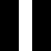
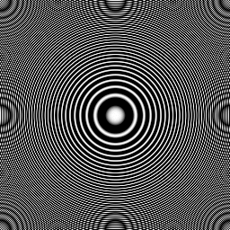
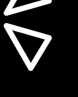
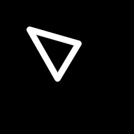
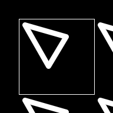
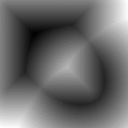
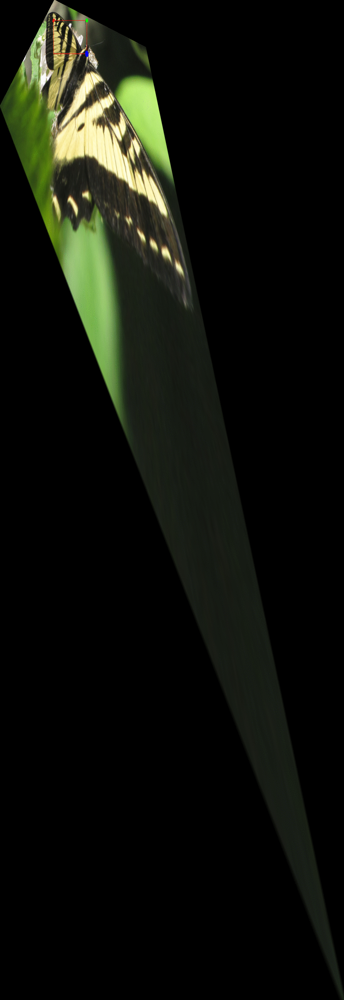

||||||||
|---|---|---|---|---|---|---|
|[Project ↗](../../README.md)|[Documentation ↗](../index.md)|&mdash;|[Tutorials ↗](../tutorials.md)|[How To's ↗](../howtos.md)|[Explanations ↗](../explanations.md)|References|

|||||||||
|---|---|---|---|---|---|---|---|
|[Entry ↗](index.md)|&mdash;|[Sections ↘](bysection.md)|[Permuted Sections ↘](bypsection.md)|[Names ↘](byname.md)|[Permuted Names ↘](bypname.md)|[Strict ↘](strict.md)|[Implementations ↘](bylang.md)|

# Documentation -- Reference Pages -- transform structure

## <anchor='top'> Table Of Contents

  - [transform](transform.md) ↗

## Subsections

 - [transform structure warp](transform_structure_warp.md) ↘

### Operators

 - [aktive op align bottom](#op_align_bottom)
 - [aktive op align left](#op_align_left)
 - [aktive op align right](#op_align_right)
 - [aktive op align top](#op_align_top)
 - [aktive op center-origin x](#op_center_origin_x)
 - [aktive op center-origin xy](#op_center_origin_xy)
 - [aktive op center-origin y](#op_center_origin_y)
 - [aktive op center-origin z](#op_center_origin_z)
 - [aktive op crop](#op_crop)
 - [aktive op embed band black](#op_embed_band_black)
 - [aktive op embed band copy](#op_embed_band_copy)
 - [aktive op embed bg](#op_embed_bg)
 - [aktive op embed black](#op_embed_black)
 - [aktive op embed copy](#op_embed_copy)
 - [aktive op embed mirror](#op_embed_mirror)
 - [aktive op embed tile](#op_embed_tile)
 - [aktive op embed white](#op_embed_white)
 - [aktive op flip x](#op_flip_x)
 - [aktive op flip y](#op_flip_y)
 - [aktive op flip z](#op_flip_z)
 - [aktive op if-then-else](#op_if_then_else)
 - [aktive op resize](#op_resize)
 - [aktive op rotate any](#op_rotate_any)
 - [aktive op rotate ccw](#op_rotate_ccw)
 - [aktive op rotate cw](#op_rotate_cw)
 - [aktive op rotate half](#op_rotate_half)
 - [aktive op sample decimate x](#op_sample_decimate_x)
 - [aktive op sample decimate xy](#op_sample_decimate_xy)
 - [aktive op sample decimate y](#op_sample_decimate_y)
 - [aktive op sample fill x](#op_sample_fill_x)
 - [aktive op sample fill xy](#op_sample_fill_xy)
 - [aktive op sample fill y](#op_sample_fill_y)
 - [aktive op sample fill z](#op_sample_fill_z)
 - [aktive op sample interpolate x](#op_sample_interpolate_x)
 - [aktive op sample interpolate xy](#op_sample_interpolate_xy)
 - [aktive op sample interpolate y](#op_sample_interpolate_y)
 - [aktive op sample replicate x](#op_sample_replicate_x)
 - [aktive op sample replicate xy](#op_sample_replicate_xy)
 - [aktive op sample replicate y](#op_sample_replicate_y)
 - [aktive op sample replicate z](#op_sample_replicate_z)
 - [aktive op sample sub x](#op_sample_sub_x)
 - [aktive op sample sub xy](#op_sample_sub_xy)
 - [aktive op sample sub y](#op_sample_sub_y)
 - [aktive op sample sub z](#op_sample_sub_z)
 - [aktive op scroll x](#op_scroll_x)
 - [aktive op scroll y](#op_scroll_y)
 - [aktive op scroll z](#op_scroll_z)
 - [aktive op select x](#op_select_x)
 - [aktive op select y](#op_select_y)
 - [aktive op select z](#op_select_z)
 - [aktive op split x](#op_split_x)
 - [aktive op split y](#op_split_y)
 - [aktive op split z](#op_split_z)
 - [aktive op swap xy](#op_swap_xy)
 - [aktive op swap xz](#op_swap_xz)
 - [aktive op swap yz](#op_swap_yz)
 - [aktive op take x](#op_take_x)
 - [aktive op take y](#op_take_y)
 - [aktive op take z](#op_take_z)
 - [aktive op transpose](#op_transpose)
 - [aktive op transverse](#op_transverse)

## Operators

---
### [↑](#top)  aktive op align bottom

Syntax: __aktive op align bottom__ src ?(param value)...? [[→ definition](/file?ci=trunk&ln=7&name=etc/transformer/structure/align.tcl)]

Returns image aligned to a border in a larger image.

|Input|Description|
|:---|:---|
|src|Source image|

|Parameter|Type|Default|Description|
|:---|:---|:---|:---|
|size|uint||Desired size of the image along the y-axis.|
|border|str|black|Method of embedding to use.|

####  Examples

<table>
<tr><th>@1
     &nbsp;</th>
    <th>aktive op align bottom @1 size 160 border mirror
     &nbsp;</th></tr>
<tr><td valign='top'>
     geometry(0 0 128 128 1)</td>
    <td valign='top'>
     geometry(0 -32 128 160 1)</td></tr>
</table>

---
### [↑](#top)  aktive op align left

Syntax: __aktive op align left__ src ?(param value)...? [[→ definition](/file?ci=trunk&ln=7&name=etc/transformer/structure/align.tcl)]

Returns image aligned to a border in a larger image.

|Input|Description|
|:---|:---|
|src|Source image|

|Parameter|Type|Default|Description|
|:---|:---|:---|:---|
|size|uint||Desired size of the image along the x-axis.|
|border|str|black|Method of embedding to use.|

####  Examples

<table>
<tr><th>@1
     &nbsp;</th>
    <th>aktive op align left @1 size 160 border mirror
     &nbsp;</th></tr>
<tr><td valign='top'>
     geometry(0 0 128 128 1)</td>
    <td valign='top'>
     geometry(0 0 160 128 1)</td></tr>
</table>

---
### [↑](#top)  aktive op align right

Syntax: __aktive op align right__ src ?(param value)...? [[→ definition](/file?ci=trunk&ln=7&name=etc/transformer/structure/align.tcl)]

Returns image aligned to a border in a larger image.

|Input|Description|
|:---|:---|
|src|Source image|

|Parameter|Type|Default|Description|
|:---|:---|:---|:---|
|size|uint||Desired size of the image along the x-axis.|
|border|str|black|Method of embedding to use.|

####  Examples

<table>
<tr><th>@1
     &nbsp;</th>
    <th>aktive op align right @1 size 160 border mirror
     &nbsp;</th></tr>
<tr><td valign='top'>
     geometry(0 0 128 128 1)</td>
    <td valign='top'>
     geometry(-32 0 160 128 1)</td></tr>
</table>

---
### [↑](#top)  aktive op align top

Syntax: __aktive op align top__ src ?(param value)...? [[→ definition](/file?ci=trunk&ln=7&name=etc/transformer/structure/align.tcl)]

Returns image aligned to a border in a larger image.

|Input|Description|
|:---|:---|
|src|Source image|

|Parameter|Type|Default|Description|
|:---|:---|:---|:---|
|size|uint||Desired size of the image along the y-axis.|
|border|str|black|Method of embedding to use.|

####  Examples

<table>
<tr><th>@1
     &nbsp;</th>
    <th>aktive op align top @1 size 160 border mirror
     &nbsp;</th></tr>
<tr><td valign='top'>
     geometry(0 0 128 128 1)</td>
    <td valign='top'>
     geometry(0 0 128 160 1)</td></tr>
</table>

---
### [↑](#top)  aktive op center-origin x

Syntax: __aktive op center-origin x__ src [[→ definition](/file?ci=trunk&ln=48&name=etc/transformer/structure/scrolling.tcl)]

Returns image where the center column of the input is shifted to the origin of the x axis.

|Input|Description|
|:---|:---|
|src|Source image|

####  Examples

<table>
<tr><th>@1
     &nbsp;</th>
    <th>aktive op center-origin x @1
     &nbsp;</th></tr>
<tr><td valign='top'>
     geometry(0 0 128 128 1)</td>
    <td valign='top'>
     geometry(0 0 128 128 1)</td></tr>
</table>

---
### [↑](#top)  aktive op center-origin xy

Syntax: __aktive op center-origin xy__ src [[→ definition](/file?ci=trunk&ln=73&name=etc/transformer/structure/scrolling.tcl)]

Returns image where the center pixel of the input is shifted to the origin.

|Input|Description|
|:---|:---|
|src|Source image|

####  Examples

<table>
<tr><th>@1
     &nbsp;</th>
    <th>aktive op center-origin xy @1
     &nbsp;</th></tr>
<tr><td valign='top'>
     geometry(0 0 128 128 1)</td>
    <td valign='top'>
     geometry(0 0 128 128 1)</td></tr>
</table>

---
### [↑](#top)  aktive op center-origin y

Syntax: __aktive op center-origin y__ src [[→ definition](/file?ci=trunk&ln=48&name=etc/transformer/structure/scrolling.tcl)]

Returns image where the center row of the input is shifted to the origin of the y axis.

|Input|Description|
|:---|:---|
|src|Source image|

####  Examples

<table>
<tr><th>@1
     &nbsp;</th>
    <th>aktive op center-origin y @1
     &nbsp;</th></tr>
<tr><td valign='top'>
     geometry(0 0 128 128 1)</td>
    <td valign='top'>
     geometry(0 0 128 128 1)</td></tr>
</table>

---
### [↑](#top)  aktive op center-origin z

Syntax: __aktive op center-origin z__ src [[→ definition](/file?ci=trunk&ln=48&name=etc/transformer/structure/scrolling.tcl)]

Returns image where the center band of the input is shifted to the origin of the z axis.

|Input|Description|
|:---|:---|
|src|Source image|

---
### [↑](#top)  aktive op crop

Syntax: __aktive op crop__ src ?(param value)...? [[→ definition](/file?ci=trunk&ln=10&name=etc/transformer/structure/crop.tcl)]

Returns image containing a rectangular subset of input, specified by the amount of rows and columns to remove from the four borders.

|Input|Description|
|:---|:---|
|src|Source image|

|Parameter|Type|Default|Description|
|:---|:---|:---|:---|
|left|uint|0|Number of columns to remove from the left input border|
|right|uint|0|Number of columns to remove from the right input border|
|top|uint|0|Number of rows to remove from the top input border|
|bottom|uint|0|Number of rows to remove from the bottom input border|

####  Examples

<table>
<tr><th>@1
     &nbsp;</th>
    <th>aktive op crop @1 left 10 right 20 top 30 bottom 50
     &nbsp;</th></tr>
<tr><td valign='top'>
     geometry(0 0 128 128 1)</td>
    <td valign='top'>
     geometry(10 30 98 48 1)</td></tr>
</table>

---
### [↑](#top)  aktive op embed band black

Syntax: __aktive op embed band black__ src ?(param value)...? [[→ definition](/file?ci=trunk&ln=9&name=etc/transformer/structure/embed/band/black.tcl)]

Returns image embedding the input into a set of black bands.

|Input|Description|
|:---|:---|
|src|Source image|

|Parameter|Type|Default|Description|
|:---|:---|:---|:---|
|up|uint|0|Number of bands to add before the image bands|
|down|uint|0|Number of bands to add after the image bands|

---
### [↑](#top)  aktive op embed band copy

Syntax: __aktive op embed band copy__ src ?(param value)...? [[→ definition](/file?ci=trunk&ln=9&name=etc/transformer/structure/embed/band/copy.tcl)]

Returns image embedding the input into a set of copied bands.

|Input|Description|
|:---|:---|
|src|Source image|

|Parameter|Type|Default|Description|
|:---|:---|:---|:---|
|up|uint|0|Number of first band copies to add before the image bands|
|down|uint|0|Number of last band copies to add after the image bands|

---
### [↑](#top)  aktive op embed bg

Syntax: __aktive op embed bg__ src ?(param value)...? [[→ definition](/file?ci=trunk&ln=9&name=etc/transformer/structure/embed/bg.tcl)]

Returns an image embedding the input into an arbitrarily colored border. The color is specified through the band values.

|Input|Description|
|:---|:---|
|src|Source image|

|Parameter|Type|Default|Description|
|:---|:---|:---|:---|
|left|uint|0|Number of columns to extend the left input border by|
|right|uint|0|Number of columns to extend the right input border by|
|top|uint|0|Number of rows to extend the top input border by|
|bottom|uint|0|Number of rows to extend the bottom input border by|
|values|double[]||Band values|

####  Examples

<table>
<tr><th>@1
     &nbsp;</th>
    <th>aktive op embed bg @1 left 32 right 32 top 32 bottom 32 values 0.5
     &nbsp;</th></tr>
<tr><td valign='top'>
     geometry(0 0 128 128 1)</td>
    <td valign='top'>
     geometry(-32 -32 192 192 1)</td></tr>
</table>

---
### [↑](#top)  aktive op embed black

Syntax: __aktive op embed black__ src ?(param value)...? [[→ definition](/file?ci=trunk&ln=9&name=etc/transformer/structure/embed/black.tcl)]

Returns an image embedding the input into a black border.

|Input|Description|
|:---|:---|
|src|Source image|

|Parameter|Type|Default|Description|
|:---|:---|:---|:---|
|left|uint|0|Number of columns to extend the left input border by|
|right|uint|0|Number of columns to extend the right input border by|
|top|uint|0|Number of rows to extend the top input border by|
|bottom|uint|0|Number of rows to extend the bottom input border by|

####  Examples

<table>
<tr><th>@1
     &nbsp;</th>
    <th>aktive op embed black @1 left 32 right 32 top 32 bottom 32
     &nbsp;</th></tr>
<tr><td valign='top'>
     geometry(0 0 128 128 1)</td>
    <td valign='top'>
     geometry(-32 -32 192 192 1)</td></tr>
</table>

---
### [↑](#top)  aktive op embed copy

Syntax: __aktive op embed copy__ src ?(param value)...? [[→ definition](/file?ci=trunk&ln=9&name=etc/transformer/structure/embed/copy.tcl)]

Returns an image embedding the input into a border made from the replicated input edges.

|Input|Description|
|:---|:---|
|src|Source image|

|Parameter|Type|Default|Description|
|:---|:---|:---|:---|
|left|uint|0|Number of columns to extend the left input border by|
|right|uint|0|Number of columns to extend the right input border by|
|top|uint|0|Number of rows to extend the top input border by|
|bottom|uint|0|Number of rows to extend the bottom input border by|

####  Examples

<table>
<tr><th>@1
     &nbsp;</th>
    <th>aktive op embed copy @1 left 32 right 32 top 32 bottom 32
     &nbsp;</th></tr>
<tr><td valign='top'>
     geometry(0 0 128 128 1)</td>
    <td valign='top'>
     geometry(-32 -32 192 192 1)</td></tr>
</table>

---
### [↑](#top)  aktive op embed mirror

Syntax: __aktive op embed mirror__ src ?(param value)...? [[→ definition](/file?ci=trunk&ln=9&name=etc/transformer/structure/embed/mirror.tcl)]

Returns an image embedding the input into a border made from the replicated mirrored input.

|Input|Description|
|:---|:---|
|src|Source image|

|Parameter|Type|Default|Description|
|:---|:---|:---|:---|
|left|uint|0|Number of columns to extend the left input border by|
|right|uint|0|Number of columns to extend the right input border by|
|top|uint|0|Number of rows to extend the top input border by|
|bottom|uint|0|Number of rows to extend the bottom input border by|

####  Examples

<table>
<tr><th>@1
     &nbsp;</th>
    <th>aktive op embed mirror @1 left 32 right 32 top 32 bottom 32
     &nbsp;</th></tr>
<tr><td valign='top'>
     geometry(0 0 128 128 1)</td>
    <td valign='top'><table><tr><td valign='top'>oframe 128 128</td><td valign='top'>
     geometry(-32 -32 192 192 1)</td></tr></table></td></tr>
</table>

---
### [↑](#top)  aktive op embed tile

Syntax: __aktive op embed tile__ src ?(param value)...? [[→ definition](/file?ci=trunk&ln=9&name=etc/transformer/structure/embed/tile.tcl)]

Returns an image embedding the input into a border made from the replicated input.

|Input|Description|
|:---|:---|
|src|Source image|

|Parameter|Type|Default|Description|
|:---|:---|:---|:---|
|left|uint|0|Number of columns to extend the left input border by|
|right|uint|0|Number of columns to extend the right input border by|
|top|uint|0|Number of rows to extend the top input border by|
|bottom|uint|0|Number of rows to extend the bottom input border by|

####  Examples

<table>
<tr><th>@1
     &nbsp;</th>
    <th>aktive op embed tile @1 left 32 right 32 top 32 bottom 32
     &nbsp;</th></tr>
<tr><td valign='top'>
     geometry(0 0 128 128 1)</td>
    <td valign='top'><table><tr><td valign='top'>oframe 128 128</td><td valign='top'>
     geometry(-32 -32 192 192 1)</td></tr></table></td></tr>
</table>

---
### [↑](#top)  aktive op embed white

Syntax: __aktive op embed white__ src ?(param value)...? [[→ definition](/file?ci=trunk&ln=9&name=etc/transformer/structure/embed/white.tcl)]

Returns an image embedding the input into a white border.

|Input|Description|
|:---|:---|
|src|Source image|

|Parameter|Type|Default|Description|
|:---|:---|:---|:---|
|left|uint|0|Number of columns to extend the left input border by|
|right|uint|0|Number of columns to extend the right input border by|
|top|uint|0|Number of rows to extend the top input border by|
|bottom|uint|0|Number of rows to extend the bottom input border by|

####  Examples

<table>
<tr><th>@1
     &nbsp;</th>
    <th>aktive op embed white @1 left 32 right 32 top 32 bottom 32
     &nbsp;</th></tr>
<tr><td valign='top'>
     geometry(0 0 128 128 1)</td>
    <td valign='top'>
     geometry(-32 -32 192 192 1)</td></tr>
</table>

---
### [↑](#top)  aktive op flip x

Syntax: __aktive op flip x__ src [[→ definition](/file?ci=trunk&ln=8&name=etc/transformer/structure/flip.tcl)]

Returns image which mirrors the input along the x-axis.

|Input|Description|
|:---|:---|
|src|Source image|

####  Examples

<table>
<tr><th>@1
     &nbsp;</th>
    <th>aktive op flip x @1
     &nbsp;</th></tr>
<tr><td valign='top'>
     geometry(0 0 128 128 1)</td>
    <td valign='top'>
     geometry(0 0 128 128 1)</td></tr>
</table>

---
### [↑](#top)  aktive op flip y

Syntax: __aktive op flip y__ src [[→ definition](/file?ci=trunk&ln=8&name=etc/transformer/structure/flip.tcl)]

Returns image which mirrors the input along the y-axis.

|Input|Description|
|:---|:---|
|src|Source image|

####  Examples

<table>
<tr><th>@1
     &nbsp;</th>
    <th>aktive op flip y @1
     &nbsp;</th></tr>
<tr><td valign='top'>
     geometry(0 0 128 128 1)</td>
    <td valign='top'>
     geometry(0 0 128 128 1)</td></tr>
</table>

---
### [↑](#top)  aktive op flip z

Syntax: __aktive op flip z__ src [[→ definition](/file?ci=trunk&ln=8&name=etc/transformer/structure/flip.tcl)]

Returns image which mirrors the input along the z-axis.

|Input|Description|
|:---|:---|
|src|Source image|

---
### [↑](#top)  aktive op if-then-else

Syntax: __aktive op if-then-else__ selector then else [[→ definition](/file?ci=trunk&ln=149&name=etc/transformer/structure/take.tcl)]

Choose between inputs `then` and `else`, based on the content of the `selector`.

All images have to have the same width and height. The `selector` has to be single-band. The other images may have arbitrary depth, as long as both have the same.

The `selector` content is clamped to `0..1`, and fractional values are rounded down to integer. 1-pixels in the `selector` pass the same pixel from `then` into the result, whereas 0-pixels in the `selector` pass the same pixel from `else` instead.

|Input|Description|
|:---|:---|
|selector|Binary selections|
|then|Image chosen where `selector == 1`.|
|else|Image chosen where `selector == 0`.|

---
### [↑](#top)  aktive op resize

Syntax: __aktive op resize__ src ?(param value)...? [[→ definition](/file?ci=trunk&ln=10&name=etc/transformer/structure/resize.tcl)]

Returns image resized to the specified width and height.

This is a convenience operator implemented on top of [aktive op transform by](transform_structure_warp.md#op_transform_by).

|Input|Description|
|:---|:---|
|src|Source image|

|Parameter|Type|Default|Description|
|:---|:---|:---|:---|
|interpolate|str|bilinear|Interpolation method to use|
|width|uint||Desired width of the result|
|height|uint||Desired height of the result|

####  Examples

<table>
<tr><th>@1
     &nbsp;</th>
    <th>aktive op resize @1 width 21 height 29
     &nbsp;</th></tr>
<tr><td valign='top'>
     geometry(0 0 256 256 3)</td>
    <td valign='top'>
     geometry(0 0 21 29 3)</td></tr>
</table>

---
### [↑](#top)  aktive op rotate any

Syntax: __aktive op rotate any__ src ?(param value)...? [[→ definition](/file?ci=trunk&ln=62&name=etc/transformer/structure/rotate.tcl)]

Returns image rotating the input at an arbitrary angle around an arbitrary center. The default center is the image center.

This is a convenience operator implemented on top of [aktive op transform by](transform_structure_warp.md#op_transform_by).

|Input|Description|
|:---|:---|
|src|Source image|

|Parameter|Type|Default|Description|
|:---|:---|:---|:---|
|by|double||In degrees, angle to rotate|
|around|point|{}|Rotation center. Default is the origin|
|interpolate|str|bilinear|Interpolation method to use|

####  Examples

<table>
<tr><th>@1
     &nbsp;</th>
    <th>aktive op rotate any @1 by 33 around {32 32}
     &nbsp;</th></tr>
<tr><td valign='top'>
     geometry(0 0 256 256 3)</td>
    <td valign='top'><table><tr><td valign='top'>sframe</td><td valign='top'>
     geometry(-116 -12 354 354 3)</td></tr></table></td></tr>
</table>

---
### [↑](#top)  aktive op rotate ccw

Syntax: __aktive op rotate ccw__ src [[→ definition](/file?ci=trunk&ln=28&name=etc/transformer/structure/rotate.tcl)]

Returns image rotating the input 90 degrees counter clockwise

|Input|Description|
|:---|:---|
|src|Source image|

####  Examples

<table>
<tr><th>@1
     &nbsp;</th>
    <th>aktive op rotate ccw @1
     &nbsp;</th></tr>
<tr><td valign='top'>
     geometry(0 0 128 128 1)</td>
    <td valign='top'>
     geometry(0 0 128 128 1)</td></tr>
</table>

---
### [↑](#top)  aktive op rotate cw

Syntax: __aktive op rotate cw__ src [[→ definition](/file?ci=trunk&ln=11&name=etc/transformer/structure/rotate.tcl)]

Returns image rotating the input 90 degrees clockwise.

|Input|Description|
|:---|:---|
|src|Source image|

####  Examples

<table>
<tr><th>@1
     &nbsp;</th>
    <th>aktive op rotate cw @1
     &nbsp;</th></tr>
<tr><td valign='top'>
     geometry(0 0 128 128 1)</td>
    <td valign='top'>
     geometry(0 0 128 128 1)</td></tr>
</table>

---
### [↑](#top)  aktive op rotate half

Syntax: __aktive op rotate half__ src [[→ definition](/file?ci=trunk&ln=45&name=etc/transformer/structure/rotate.tcl)]

Returns image rotating the input 180 degrees (counter) clockwise.

|Input|Description|
|:---|:---|
|src|Source image|

####  Examples

<table>
<tr><th>@1
     &nbsp;</th>
    <th>aktive op rotate half @1
     &nbsp;</th></tr>
<tr><td valign='top'>
     geometry(0 0 128 128 1)</td>
    <td valign='top'>
     geometry(0 0 128 128 1)</td></tr>
</table>

---
### [↑](#top)  aktive op sample decimate x

Syntax: __aktive op sample decimate x__ src ?(param value)...? [[→ definition](/file?ci=trunk&ln=33&name=etc/transformer/structure/resample/decimate.tcl)]

Returns image with the input decimated along the x-axis according to the decimation factor (>= 1).

This is accomplished by sub sampling the result of a lowpass filter applied to the input.

|Input|Description|
|:---|:---|
|src|Source image|

|Parameter|Type|Default|Description|
|:---|:---|:---|:---|
|by|uint|2|Decimation factor, range 2...|
|embed|str|mirror|Embedding to apply to prevent input from shrinking before sampled down.|

####  Examples

<table>
<tr><th>@1
     &nbsp;</th>
    <th>aktive op sample decimate x @1 by 4
     &nbsp;</th></tr>
<tr><td valign='top'>
     geometry(0 0 128 128 1)</td>
    <td valign='top'>
     geometry(0 0 32 128 1)</td></tr>
</table>

---
### [↑](#top)  aktive op sample decimate xy

Syntax: __aktive op sample decimate xy__ src ?(param value)...? [[→ definition](/file?ci=trunk&ln=8&name=etc/transformer/structure/resample/decimate.tcl)]

Returns image with the input decimated along both x and y axes according to the decimation factor (>= 1).

|Input|Description|
|:---|:---|
|src|Source image|

|Parameter|Type|Default|Description|
|:---|:---|:---|:---|
|by|uint|2|Decimation factor, range 2...|
|embed|str|mirror|Embedding to apply to prevent input from shrinking before sampled down.|

####  Examples

<table>
<tr><th>@1
     &nbsp;</th>
    <th>aktive op sample decimate xy @1 by 4
     &nbsp;</th></tr>
<tr><td valign='top'>
     geometry(0 0 128 128 1)</td>
    <td valign='top'>
     geometry(0 0 32 32 1)</td></tr>
</table>

---
### [↑](#top)  aktive op sample decimate y

Syntax: __aktive op sample decimate y__ src ?(param value)...? [[→ definition](/file?ci=trunk&ln=33&name=etc/transformer/structure/resample/decimate.tcl)]

Returns image with the input decimated along the y-axis according to the decimation factor (>= 1).

This is accomplished by sub sampling the result of a lowpass filter applied to the input.

|Input|Description|
|:---|:---|
|src|Source image|

|Parameter|Type|Default|Description|
|:---|:---|:---|:---|
|by|uint|2|Decimation factor, range 2...|
|embed|str|mirror|Embedding to apply to prevent input from shrinking before sampled down.|

####  Examples

<table>
<tr><th>@1
     &nbsp;</th>
    <th>aktive op sample decimate y @1 by 4
     &nbsp;</th></tr>
<tr><td valign='top'>
     geometry(0 0 128 128 1)</td>
    <td valign='top'>
     geometry(0 0 128 32 1)</td></tr>
</table>

---
### [↑](#top)  aktive op sample fill x

Syntax: __aktive op sample fill x__ src ?(param value)...? [[→ definition](/file?ci=trunk&ln=40&name=etc/transformer/structure/resample/fill.tcl)]

Returns image where the input is "zero-stuffed" along the x-axis according to the stuffing factor S (>= 1). The S-1 gaps in the result are set to the given fill value, with zero, i.e. 0, used by default.

|Input|Description|
|:---|:---|
|src|Source image|

|Parameter|Type|Default|Description|
|:---|:---|:---|:---|
|by|uint||Stuff factor, range 2...|
|fill|double|0|Pixel fill value|

####  Examples

<table>
<tr><th>@1
     &nbsp;</th>
    <th>aktive op sample fill x @1 by 4 fill 0.5
     &nbsp;</th></tr>
<tr><td valign='top'>
     geometry(0 0 128 128 1)</td>
    <td valign='top'>
     geometry(0 0 512 128 1)</td></tr>
</table>

---
### [↑](#top)  aktive op sample fill xy

Syntax: __aktive op sample fill xy__ src ?(param value)...? [[→ definition](/file?ci=trunk&ln=15&name=etc/transformer/structure/resample/fill.tcl)]

Returns image where the input is "zero-stuffed" along both x and y axes according to the stuffing factor S (>= 1). The S-1 gaps in the result are set to the given fill value, with zero, i.e. 0, used by default.

|Input|Description|
|:---|:---|
|src|Source image|

|Parameter|Type|Default|Description|
|:---|:---|:---|:---|
|by|uint|2|Stuff factor, range 2...|
|fill|double|0|Pixel fill value|

####  Examples

<table>
<tr><th>@1
     &nbsp;</th>
    <th>aktive op sample fill xy @1 by 4 fill 0.5
     &nbsp;</th></tr>
<tr><td valign='top'>
     geometry(0 0 128 128 1)</td>
    <td valign='top'>
     geometry(0 0 512 512 1)</td></tr>
</table>

---
### [↑](#top)  aktive op sample fill y

Syntax: __aktive op sample fill y__ src ?(param value)...? [[→ definition](/file?ci=trunk&ln=40&name=etc/transformer/structure/resample/fill.tcl)]

Returns image where the input is "zero-stuffed" along the y-axis according to the stuffing factor S (>= 1). The S-1 gaps in the result are set to the given fill value, with zero, i.e. 0, used by default.

|Input|Description|
|:---|:---|
|src|Source image|

|Parameter|Type|Default|Description|
|:---|:---|:---|:---|
|by|uint||Stuff factor, range 2...|
|fill|double|0|Pixel fill value|

####  Examples

<table>
<tr><th>@1
     &nbsp;</th>
    <th>aktive op sample fill y @1 by 4 fill 0.5
     &nbsp;</th></tr>
<tr><td valign='top'>
     geometry(0 0 128 128 1)</td>
    <td valign='top'>
     geometry(0 0 128 512 1)</td></tr>
</table>

---
### [↑](#top)  aktive op sample fill z

Syntax: __aktive op sample fill z__ src ?(param value)...? [[→ definition](/file?ci=trunk&ln=40&name=etc/transformer/structure/resample/fill.tcl)]

Returns image where the input is "zero-stuffed" along the z-axis according to the stuffing factor S (>= 1). The S-1 gaps in the result are set to the given fill value, with zero, i.e. 0, used by default.

|Input|Description|
|:---|:---|
|src|Source image|

|Parameter|Type|Default|Description|
|:---|:---|:---|:---|
|by|uint||Stuff factor, range 2...|
|fill|double|0|Pixel fill value|

---
### [↑](#top)  aktive op sample interpolate x

Syntax: __aktive op sample interpolate x__ src ?(param value)...? [[→ definition](/file?ci=trunk&ln=37&name=etc/transformer/structure/resample/interpolate.tcl)]

Returns image with the input interpolated along the x-axis according to the interpolation factor (>= 1).

This is accomplished by low-pass filtering applied to the result of zero-stuffing the input.

|Input|Description|
|:---|:---|
|src|Source image|

|Parameter|Type|Default|Description|
|:---|:---|:---|:---|
|by|uint|2|Interpolation factor, range 2...|
|embed|str|mirror|Embedding to apply to prevent input from shrinking before sampled down.|

####  Examples

<table>
<tr><th>@1
     &nbsp;</th>
    <th>aktive op sample interpolate x @1 by 4
     &nbsp;</th></tr>
<tr><td valign='top'>
     geometry(0 0 128 128 1)</td>
    <td valign='top'>
     geometry(0 0 512 128 1)</td></tr>
</table>

---
### [↑](#top)  aktive op sample interpolate xy

Syntax: __aktive op sample interpolate xy__ src ?(param value)...? [[→ definition](/file?ci=trunk&ln=8&name=etc/transformer/structure/resample/interpolate.tcl)]

Returns image with the input interpolated along both x and y axes according to the interpolation factor (>= 1).

This is accomplished by low-pass filtering applied to the result of zero-stuffing the input.

|Input|Description|
|:---|:---|
|src|Source image|

|Parameter|Type|Default|Description|
|:---|:---|:---|:---|
|by|uint|2|Interpolation factor, range 2...|
|embed|str|mirror|Embedding to apply to prevent input from shrinking before sampled down.|

####  Examples

<table>
<tr><th>@1
     &nbsp;</th>
    <th>aktive op sample interpolate xy @1 by 4
     &nbsp;</th></tr>
<tr><td valign='top'>
     geometry(0 0 128 128 1)</td>
    <td valign='top'>
     geometry(0 0 512 512 1)</td></tr>
</table>

---
### [↑](#top)  aktive op sample interpolate y

Syntax: __aktive op sample interpolate y__ src ?(param value)...? [[→ definition](/file?ci=trunk&ln=37&name=etc/transformer/structure/resample/interpolate.tcl)]

Returns image with the input interpolated along the y-axis according to the interpolation factor (>= 1).

This is accomplished by low-pass filtering applied to the result of zero-stuffing the input.

|Input|Description|
|:---|:---|
|src|Source image|

|Parameter|Type|Default|Description|
|:---|:---|:---|:---|
|by|uint|2|Interpolation factor, range 2...|
|embed|str|mirror|Embedding to apply to prevent input from shrinking before sampled down.|

####  Examples

<table>
<tr><th>@1
     &nbsp;</th>
    <th>aktive op sample interpolate y @1 by 4
     &nbsp;</th></tr>
<tr><td valign='top'>
     geometry(0 0 128 128 1)</td>
    <td valign='top'>
     geometry(0 0 128 512 1)</td></tr>
</table>

---
### [↑](#top)  aktive op sample replicate x

Syntax: __aktive op sample replicate x__ src (param value)... [[→ definition](/file?ci=trunk&ln=30&name=etc/transformer/structure/resample/replicated.tcl)]

Returns image where the input is stretched along the x-axis according to the stretching factor (>= 1), and the gaps are filled by replicating the preceding non-gap pixel.

|Input|Description|
|:---|:---|
|src|Source image|

|Parameter|Type|Default|Description|
|:---|:---|:---|:---|
|by|uint||Stretch factor, range 2...|

####  Examples

<table>
<tr><th>@1
     &nbsp;</th>
    <th>aktive op sample replicate x @1 by 4
     &nbsp;</th></tr>
<tr><td valign='top'>
     geometry(0 0 128 128 1)</td>
    <td valign='top'>
     geometry(0 0 512 128 1)</td></tr>
</table>

---
### [↑](#top)  aktive op sample replicate xy

Syntax: __aktive op sample replicate xy__ src ?(param value)...? [[→ definition](/file?ci=trunk&ln=8&name=etc/transformer/structure/resample/replicated.tcl)]

Returns image where the input is stretched along both x and y axes according to the stretching factor (>= 1), and the gaps are filled by replicating the preceding non-gap pixel.

|Input|Description|
|:---|:---|
|src|Source image|

|Parameter|Type|Default|Description|
|:---|:---|:---|:---|
|by|uint|2|Stretch factor, range 2...|

####  Examples

<table>
<tr><th>@1
     &nbsp;</th>
    <th>aktive op sample replicate xy @1 by 4
     &nbsp;</th></tr>
<tr><td valign='top'>
     geometry(0 0 128 128 1)</td>
    <td valign='top'>
     geometry(0 0 512 512 1)</td></tr>
</table>

---
### [↑](#top)  aktive op sample replicate y

Syntax: __aktive op sample replicate y__ src (param value)... [[→ definition](/file?ci=trunk&ln=30&name=etc/transformer/structure/resample/replicated.tcl)]

Returns image where the input is stretched along the y-axis according to the stretching factor (>= 1), and the gaps are filled by replicating the preceding non-gap pixel.

|Input|Description|
|:---|:---|
|src|Source image|

|Parameter|Type|Default|Description|
|:---|:---|:---|:---|
|by|uint||Stretch factor, range 2...|

####  Examples

<table>
<tr><th>@1
     &nbsp;</th>
    <th>aktive op sample replicate y @1 by 4
     &nbsp;</th></tr>
<tr><td valign='top'>
     geometry(0 0 128 128 1)</td>
    <td valign='top'>
     geometry(0 0 128 512 1)</td></tr>
</table>

---
### [↑](#top)  aktive op sample replicate z

Syntax: __aktive op sample replicate z__ src (param value)... [[→ definition](/file?ci=trunk&ln=30&name=etc/transformer/structure/resample/replicated.tcl)]

Returns image where the input is stretched along the z-axis according to the stretching factor (>= 1), and the gaps are filled by replicating the preceding non-gap pixel.

|Input|Description|
|:---|:---|
|src|Source image|

|Parameter|Type|Default|Description|
|:---|:---|:---|:---|
|by|uint||Stretch factor, range 2...|

---
### [↑](#top)  aktive op sample sub x

Syntax: __aktive op sample sub x__ src ?(param value)...? [[→ definition](/file?ci=trunk&ln=61&name=etc/transformer/structure/resample/sub.tcl)]

Returns image with the input sampled down along the x-axis according to the sampling factor S (>= 1). The result keeps every S'th pixel of the input. S-1 pixels after every kept pixel are removed.

|Input|Description|
|:---|:---|
|src|Source image|

|Parameter|Type|Default|Description|
|:---|:---|:---|:---|
|by|uint|2|Sampling factor, range 2...|

####  Examples

<table>
<tr><th>@1
     &nbsp;</th>
    <th>aktive op sample sub x @1 by 4
     &nbsp;</th></tr>
<tr><td valign='top'>
     geometry(0 0 128 128 1)</td>
    <td valign='top'>
     geometry(0 0 32 128 1)</td></tr>
</table>

---
### [↑](#top)  aktive op sample sub xy

Syntax: __aktive op sample sub xy__ src ?(param value)...? [[→ definition](/file?ci=trunk&ln=32&name=etc/transformer/structure/resample/sub.tcl)]

Returns image with the input sampled down along both x and y axes according to the sampling factor S (>= 1). The result keeps every S'th pixel of the input. S-1 pixels after every kept pixel are removed.

|Input|Description|
|:---|:---|
|src|Source image|

|Parameter|Type|Default|Description|
|:---|:---|:---|:---|
|by|uint|2|Sampling factor, range 2...|

####  Examples

<table>
<tr><th>@1
     &nbsp;</th>
    <th>aktive op sample sub xy @1 by 4
     &nbsp;</th></tr>
<tr><td valign='top'>
     geometry(0 0 128 128 1)</td>
    <td valign='top'>
     geometry(0 0 32 32 1)</td></tr>
</table>

---
### [↑](#top)  aktive op sample sub y

Syntax: __aktive op sample sub y__ src ?(param value)...? [[→ definition](/file?ci=trunk&ln=61&name=etc/transformer/structure/resample/sub.tcl)]

Returns image with the input sampled down along the y-axis according to the sampling factor S (>= 1). The result keeps every S'th pixel of the input. S-1 pixels after every kept pixel are removed.

|Input|Description|
|:---|:---|
|src|Source image|

|Parameter|Type|Default|Description|
|:---|:---|:---|:---|
|by|uint|2|Sampling factor, range 2...|

####  Examples

<table>
<tr><th>@1
     &nbsp;</th>
    <th>aktive op sample sub y @1 by 4
     &nbsp;</th></tr>
<tr><td valign='top'>
     geometry(0 0 128 128 1)</td>
    <td valign='top'>
     geometry(0 0 128 32 1)</td></tr>
</table>

---
### [↑](#top)  aktive op sample sub z

Syntax: __aktive op sample sub z__ src ?(param value)...? [[→ definition](/file?ci=trunk&ln=61&name=etc/transformer/structure/resample/sub.tcl)]

Returns image with the input sampled down along the z-axis according to the sampling factor S (>= 1). The result keeps every S'th pixel of the input. S-1 pixels after every kept pixel are removed.

|Input|Description|
|:---|:---|
|src|Source image|

|Parameter|Type|Default|Description|
|:---|:---|:---|:---|
|by|uint|2|Sampling factor, range 2...|

---
### [↑](#top)  aktive op scroll x

Syntax: __aktive op scroll x__ src (param value)... [[→ definition](/file?ci=trunk&ln=14&name=etc/transformer/structure/scrolling.tcl)]

Returns image with the pixels of the input shifted along the x axis so that the N'th column becomes the origin on that axis.

|Input|Description|
|:---|:---|
|src|Source image|

|Parameter|Type|Default|Description|
|:---|:---|:---|:---|
|offset|uint||x scroll offset|

####  Examples

<table>
<tr><th>@1
     &nbsp;</th>
    <th>aktive op scroll x @1 offset 32
     &nbsp;</th></tr>
<tr><td valign='top'>
     geometry(0 0 128 128 1)</td>
    <td valign='top'>
     geometry(0 0 128 128 1)</td></tr>
</table>

---
### [↑](#top)  aktive op scroll y

Syntax: __aktive op scroll y__ src (param value)... [[→ definition](/file?ci=trunk&ln=14&name=etc/transformer/structure/scrolling.tcl)]

Returns image with the pixels of the input shifted along the y axis so that the N'th row becomes the origin on that axis.

|Input|Description|
|:---|:---|
|src|Source image|

|Parameter|Type|Default|Description|
|:---|:---|:---|:---|
|offset|uint||y scroll offset|

####  Examples

<table>
<tr><th>@1
     &nbsp;</th>
    <th>aktive op scroll y @1 offset 32
     &nbsp;</th></tr>
<tr><td valign='top'>
     geometry(0 0 128 128 1)</td>
    <td valign='top'>
     geometry(0 0 128 128 1)</td></tr>
</table>

---
### [↑](#top)  aktive op scroll z

Syntax: __aktive op scroll z__ src (param value)... [[→ definition](/file?ci=trunk&ln=14&name=etc/transformer/structure/scrolling.tcl)]

Returns image with the pixels of the input shifted along the z axis so that the N'th band becomes the origin on that axis.

|Input|Description|
|:---|:---|
|src|Source image|

|Parameter|Type|Default|Description|
|:---|:---|:---|:---|
|offset|uint||z scroll offset|

---
### [↑](#top)  aktive op select x

Syntax: __aktive op select x__ src ?(param value)...? [[→ definition](/file?ci=trunk&ln=8&name=etc/transformer/structure/select.tcl)]

Returns image containing a contiguous subset of the input's columns.

The result has a properly reduced width.

The other two dimension are unchanged.

The 2D location of the first cell of the input going into the

result is the location of the result.

|Input|Description|
|:---|:---|
|src|Source image|

|Parameter|Type|Default|Description|
|:---|:---|:---|:---|
|from|uint||The input's first column to be placed into the result.|
|to|uint|from|The input's last column to be placed into the result. If not specified defaults to the first.|

####  Examples

<table>
<tr><th>@1
     &nbsp;</th>
    <th>aktive op select x @1 from 20 to 50
     &nbsp;</th></tr>
<tr><td valign='top'>
     geometry(0 0 128 128 1)</td>
    <td valign='top'>
     geometry(20 0 31 128 1)</td></tr>
</table>

---
### [↑](#top)  aktive op select y

Syntax: __aktive op select y__ src ?(param value)...? [[→ definition](/file?ci=trunk&ln=8&name=etc/transformer/structure/select.tcl)]

Returns image containing a contiguous subset of the input's rows.

The result has a properly reduced height.

The other two dimension are unchanged.

The 2D location of the first cell of the input going into the

result is the location of the result.

|Input|Description|
|:---|:---|
|src|Source image|

|Parameter|Type|Default|Description|
|:---|:---|:---|:---|
|from|uint||The input's first row to be placed into the result.|
|to|uint|from|The input's last row to be placed into the result. If not specified defaults to the first.|

####  Examples

<table>
<tr><th>@1
     &nbsp;</th>
    <th>aktive op select y @1 from 20 to 50
     &nbsp;</th></tr>
<tr><td valign='top'>
     geometry(0 0 128 128 1)</td>
    <td valign='top'>
     geometry(0 20 128 31 1)</td></tr>
</table>

---
### [↑](#top)  aktive op select z

Syntax: __aktive op select z__ src ?(param value)...? [[→ definition](/file?ci=trunk&ln=8&name=etc/transformer/structure/select.tcl)]

Returns image containing a contiguous subset of the input's bands.

The result has a properly reduced depth.

The other two dimension are unchanged.

The 2D location of the first cell of the input going into the

result is the location of the result.

|Input|Description|
|:---|:---|
|src|Source image|

|Parameter|Type|Default|Description|
|:---|:---|:---|:---|
|from|uint||The input's first band to be placed into the result.|
|to|uint|from|The input's last band to be placed into the result. If not specified defaults to the first.|

---
### [↑](#top)  aktive op split x

Syntax: __aktive op split x__ src [[→ definition](/file?ci=trunk&ln=10&name=etc/transformer/structure/split.tcl)]

Returns list containing each column of the input as separate image.

|Input|Description|
|:---|:---|
|src|Source image|

---
### [↑](#top)  aktive op split y

Syntax: __aktive op split y__ src [[→ definition](/file?ci=trunk&ln=10&name=etc/transformer/structure/split.tcl)]

Returns list containing each row of the input as separate image.

|Input|Description|
|:---|:---|
|src|Source image|

---
### [↑](#top)  aktive op split z

Syntax: __aktive op split z__ src [[→ definition](/file?ci=trunk&ln=10&name=etc/transformer/structure/split.tcl)]

Returns list containing each band of the input as separate image.

|Input|Description|
|:---|:---|
|src|Source image|

---
### [↑](#top)  aktive op swap xy

Syntax: __aktive op swap xy__ src [[→ definition](/file?ci=trunk&ln=8&name=etc/transformer/structure/swap.tcl)]

Returns image with the x- and y-axes of the input exchanged.

The location of the image is not changed.

|Input|Description|
|:---|:---|
|src|Source image|

####  Examples

<table>
<tr><th>@1
     &nbsp;</th>
    <th>aktive op swap xy @1
     &nbsp;</th></tr>
<tr><td valign='top'>
     geometry(0 0 128 128 1)</td>
    <td valign='top'>
     geometry(0 0 128 128 1)</td></tr>
</table>

---
### [↑](#top)  aktive op swap xz

Syntax: __aktive op swap xz__ src [[→ definition](/file?ci=trunk&ln=8&name=etc/transformer/structure/swap.tcl)]

Returns image with the x- and z-axes of the input exchanged.

The location of the image is not changed.

|Input|Description|
|:---|:---|
|src|Source image|

---
### [↑](#top)  aktive op swap yz

Syntax: __aktive op swap yz__ src [[→ definition](/file?ci=trunk&ln=8&name=etc/transformer/structure/swap.tcl)]

Returns image with the y- and z-axes of the input exchanged.

The location of the image is not changed.

|Input|Description|
|:---|:---|
|src|Source image|

---
### [↑](#top)  aktive op take x

Syntax: __aktive op take x__ index src [[→ definition](/file?ci=trunk&ln=8&name=etc/transformer/structure/take.tcl)]

Selects column values from the source under the control of the single-column index.

Takes two inputs of the same height and depth. The index is single-column. Its height and depth match the source. The result image has the same geometry as the index.

The stored indices select, per result pixel, the column value to take from the source and place into the result.

Indices are clamped to the interval 0 ... #(columns-1) of the source. Fractional indices are rounded down to integer.

The locations of index and source are ignored. The result is placed at the coordinate origin/zero.

|Input|Description|
|:---|:---|
|index|Indices selecting the per-pixel column of the source.|
|src|Source the data is selected from.|

---
### [↑](#top)  aktive op take y

Syntax: __aktive op take y__ index src [[→ definition](/file?ci=trunk&ln=8&name=etc/transformer/structure/take.tcl)]

Selects row values from the source under the control of the single-row index.

Takes two inputs of the same width and depth. The index is single-row. Its width and depth match the source. The result image has the same geometry as the index.

The stored indices select, per result pixel, the row value to take from the source and place into the result.

Indices are clamped to the interval 0 ... #(rows-1) of the source. Fractional indices are rounded down to integer.

The locations of index and source are ignored. The result is placed at the coordinate origin/zero.

|Input|Description|
|:---|:---|
|index|Indices selecting the per-pixel row of the source.|
|src|Source the data is selected from.|

---
### [↑](#top)  aktive op take z

Syntax: __aktive op take z__ index src [[→ definition](/file?ci=trunk&ln=8&name=etc/transformer/structure/take.tcl)]

Selects band values from the source under the control of the single-band index.

Takes two inputs of the same width and height. The index is single-band. Its width and height match the source. The result image has the same geometry as the index.

The stored indices select, per result pixel, the band value to take from the source and place into the result.

Indices are clamped to the interval 0 ... #(bands-1) of the source. Fractional indices are rounded down to integer.

The locations of index and source are ignored. The result is placed at the coordinate origin/zero.

|Input|Description|
|:---|:---|
|index|Indices selecting the per-pixel band of the source.|
|src|Source the data is selected from.|

---
### [↑](#top)  aktive op transpose

Syntax: __aktive op transpose__ src [[→ definition](/file?ci=trunk&ln=10&name=etc/transformer/structure/transpose.tcl)]

Returns image with the input mirrored along the primary diagonal.

This is an alias of `swap xy`.

|Input|Description|
|:---|:---|
|src|Source image|

####  Examples

<table>
<tr><th>@1
     &nbsp;</th>
    <th>aktive op transpose @1
     &nbsp;</th></tr>
<tr><td valign='top'>
     geometry(0 0 128 128 1)</td>
    <td valign='top'>
     geometry(0 0 128 128 1)</td></tr>
</table>

---
### [↑](#top)  aktive op transverse

Syntax: __aktive op transverse__ src [[→ definition](/file?ci=trunk&ln=29&name=etc/transformer/structure/transpose.tcl)]

Returns image with the input mirrored along the secondary diagonal.

|Input|Description|
|:---|:---|
|src|Source image|

####  Examples

<table>
<tr><th>@1
     &nbsp;</th>
    <th>aktive op transverse @1
     &nbsp;</th></tr>
<tr><td valign='top'>
     geometry(0 0 128 128 1)</td>
    <td valign='top'>
     geometry(0 0 128 128 1)</td></tr>
</table>

