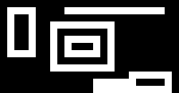

||||||||
|---|---|---|---|---|---|---|
|[Project ↗](../../README.md)|[Documentation ↗](../index.md)|&mdash;|[Tutorials ↗](../tutorials.md)|[How To's ↗](../howtos.md)|[Explanations ↗](../explanations.md)|References|

|||||||||
|---|---|---|---|---|---|---|---|
|[Entry ↗](index.md)|&mdash;|[Sections ↘](bysection.md)|[Permuted Sections ↘](bypsection.md)|[Names ↘](byname.md)|[Permuted Names ↘](bypname.md)|[Strict ↘](strict.md)|[Implementations ↘](bylang.md)|

# Documentation -- Reference Pages -- transform structure warp

## Table Of Contents

  - [transform structure](transform_structure.md) ↗

### Operators

 - [aktive op transform by](#op_transform_by)
 - [aktive op warp bicubic](#op_warp_bicubic)
 - [aktive op warp bilinear](#op_warp_bilinear)
 - [aktive op warp lanczos](#op_warp_lanczos)
 - [aktive op warp near-neighbour](#op_warp_near_neighbour)

## Operators

---
###  aktive op transform by

Syntax: __aktive op transform by__ src0 src1 ?(param value)...?

Returns an image generated by the application of the projective __forward__transform (`src0`) to the input (`src1`), using some kind of pixel interpolation. The default is `bilinear`.

The necessary backward transformation is computed internally.

The result's domain is set to the domain of the forward transform applied to the input domain. Fractions are rounded to integers such that the actual bounding box is kept enclosed.

The result has depth of the image.

See [aktive transform affine](generator_virtual_warp.md#transform_affine) and its relatives for a set of operations creating transformations acceptable here.

The [aktive op view](transform.md#op_view) operator is a useful means of focusing on the desired part of a transformation.

This operator is __strict__ in the 1st input. The projective matrix is materialized for the calculation of the backward transform.

|Parameter|Type|Default|Description|
|:---|:---|:---|:---|
|interpolate|str|bilinear|Interpolation method to use|

####  Examples

<table><tr><th>@1 (assets/butterfly.ppm)</th><th>@2 (rotate by 30 around {10 50})</th><th>aktive op transform by @2 @1</th></tr>
<tr><td valign='top'>(assets/butterfly.ppm)' style='border:4px solid gold'></td><td valign='top'><table><tr><td>0.8660</td><td>-0.5000</td><td>26.3397</td></tr><tr><td>0.5000</td><td>0.8660</td><td>1.6987</td></tr><tr><td>0.0000</td><td>0.0000</td><td>1.0000</td></tr></table></td><td valign='top'></td></tr></table>

<table><tr><th>@1 (assets/butterfly.ppm)</th><th>@2 (scale x 0.5 y 1.5)</th><th>aktive op transform by @2 @1</th></tr>
<tr><td valign='top'>(assets/butterfly.ppm)' style='border:4px solid gold'></td><td valign='top'><table><tr><td>0.5000</td><td>0.0000</td><td>0.0000</td></tr><tr><td>0.0000</td><td>1.5000</td><td>0.0000</td></tr><tr><td>0.0000</td><td>0.0000</td><td>1.0000</td></tr></table></td><td valign='top'></td></tr></table>

<table><tr><th>@1 (assets/butterfly.ppm)</th><th>@2 (shear x 20 y 10)</th><th>aktive op transform by @2 @1</th></tr>
<tr><td valign='top'>(assets/butterfly.ppm)' style='border:4px solid gold'></td><td valign='top'><table><tr><td>1.0000</td><td>0.3640</td><td>0.0000</td></tr><tr><td>0.1763</td><td>1.0642</td><td>0.0000</td></tr><tr><td>0.0000</td><td>0.0000</td><td>1.0000</td></tr></table></td><td valign='top'></td></tr></table>

<table><tr><th>@1 (assets/butterfly.ppm)</th><th>@2 (reflect x)</th><th>aktive op transform by @2 @1</th></tr>
<tr><td valign='top'>(assets/butterfly.ppm)' style='border:4px solid gold'></td><td valign='top'><table><tr><td>-1.0000</td><td>0.0000</td><td>0.0000</td></tr><tr><td>0.0000</td><td>1.0000</td><td>0.0000</td></tr><tr><td>0.0000</td><td>0.0000</td><td>1.0000</td></tr></table></td><td valign='top'></td></tr></table>

<table><tr><th>@1 (assets/butterfly.ppm)</th><th>@2 (reflect y)</th><th>aktive op transform by @2 @1</th></tr>
<tr><td valign='top'>(assets/butterfly.ppm)' style='border:4px solid gold'></td><td valign='top'><table><tr><td>1.0000</td><td>0.0000</td><td>0.0000</td></tr><tr><td>0.0000</td><td>-1.0000</td><td>0.0000</td></tr><tr><td>0.0000</td><td>0.0000</td><td>1.0000</td></tr></table></td><td valign='top'></td></tr></table>

<table><tr><th>@1 (assets/butterfly.ppm)</th><th>@2 (reflect line {50 260} b {150 -10})</th><th>aktive op transform by @2 @1</th></tr>
<tr><td valign='top'>(assets/butterfly.ppm)' style='border:4px solid gold'></td><td valign='top'><table><tr><td>-0.7587</td><td>-0.6514</td><td>257.2979</td></tr><tr><td>-0.6514</td><td>0.7587</td><td>95.2955</td></tr><tr><td>0.0000</td><td>0.0000</td><td>1.0000</td></tr></table></td><td valign='top'></td></tr></table>

<table><tr><th>@1 (assets/butterfly.ppm)</th><th>@2 (quadrilateral)</th><th>@3</th><th>aktive op view @3 port {0 0 100 100}</th></tr>
<tr><td valign='top'>(assets/butterfly.ppm)' style='border:4px solid gold'></td><td valign='top'><table><tr><td>0.49438377567130865</td><td>-0.41591016048538665</td><td>2.550392493542465</td></tr><tr><td>0.44671582705085094</td><td>1.2284685243898399</td><td>-97.16069238356006</td></tr><tr><td>-0.00036375960388762595</td><td>0.0004757748842634034</td><td>0.9875986585583872</td></tr></table></td><td valign='top'></td><td valign='top'></td></tr></table>

<table><tr><th>@1 (quadrilateral)</th><th>@2 ( 47  62 =>   0   0)</th><th>@3 (100 125 =>   0 100)</th><th>@4 (210  80 => 100 100)</th><th>aktive transform point @1 at {190  10} (190  10 => 100   0)</th></tr>
<tr><td valign='top'><table><tr><td>0.49438377567130865</td><td>-0.41591016048538665</td><td>2.550392493542465</td></tr><tr><td>0.44671582705085094</td><td>1.2284685243898399</td><td>-97.16069238356006</td></tr><tr><td>-0.00036375960388762595</td><td>0.0004757748842634034</td><td>0.9875986585583872</td></tr></table></td><td valign='top'>8.881784197001254e-16 1.4210854715202007e-14</td><td valign='top'>-2.636340758102919e-15 100.0</td><td valign='top'>77.00452488687783 100.00000000000001</td><td valign='top'>100.0 1.5392338566524034e-14</td></tr></table>

<table><tr><th>@1 (quadrilateral)</th><th>@2 (inverted)</th><th>@3 (  0   0 =>  47  62)</th><th>@4 (  0 100 => 100 125)</th><th>@5 (100 100 => 210  80)</th><th>aktive transform point @2 at {100   0} (100   0 => 190  10)</th></tr>
<tr><td valign='top'><table><tr><td>0.49438377567130865</td><td>-0.41591016048538665</td><td>2.550392493542465</td></tr><tr><td>0.44671582705085094</td><td>1.2284685243898399</td><td>-97.16069238356006</td></tr><tr><td>-0.00036375960388762595</td><td>0.0004757748842634034</td><td>0.9875986585583872</td></tr></table></td><td valign='top'><table><tr><td>1.5879651162790698</td><td>0.5194186046511629</td><td>47.00000000000001</td></tr><tr><td>-0.511686046511628</td><td>0.6167732558139535</td><td>62.0</td></tr><tr><td>0.0008313953488372095</td><td>-0.00010581395348837208</td><td>1.0000000000000002</td></tr></table></td><td valign='top'>47.0 61.999999999999986</td><td valign='top'>99.99999999999999 124.99999999999997</td><td valign='top'>240.30247181266256 67.60353425845618</td><td valign='top'>189.99999999999994 9.999999999999995</td></tr></table>

---
###  aktive op warp bicubic

Syntax: __aktive op warp bicubic__ src0 src1

Returns an image generated by the application of the origin map (`src0`) to the image (`src1`), with bicubic interpolation.

The result has the domain of the origin map, and the depth of the image.

See [aktive transform affine](generator_virtual_warp.md#transform_affine) and its relatives for a set of operations creating origin maps acceptable here.

---
###  aktive op warp bilinear

Syntax: __aktive op warp bilinear__ src0 src1

Returns an image generated by the application of the origin map (`src0`) to the image (`src1`), with bilinear interpolation.

The result has the domain of the origin map, and the depth of the image.

See [aktive transform affine](generator_virtual_warp.md#transform_affine) and its relatives for a set of operations creating origin maps acceptable here.

---
###  aktive op warp lanczos

Syntax: __aktive op warp lanczos__ src0 src1

Returns an image generated by the application of the origin map (`src0`) to the image (`src1`), with order-3 lanczos interpolation.

The result has the domain of the origin map, and the depth of the image.

See [aktive transform affine](generator_virtual_warp.md#transform_affine) and its relatives for a set of operations creating origin maps acceptable here.

---
###  aktive op warp near-neighbour

Syntax: __aktive op warp near-neighbour__ src0 src1

Returns an image generated by the application of the origin map (`src0`) to the image (`src1`), with nearest neighbour interpolation.

The result has the domain of the origin map, and the depth of the image.

See [aktive transform affine](generator_virtual_warp.md#transform_affine) and its relatives for a set of operations creating origin maps acceptable here.

