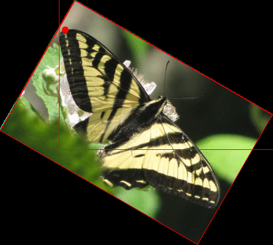
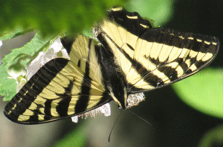
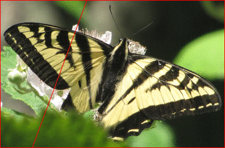
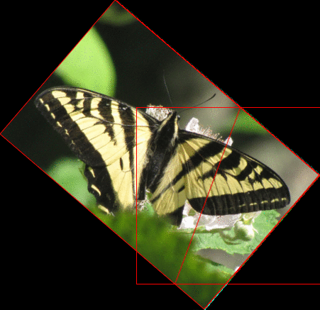
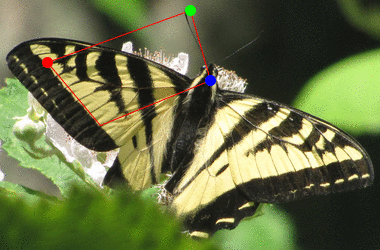

||||||||
|---|---|---|---|---|---|---|
|[Project ↗](../../README.md)|[Documentation ↗](../index.md)|&mdash;|[Tutorials ↗](../tutorials.md)|[How To's ↗](../howtos.md)|[Explanations ↗](../explanations.md)|References|

|||||||||
|---|---|---|---|---|---|---|---|
|[Entry ↗](index.md)|&mdash;|[Sections ↘](bysection.md)|[Permuted Sections ↘](bypsection.md)|[Names ↘](byname.md)|[Permuted Names ↘](bypname.md)|[Strict ↘](strict.md)|[Implementations ↘](bylang.md)|

# Documentation -- Reference Pages -- transform structure warp

## <anchor='top'> Table Of Contents

  - [transform structure](transform_structure.md) ↗

### Operators

 - [aktive op transform by](#op_transform_by)
 - [aktive op warp bicubic](#op_warp_bicubic)
 - [aktive op warp bilinear](#op_warp_bilinear)
 - [aktive op warp lanczos](#op_warp_lanczos)
 - [aktive op warp near-neighbour](#op_warp_near_neighbour)

## Operators

---
### [↑](#top)  aktive op transform by

Syntax: __aktive op transform by__ transform src ?(param value)...? [[→ definition](/file?ci=trunk&ln=8&name=etc/transformer/structure/transform.tcl)]

Applies the projective __forward__ `transform` to the source image, using some kind of pixel interpolation, and returns the result. The default interpolation is `bilinear`.

The necessary backward transformation is computed internally.

The result's domain is set to the domain of the forward transform applied to the input domain. Fractions are rounded to integers such that the actual bounding box is kept enclosed.

The result has depth of the image.

See [aktive transform affine](generator_virtual_warp.md#transform_affine) and its relatives for a set of operations creating transformations acceptable here.

The [aktive op view](transform.md#op_view) operator is a useful means of focusing on the desired part of a transformation result.

This operator is __strict__ in the 1st input. The projective matrix is materialized for the calculation of the backward transform.

|Input|Description|
|:---|:---|
|transform|Affine forward transformation.|
|src|The image to transform.|

|Parameter|Type|Default|Description|
|:---|:---|:---|:---|
|interpolate|str|bilinear|Interpolation method to use|

####  Examples

<table>
<tr><th>@1
     &nbsp;</th>
    <th>@2
     (rotate by 30 around {10 50})</th>
    <th>aktive op transform by @2 @1
     &nbsp;</th></tr>
<tr><td valign='top'>
     geometry(0 0 380 250 3)</td>
    <td valign='top'><table><tr><td>0.8660</td><td>-0.5000</td><td>26.3397</td></tr><tr><td>0.5000</td><td>0.8660</td><td>1.6987</td></tr><tr><td>0.0000</td><td>0.0000</td><td>1.0000</td></tr></table></td>
    <td valign='top'><table><tr><td valign='top'>bframe</td><td valign='top'>
     geometry(-98 1 454 407 3)</td></tr></table></td></tr>
</table>

<table>
<tr><th>@1
     &nbsp;</th>
    <th>@2
     (scale x 0.5 y 1.5)</th>
    <th>aktive op transform by @2 @1
     &nbsp;</th></tr>
<tr><td valign='top'>
     geometry(0 0 380 250 3)</td>
    <td valign='top'><table><tr><td>0.5000</td><td>0.0000</td><td>0.0000</td></tr><tr><td>0.0000</td><td>1.5000</td><td>0.0000</td></tr><tr><td>0.0000</td><td>0.0000</td><td>1.0000</td></tr></table></td>
    <td valign='top'>
     geometry(0 0 191 375 3)</td></tr>
</table>

<table>
<tr><th>@1
     &nbsp;</th>
    <th>@2
     (shear x 20 y 10)</th>
    <th>aktive op transform by @2 @1
     &nbsp;</th></tr>
<tr><td valign='top'>
     geometry(0 0 380 250 3)</td>
    <td valign='top'><table><tr><td>1.0000</td><td>0.3640</td><td>0.0000</td></tr><tr><td>0.1763</td><td>1.0642</td><td>0.0000</td></tr><tr><td>0.0000</td><td>0.0000</td><td>1.0000</td></tr></table></td>
    <td valign='top'>
     geometry(0 0 471 333 3)</td></tr>
</table>

<table>
<tr><th>@1
     &nbsp;</th>
    <th>@2
     (reflect x)</th>
    <th>aktive op transform by @2 @1
     &nbsp;</th></tr>
<tr><td valign='top'>
     geometry(0 0 380 250 3)</td>
    <td valign='top'><table><tr><td>-1.0000</td><td>0.0000</td><td>0.0000</td></tr><tr><td>0.0000</td><td>1.0000</td><td>0.0000</td></tr><tr><td>0.0000</td><td>0.0000</td><td>1.0000</td></tr></table></td>
    <td valign='top'>
     geometry(-379 0 380 250 3)</td></tr>
</table>

<table>
<tr><th>@1
     &nbsp;</th>
    <th>@2
     (reflect y)</th>
    <th>aktive op transform by @2 @1
     &nbsp;</th></tr>
<tr><td valign='top'>
     geometry(0 0 380 250 3)</td>
    <td valign='top'><table><tr><td>1.0000</td><td>0.0000</td><td>0.0000</td></tr><tr><td>0.0000</td><td>-1.0000</td><td>0.0000</td></tr><tr><td>0.0000</td><td>0.0000</td><td>1.0000</td></tr></table></td>
    <td valign='top'>
     geometry(0 -249 380 250 3)</td></tr>
</table>

<table>
<tr><th>@1
     &nbsp;</th>
    <th>@2
     (reflect line {50 260} b {150 -10})</th>
    <th>aktive op transform by @2 @1
     &nbsp;</th></tr>
<tr><td valign='top'>
     geometry(0 0 380 250 3)</td>
    <td valign='top'><table><tr><td>-0.7587</td><td>-0.6514</td><td>257.2979</td></tr><tr><td>-0.6514</td><td>0.7587</td><td>95.2955</td></tr><tr><td>0.0000</td><td>0.0000</td><td>1.0000</td></tr></table></td>
    <td valign='top'><table><tr><td valign='top'>bframe</td><td valign='top'>
     geometry(-192 -151 451 437 3)</td></tr></table></td></tr>
</table>

<table>
<tr><th>@1
     &nbsp;</th>
    <th>@2
     (quadrilateral)</th>
    <th>@3
     &nbsp;</th>
    <th>aktive op view @3 port {0 0 100 100}
     &nbsp;</th></tr>
<tr><td valign='top'>
     geometry(0 0 380 250 3)</td>
    <td valign='top'><table><tr><td>0.4944</td><td>-0.4159</td><td>2.5504</td></tr><tr><td>0.3440</td><td>0.9460</td><td>-74.8181</td></tr><tr><td>-0.0014</td><td>-0.0023</td><td>1.2110</td></tr></table></td>
    <td valign='top'>
     geometry(-161 -61 1036 3006 3)</td>
    <td valign='top'>
     geometry(0 0 100 100 3)</td></tr>
</table>

---
### [↑](#top)  aktive op warp bicubic

Syntax: __aktive op warp bicubic__ origins src [[→ definition](/file?ci=trunk&ln=8&name=etc/transformer/structure/warp.tcl)]

Returns an image generated by the application of the origin map to the image, with bicubic interpolation.

The result has the domain of the origin map, and the depth of the image.

See [aktive transform affine](generator_virtual_warp.md#transform_affine) and its relatives for a set of operations creating origin maps acceptable here.

|Input|Description|
|:---|:---|
|origins|Origin map to wrap the `src` by.|
|src|Image to warp by the `origin`.|

####  References

  - <http://en.wikipedia.org/wiki/Bicubic_interpolation>

  - <http://www.paulinternet.nl/?page=bicubic>

---
### [↑](#top)  aktive op warp bilinear

Syntax: __aktive op warp bilinear__ origins src [[→ definition](/file?ci=trunk&ln=8&name=etc/transformer/structure/warp.tcl)]

Returns an image generated by the application of the origin map to the image, with bilinear interpolation.

The result has the domain of the origin map, and the depth of the image.

See [aktive transform affine](generator_virtual_warp.md#transform_affine) and its relatives for a set of operations creating origin maps acceptable here.

|Input|Description|
|:---|:---|
|origins|Origin map to wrap the `src` by.|
|src|Image to warp by the `origin`.|

####  References

  - <https://en.wikipedia.org/wiki/Bilinear_interpolation>

---
### [↑](#top)  aktive op warp lanczos

Syntax: __aktive op warp lanczos__ origins src [[→ definition](/file?ci=trunk&ln=8&name=etc/transformer/structure/warp.tcl)]

Returns an image generated by the application of the origin map to the image, with order-3 lanczos interpolation.

The result has the domain of the origin map, and the depth of the image.

See [aktive transform affine](generator_virtual_warp.md#transform_affine) and its relatives for a set of operations creating origin maps acceptable here.

|Input|Description|
|:---|:---|
|origins|Origin map to wrap the `src` by.|
|src|Image to warp by the `origin`.|

####  References

  - <https://mazzo.li/posts/lanczos.html>

  - <https://en.wikipedia.org/wiki/Lanczos_resampling>

  - <https://github.com/jeffboody/Lanczos>

---
### [↑](#top)  aktive op warp near-neighbour

Syntax: __aktive op warp near-neighbour__ origins src [[→ definition](/file?ci=trunk&ln=8&name=etc/transformer/structure/warp.tcl)]

Returns an image generated by the application of the origin map to the image, with nearest neighbour interpolation.

The result has the domain of the origin map, and the depth of the image.

See [aktive transform affine](generator_virtual_warp.md#transform_affine) and its relatives for a set of operations creating origin maps acceptable here.

|Input|Description|
|:---|:---|
|origins|Origin map to wrap the `src` by.|
|src|Image to warp by the `origin`.|

####  References

  - <https://en.wikipedia.org/wiki/Nearest-neighbor_interpolation>

