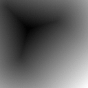
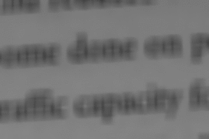
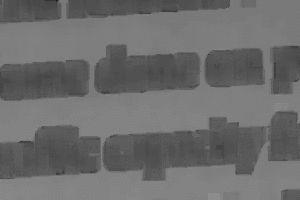

||||||||
|---|---|---|---|---|---|---|
|[Project ↗](../../README.md)|[Documentation ↗](../index.md)|&mdash;|[Tutorials ↗](../tutorials.md)|[How To's ↗](../howtos.md)|[Explanations ↗](../explanations.md)|References|

|||||||||
|---|---|---|---|---|---|---|---|
|[Entry ↗](index.md)|&mdash;|[Sections ↘](bysection.md)|[Permuted Sections ↘](bypsection.md)|[Names ↘](byname.md)|[Permuted Names ↘](bypname.md)|[Strict ↘](strict.md)|[Implementations ↘](bylang.md)|

# Documentation -- Reference Pages -- transform threshold generate

## <anchor='top'> Table Of Contents

  - [transform threshold](transform_threshold.md) ↗

### Operators

 - [aktive image threshold bernsen](#image_threshold_bernsen)
 - [aktive image threshold mean](#image_threshold_mean)
 - [aktive image threshold niblack](#image_threshold_niblack)
 - [aktive image threshold otsu](#image_threshold_otsu)
 - [aktive image threshold phansalkar](#image_threshold_phansalkar)
 - [aktive image threshold sauvola](#image_threshold_sauvola)
 - [aktive image threshold wolfjolion](#image_threshold_wolfjolion)

## Operators

---
### [↑](#top)  aktive image threshold bernsen

Syntax: __aktive image threshold bernsen__ src (param value)... [[→ definition](/file?ci=trunk&ln=56&name=etc/transformer/thresholds/thresholds.tcl)]

Returns an image containing per-pixel thresholds for the input, as per [Bernsen's](https://craftofcoding.wordpress.com/2021/10/27/thresholding-algorithms-bernsen-local) method.

The operator [aktive image mask per bernsen](transform_threshold_mask_generate.md#image_mask_per_bernsen) uses this to generate a mask of the input.

|Input|Description|
|:---|:---|
|src|Source image|

|Parameter|Type|Default|Description|
|:---|:---|:---|:---|
|radius|uint||Size of region to consider, as radius from center|

####  Examples

<table>
<tr><th>@1
     &nbsp;</th>
    <th>aktive image threshold bernsen @1 radius 7
     &nbsp;</th></tr>
<tr><td valign='top'>
     geometry(0 0 300 200 1)</td>
    <td valign='top'>
     geometry(0 0 300 200 1)</td></tr>
</table>

<table>
<tr><th>@1
     &nbsp;</th>
    <th>aktive image threshold bernsen @1 radius 7
     &nbsp;</th></tr>
<tr><td valign='top'>
     geometry(0 0 380 250 3)</td>
    <td valign='top'>
     geometry(0 0 380 250 3)</td></tr>
</table>

####  References

  - <https://craftofcoding.wordpress.com/2021/10/27/thresholding-algorithms-bernsen-local>

---
### [↑](#top)  aktive image threshold mean

Syntax: __aktive image threshold mean__ src (param value)... [[→ definition](/file?ci=trunk&ln=8&name=etc/transformer/thresholds/thresholds.tcl)]

Returns an image containing per-pixel thresholds for the input, as per the local mean.

The operator [aktive image mask per mean](transform_threshold_mask_generate.md#image_mask_per_mean) uses this to generate a mask of the input.

There are better methods. Extensions to the simple mean, in order of creation (and complexity), are Sauvola, Niblack, and Phansalkar. Each of these modifies the plain mean with a bias based on a mix of standard deviation, parameters, and the mean itself.

|Input|Description|
|:---|:---|
|src|Source image|

|Parameter|Type|Default|Description|
|:---|:---|:---|:---|
|radius|uint||Size of region to consider, as radius from center|

####  Examples

<table>
<tr><th>@1
     &nbsp;</th>
    <th>aktive image threshold mean @1 radius 7
     &nbsp;</th></tr>
<tr><td valign='top'>
     geometry(0 0 300 200 1)</td>
    <td valign='top'>
     geometry(0 0 300 200 1)</td></tr>
</table>

<table>
<tr><th>@1
     &nbsp;</th>
    <th>aktive image threshold mean @1 radius 7
     &nbsp;</th></tr>
<tr><td valign='top'>
     geometry(0 0 380 250 3)</td>
    <td valign='top'>
     geometry(0 0 380 250 3)</td></tr>
</table>

---
### [↑](#top)  aktive image threshold niblack

Syntax: __aktive image threshold niblack__ src ?(param value)...? [[→ definition](/file?ci=trunk&ln=109&name=etc/transformer/thresholds/thresholds.tcl)]

Returns an image containing per-pixel thresholds for the input, as per [Niblack's](https://craftofcoding.wordpress.com/2021/09/30/thresholding-algorithms-niblack-local) method.

The operator [aktive image mask per niblack](transform_threshold_mask_generate.md#image_mask_per_niblack) uses this to generate a mask of the input.

|Input|Description|
|:---|:---|
|src|Source image|

|Parameter|Type|Default|Description|
|:---|:---|:---|:---|
|k|double|-0.2|niblack parameter|
|radius|uint||Size of region to consider, as radius from center|

####  Examples

<table>
<tr><th>@1
     &nbsp;</th>
    <th>aktive image threshold niblack @1 radius 7
     &nbsp;</th></tr>
<tr><td valign='top'>
     geometry(0 0 300 200 1)</td>
    <td valign='top'>
     geometry(0 0 300 200 1)</td></tr>
</table>

<table>
<tr><th>@1
     &nbsp;</th>
    <th>aktive image threshold niblack @1 radius 7
     &nbsp;</th></tr>
<tr><td valign='top'>
     geometry(0 0 380 250 3)</td>
    <td valign='top'>
     geometry(0 0 380 250 3)</td></tr>
</table>

####  References

  - <https://craftofcoding.wordpress.com/2021/09/30/thresholding-algorithms-niblack-local>

---
### [↑](#top)  aktive image threshold otsu

Syntax: __aktive image threshold otsu__ src ?(param value)...? [[→ definition](/file?ci=trunk&ln=294&name=etc/transformer/thresholds/thresholds.tcl)]

Returns an image containing per-pixel thresholds for the input, as per [Otsu's](https://en.wikipedia.org/wiki/Otsu%27s_method) method.

The operator [aktive image mask per otsu](transform_threshold_mask_generate.md#image_mask_per_otsu) uses this to generate a mask of the input.

|Input|Description|
|:---|:---|
|src|Source image|

|Parameter|Type|Default|Description|
|:---|:---|:---|:---|
|radius|uint||Size of region to consider, as radius from center|
|bins|int|256|The number of bins used by the internal histograms. The pixel values are quantized to fit. Only values in the range of [0..1] are considered valid. Values outside of that range are placed into the smallest/largest bin. The default quantizes the image values to 8-bit.|

####  Examples

<table>
<tr><th>@1
     &nbsp;</th>
    <th>aktive image threshold otsu @1 radius 7
     &nbsp;</th></tr>
<tr><td valign='top'>
     geometry(0 0 300 200 1)</td>
    <td valign='top'>
     geometry(0 0 300 200 1)</td></tr>
</table>

####  References

  - <https://en.wikipedia.org/wiki/Otsu%27s_method>

  - <http://www.labbookpages.co.uk/software/imgProc/otsuThreshold.html>

---
### [↑](#top)  aktive image threshold phansalkar

Syntax: __aktive image threshold phansalkar__ src ?(param value)...? [[→ definition](/file?ci=trunk&ln=224&name=etc/transformer/thresholds/thresholds.tcl)]

Returns an image containing per-pixel thresholds for the input, as per [Phansalkar's](https://craftofcoding.wordpress.com/2021/09/28/thresholding-algorithms-phansalkar-local) method.

The operator [aktive image mask per phansalkar](transform_threshold_mask_generate.md#image_mask_per_phansalkar) uses this to generate a mask of the input.

|Input|Description|
|:---|:---|
|src|Source image|

|Parameter|Type|Default|Description|
|:---|:---|:---|:---|
|k|double|0.25|phansalkar parameter|
|R|double|0.5|phansalkar parameter|
|p|double|3|phansalkar parameter|
|q|double|10|phansalkar parameter|
|radius|uint||Size of region to consider, as radius from center|

####  Examples

<table>
<tr><th>@1
     &nbsp;</th>
    <th>aktive image threshold phansalkar @1 radius 7
     &nbsp;</th></tr>
<tr><td valign='top'>
     geometry(0 0 300 200 1)</td>
    <td valign='top'>
     geometry(0 0 300 200 1)</td></tr>
</table>

<table>
<tr><th>@1
     &nbsp;</th>
    <th>aktive image threshold phansalkar @1 radius 7
     &nbsp;</th></tr>
<tr><td valign='top'>
     geometry(0 0 380 250 3)</td>
    <td valign='top'>
     geometry(0 0 380 250 3)</td></tr>
</table>

####  References

  - <https://craftofcoding.wordpress.com/2021/09/28/thresholding-algorithms-phansalkar-local>

---
### [↑](#top)  aktive image threshold sauvola

Syntax: __aktive image threshold sauvola__ src ?(param value)...? [[→ definition](/file?ci=trunk&ln=165&name=etc/transformer/thresholds/thresholds.tcl)]

Returns an image containing per-pixel thresholds for the input, as per [Sauvola's](https://craftofcoding.wordpress.com/2021/10/06/thresholding-algorithms-sauvola-local) method.

The operator [aktive image mask per sauvola](transform_threshold_mask_generate.md#image_mask_per_sauvola) uses this to generate a mask of the input.

|Input|Description|
|:---|:---|
|src|Source image|

|Parameter|Type|Default|Description|
|:---|:---|:---|:---|
|k|double|0.5|sauvola parameter|
|R|double|128|sauvola parameter|
|radius|uint||Size of region to consider, as radius from center|

####  Examples

<table>
<tr><th>@1
     &nbsp;</th>
    <th>aktive image threshold sauvola @1 radius 7
     &nbsp;</th></tr>
<tr><td valign='top'>
     geometry(0 0 300 200 1)</td>
    <td valign='top'>
     geometry(0 0 300 200 1)</td></tr>
</table>

<table>
<tr><th>@1
     &nbsp;</th>
    <th>aktive image threshold sauvola @1 radius 7
     &nbsp;</th></tr>
<tr><td valign='top'>
     geometry(0 0 380 250 3)</td>
    <td valign='top'>
     geometry(0 0 380 250 3)</td></tr>
</table>

####  References

  - <https://craftofcoding.wordpress.com/2021/10/06/thresholding-algorithms-sauvola-local>

---
### [↑](#top)  aktive image threshold wolfjolion

Syntax: __aktive image threshold wolfjolion__ src ?(param value)...? [[→ definition](/file?ci=trunk&ln=340&name=etc/transformer/thresholds/thresholds.tcl)]

Returns an image containing per-pixel thresholds for the input, as per [Wolf+Jolion's](https://chriswolfvision.github.io/www/software/binarize/index.html) method.

The operator [aktive image mask per wolfjolion](transform_threshold_mask_generate.md#image_mask_per_wolfjolion) uses this to generate a mask of the input.

|Input|Description|
|:---|:---|
|src|Source image|

|Parameter|Type|Default|Description|
|:---|:---|:---|:---|
|k|double|0.5|wolfjolion parameter|
|radius|uint||Size of region to consider, as radius from center|

####  Examples

<table>
<tr><th>@1
     &nbsp;</th>
    <th>aktive image threshold wolfjolion @1 radius 7
     &nbsp;</th></tr>
<tr><td valign='top'>
     geometry(0 0 300 200 1)</td>
    <td valign='top'>
     geometry(0 0 300 200 1)</td></tr>
</table>

<table>
<tr><th>@1
     &nbsp;</th>
    <th>aktive image threshold wolfjolion @1 radius 7
     &nbsp;</th></tr>
<tr><td valign='top'>
     geometry(0 0 380 250 3)</td>
    <td valign='top'>
     geometry(0 0 380 250 3)</td></tr>
</table>

####  References

  - <https://chriswolfvision.github.io/www/software/binarize/index.html>

  - <https://chriswolfvision.github.io/www/papers/icpr2002v.pdf>

  - <https://github.com/chriswolfvision/local_adaptive_binarization>

