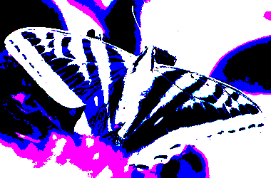
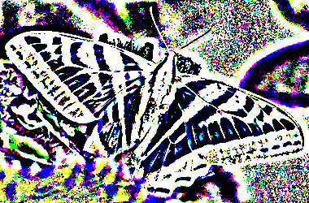
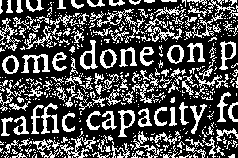

||||||||
|---|---|---|---|---|---|---|
|[Project ↗](../../README.md)|[Documentation ↗](../index.md)|&mdash;|[Tutorials ↗](../tutorials.md)|[How To's ↗](../howtos.md)|[Explanations ↗](../explanations.md)|References|

|||||||||
|---|---|---|---|---|---|---|---|
|[Entry ↗](index.md)|&mdash;|[Sections ↘](bysection.md)|[Permuted Sections ↘](bypsection.md)|[Names ↘](byname.md)|[Permuted Names ↘](bypname.md)|[Strict ↘](strict.md)|[Implementations ↘](bylang.md)|

# Documentation -- Reference Pages -- transform threshold mask generate

## <anchor='top'> Table Of Contents

  - [transform threshold mask](transform_threshold_mask.md) ↗

### Operators

 - [aktive image mask from threshold](#image_mask_from_threshold)
 - [aktive image mask per bernsen](#image_mask_per_bernsen)
 - [aktive image mask per global bernsen](#image_mask_per_global_bernsen)
 - [aktive image mask per global mean](#image_mask_per_global_mean)
 - [aktive image mask per global niblack](#image_mask_per_global_niblack)
 - [aktive image mask per global otsu](#image_mask_per_global_otsu)
 - [aktive image mask per global phansalkar](#image_mask_per_global_phansalkar)
 - [aktive image mask per global sauvola](#image_mask_per_global_sauvola)
 - [aktive image mask per mean](#image_mask_per_mean)
 - [aktive image mask per niblack](#image_mask_per_niblack)
 - [aktive image mask per otsu](#image_mask_per_otsu)
 - [aktive image mask per phansalkar](#image_mask_per_phansalkar)
 - [aktive image mask per sauvola](#image_mask_per_sauvola)
 - [aktive image mask per wolfjolion](#image_mask_per_wolfjolion)

## Operators

---
### [↑](#top)  aktive image mask from threshold

Syntax: __aktive image mask from threshold__ threshold src [[→ definition](/file?ci=trunk&ln=9&name=etc/transformer/thresholds/mask.tcl)]

Returns mask image indicating the foreground pixels of the input, as per the thresholds.

The foreground are the pixels __less or equal__ to the threshold. IOW the input's foreground is assumed to be darker than the background. Invert the result otherwise.

The foreground pixels are indicated by white. Background by black.

|Input|Description|
|:---|:---|
|threshold|Per-pixel thresholds|
|src|Image to threshold|

---
### [↑](#top)  aktive image mask per bernsen

Syntax: __aktive image mask per bernsen__ src (param value)... [[→ definition](/file?ci=trunk&ln=29&name=etc/transformer/thresholds/mask.tcl)]

Return image foreground mask of input, using [Bernsen](https://craftofcoding.wordpress.com/2021/10/27/thresholding-algorithms-bernsen-local) thresholding.

The foreground are the pixels falling under the threshold. IOW the input foreground is assumed to be darker than background. Invert the result otherwise.

The foreground pixels are indicated by white. Background by black.

The local thresholds are computed using [aktive image threshold bernsen](transform_threshold_generate.md#image_threshold_bernsen).

|Input|Description|
|:---|:---|
|src|Source image|

|Parameter|Type|Default|Description|
|:---|:---|:---|:---|
|radius|uint||Size of region to consider, as radius from center|

####  Examples

<table>
<tr><th>@1
     &nbsp;</th>
    <th>aktive image mask per bernsen @1 radius 7
     &nbsp;</th></tr>
<tr><td valign='top'>
     geometry(0 0 300 200 1)</td>
    <td valign='top'>
     geometry(0 0 300 200 1)</td></tr>
</table>

<table>
<tr><th>@1
     &nbsp;</th>
    <th>aktive image mask per bernsen @1 radius 7
     &nbsp;</th></tr>
<tr><td valign='top'>
     geometry(0 0 380 250 3)</td>
    <td valign='top'>
     geometry(0 0 380 250 3)</td></tr>
</table>

####  References

  - <https://craftofcoding.wordpress.com/2021/10/27/thresholding-algorithms-bernsen-local>

---
### [↑](#top)  aktive image mask per global bernsen

Syntax: __aktive image mask per global bernsen__ src [[→ definition](/file?ci=trunk&ln=110&name=etc/transformer/thresholds/mask.tcl)]

Returns mask image indicating the foreground pixels of the input, using global [Bernsen](https://craftofcoding.wordpress.com/2021/10/27/thresholding-algorithms-bernsen-local) thresholding.

The foreground are the pixels __less or equal__ to the threshold. IOW the input's foreground is assumed to be darker than the background. Invert the result otherwise.

The foreground pixels are indicated by white. Background by black.

The threshold is computed using [aktive image threshold global bernsen](accessor_threshold_generate.md#image_threshold_global_bernsen).

|Input|Description|
|:---|:---|
|src|Source image|

####  Examples

<table>
<tr><th>@1
     &nbsp;</th>
    <th>aktive image mask per global bernsen @1
     &nbsp;</th></tr>
<tr><td valign='top'>
     geometry(0 0 300 200 1)</td>
    <td valign='top'>
     geometry(0 0 300 200 1)</td></tr>
</table>

<table>
<tr><th>@1
     &nbsp;</th>
    <th>aktive image mask per global bernsen @1
     &nbsp;</th></tr>
<tr><td valign='top'>
     geometry(0 0 380 250 3)</td>
    <td valign='top'>
     geometry(0 0 380 250 3)</td></tr>
</table>

####  References

  - <https://craftofcoding.wordpress.com/2021/10/27/thresholding-algorithms-bernsen-local>

---
### [↑](#top)  aktive image mask per global mean

Syntax: __aktive image mask per global mean__ src [[→ definition](/file?ci=trunk&ln=110&name=etc/transformer/thresholds/mask.tcl)]

Returns mask image indicating the foreground pixels of the input, using global `Mean` thresholding.

The foreground are the pixels __less or equal__ to the threshold. IOW the input's foreground is assumed to be darker than the background. Invert the result otherwise.

The foreground pixels are indicated by white. Background by black.

The threshold is computed using [aktive image threshold global mean](accessor_threshold_generate.md#image_threshold_global_mean).

|Input|Description|
|:---|:---|
|src|Source image|

####  Examples

<table>
<tr><th>@1
     &nbsp;</th>
    <th>aktive image mask per global mean @1
     &nbsp;</th></tr>
<tr><td valign='top'>
     geometry(0 0 300 200 1)</td>
    <td valign='top'>
     geometry(0 0 300 200 1)</td></tr>
</table>

<table>
<tr><th>@1
     &nbsp;</th>
    <th>aktive image mask per global mean @1
     &nbsp;</th></tr>
<tr><td valign='top'>
     geometry(0 0 380 250 3)</td>
    <td valign='top'>
     geometry(0 0 380 250 3)</td></tr>
</table>

---
### [↑](#top)  aktive image mask per global niblack

Syntax: __aktive image mask per global niblack__ src ?(param value)...? [[→ definition](/file?ci=trunk&ln=110&name=etc/transformer/thresholds/mask.tcl)]

Returns mask image indicating the foreground pixels of the input, using global [Niblack](https://craftofcoding.wordpress.com/2021/09/30/thresholding-algorithms-niblack-local) thresholding.

The foreground are the pixels __less or equal__ to the threshold. IOW the input's foreground is assumed to be darker than the background. Invert the result otherwise.

The foreground pixels are indicated by white. Background by black.

The threshold is computed using [aktive image threshold global niblack](accessor_threshold_generate.md#image_threshold_global_niblack).

|Input|Description|
|:---|:---|
|src|Source image|

|Parameter|Type|Default|Description|
|:---|:---|:---|:---|
|k|double|-0.2|niblack parameter|

####  Examples

<table>
<tr><th>@1
     &nbsp;</th>
    <th>aktive image mask per global niblack @1
     &nbsp;</th></tr>
<tr><td valign='top'>
     geometry(0 0 300 200 1)</td>
    <td valign='top'>
     geometry(0 0 300 200 1)</td></tr>
</table>

<table>
<tr><th>@1
     &nbsp;</th>
    <th>aktive image mask per global niblack @1
     &nbsp;</th></tr>
<tr><td valign='top'>
     geometry(0 0 380 250 3)</td>
    <td valign='top'>
     geometry(0 0 380 250 3)</td></tr>
</table>

####  References

  - <https://craftofcoding.wordpress.com/2021/09/30/thresholding-algorithms-niblack-local>

---
### [↑](#top)  aktive image mask per global otsu

Syntax: __aktive image mask per global otsu__ src ?(param value)...? [[→ definition](/file?ci=trunk&ln=110&name=etc/transformer/thresholds/mask.tcl)]

Returns mask image indicating the foreground pixels of the input, using global [Otsu](https://en.wikipedia.org/wiki/Otsu%27s_method) thresholding.

The foreground are the pixels __less or equal__ to the threshold. IOW the input's foreground is assumed to be darker than the background. Invert the result otherwise.

The foreground pixels are indicated by white. Background by black.

The threshold is computed using [aktive image threshold global otsu](accessor_threshold_generate.md#image_threshold_global_otsu).

|Input|Description|
|:---|:---|
|src|Source image|

|Parameter|Type|Default|Description|
|:---|:---|:---|:---|
|bins|int|256|otsu histogram parameter|

####  Examples

<table>
<tr><th>@1
     &nbsp;</th>
    <th>aktive image mask per global otsu @1
     &nbsp;</th></tr>
<tr><td valign='top'>
     geometry(0 0 300 200 1)</td>
    <td valign='top'>
     geometry(0 0 300 200 1)</td></tr>
</table>

####  References

  - <https://en.wikipedia.org/wiki/Otsu%27s_method>

  - <http://www.labbookpages.co.uk/software/imgProc/otsuThreshold.html>

---
### [↑](#top)  aktive image mask per global phansalkar

Syntax: __aktive image mask per global phansalkar__ src ?(param value)...? [[→ definition](/file?ci=trunk&ln=110&name=etc/transformer/thresholds/mask.tcl)]

Returns mask image indicating the foreground pixels of the input, using global [Phansalkar](https://craftofcoding.wordpress.com/2021/10/06/thresholding-algorithms-sauvola-local) thresholding.

The foreground are the pixels __less or equal__ to the threshold. IOW the input's foreground is assumed to be darker than the background. Invert the result otherwise.

The foreground pixels are indicated by white. Background by black.

The threshold is computed using [aktive image threshold global phansalkar](accessor_threshold_generate.md#image_threshold_global_phansalkar).

|Input|Description|
|:---|:---|
|src|Source image|

|Parameter|Type|Default|Description|
|:---|:---|:---|:---|
|k|double|0.25|phansalkar parameter|
|R|double|0.5|phansalkar parameter|
|p|double|3|phansalkar parameter|
|q|double|10|phansalkar parameter|

####  Examples

<table>
<tr><th>@1
     &nbsp;</th>
    <th>aktive image mask per global phansalkar @1
     &nbsp;</th></tr>
<tr><td valign='top'>
     geometry(0 0 300 200 1)</td>
    <td valign='top'>
     geometry(0 0 300 200 1)</td></tr>
</table>

<table>
<tr><th>@1
     &nbsp;</th>
    <th>aktive image mask per global phansalkar @1
     &nbsp;</th></tr>
<tr><td valign='top'>
     geometry(0 0 380 250 3)</td>
    <td valign='top'>
     geometry(0 0 380 250 3)</td></tr>
</table>

####  References

  - <https://craftofcoding.wordpress.com/2021/10/06/thresholding-algorithms-sauvola-local>

---
### [↑](#top)  aktive image mask per global sauvola

Syntax: __aktive image mask per global sauvola__ src ?(param value)...? [[→ definition](/file?ci=trunk&ln=110&name=etc/transformer/thresholds/mask.tcl)]

Returns mask image indicating the foreground pixels of the input, using global [Sauvola](https://craftofcoding.wordpress.com/2021/09/28/thresholding-algorithms-phansalkar-local) thresholding.

The foreground are the pixels __less or equal__ to the threshold. IOW the input's foreground is assumed to be darker than the background. Invert the result otherwise.

The foreground pixels are indicated by white. Background by black.

The threshold is computed using [aktive image threshold global sauvola](accessor_threshold_generate.md#image_threshold_global_sauvola).

|Input|Description|
|:---|:---|
|src|Source image|

|Parameter|Type|Default|Description|
|:---|:---|:---|:---|
|k|double|0.5|sauvola parameter|
|R|double|128|sauvola parameter|

####  Examples

<table>
<tr><th>@1
     &nbsp;</th>
    <th>aktive image mask per global sauvola @1
     &nbsp;</th></tr>
<tr><td valign='top'>
     geometry(0 0 300 200 1)</td>
    <td valign='top'>
     geometry(0 0 300 200 1)</td></tr>
</table>

<table>
<tr><th>@1
     &nbsp;</th>
    <th>aktive image mask per global sauvola @1
     &nbsp;</th></tr>
<tr><td valign='top'>
     geometry(0 0 380 250 3)</td>
    <td valign='top'>
     geometry(0 0 380 250 3)</td></tr>
</table>

####  References

  - <https://craftofcoding.wordpress.com/2021/09/28/thresholding-algorithms-phansalkar-local>

---
### [↑](#top)  aktive image mask per mean

Syntax: __aktive image mask per mean__ src (param value)... [[→ definition](/file?ci=trunk&ln=29&name=etc/transformer/thresholds/mask.tcl)]

Return image foreground mask of input, using `Mean` thresholding.

The foreground are the pixels falling under the threshold. IOW the input foreground is assumed to be darker than background. Invert the result otherwise.

The foreground pixels are indicated by white. Background by black.

The local thresholds are computed using [aktive image threshold mean](transform_threshold_generate.md#image_threshold_mean).

|Input|Description|
|:---|:---|
|src|Source image|

|Parameter|Type|Default|Description|
|:---|:---|:---|:---|
|radius|uint||Size of region to consider, as radius from center|

####  Examples

<table>
<tr><th>@1
     &nbsp;</th>
    <th>aktive image mask per mean @1 radius 7
     &nbsp;</th></tr>
<tr><td valign='top'>
     geometry(0 0 300 200 1)</td>
    <td valign='top'>
     geometry(0 0 300 200 1)</td></tr>
</table>

<table>
<tr><th>@1
     &nbsp;</th>
    <th>aktive image mask per mean @1 radius 7
     &nbsp;</th></tr>
<tr><td valign='top'>
     geometry(0 0 380 250 3)</td>
    <td valign='top'>
     geometry(0 0 380 250 3)</td></tr>
</table>

---
### [↑](#top)  aktive image mask per niblack

Syntax: __aktive image mask per niblack__ src ?(param value)...? [[→ definition](/file?ci=trunk&ln=29&name=etc/transformer/thresholds/mask.tcl)]

Return image foreground mask of input, using [Niblack](https://craftofcoding.wordpress.com/2021/09/30/thresholding-algorithms-niblack-local) thresholding.

The foreground are the pixels falling under the threshold. IOW the input foreground is assumed to be darker than background. Invert the result otherwise.

The foreground pixels are indicated by white. Background by black.

The local thresholds are computed using [aktive image threshold niblack](transform_threshold_generate.md#image_threshold_niblack).

|Input|Description|
|:---|:---|
|src|Source image|

|Parameter|Type|Default|Description|
|:---|:---|:---|:---|
|k|double|-0.2|niblack parameter|
|radius|uint||Size of region to consider, as radius from center|

####  Examples

<table>
<tr><th>@1
     &nbsp;</th>
    <th>aktive image mask per niblack @1 radius 7
     &nbsp;</th></tr>
<tr><td valign='top'>
     geometry(0 0 300 200 1)</td>
    <td valign='top'>
     geometry(0 0 300 200 1)</td></tr>
</table>

<table>
<tr><th>@1
     &nbsp;</th>
    <th>aktive image mask per niblack @1 radius 7
     &nbsp;</th></tr>
<tr><td valign='top'>
     geometry(0 0 380 250 3)</td>
    <td valign='top'>
     geometry(0 0 380 250 3)</td></tr>
</table>

####  References

  - <https://craftofcoding.wordpress.com/2021/09/30/thresholding-algorithms-niblack-local>

---
### [↑](#top)  aktive image mask per otsu

Syntax: __aktive image mask per otsu__ src ?(param value)...? [[→ definition](/file?ci=trunk&ln=29&name=etc/transformer/thresholds/mask.tcl)]

Return image foreground mask of input, using [Otsu](https://en.wikipedia.org/wiki/Otsu%27s_method) thresholding.

The foreground are the pixels falling under the threshold. IOW the input foreground is assumed to be darker than background. Invert the result otherwise.

The foreground pixels are indicated by white. Background by black.

The local thresholds are computed using [aktive image threshold otsu](transform_threshold_generate.md#image_threshold_otsu).

|Input|Description|
|:---|:---|
|src|Source image|

|Parameter|Type|Default|Description|
|:---|:---|:---|:---|
|bins|int|256|otsu histogram parameter|
|radius|uint||Size of region to consider, as radius from center|

####  Examples

<table>
<tr><th>@1
     &nbsp;</th>
    <th>aktive image mask per otsu @1 radius 7
     &nbsp;</th></tr>
<tr><td valign='top'>
     geometry(0 0 300 200 1)</td>
    <td valign='top'>
     geometry(0 0 300 200 1)</td></tr>
</table>

####  References

  - <https://en.wikipedia.org/wiki/Otsu%27s_method>

  - <http://www.labbookpages.co.uk/software/imgProc/otsuThreshold.html>

---
### [↑](#top)  aktive image mask per phansalkar

Syntax: __aktive image mask per phansalkar__ src ?(param value)...? [[→ definition](/file?ci=trunk&ln=29&name=etc/transformer/thresholds/mask.tcl)]

Return image foreground mask of input, using [Phansalkar](https://craftofcoding.wordpress.com/2021/09/28/thresholding-algorithms-phansalkar-local) thresholding.

The foreground are the pixels falling under the threshold. IOW the input foreground is assumed to be darker than background. Invert the result otherwise.

The foreground pixels are indicated by white. Background by black.

The local thresholds are computed using [aktive image threshold phansalkar](transform_threshold_generate.md#image_threshold_phansalkar).

|Input|Description|
|:---|:---|
|src|Source image|

|Parameter|Type|Default|Description|
|:---|:---|:---|:---|
|k|double|0.25|phansalkar parameter|
|R|double|0.5|phansalkar parameter|
|p|double|3|phansalkar parameter|
|q|double|10|phansalkar parameter|
|radius|uint||Size of region to consider, as radius from center|

####  Examples

<table>
<tr><th>@1
     &nbsp;</th>
    <th>aktive image mask per phansalkar @1 radius 7
     &nbsp;</th></tr>
<tr><td valign='top'>
     geometry(0 0 300 200 1)</td>
    <td valign='top'>
     geometry(0 0 300 200 1)</td></tr>
</table>

<table>
<tr><th>@1
     &nbsp;</th>
    <th>aktive image mask per phansalkar @1 radius 7
     &nbsp;</th></tr>
<tr><td valign='top'>
     geometry(0 0 380 250 3)</td>
    <td valign='top'>
     geometry(0 0 380 250 3)</td></tr>
</table>

####  References

  - <https://craftofcoding.wordpress.com/2021/09/28/thresholding-algorithms-phansalkar-local>

---
### [↑](#top)  aktive image mask per sauvola

Syntax: __aktive image mask per sauvola__ src ?(param value)...? [[→ definition](/file?ci=trunk&ln=29&name=etc/transformer/thresholds/mask.tcl)]

Return image foreground mask of input, using [Sauvola](https://craftofcoding.wordpress.com/2021/10/06/thresholding-algorithms-sauvola-local) thresholding.

The foreground are the pixels falling under the threshold. IOW the input foreground is assumed to be darker than background. Invert the result otherwise.

The foreground pixels are indicated by white. Background by black.

The local thresholds are computed using [aktive image threshold sauvola](transform_threshold_generate.md#image_threshold_sauvola).

|Input|Description|
|:---|:---|
|src|Source image|

|Parameter|Type|Default|Description|
|:---|:---|:---|:---|
|k|double|0.5|sauvola parameter|
|R|double|128|sauvola parameter|
|radius|uint||Size of region to consider, as radius from center|

####  Examples

<table>
<tr><th>@1
     &nbsp;</th>
    <th>aktive image mask per sauvola @1 radius 7
     &nbsp;</th></tr>
<tr><td valign='top'>
     geometry(0 0 300 200 1)</td>
    <td valign='top'>
     geometry(0 0 300 200 1)</td></tr>
</table>

<table>
<tr><th>@1
     &nbsp;</th>
    <th>aktive image mask per sauvola @1 radius 7
     &nbsp;</th></tr>
<tr><td valign='top'>
     geometry(0 0 380 250 3)</td>
    <td valign='top'>
     geometry(0 0 380 250 3)</td></tr>
</table>

####  References

  - <https://craftofcoding.wordpress.com/2021/10/06/thresholding-algorithms-sauvola-local>

---
### [↑](#top)  aktive image mask per wolfjolion

Syntax: __aktive image mask per wolfjolion__ src ?(param value)...? [[→ definition](/file?ci=trunk&ln=29&name=etc/transformer/thresholds/mask.tcl)]

Return image foreground mask of input, using [Wolfjolion](https://chriswolfvision.github.io/www/software/binarize/index.html) thresholding.

The foreground are the pixels falling under the threshold. IOW the input foreground is assumed to be darker than background. Invert the result otherwise.

The foreground pixels are indicated by white. Background by black.

The local thresholds are computed using [aktive image threshold wolfjolion](transform_threshold_generate.md#image_threshold_wolfjolion).

|Input|Description|
|:---|:---|
|src|Source image|

|Parameter|Type|Default|Description|
|:---|:---|:---|:---|
|k|double|0.5|wolfjolion parameter|
|radius|uint||Size of region to consider, as radius from center|

####  Examples

<table>
<tr><th>@1
     &nbsp;</th>
    <th>aktive image mask per wolfjolion @1 radius 7
     &nbsp;</th></tr>
<tr><td valign='top'>
     geometry(0 0 300 200 1)</td>
    <td valign='top'>
     geometry(0 0 300 200 1)</td></tr>
</table>

<table>
<tr><th>@1
     &nbsp;</th>
    <th>aktive image mask per wolfjolion @1 radius 7
     &nbsp;</th></tr>
<tr><td valign='top'>
     geometry(0 0 380 250 3)</td>
    <td valign='top'>
     geometry(0 0 380 250 3)</td></tr>
</table>

####  References

  - <https://chriswolfvision.github.io/www/software/binarize/index.html>

  - <https://chriswolfvision.github.io/www/papers/icpr2002v.pdf>

  - <https://github.com/chriswolfvision/local_adaptive_binarization>

