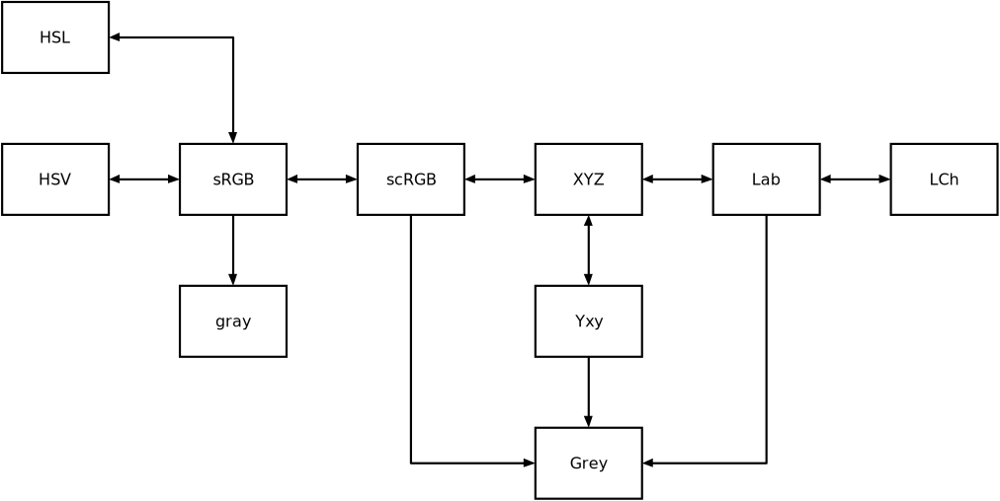

# Color conversions

  - [Operator reference](/doc/trunk/doc/ref/transform_color.md)

## Color spaces

|Colorspace	|Notes							|
|---		|---							|
|sRGB		|"standard" non-linear RGB space (gamma-compressed)	|
|scRGB		|linear RGB space (gamma compression undone)		|
|___		|___							|
|HSV		|sRGB in a different basis to separate color components |
|HSL		|Another transformation of sRGB				|
|		|__V__ Range: 0..1	   				|
|		|__L__ Range: 0..1	   				|
|		|__S__ Range: 0..1					|
|		|__H__ Range: 0..1 (Wikipedia: 0..360)			|
|___		|___							|
|XYZ		|CIE XYZ tristimulus space				|
|		|__X__ Range:	     					|
|		|__Y__ Range: 0...100					|
|		|__Z__ Range: 						|
|Yxy		|CIE Yxy space						|
|Lab		|CIE L*a*b* space					|
|		|__L__ Range: 0...100					|
|		|__a__ Range: +/- 150, no specific limits		|
|		|__b__ Range: +/- 150, no specific limits		|
|LCh		|CIE LCh(ab) space					|
|___		|___							|
|Grey		|Y luminance channel of CIE XYZ tristimulus space	|
|		|__Attention__: Range is 0...100	    		|
|___		|___							|
|gray		|grayscale as coming out of PGM images, etc.            |

```
Lab - L* defines black at 0 and white at 100.
      The a* and b* axes are unbounded and depending on the
      reference white they can easily exceed +/- 150 to cover
      the human gamut.
```

## Core conversions



|A	|B	|Done	|
|---	|---	|---	|
|HSL	|sRGB	|ok	|
|HSV	|sRGB	|ok	|
|sRGB	|scRGB	|ok	|
|sRGB	|gray	|ok	|
|scRGB	|XYZ	|ok	|
|XYZ	|Lab	|ok	|
|XYZ	|Yxy	|ok	|
|Lab	|LCh	|ok	|

## Other conversions

Are assembled from the core conversions by chaining these.

See `no-core.tcl`.

## Queries

See `../../accessor/colorspace.tcl`.
